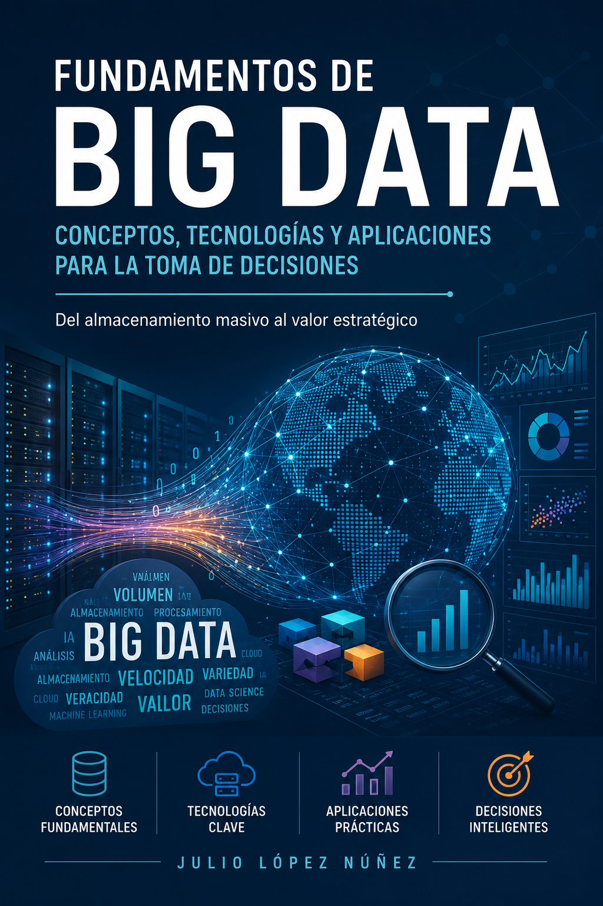
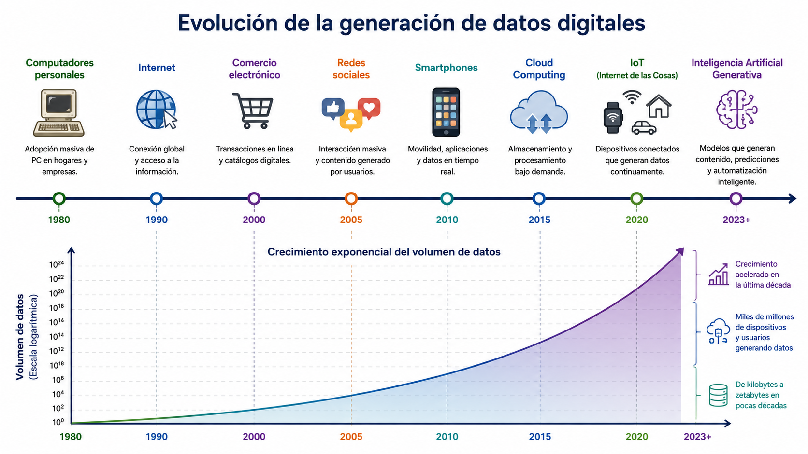
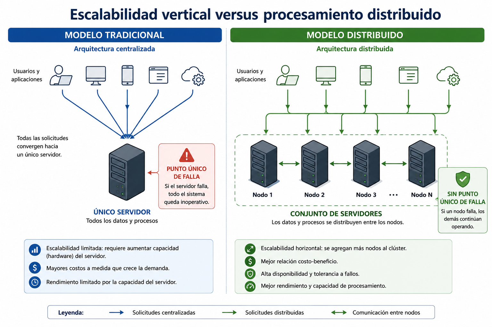
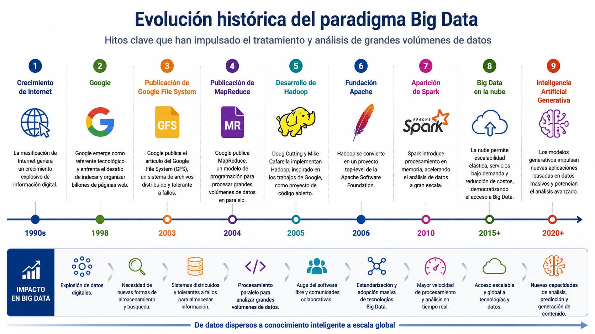
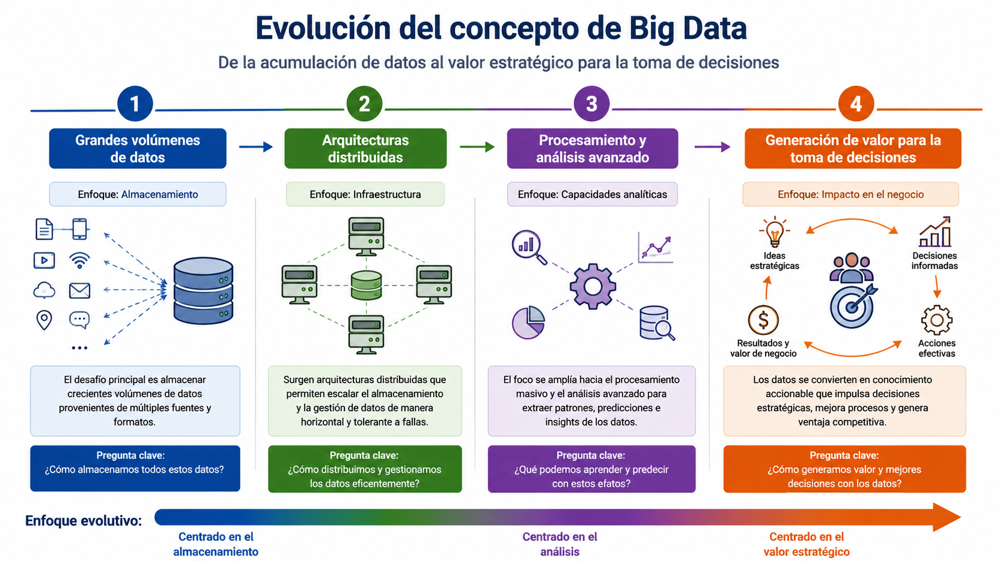
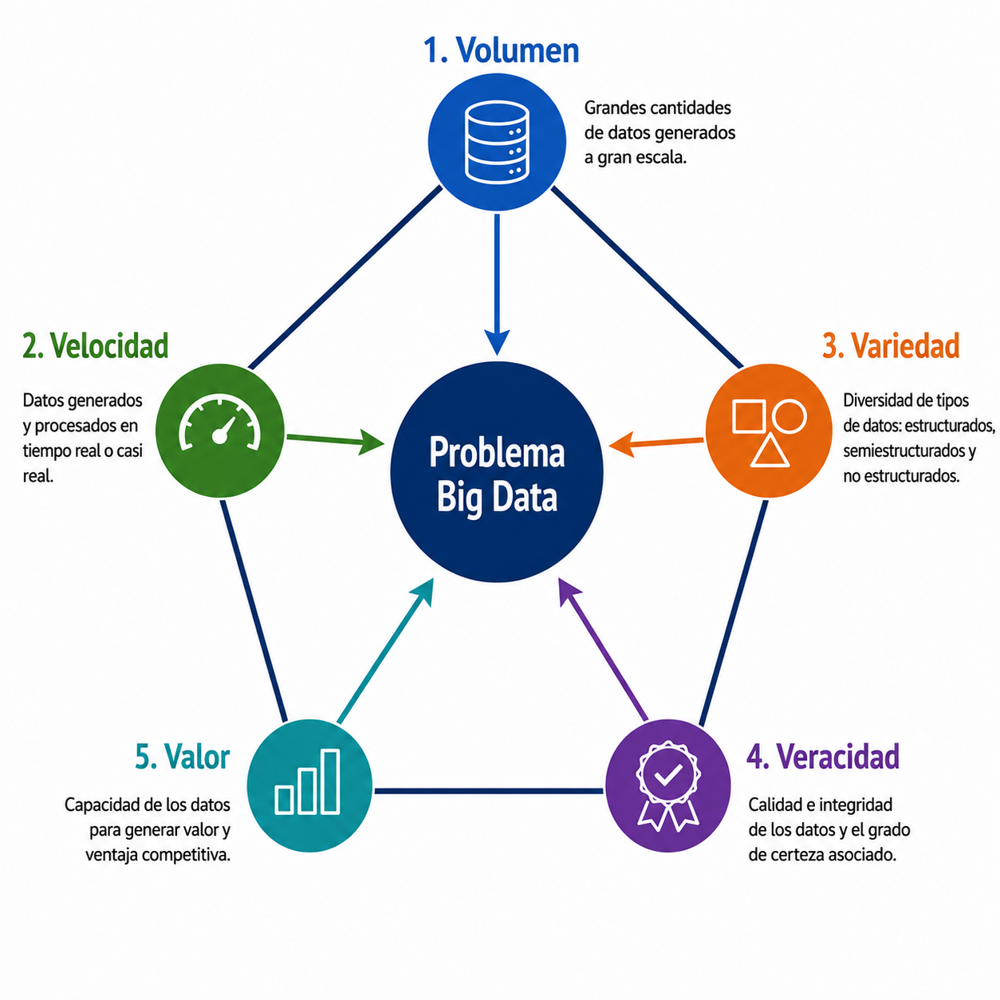
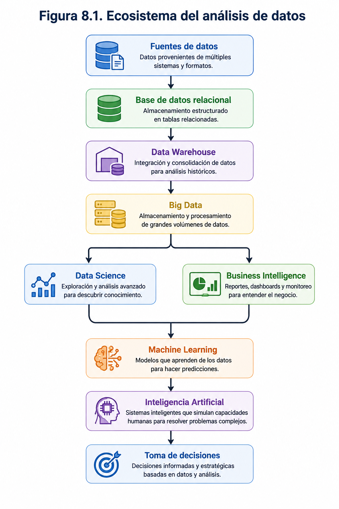
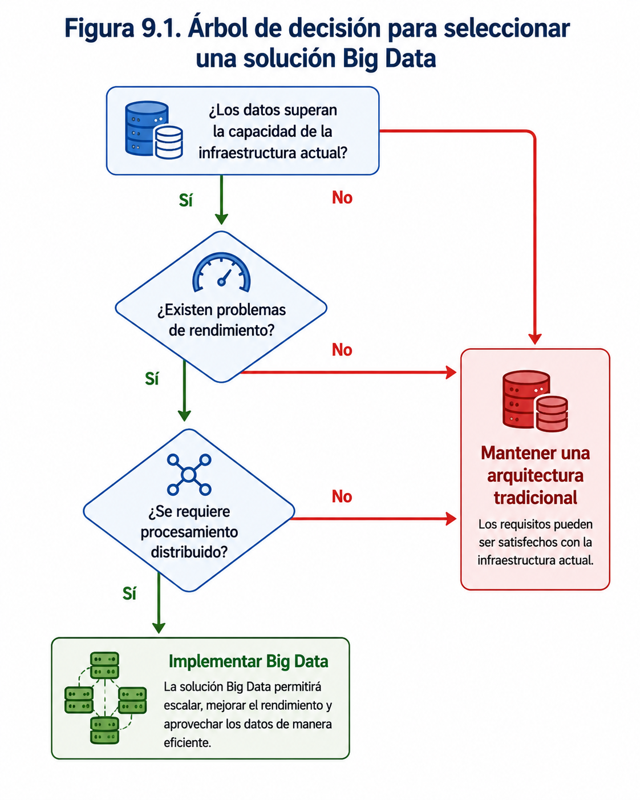

  

---

# PARTE I

# Fundamentos del Big Data

### Del problema al paradigma

---

# Capítulo 1

## Fundamentos del Big Data

---

# Pregunta guía

> **¿Por qué las tecnologías tradicionales para gestionar datos dejaron de ser suficientes y fue necesario desarrollar un nuevo paradigma denominado Big Data?**

Esta pregunta orienta todo el capítulo y deberá ser respondida por el estudiante al finalizar su lectura.

---
# Objetivos de aprendizaje

Al finalizar este capítulo el estudiante será capaz de:

- Explicar el contexto histórico que dio origen al paradigma Big Data.
- Comprender las causas del crecimiento exponencial de los datos.
- Diferenciar Big Data de otros conceptos relacionados.
- Identificar las principales características del Big Data.
- Reconocer situaciones donde Big Data constituye una solución apropiada.
- Evaluar críticamente cuándo una organización no requiere una solución Big Data.

---
# Introducción

*"Los datos se han convertido en uno de los activos más valiosos del siglo XXI."* Esta afirmación, repetida con frecuencia en el ámbito tecnológico y empresarial, refleja una realidad que afecta prácticamente a todos los sectores de la sociedad. Cada búsqueda realizada en Internet, cada compra efectuada mediante una tarjeta bancaria, cada fotografía publicada en una red social y cada interacción con un teléfono inteligente genera información que puede ser almacenada, procesada y analizada. Incluso actividades cotidianas como caminar utilizando un reloj inteligente, conducir un automóvil moderno o visualizar una película en una plataforma de streaming producen una cantidad considerable de datos.

Hace apenas unas décadas, la mayor parte de la información utilizada por las organizaciones era estructurada, relativamente pequeña y generada principalmente a partir de sistemas administrativos. En la actualidad, el escenario es completamente distinto. Empresas, gobiernos, instituciones de salud, universidades y centros de investigación producen diariamente volúmenes masivos de información provenientes de múltiples fuentes y en diversos formatos. A ello se suma el crecimiento acelerado del Internet de las Cosas (IoT), la computación en la nube, las redes sociales y, más recientemente, la inteligencia artificial generativa, tecnologías que han incrementado significativamente tanto la cantidad como la diversidad de los datos disponibles.

Este crecimiento exponencial ha permitido a las organizaciones acceder a una cantidad de información sin precedentes. Sin embargo, también ha generado un desafío tecnológico considerable. Las herramientas tradicionales para almacenar, gestionar y analizar datos comenzaron a mostrar limitaciones frente a conjuntos de información cada vez más grandes, heterogéneos y generados a velocidades crecientes. Problemas relacionados con la capacidad de almacenamiento, los tiempos de procesamiento, la escalabilidad y la disponibilidad de la información hicieron evidente la necesidad de desarrollar nuevos enfoques para el tratamiento de los datos.

Como respuesta a estos desafíos surgió el paradigma **Big Data**, un conjunto de principios, arquitecturas y tecnologías diseñados para capturar, almacenar, procesar y analizar grandes volúmenes de datos de manera eficiente. No obstante, comprender Big Data implica mucho más que conocer una definición o identificar un conjunto de herramientas tecnológicas. Significa comprender el contexto histórico que motivó su aparición, reconocer las limitaciones de los enfoques tradicionales y entender cómo los datos pueden transformarse en conocimiento útil para apoyar la toma de decisiones.

En este capítulo se estudiarán los fundamentos que dieron origen al Big Data, analizando el fenómeno de la explosión de los datos, las características que distinguen este paradigma de otras formas tradicionales de gestión de información y los diferentes tipos de datos que actualmente utilizan las organizaciones. Asimismo, se establecerán las diferencias entre Big Data y otros conceptos estrechamente relacionados, como Business Intelligence, Data Warehouse, Ciencia de Datos e Inteligencia Artificial, permitiendo al estudiante construir una visión integrada del ecosistema de análisis de datos.

Finalmente, el capítulo propone una reflexión que acompañará toda la lectura y servirá como eje articulador de los contenidos:

> **¿Por qué las tecnologías tradicionales para gestionar datos dejaron de ser suficientes y fue necesario desarrollar un nuevo paradigma denominado Big Data?**

Responder adecuadamente esta pregunta permitirá comprender que Big Data no constituye simplemente una colección de herramientas tecnológicas, sino una respuesta a un cambio profundo en la forma en que la sociedad genera, almacena y utiliza la información.

---

## Conceptos clave

- Sociedad del dato.
- Transformación digital.
- Economía digital.
- Toma de decisiones basada en datos.
- Explosión de los datos.
- Big Data.

> **Sociedad del dato:** modelo de organización social y económica en el cual la generación, el intercambio y el análisis de datos constituyen un recurso estratégico para la creación de conocimiento, la innovación y la toma de decisiones.

---

## Sabías que...

Diversas estimaciones indican que más del 90 % de los datos digitales existentes en la actualidad fueron generados durante los últimos años, impulsados principalmente por dispositivos móviles, redes sociales, servicios en la nube, sensores conectados e inteligencia artificial. Este crecimiento continúa acelerándose a medida que nuevas tecnologías se incorporan a la vida cotidiana.

---

## En la práctica

Cuando un usuario abre una aplicación de navegación como Google Maps, el sistema no solo calcula una ruta. También recopila información sobre la ubicación, velocidad de desplazamiento, condiciones del tráfico, horarios de mayor congestión y comportamiento de millones de usuarios. Estos datos son analizados en tiempo real para optimizar rutas, estimar tiempos de viaje y mejorar continuamente la precisión del servicio. Este tipo de procesamiento constituye un ejemplo representativo de los desafíos que motivaron el desarrollo del paradigma Big Data.

---

## Error frecuente

> **"Big Data consiste únicamente en almacenar grandes cantidades de información."**

Aunque el volumen es una característica importante, el verdadero desafío del Big Data radica en transformar datos provenientes de múltiples fuentes y generados a gran velocidad en información útil para apoyar la toma de decisiones. El valor no está en acumular datos, sino en la capacidad para analizarlos y convertirlos en conocimiento.

---

## Caso breve

Una cadena nacional de supermercados registra diariamente millones de transacciones provenientes de sus sucursales, aplicaciones móviles, sitio web, programas de fidelización y redes sociales. Cada cliente deja un rastro de información relacionado con sus hábitos de compra, horarios de consumo y preferencias de productos.

Durante varios años la empresa administró estos datos mediante bases de datos relacionales tradicionales. Sin embargo, el crecimiento sostenido de la información comenzó a afectar el rendimiento de los sistemas, incrementando los tiempos de procesamiento y dificultando la generación de reportes estratégicos.

**Pregunta para reflexionar:**

> ¿Qué características de este escenario permiten anticipar que una arquitectura tradicional podría dejar de ser suficiente?

# 1.2 La explosión de los datos

La humanidad nunca había producido tanta información como en la actualidad. Durante gran parte del siglo XX, la generación de datos estuvo limitada principalmente a registros administrativos, documentos impresos y bases de datos corporativas de tamaño relativamente reducido. Sin embargo, el desarrollo acelerado de las tecnologías digitales transformó profundamente este escenario. Hoy, prácticamente cualquier actividad humana genera datos susceptibles de ser almacenados, procesados y analizados.

Este fenómeno no ocurrió de manera espontánea. Es el resultado de una serie de transformaciones tecnológicas que, durante las últimas décadas, modificaron la forma en que las personas interactúan entre sí, consumen información, trabajan, aprenden y utilizan dispositivos conectados a Internet. Comprender esta evolución resulta fundamental para entender por qué surgió el paradigma Big Data.

---

## 1.2.1 La transformación digital

La transformación digital corresponde al proceso mediante el cual organizaciones y personas incorporan tecnologías digitales para mejorar procesos, crear nuevos modelos de negocio y generar mayor valor a partir de la información.

Inicialmente, la digitalización consistió simplemente en reemplazar documentos físicos por archivos electrónicos. Posteriormente, las organizaciones comenzaron a automatizar procesos completos mediante sistemas informáticos, permitiendo registrar una cantidad creciente de información relacionada con clientes, proveedores, operaciones y procesos internos.

Actualmente, la transformación digital va mucho más allá de la automatización. Las organizaciones utilizan plataformas digitales, inteligencia artificial, servicios en la nube y dispositivos conectados para capturar información en tiempo real y apoyar la toma de decisiones basada en datos.

Como consecuencia, cada proceso digital deja un registro permanente que puede ser utilizado posteriormente para analizar comportamientos, optimizar operaciones o desarrollar nuevos servicios.

---

### Concepto clave

> **Transformación digital:** proceso de integración de tecnologías digitales en las actividades de personas y organizaciones, modificando la forma en que se generan, almacenan y utilizan los datos.

---

## 1.2.2 Internet: el primer gran acelerador

La masificación de Internet representó uno de los mayores cambios tecnológicos de la historia reciente. Antes de su expansión, gran parte de la información permanecía almacenada localmente dentro de las organizaciones. Con Internet, millones de computadores comenzaron a intercambiar información de manera permanente.

Cada correo electrónico enviado, cada búsqueda realizada en un motor de búsqueda, cada descarga de un archivo y cada visita a un sitio web generan múltiples registros digitales.

Además del intercambio de información, Internet permitió la creación de nuevos servicios digitales como el comercio electrónico, la banca en línea, la educación virtual y el trabajo remoto, aumentando considerablemente la cantidad de datos generados diariamente.

---

## 1.2.3 La revolución de los dispositivos móviles

El desarrollo de teléfonos inteligentes y tabletas transformó radicalmente la producción de información.

Mientras un computador tradicional genera datos únicamente cuando está siendo utilizado, un teléfono inteligente continúa produciendo información incluso cuando permanece guardado en el bolsillo de su propietario.

Entre los datos registrados se encuentran:

- ubicación geográfica;
- velocidad de desplazamiento;
- redes Wi-Fi disponibles;
- fotografías y videos;
- actividad física;
- aplicaciones utilizadas;
- historial de navegación;
- transacciones electrónicas.

Actualmente existen miles de millones de dispositivos móviles activos en el mundo, cada uno generando información de manera continua.

---

## 1.2.4 Redes sociales: información producida por las personas

Las redes sociales modificaron profundamente la naturaleza de los datos disponibles.

Anteriormente, gran parte de la información empresarial provenía de sistemas estructurados como bases de datos comerciales o financieras. En cambio, las redes sociales comenzaron a producir enormes cantidades de datos no estructurados, incluyendo:

- textos;
- imágenes;
- videos;
- comentarios;
- reacciones;
- transmisiones en vivo;
- conversaciones.

Esta información permitió analizar opiniones, tendencias, preferencias y comportamientos sociales que anteriormente eran muy difíciles de estudiar.

---

## 1.2.5 Internet de las Cosas (IoT)

El Internet de las Cosas (Internet of Things, IoT) amplió el concepto de generación de datos más allá de las personas.

Actualmente, miles de millones de dispositivos incorporan sensores capaces de medir continuamente variables del entorno, tales como:

- temperatura;
- humedad;
- presión;
- ubicación;
- consumo energético;
- vibraciones;
- frecuencia cardíaca;
- calidad del aire.

Estos sensores generan datos las veinticuatro horas del día, incluso sin intervención humana.

En industrias como la minería, agricultura, salud o manufactura, un único sistema puede producir millones de registros diariamente.

---

## 1.2.6 Inteligencia Artificial Generativa

Uno de los fenómenos más recientes corresponde a la expansión de la Inteligencia Artificial Generativa.

Modelos como ChatGPT, Gemini, Claude o Copilot no solamente consumen grandes cantidades de información durante su entrenamiento, sino que además generan permanentemente nuevos contenidos:

- textos;
- imágenes;
- código fuente;
- audio;
- video;
- documentos.

Esto implica que la inteligencia artificial ya no solo analiza datos existentes, sino que también se ha convertido en una fuente masiva de nuevos datos digitales.

---

## 1.2.7 El crecimiento exponencial de los datos

La combinación de todos estos factores produjo un fenómeno conocido como **explosión de los datos**.

A diferencia de un crecimiento lineal, donde la cantidad de información aumenta de forma constante, la generación de datos digitales crece de manera exponencial. Cada nueva tecnología no reemplaza a la anterior, sino que se suma a ella, multiplicando continuamente la cantidad de información disponible.

Actualmente, personas, empresas, gobiernos, sensores, plataformas digitales e inteligencias artificiales producen datos de manera simultánea y continua, generando un volumen de información sin precedentes en la historia de la humanidad.

Este escenario representa el punto de partida para comprender por qué las tecnologías tradicionales comenzaron a mostrar limitaciones y por qué fue necesario desarrollar nuevas arquitecturas de almacenamiento y procesamiento de datos.

---

## Conceptos clave

- Transformación digital.
- Internet.
- Dispositivos móviles.
- Redes sociales.
- Internet de las Cosas (IoT).
- Inteligencia Artificial Generativa.
- Crecimiento exponencial de los datos.

---

## Sabías que...

Cada minuto se generan millones de búsquedas en Internet, mensajes instantáneos, publicaciones en redes sociales y horas de contenido audiovisual. A esto se suman los datos producidos automáticamente por sensores industriales, vehículos conectados, dispositivos médicos y asistentes de inteligencia artificial. La velocidad de crecimiento es tal que una parte significativa de la información digital existente fue creada durante los últimos años.

---

## En la práctica

Una empresa de logística puede equipar cada uno de sus camiones con sensores GPS, acelerómetros, medidores de combustible y dispositivos de monitoreo del motor. Si la empresa opera una flota de miles de vehículos, cada uno transmitiendo datos cada pocos segundos, el resultado es un flujo continuo de millones de registros diarios. Analizar esa información permite optimizar rutas, reducir costos de combustible, anticipar fallas mecánicas y mejorar los tiempos de entrega.

---

## Error frecuente

> **"La explosión de los datos se debe únicamente al uso de Internet."**

Internet fue un factor decisivo, pero el crecimiento exponencial de los datos es consecuencia de la convergencia de múltiples tecnologías, entre ellas los dispositivos móviles, las redes sociales, el Internet de las Cosas, los servicios en la nube y la inteligencia artificial generativa.

---

  

  <strong>Figura 2.1.</strong> Evolución de la generación de datos digitales.

**Tabla 2.1. Tecnologías impulsoras de la explosión de los datos**

| Tecnología | Tipo de datos generados | Ejemplos |
|------------|-------------------------|----------|
| Internet | Navegación y transacciones | Sitios web, comercio electrónico |
| Dispositivos móviles | Geolocalización, multimedia | Smartphones, tablets |
| Redes sociales | Texto, imágenes, video | Facebook, Instagram, X |
| IoT | Datos de sensores | Industria, salud, ciudades inteligentes |
| IA Generativa | Contenido sintético | ChatGPT, Gemini, Copilot |

---

# 1.3 El problema: las limitaciones de las tecnologías tradicionales

El crecimiento acelerado de los datos descrito en la sección anterior no representó únicamente un aumento en la cantidad de información almacenada por las organizaciones. También implicó un incremento significativo en el número de usuarios, consultas, transacciones y procesos que debían ejecutarse de forma simultánea.

Durante muchos años, las bases de datos relacionales y los servidores tradicionales fueron suficientes para responder a las necesidades de las organizaciones. Sin embargo, a medida que los datos crecían y las operaciones se volvían más complejas, comenzaron a aparecer problemas que anteriormente eran poco frecuentes: tiempos de respuesta elevados, dificultades para ampliar la capacidad de almacenamiento, altos costos de infraestructura y una creciente dependencia de servidores cada vez más potentes.

Estas limitaciones no significan que las bases de datos relacionales dejaran de ser útiles. De hecho, continúan siendo la mejor alternativa para una enorme cantidad de aplicaciones empresariales. El problema surge cuando el volumen, la velocidad y la diversidad de los datos superan las capacidades para las cuales estas tecnologías fueron diseñadas.

Comprender estas limitaciones permite entender por qué la industria comenzó a buscar nuevas arquitecturas capaces de distribuir el almacenamiento y el procesamiento entre múltiples computadores.

---

## 1.3.1 Crecimiento del volumen de información

Las organizaciones comenzaron a almacenar cantidades de información cada vez mayores.

Por ejemplo:

- registros históricos de clientes;
- transacciones comerciales;
- documentos digitales;
- fotografías;
- videos;
- información proveniente de sensores;
- registros de navegación web.

Mientras una base de datos empresarial podía administrar algunos millones de registros sin mayores dificultades, nuevos escenarios requerían gestionar miles de millones de registros distribuidos en múltiples fuentes de información.

El desafío dejó de ser únicamente almacenar datos; también era necesario acceder a ellos de manera rápida y eficiente.

---

## 1.3.2 Más usuarios, más consultas

El crecimiento no solo afectó el tamaño de las bases de datos.

También aumentó considerablemente el número de personas y sistemas consultando la información de manera simultánea.

Una plataforma de comercio electrónico, por ejemplo, debe responder al mismo tiempo a:

- clientes navegando por el catálogo;
- sistemas de pago;
- inventarios;
- recomendaciones de productos;
- aplicaciones móviles;
- servicios externos.

Cada nueva consulta consume recursos del servidor y aumenta la carga del sistema.

---

## 1.3.3 Escalabilidad vertical

Una de las estrategias tradicionales para mejorar el rendimiento consiste en aumentar la capacidad del servidor existente.

Este proceso recibe el nombre de **escalabilidad vertical** (*scale-up*).

En términos generales, consiste en incorporar más recursos a un único servidor:

- mayor cantidad de memoria RAM;
- procesadores más rápidos;
- discos de mayor capacidad;
- almacenamiento de mayor velocidad.

Durante muchos años esta estrategia permitió responder al crecimiento de las organizaciones.

Sin embargo, presenta importantes limitaciones.

Llega un momento en que resulta imposible seguir aumentando la capacidad del servidor o el costo de hacerlo deja de ser razonable.

---

### Concepto clave

> **Escalabilidad vertical:** estrategia de crecimiento basada en aumentar la capacidad de un único servidor mediante la incorporación de más memoria, procesadores o almacenamiento.

---

## 1.3.4 Costos crecientes

Los servidores empresariales de alto rendimiento poseen un costo considerablemente superior al de los equipos convencionales.

A medida que las organizaciones requieren más capacidad de procesamiento, las inversiones aumentan rápidamente.

Además del hardware, deben considerarse costos asociados a:

- licencias de software;
- consumo energético;
- refrigeración;
- mantenimiento;
- respaldo de información;
- personal especializado.

En muchos casos, ampliar continuamente un único servidor deja de ser económicamente viable.

---

## 1.3.5 Rendimiento

El incremento del volumen de datos afecta directamente el tiempo requerido para ejecutar consultas y procesos analíticos.

Operaciones que anteriormente tardaban algunos segundos pueden comenzar a requerir varios minutos o incluso horas.

Este problema se vuelve especialmente crítico cuando las organizaciones necesitan responder en tiempo real.

Por ejemplo:

- detectar fraudes bancarios;
- recomendar productos;
- monitorear pacientes;
- controlar procesos industriales.

---

## 1.3.6 Disponibilidad

Otro desafío importante consiste en garantizar que la información permanezca disponible de forma permanente.

Cuando toda la operación depende de un único servidor, cualquier falla de hardware o software puede provocar la interrupción completa del servicio.

Este escenario recibe comúnmente el nombre de **punto único de falla** (*Single Point of Failure*).

Las organizaciones comenzaron entonces a buscar arquitecturas capaces de continuar funcionando incluso cuando uno o varios computadores dejaran de operar.

---

## 1.3.7 Tiempo de respuesta

La velocidad de respuesta constituye actualmente uno de los principales indicadores de calidad de un sistema de información.

Diversos estudios muestran que retrasos de apenas algunos segundos pueden afectar la experiencia del usuario y provocar pérdidas económicas.

En consecuencia, no basta con almacenar grandes cantidades de información; también es necesario procesarlas y entregarlas oportunamente para apoyar la toma de decisiones.

---

## Conceptos clave

- Escalabilidad.
- Escalabilidad vertical.
- Rendimiento.
- Disponibilidad.
- Punto único de falla.
- Tiempo de respuesta.

---

## Sabías que...

Durante muchos años, la estrategia predominante consistió en adquirir servidores cada vez más potentes. Sin embargo, llegó un punto en que aumentar la capacidad de un único equipo resultaba significativamente más costoso que distribuir el procesamiento entre varios computadores convencionales. Esta transición marcó el inicio del desarrollo de las arquitecturas distribuidas que posteriormente darían origen a tecnologías como Hadoop.

---

## En la práctica

Imagine una plataforma de streaming que atiende simultáneamente a millones de usuarios. Si todos los videos estuvieran almacenados y procesados en un único servidor, cualquier aumento significativo de la demanda provocaría una disminución del rendimiento o incluso la interrupción del servicio. Para evitarlo, estas plataformas distribuyen tanto el almacenamiento como el procesamiento entre cientos o miles de servidores ubicados en distintos centros de datos.

---

## Error frecuente

> **"Las bases de datos relacionales ya no sirven."**

Las bases de datos relacionales continúan siendo la mejor solución para una gran cantidad de aplicaciones empresariales. Las limitaciones descritas en esta sección aparecen únicamente cuando el volumen, la velocidad o la diversidad de los datos superan las capacidades para las cuales estos sistemas fueron diseñados.

---

  

  <strong>Figura 3.1.</strong> Escalabilidad vertical versus procesamiento distribuido.

**Tabla 3.1. Principales limitaciones de las arquitecturas tradicionales**

| Limitación | Descripción | Consecuencia |
|------------|-------------|--------------|
| Escalabilidad vertical | Crecimiento limitado a un único servidor | Alto costo y capacidad finita |
| Rendimiento | Consultas cada vez más lentas | Menor productividad |
| Disponibilidad | Dependencia de un solo equipo | Riesgo de interrupción del servicio |
| Costos | Hardware empresarial de alto rendimiento | Inversiones crecientes |
| Tiempo de respuesta | Procesamiento insuficiente para grandes volúmenes | Retrasos en la toma de decisiones |

---

# 1.4 El nacimiento del paradigma Big Data

El crecimiento exponencial de los datos y las limitaciones de las arquitecturas tradicionales llevaron a muchas organizaciones tecnológicas a buscar nuevas estrategias para almacenar y procesar información. Empresas como Google, Yahoo!, Amazon y posteriormente Facebook comenzaron a enfrentarse a desafíos que ninguna tecnología existente podía resolver de manera eficiente.

Estas organizaciones necesitaban almacenar cantidades masivas de información distribuidas en miles de computadores, garantizar la disponibilidad de los datos incluso ante fallas de hardware y procesar grandes volúmenes de información en tiempos razonables. Resolver estos desafíos requería abandonar el paradigma tradicional basado en un único servidor y adoptar arquitecturas distribuidas capaces de trabajar de manera colaborativa.

Aunque hoy el término **Big Data** es ampliamente conocido, su desarrollo fue el resultado de múltiples investigaciones, proyectos de ingeniería y contribuciones de la comunidad de software libre que transformaron la forma en que se diseñan los sistemas de procesamiento de datos.

---

## 1.4.1 Google y los primeros desafíos a gran escala

A finales de la década de 1990, Google experimentó un crecimiento extraordinario impulsado por la expansión de Internet.

Su motor de búsqueda debía indexar miles de millones de páginas web y responder consultas provenientes de millones de usuarios distribuidos en todo el mundo.

Los sistemas tradicionales comenzaron a mostrar limitaciones importantes.

No resultaba viable continuar aumentando indefinidamente la capacidad de un único servidor.

Google necesitaba una solución distinta.

La empresa adoptó un enfoque innovador: distribuir tanto el almacenamiento como el procesamiento entre cientos y posteriormente miles de computadores convencionales.

Esta estrategia permitió construir sistemas más económicos, escalables y tolerantes a fallas.

---

## 1.4.2 Los artículos científicos de Google

En lugar de mantener completamente reservadas sus investigaciones, Google publicó una serie de artículos científicos que describían las ideas fundamentales detrás de sus nuevas arquitecturas.

Entre los más influyentes destacan:

- **Google File System (GFS)** (2003).
- **MapReduce** (2004).
- **Bigtable** (2006).

Estos trabajos describían cómo distribuir archivos, dividir tareas de procesamiento entre múltiples computadores y almacenar enormes cantidades de información de manera eficiente.

Aunque el código fuente nunca fue publicado, estos artículos proporcionaron suficiente información para que otras organizaciones desarrollaran implementaciones similares.

---

### Sabías que...

Los artículos publicados por Google no incluían el software original. Sin embargo, fueron tan detallados que permitieron a investigadores y desarrolladores reconstruir arquitecturas equivalentes mediante proyectos de código abierto.

---

## 1.4.3 El nacimiento de Hadoop

Inspirados por los trabajos publicados por Google, Doug Cutting y Mike Cafarella iniciaron el desarrollo de un proyecto de software libre destinado a resolver problemas similares.

Ese proyecto recibió el nombre de **Hadoop**, inspirado en el elefante de juguete del hijo de Doug Cutting.

Hadoop incorporó dos componentes fundamentales:

- **HDFS (Hadoop Distributed File System)** para el almacenamiento distribuido.
- **MapReduce** para el procesamiento paralelo de datos.

Gracias a estas tecnologías, organizaciones de distintos tamaños pudieron comenzar a trabajar con grandes volúmenes de información utilizando clusters de computadores convencionales.

---

### Concepto clave

> **Hadoop:** ecosistema de software libre diseñado para almacenar y procesar grandes volúmenes de datos mediante arquitecturas distribuidas.

---

## 1.4.4 El proyecto Apache

Con el tiempo, Hadoop pasó a formar parte de la **Apache Software Foundation**, organización dedicada al desarrollo y mantenimiento de proyectos de software libre.

La incorporación de Hadoop al ecosistema Apache permitió su rápida evolución y la creación de numerosos proyectos complementarios, entre ellos:

- Hive.
- Pig.
- HBase.
- Spark.
- Kafka.
- Sqoop.
- Flume.

Estos componentes dieron origen a uno de los ecosistemas tecnológicos más influyentes en la historia del procesamiento de datos.

---

## 1.4.5 La evolución del concepto Big Data

Inicialmente, el término **Big Data** se utilizaba principalmente para describir conjuntos de datos demasiado grandes para ser procesados mediante herramientas tradicionales.

Sin embargo, con el paso del tiempo el concepto evolucionó considerablemente.

Actualmente, Big Data no hace referencia únicamente al tamaño de los datos.

También involucra:

- nuevas arquitecturas;
- procesamiento distribuido;
- almacenamiento distribuido;
- análisis avanzado;
- computación en la nube;
- inteligencia artificial;
- toma de decisiones basada en datos.

Por esta razón, Big Data debe entenderse como un paradigma tecnológico y organizacional más que como una simple colección de herramientas informáticas.

---

## Conceptos clave

- Arquitectura distribuida.
- Cluster.
- Google File System.
- MapReduce.
- Hadoop.
- Apache Software Foundation.
- Ecosistema Big Data.

---

## En la práctica

Empresas como Netflix, Uber, Spotify y Mercado Libre utilizan arquitecturas distribuidas derivadas de los principios desarrollados originalmente por Google y posteriormente incorporados al ecosistema Hadoop. Aunque muchas organizaciones han reemplazado algunos componentes clásicos por tecnologías más recientes basadas en la nube, los principios fundamentales del procesamiento distribuido continúan siendo los mismos.

---

## Error frecuente

> **"Big Data es sinónimo de Hadoop."**

Hadoop fue una de las primeras implementaciones ampliamente adoptadas para trabajar con grandes volúmenes de datos, pero el paradigma Big Data es mucho más amplio. Actualmente existen múltiples tecnologías y servicios en la nube que permiten implementar soluciones Big Data sin utilizar Hadoop.

---

  

  <strong>Figura 4.1.</strong> Evolución histórica del paradigma Big Data.

**Tabla 4.1. Principales hitos en la evolución del Big Data**

| Año | Hito | Impacto |
|-----|------|---------|
| 2003 | Google File System | Almacenamiento distribuido |
| 2004 | MapReduce | Procesamiento paralelo |
| 2005 | Hadoop | Implementación open source |
| 2008 | Apache Hadoop | Consolidación del ecosistema |
| 2014+ | Spark y cloud computing | Mayor velocidad y flexibilidad |
| 2022+ | IA generativa | Nueva explosión en la producción y análisis de datos |

---

# 1.5 ¿Qué es Big Data?

Después de analizar el contexto histórico, comprender el crecimiento explosivo de los datos y estudiar las limitaciones de las tecnologías tradicionales, surge naturalmente una pregunta:

> **¿Qué entendemos exactamente por Big Data?**

Aunque el término es ampliamente utilizado en ámbitos académicos, empresariales y tecnológicos, no existe una única definición universalmente aceptada. Su significado ha evolucionado a medida que cambian las tecnologías, las necesidades de las organizaciones y las capacidades para almacenar y procesar información.

En sus primeras etapas, Big Data se asociaba principalmente con conjuntos de datos cuyo tamaño superaba la capacidad de las herramientas tradicionales. Sin embargo, esta definición comenzó a resultar insuficiente. Lo que hace diez años podía considerarse un gran volumen de datos, hoy puede procesarse fácilmente mediante tecnologías convencionales.

Actualmente, el concepto de Big Data no depende únicamente de la cantidad de información almacenada. También considera la velocidad con que los datos son generados, la diversidad de sus formatos, la calidad de la información disponible y, sobre todo, el valor que puede obtenerse mediante su análisis.

Por esta razón, antes de adoptar una definición para este libro, resulta pertinente revisar cómo ha evolucionado el concepto.

---

## 1.5.1 Las primeras definiciones

Durante los primeros años del desarrollo del paradigma Big Data, la mayoría de las definiciones hacía referencia principalmente al tamaño de los conjuntos de datos.

Una de las definiciones más difundidas fue propuesta por Gartner, que inicialmente describía Big Data mediante tres características fundamentales conocidas como las **3V**:

- Volumen.
- Velocidad.
- Variedad.

Esta propuesta permitió comprender que el desafío no estaba únicamente en almacenar grandes cantidades de información, sino también en procesarla rápidamente y gestionar datos provenientes de múltiples fuentes y formatos.

Con el tiempo, diversos autores ampliaron este modelo incorporando nuevas dimensiones, como la veracidad y el valor, que serán analizadas en la siguiente sección.

---

## 1.5.2 Definiciones académicas

En la literatura científica pueden encontrarse múltiples definiciones de Big Data, cada una enfatizando distintos aspectos del fenómeno.

Algunos autores centran su definición en las características de los datos, mientras que otros ponen el énfasis en las arquitecturas tecnológicas necesarias para procesarlos o en el valor que estos generan para las organizaciones.

Esta diversidad refleja que Big Data no corresponde únicamente a una tecnología específica, sino a un fenómeno complejo que involucra infraestructura, procesamiento distribuido, análisis avanzado y toma de decisiones basada en datos.

En consecuencia, resulta más apropiado comprender Big Data como un paradigma tecnológico y organizacional que como una herramienta particular.

> **Nota para el lector:** En la siguiente sesión del curso se analizarán artículos científicos que presentan distintas perspectivas sobre este concepto, permitiendo comparar críticamente sus similitudes y diferencias.

---

## 1.5.3 La evolución del concepto

El significado de Big Data ha evolucionado junto con las tecnologías disponibles.

En sus primeras etapas, el concepto hacía referencia principalmente a la imposibilidad de almacenar y procesar grandes volúmenes de información mediante bases de datos tradicionales.

Posteriormente, el desarrollo de arquitecturas distribuidas, la computación en la nube, el aprendizaje automático y la inteligencia artificial ampliaron considerablemente su alcance.

Actualmente, Big Data comprende un ecosistema completo que incluye:

- captura de datos;
- almacenamiento distribuido;
- procesamiento paralelo;
- análisis avanzado;
- visualización;
- apoyo a la toma de decisiones.

Esta evolución demuestra que el concepto continuará transformándose conforme aparezcan nuevas tecnologías y nuevos desafíos.

---

## 1.5.4 La definición adoptada en este libro

A lo largo de este libro utilizaremos la siguiente definición operativa:

> **Big Data es un paradigma tecnológico y organizacional que integra arquitecturas, métodos y herramientas para capturar, almacenar, procesar y analizar grandes volúmenes de datos, generados a alta velocidad y en múltiples formatos, con el propósito de transformarlos en información útil para apoyar la toma de decisiones.**

Esta definición incorpora tres elementos fundamentales:

1. **Los datos**, entendidos como el recurso que será gestionado.
2. **La infraestructura tecnológica**, necesaria para procesarlos de forma eficiente.
3. **La generación de valor**, objetivo último de cualquier iniciativa Big Data.

De esta forma, el concepto trasciende la idea de "muchos datos" y pone el énfasis en la capacidad de convertir esos datos en conocimiento útil.

---

## Conceptos clave

- Big Data.
- Paradigma tecnológico.
- Paradigma organizacional.
- Volumen.
- Velocidad.
- Variedad.
- Toma de decisiones basada en datos.

---

## Concepto clave

> **Big Data no se define únicamente por el tamaño de los datos, sino por la necesidad de utilizar arquitecturas y técnicas diferentes a las tradicionales para gestionarlos eficientemente y obtener valor a partir de ellos.**

---

## Sabías que...

El umbral que define qué se considera "gran volumen de datos" cambia constantemente. Lo que hace veinte años requería un supercomputador, hoy puede procesarse en un computador personal o mediante servicios en la nube. Por esta razón, las definiciones modernas de Big Data se centran en las características del problema y no exclusivamente en la cantidad de información.

---

## En la práctica

Una universidad puede almacenar información académica de miles de estudiantes utilizando una base de datos relacional sin necesidad de implementar una solución Big Data. En cambio, una plataforma de streaming que registra millones de reproducciones, recomendaciones personalizadas y eventos por segundo requiere arquitecturas distribuidas capaces de procesar grandes volúmenes de información en tiempo real. Ambos escenarios gestionan datos, pero solo uno presenta las condiciones que justifican una solución Big Data.

---

## Error frecuente

> **"Big Data significa simplemente tener muchos datos."**

El tamaño de un conjunto de datos, por sí solo, no determina la necesidad de utilizar Big Data. Lo realmente importante es evaluar si las tecnologías tradicionales son suficientes para almacenar, procesar y analizar esa información de manera eficiente y generar valor para la organización.

---

  

  <strong>Figura 5.1.</strong> Evolución del concepto de Big Data.

**Tabla 5.1. Evolución de las definiciones de Big Data**

| Enfoque | Característica principal | Limitación |
|---------|--------------------------|------------|
| Primeras definiciones | Gran volumen de datos | Se centra solo en el tamaño |
| Modelo 3V | Volumen, velocidad y variedad | No considera calidad ni valor |
| Definiciones actuales | Ecosistema tecnológico y organizacional | Concepto amplio y en constante evolución |
| Definición adoptada en este libro | Datos + infraestructura + generación de valor | Se utiliza como marco conceptual para el curso |

---

# 1.6 Las características del Big Data

Hasta este punto se ha explicado por qué surgió el paradigma Big Data y cómo evolucionó su definición. Sin embargo, aún queda una pregunta fundamental:

> **¿Cómo reconocer que una organización enfrenta realmente un problema de Big Data?**

La respuesta no depende únicamente de la cantidad de información disponible. En la práctica, un problema Big Data se caracteriza por la presencia simultánea de diversas dimensiones que dificultan el almacenamiento, procesamiento y análisis de los datos utilizando tecnologías tradicionales.

Originalmente, Gartner propuso tres dimensiones fundamentales conocidas como las **3V**: volumen, velocidad y variedad. Posteriormente, diversos autores ampliaron este modelo incorporando nuevas dimensiones, entre ellas la veracidad y el valor.

En este libro utilizaremos el modelo de las **5V**, por ser uno de los más difundidos en la literatura académica y profesional.

Para facilitar su comprensión, todas las dimensiones serán explicadas utilizando el mismo caso de estudio: una plataforma internacional de streaming de video.

---

# Caso de referencia

Imagine una plataforma similar a Netflix.

Millones de usuarios utilizan diariamente el servicio para:

- buscar películas;
- reproducir contenido;
- detener y reanudar reproducciones;
- calificar series;
- crear listas personales;
- recibir recomendaciones.

Cada una de estas acciones genera información que debe almacenarse y analizarse continuamente.

Las cinco dimensiones del Big Data permiten comprender por qué este escenario requiere tecnologías diferentes a las utilizadas por una base de datos tradicional.

---

## 1.6.1 Volumen

El **volumen** corresponde a la enorme cantidad de datos que una organización debe almacenar y procesar.

En una plataforma de streaming, millones de reproducciones diarias generan registros relacionados con:

- usuario;
- dispositivo;
- ubicación;
- horario;
- contenido visualizado;
- duración;
- calidad del video.

A ello se suman los archivos multimedia, registros de navegación, historiales de búsqueda y datos administrativos.

El desafío no consiste únicamente en almacenar esta información, sino en hacerlo de manera eficiente y económicamente sostenible.

---

### En la práctica

Cada vez que un usuario inicia una película, el sistema registra múltiples eventos. Multiplicar esta situación por millones de usuarios genera volúmenes de información imposibles de administrar mediante un único servidor.

---

## 1.6.2 Velocidad

La **velocidad** hace referencia al ritmo con que los datos son generados, transmitidos y procesados.

Los sistemas actuales no reciben información una vez al día.

La reciben continuamente.

Cada segundo ingresan nuevos eventos que deben analizarse prácticamente en tiempo real.

En una plataforma de streaming, por ejemplo, las recomendaciones personalizadas deben actualizarse mientras el usuario continúa navegando.

Si el procesamiento tarda demasiado, la información pierde utilidad.

---

### En la práctica

Cuando un usuario termina de ver una película, las nuevas recomendaciones aparecen casi inmediatamente.

Esto solo es posible porque los datos son procesados a gran velocidad.

---

## 1.6.3 Variedad

La **variedad** representa la diversidad de formatos que puede adoptar la información.

Una organización moderna ya no trabaja únicamente con tablas de bases de datos.

También administra:

- documentos;
- imágenes;
- videos;
- archivos de audio;
- registros de sensores;
- archivos JSON;
- archivos XML;
- publicaciones en redes sociales.

Cada tipo de información requiere estrategias diferentes para su almacenamiento y procesamiento.

---

### En la práctica

Una plataforma de streaming administra simultáneamente:

- archivos de video;
- subtítulos;
- imágenes promocionales;
- comentarios;
- historiales de navegación;
- datos de facturación.

Todos estos formatos conviven dentro del mismo ecosistema tecnológico.

---

## 1.6.4 Veracidad

No todos los datos poseen la misma calidad.

La **veracidad** hace referencia al grado de confianza que puede depositarse en la información disponible.

Los datos pueden contener:

- errores;
- duplicados;
- registros incompletos;
- inconsistencias;
- información desactualizada.

Tomar decisiones utilizando información poco confiable puede conducir a conclusiones erróneas.

Por ello, garantizar la calidad de los datos constituye uno de los desafíos más importantes del Big Data.

---

### En la práctica

Si un usuario comparte una cuenta con varias personas, el sistema podría interpretar incorrectamente sus preferencias y generar recomendaciones poco precisas.

---

## 1.6.5 Valor

El **valor** representa probablemente la dimensión más importante.

Los datos, por sí solos, no generan beneficios.

Solo adquieren valor cuando permiten responder preguntas relevantes para la organización y apoyar la toma de decisiones.

En otras palabras, almacenar enormes cantidades de información carece de sentido si posteriormente no es posible transformarla en conocimiento útil.

---

### En la práctica

El verdadero valor para una plataforma de streaming no consiste en saber cuántas películas fueron vistas, sino en comprender qué factores permiten mantener a los usuarios suscritos durante más tiempo.

---

## Conceptos clave

- Volumen.
- Velocidad.
- Variedad.
- Veracidad.
- Valor.

---

## Concepto clave

> **Las cinco dimensiones del Big Data no deben entenderse como características independientes. En la práctica, estas dimensiones interactúan entre sí y determinan la complejidad de un problema de datos.**

---

## Sabías que...

En la actualidad existen propuestas que amplían las cinco dimensiones tradicionales incorporando conceptos como variabilidad, visualización, vulnerabilidad o viabilidad. Sin embargo, el modelo de las **5V** continúa siendo el más utilizado en programas de formación y publicaciones especializadas debido a su claridad y capacidad para describir los principales desafíos asociados al Big Data.

---

## Error frecuente

> **"Mientras más grande sea una base de datos, automáticamente estamos frente a un problema Big Data."**

Una organización puede almacenar varios terabytes de información y continuar utilizando tecnologías tradicionales si el volumen, la velocidad de generación, la diversidad de formatos y los requerimientos de análisis permanecen dentro de las capacidades de su infraestructura.

---

  

  <strong>Figura 6.1.</strong> Las cinco dimensiones del Big Data.

**Tabla 6.1. Las cinco dimensiones del Big Data**

| Dimensión | Pregunta que responde | Ejemplo |
|-----------|-----------------------|----------|
| Volumen | ¿Cuántos datos existen? | Millones de registros diarios |
| Velocidad | ¿Con qué rapidez se generan? | Eventos en tiempo real |
| Variedad | ¿Qué tipos de datos existen? | Texto, imágenes, video, sensores |
| Veracidad | ¿Qué tan confiables son? | Datos inconsistentes o incompletos |
| Valor | ¿Qué utilidad tienen? | Apoyo a la toma de decisiones |

---

# 1.7 Tipos de datos

Hasta ahora hemos analizado cómo el crecimiento exponencial de la información impulsó el desarrollo del paradigma Big Data. Sin embargo, no todos los datos poseen la misma estructura ni presentan las mismas dificultades para su almacenamiento y procesamiento.

Durante muchos años, las organizaciones trabajaron casi exclusivamente con información altamente organizada, almacenada en tablas de bases de datos relacionales. Este tipo de datos continúa siendo fundamental para numerosos sistemas empresariales, pero representa solo una pequeña parte de la información que actualmente generan personas, empresas y dispositivos.

Hoy conviven múltiples formatos de información: documentos, fotografías, videos, publicaciones en redes sociales, archivos XML, mensajes JSON, registros de sensores, correos electrónicos y muchos otros. Cada uno posee características distintas y requiere estrategias específicas para su almacenamiento y análisis.

Por esta razón, antes de estudiar las tecnologías Big Data, resulta indispensable comprender los principales tipos de datos existentes.

---

## 1.7.1 Datos estructurados

Los **datos estructurados** corresponden a información organizada mediante un esquema previamente definido.

Cada registro posee exactamente los mismos atributos, permitiendo almacenar la información en tablas compuestas por filas y columnas.

Este tipo de organización facilita enormemente la búsqueda, actualización y análisis de los datos mediante lenguajes como SQL.

Durante décadas, las bases de datos relacionales se diseñaron específicamente para administrar este tipo de información.

### Ejemplos

- Clientes.
- Productos.
- Facturas.
- Matrículas.
- Inventarios.
- Cuentas bancarias.

---

### En la práctica

Cuando una universidad registra la información de sus estudiantes, cada registro contiene los mismos campos:

- RUN.
- Nombre.
- Carrera.
- Fecha de ingreso.
- Año académico.

Todos los estudiantes poseen exactamente la misma estructura de datos.

---

## 1.7.2 Datos semiestructurados

Los **datos semiestructurados** contienen cierta organización interna, pero no siguen un esquema rígido como las bases de datos relacionales.

Generalmente utilizan etiquetas o estructuras jerárquicas que permiten identificar los distintos elementos de la información.

Los formatos JSON y XML constituyen los ejemplos más conocidos.

Estos formatos ofrecen mayor flexibilidad para representar información compleja y son ampliamente utilizados por aplicaciones web, servicios REST y plataformas de intercambio de información.

### Ejemplos

- JSON.
- XML.
- Archivos YAML.
- Documentos HTML.
- Respuestas de APIs.

---

### En la práctica

Cuando una aplicación móvil consulta el pronóstico del tiempo mediante una API, normalmente recibe un documento JSON.

Cada ciudad puede contener distinta cantidad de información dependiendo de los servicios disponibles.

Esta flexibilidad hace muy difícil almacenar todos los registros utilizando una única tabla relacional.

---

## 1.7.3 Datos no estructurados

Los **datos no estructurados** carecen de una estructura fija que permita organizarlos fácilmente en filas y columnas.

Representan actualmente la mayor parte de la información digital generada en el mundo.

En esta categoría se incluyen:

- fotografías;
- videos;
- archivos de audio;
- documentos PDF;
- correos electrónicos;
- publicaciones en redes sociales;
- conversaciones;
- imágenes médicas.

Aunque estos datos contienen enorme cantidad de información, resulta considerablemente más complejo analizarlos utilizando herramientas tradicionales.

Por esta razón, el procesamiento de datos no estructurados constituye uno de los principales desafíos del Big Data.

---

### En la práctica

Una plataforma de streaming almacena:

- películas;
- series;
- imágenes promocionales;
- avances;
- subtítulos;
- comentarios de usuarios.

La mayor parte de esta información no puede organizarse mediante tablas tradicionales.

---

## 1.7.4 Comparación de los tipos de datos

Los tres tipos de datos no son excluyentes.

De hecho, una misma organización administra simultáneamente información estructurada, semiestructurada y no estructurada.

Por ejemplo, una plataforma de comercio electrónico puede almacenar:

- información de clientes en una base de datos relacional;
- pedidos mediante documentos JSON;
- fotografías de productos;
- videos promocionales;
- comentarios de usuarios.

Cada tipo de información requiere tecnologías y estrategias distintas para su gestión.

Comprender esta diversidad constituye uno de los fundamentos del paradigma Big Data.

---

## Conceptos clave

- Datos estructurados.
- Datos semiestructurados.
- Datos no estructurados.
- Esquema.
- JSON.
- XML.
- SQL.

---

## Concepto clave

> **El tipo de dato determina, en gran medida, las tecnologías más adecuadas para almacenarlo, procesarlo y analizarlo.**

---

## Sabías que...

Se estima que más del 80 % de la información digital generada actualmente corresponde a datos no estructurados. Fotografías, videos, publicaciones en redes sociales, documentos y registros multimedia representan la mayor parte del crecimiento de la información en Internet.

---

## En la práctica

Una empresa de retail administra simultáneamente distintos tipos de datos:

- Información de ventas → estructurada.
- Catálogo de productos en JSON → semiestructurada.
- Fotografías y videos promocionales → no estructurados.

Todos estos datos forman parte del mismo ecosistema de información.

---

## Error frecuente

> **"Los datos no estructurados no poseen organización."**

Los datos no estructurados sí contienen información valiosa y, en muchos casos, presentan patrones internos. Lo que ocurre es que no siguen un esquema fijo que permita almacenarlos fácilmente mediante tablas relacionales.

---

**Tabla 7.1. Comparación entre tipos de datos**

| Característica | Estructurados | Semiestructurados | No estructurados |
|---------------|---------------|-------------------|------------------|
| Organización | Esquema fijo | Esquema flexible | Sin esquema fijo |
| Ejemplos | SQL, ERP, CRM | JSON, XML | Video, audio, imágenes |
| Facilidad de consulta | Muy alta | Media | Baja |
| Tecnología habitual | Bases de datos relacionales | Bases NoSQL documentales | Sistemas distribuidos y almacenamiento de objetos |
| Complejidad de análisis | Baja | Media | Alta |

---

# 1.8 Big Data y su relación con otros paradigmas del análisis de datos

A lo largo de los últimos años han surgido numerosos conceptos relacionados con el tratamiento y análisis de datos. Términos como **Business Intelligence**, **Data Warehouse**, **Data Science**, **Machine Learning** o **Inteligencia Artificial** aparecen con frecuencia en artículos, conferencias y ofertas laborales. Sin embargo, no siempre resulta evidente cuál es la relación entre ellos.

Es común encontrar personas que utilizan estos conceptos como si fueran equivalentes o que consideran que uno reemplaza completamente a otro. En realidad, cada paradigma responde a objetivos distintos, utiliza herramientas específicas y ocupa un lugar determinado dentro del ecosistema de gestión y análisis de datos.

Comprender estas diferencias constituye un requisito fundamental para seleccionar correctamente la tecnología más adecuada para cada problema organizacional.

---

# 1.8.1 Bases de datos relacionales

Las bases de datos relacionales constituyen el fundamento de la mayoría de los sistemas de información desarrollados durante las últimas décadas.

Su principal objetivo consiste en almacenar información estructurada de manera consistente, segura y eficiente.

Son especialmente apropiadas para sistemas transaccionales como:

- sistemas bancarios;
- sistemas académicos;
- ERP;
- CRM;
- sistemas de inventario.

Aunque continúan siendo indispensables, presentan limitaciones cuando el volumen, la velocidad o la variedad de los datos aumentan considerablemente.

---

## Objetivo principal

Registrar operaciones.

---

## Ejemplo

Sistema de matrícula universitaria.

---

# 1.8.2 Data Warehouse

Un **Data Warehouse** corresponde a un repositorio especializado en integrar información proveniente de múltiples sistemas para facilitar el análisis histórico y la generación de reportes.

A diferencia de las bases de datos transaccionales, un Data Warehouse no está orientado al registro de operaciones diarias, sino al apoyo de la toma de decisiones mediante consultas analíticas.

En muchos proyectos, el Data Warehouse constituye una etapa previa al análisis mediante herramientas de Business Intelligence.

---

## Objetivo principal

Integrar información para análisis.

---

## Ejemplo

Histórico de ventas de una empresa durante diez años.

---

# 1.8.3 Business Intelligence

Business Intelligence (BI) corresponde al conjunto de metodologías y herramientas destinadas a transformar los datos en información útil para apoyar la toma de decisiones.

Generalmente incorpora:

- indicadores;
- dashboards;
- reportes;
- análisis OLAP;
- visualización de información.

El objetivo principal de BI consiste en responder preguntas relacionadas con el desempeño pasado y presente de una organización.

---

## Objetivo principal

Responder:

**¿Qué ocurrió?**

---

## Ejemplo

Dashboard de ventas mensuales.

---

# 1.8.4 Big Data

Big Data incorpora arquitecturas capaces de almacenar y procesar enormes volúmenes de información provenientes de múltiples fuentes y formatos.

Su principal aporte consiste en permitir el procesamiento distribuido cuando las tecnologías tradicionales dejan de ser suficientes.

Big Data puede integrarse posteriormente con herramientas de Business Intelligence, Ciencia de Datos o Inteligencia Artificial.

---

## Objetivo principal

Gestionar grandes volúmenes de datos.

---

## Ejemplo

Procesamiento de millones de registros provenientes de sensores IoT.

---

# 1.8.5 Data Science

La Ciencia de Datos combina estadística, programación, matemáticas y conocimiento del negocio para descubrir patrones, explicar fenómenos y construir modelos predictivos.

Mientras Big Data proporciona la infraestructura necesaria para gestionar enormes cantidades de información, Data Science utiliza esos datos para generar conocimiento.

---

## Objetivo principal

Descubrir conocimiento.

---

## Ejemplo

Predicción del abandono de estudiantes universitarios.

---

# 1.8.6 Machine Learning

Machine Learning constituye una rama de la Inteligencia Artificial orientada al desarrollo de algoritmos capaces de aprender automáticamente a partir de los datos.

Estos modelos pueden utilizarse para:

- clasificación;
- predicción;
- recomendación;
- detección de anomalías.

Su desempeño depende directamente de la calidad y cantidad de información disponible.

---

## Objetivo principal

Aprender patrones.

---

## Ejemplo

Sistema de recomendación de películas.

---

# 1.8.7 Inteligencia Artificial

La Inteligencia Artificial corresponde a un campo mucho más amplio que busca desarrollar sistemas capaces de realizar tareas que normalmente requieren inteligencia humana.

Incluye múltiples áreas, entre ellas:

- Machine Learning;
- procesamiento del lenguaje natural;
- visión por computador;
- robótica;
- sistemas expertos;
- inteligencia artificial generativa.

Big Data constituye uno de los principales habilitadores tecnológicos para el entrenamiento y funcionamiento de numerosos sistemas de inteligencia artificial.

---

## Objetivo principal

Automatizar capacidades cognitivas.

---

## Ejemplo

Asistentes inteligentes como ChatGPT o Copilot.

---

# Conceptos clave

- Base de datos relacional.
- Data Warehouse.
- Business Intelligence.
- Big Data.
- Data Science.
- Machine Learning.
- Inteligencia Artificial.

---

## Concepto clave

> **Estos paradigmas no compiten entre sí. Por el contrario, se complementan y pueden formar parte de una misma solución tecnológica.**

---

## Sabías que...

Un mismo proyecto puede utilizar simultáneamente una base de datos relacional para registrar transacciones, un Data Warehouse para consolidar la información histórica, una plataforma Big Data para procesar grandes volúmenes de datos, modelos de Machine Learning para realizar predicciones y herramientas de Business Intelligence para visualizar los resultados.

---

## En la práctica

Una empresa de comercio electrónico puede seguir el siguiente flujo:

1. Registrar ventas en una base de datos relacional.
2. Consolidar la información en un Data Warehouse.
3. Procesar millones de eventos de navegación mediante Big Data.
4. Construir modelos predictivos utilizando Data Science y Machine Learning.
5. Presentar los resultados mediante dashboards de Business Intelligence.

Todos estos componentes forman parte de una única arquitectura de análisis de datos.

---

## Error frecuente

> **"Big Data reemplaza a Business Intelligence o a las bases de datos relacionales."**

Cada paradigma resuelve problemas diferentes. En la mayoría de las organizaciones modernas, estas tecnologías coexisten y se complementan dentro de una misma arquitectura de información.

---

  

  <strong>Figura 8.1.</strong> Ecosistema del análisis de datos.

---

**Tabla 8.1. Comparación entre paradigmas del ecosistema de datos**

| Paradigma | Objetivo principal | Tipo de datos | Pregunta que responde | Ejemplo |
|-----------|-------------------|---------------|-----------------------|----------|
| Base de datos relacional | Registrar operaciones | Estructurados | ¿Qué ocurrió? | Sistema académico |
| Data Warehouse | Integrar información histórica | Estructurados | ¿Qué ha ocurrido en el tiempo? | Históricos de ventas |
| Business Intelligence | Analizar y visualizar | Principalmente estructurados | ¿Qué está pasando? | Dashboard |
| Big Data | Procesar grandes volúmenes | Todo tipo de datos | ¿Cómo gestiono estos datos? | Hadoop / Spark |
| Data Science | Descubrir patrones | Todos | ¿Qué puedo aprender? | Modelos predictivos |
| Machine Learning | Aprender automáticamente | Todos | ¿Qué ocurrirá? | Predicciones |
| Inteligencia Artificial | Automatizar decisiones y capacidades cognitivas | Todos | ¿Cómo puede actuar el sistema? | Asistentes inteligentes |

---

# 1.9 ¿Cuándo una organización realmente necesita Big Data?

Después de estudiar el origen del paradigma Big Data, sus características y su relación con otras tecnologías, es posible responder una de las preguntas más importantes para cualquier profesional del área:

> **¿En qué situaciones resulta realmente necesario implementar una solución Big Data?**

Responder correctamente esta pregunta requiere comprender que Big Data no constituye una solución universal para todos los problemas relacionados con datos. En muchos casos, las tecnologías tradicionales continúan siendo la alternativa más eficiente, económica y sencilla.

Uno de los errores más frecuentes consiste en asumir que una organización necesita Big Data únicamente porque dispone de una gran cantidad de información. Sin embargo, el tamaño de una base de datos, por sí solo, no justifica la adopción de arquitecturas distribuidas.

La decisión debe fundamentarse en las necesidades reales del problema, considerando aspectos técnicos, organizacionales y económicos.

---

## 1.9.1 Casos donde sí utilizar Big Data

Una solución Big Data resulta recomendable cuando concurren una o varias de las siguientes situaciones.

### Grandes volúmenes de información

La organización administra cantidades masivas de datos cuyo almacenamiento o procesamiento supera las capacidades de una infraestructura tradicional.

Ejemplos:

- plataformas de streaming;
- motores de búsqueda;
- redes sociales;
- comercio electrónico global.

---

### Alta velocidad de generación

Los datos son producidos continuamente y deben procesarse prácticamente en tiempo real.

Ejemplos:

- sensores industriales;
- monitoreo financiero;
- vehículos conectados;
- Internet de las Cosas.

---

### Gran diversidad de formatos

La información proviene de múltiples fuentes y combina datos estructurados, documentos, imágenes, videos, registros de sensores y archivos semiestructurados.

---

### Procesamiento distribuido

El problema requiere distribuir el almacenamiento o el procesamiento entre numerosos computadores para reducir tiempos de ejecución o aumentar la disponibilidad.

---

### Analítica a gran escala

La organización necesita analizar enormes cantidades de información para descubrir patrones, entrenar modelos predictivos o apoyar decisiones estratégicas.

---

## Caso 1

Una plataforma internacional de comercio electrónico registra diariamente cientos de millones de transacciones, clics, búsquedas y recomendaciones personalizadas.

La información proviene de aplicaciones móviles, sitios web, centros logísticos y sistemas de pago distribuidos en distintos países.

En este escenario, una arquitectura Big Data resulta plenamente justificada.

---

## 1.9.2 Casos donde no utilizar Big Data

Existen numerosas situaciones donde implementar una plataforma Big Data constituye una decisión innecesaria.

---

### Sistemas transaccionales tradicionales

Una empresa administra clientes, productos, ventas y facturación mediante una base de datos relacional.

El volumen de información es reducido y las consultas se ejecutan rápidamente.

Una arquitectura Big Data aportaría complejidad sin entregar beneficios significativos.

---

### Organizaciones pequeñas

Muchas pequeñas y medianas empresas administran exitosamente su información mediante bases de datos tradicionales o servicios en la nube sin necesidad de incorporar tecnologías Big Data.

---

### Bajo volumen de datos

Aunque una organización produzca información diariamente, ello no implica necesariamente que deba utilizar procesamiento distribuido.

Miles o incluso millones de registros pueden administrarse eficientemente mediante tecnologías convencionales.

---

### Problemas exclusivamente administrativos

Sistemas como:

- control de asistencia;
- biblioteca;
- inventario;
- gestión académica;
- recursos humanos;

normalmente pueden implementarse utilizando bases de datos relacionales.

---

## Caso 2

Una universidad administra la información académica de 25 000 estudiantes.

Toda la información corresponde a datos estructurados:

- matrícula;
- asignaturas;
- calificaciones;
- docentes;
- horarios.

Las consultas se ejecutan correctamente utilizando SQL Server o PostgreSQL.

En este escenario, implementar una plataforma Hadoop no generaría ventajas relevantes y aumentaría innecesariamente los costos y la complejidad técnica.

---

## 1.9.3 Criterios para decidir

Antes de seleccionar una arquitectura Big Data conviene responder preguntas como las siguientes:

- ¿Las tecnologías actuales ya no responden adecuadamente?
- ¿Existe un problema real de escalabilidad?
- ¿La información proviene de múltiples formatos?
- ¿Se requiere procesamiento distribuido?
- ¿Los datos se generan continuamente?
- ¿El análisis debe realizarse en tiempo real?
- ¿El beneficio esperado justifica el costo de implementación?

Responder afirmativamente a varias de estas preguntas constituye un fuerte indicador de que una solución Big Data podría ser apropiada.

---

## Conceptos clave

- Escalabilidad.
- Procesamiento distribuido.
- Infraestructura.
- Costo-beneficio.
- Complejidad tecnológica.
- Arquitectura Big Data.

---

## Concepto clave

> **Big Data no debe seleccionarse porque esté de moda, sino porque constituye la solución técnicamente más adecuada para un problema específico.**

---

## Sabías que...

Muchas organizaciones que inicialmente implementaron plataformas Big Data migraron posteriormente parte de sus soluciones hacia servicios administrados en la nube. El objetivo no fue abandonar el paradigma Big Data, sino reducir la complejidad operativa manteniendo las capacidades de almacenamiento y procesamiento distribuido.

---

## En la práctica

Una empresa puede comenzar utilizando una base de datos relacional y, conforme aumenta el volumen de información, incorporar progresivamente un Data Warehouse, herramientas de Business Intelligence y, solo cuando resulte necesario, una plataforma Big Data. No todas las organizaciones recorren este camino completo, y esa decisión depende de sus necesidades específicas.

---

## Error frecuente

> **"Toda base de datos grande requiere Big Data."**

El volumen constituye solo una de las dimensiones que deben evaluarse. Una organización puede administrar cantidades importantes de información utilizando tecnologías tradicionales si estas continúan satisfaciendo adecuadamente sus necesidades de almacenamiento, procesamiento y análisis.

---

  

  <strong>Figura 9.1.</strong> Árbol de decisión para seleccionar una solución Big Data.

---

**Tabla 9.1. ¿Cuándo utilizar Big Data?**

| Escenario | ¿Big Data? | Justificación |
|-----------|:----------:|---------------|
| Sistema de matrícula universitaria | ❌ | Datos estructurados y volumen manejable |
| Plataforma de streaming | ✅ | Gran volumen, velocidad y variedad |
| Red social | ✅ | Millones de usuarios y datos no estructurados |
| Sistema ERP empresarial | ❌ | Procesamiento transaccional tradicional |
| Monitoreo de sensores IoT | ✅ | Flujo continuo de datos en tiempo real |
| Comercio electrónico internacional | ✅ | Alta escalabilidad y procesamiento distribuido |

---

# 1.10 Caso de estudio integrador

## SmartCity Analytics

### Diseño de una plataforma Big Data para una ciudad inteligente

A lo largo de este libro se desarrollará un único caso de estudio que permitirá integrar progresivamente los conceptos presentados en cada capítulo.

El objetivo no consiste únicamente en comprender la teoría del Big Data, sino también en observar cómo estos principios pueden aplicarse para resolver un problema real de ingeniería.

---

# Contexto

La ciudad ficticia **Nova Ciudad** posee aproximadamente dos millones de habitantes.

Durante los últimos años ha experimentado un importante proceso de transformación digital, incorporando sensores, plataformas electrónicas y servicios inteligentes destinados a mejorar la calidad de vida de sus ciudadanos.

Actualmente la ciudad dispone de múltiples fuentes de información, entre ellas:

- cámaras de tránsito;
- sensores ambientales;
- estaciones meteorológicas;
- GPS de buses urbanos;
- consumo energético;
- semáforos inteligentes;
- denuncias ciudadanas;
- redes sociales;
- aplicaciones móviles;
- sistemas de salud;
- información turística.

Cada uno de estos sistemas genera información continuamente.

---

# El problema

Inicialmente, cada organismo municipal almacenaba su información de manera independiente.

Con el paso del tiempo comenzaron a aparecer dificultades importantes:

- los datos crecieron rápidamente;
- existían múltiples formatos incompatibles;
- algunas fuentes generaban información cada segundo;
- los tiempos de respuesta comenzaron a aumentar;
- era muy difícil integrar la información para apoyar la toma de decisiones.

Las autoridades municipales concluyeron que la infraestructura tecnológica existente ya no respondía adecuadamente a las nuevas necesidades.

Por ello decidieron diseñar una plataforma Big Data denominada:

> **SmartCity Analytics**

---

# Objetivo del proyecto

Construir una plataforma capaz de:

- almacenar grandes volúmenes de información;
- integrar múltiples fuentes de datos;
- procesar información distribuida;
- generar indicadores para la gestión municipal;
- apoyar decisiones estratégicas.

---

# Fuentes de datos

La plataforma deberá integrar información proveniente de:

| Fuente | Tipo de dato |
|---------|--------------|
| GPS de buses | Semiestructurado |
| Cámaras urbanas | No estructurado |
| Sensores ambientales | Semiestructurado |
| Consumo eléctrico | Estructurado |
| Redes sociales | No estructurado |
| Meteorología | Semiestructurado |
| Denuncias ciudadanas | No estructurado |
| Catastro municipal | Estructurado |

---

# ¿Por qué este caso corresponde a un problema Big Data?

Durante la lectura del capítulo ya es posible identificar varias características estudiadas anteriormente.

✔ Gran volumen de información.

✔ Alta velocidad de generación.

✔ Múltiples formatos de datos.

✔ Necesidad de integrar numerosas fuentes.

✔ Procesamiento distribuido.

✔ Generación de información para apoyar decisiones.

---

## Preguntas para analizar

1. ¿Qué características del Big Data aparecen en este caso?

2. ¿Qué tipos de datos administra la ciudad?

3. ¿Podría resolverse este problema utilizando únicamente una base de datos relacional?

4. ¿Qué beneficios aportaría una arquitectura distribuida?

5. ¿Qué decisiones podrían mejorar utilizando esta plataforma?

---

## Como ingeniero(a), pregúntese...

Si usted fuera el arquitecto responsable del proyecto:

> **¿Qué información necesitaría recopilar antes de decidir qué tecnologías utilizar para construir la plataforma SmartCity Analytics?**

---

# 1.11 Resumen del capítulo

En este capítulo se estudió el origen del paradigma Big Data, comprendiendo que su aparición no respondió a una moda tecnológica, sino a la necesidad de resolver problemas que las arquitecturas tradicionales ya no podían abordar de manera eficiente.

El análisis comenzó examinando la transformación digital y el crecimiento exponencial de la información generado por Internet, los dispositivos móviles, las redes sociales, el Internet de las Cosas y, más recientemente, la Inteligencia Artificial Generativa. Estas tecnologías incrementaron simultáneamente el volumen, la velocidad y la diversidad de los datos disponibles para personas y organizaciones.

Posteriormente se analizaron las limitaciones de las bases de datos tradicionales, identificando problemas relacionados con la escalabilidad, el rendimiento, la disponibilidad y los costos asociados al procesamiento de grandes volúmenes de información. Estas dificultades impulsaron el desarrollo de nuevas arquitecturas distribuidas capaces de almacenar y procesar datos utilizando múltiples computadores trabajando de forma coordinada.

El capítulo también presentó el origen histórico del paradigma Big Data, destacando el papel desempeñado por Google, la publicación de Google File System y MapReduce, así como el posterior desarrollo del ecosistema Hadoop dentro de la Apache Software Foundation.

A continuación se revisaron distintas definiciones de Big Data, concluyendo que no existe una definición universalmente aceptada y que el concepto ha evolucionado desde una visión centrada únicamente en el tamaño de los datos hacia un paradigma que integra infraestructura tecnológica, procesamiento distribuido y generación de valor para la toma de decisiones.

Posteriormente se estudiaron las cinco dimensiones del Big Data (volumen, velocidad, variedad, veracidad y valor), así como los principales tipos de datos que actualmente administran las organizaciones: estructurados, semiestructurados y no estructurados.

Finalmente, se comparó Big Data con otros paradigmas del ecosistema del análisis de datos, diferenciándolo de las bases de datos relacionales, Data Warehouse, Business Intelligence, Data Science, Machine Learning e Inteligencia Artificial. Asimismo, se analizaron los criterios que permiten determinar cuándo una organización realmente necesita implementar una solución Big Data y cuándo resulta más conveniente utilizar tecnologías tradicionales.

El capítulo concluyó con el análisis del caso **SmartCity Analytics**, que será desarrollado progresivamente a lo largo del libro para integrar los conceptos presentados y aplicarlos en un contexto de ingeniería.

---

# Conceptos fundamentales

Al finalizar este capítulo, el lector debería comprender con claridad los siguientes conceptos:

- Transformación digital.
- Explosión de los datos.
- Limitaciones de las arquitecturas tradicionales.
- Procesamiento distribuido.
- Paradigma Big Data.
- Hadoop como hito histórico.
- Las cinco dimensiones del Big Data.
- Tipos de datos.
- Ecosistema del análisis de datos.
- Criterios para decidir cuándo utilizar Big Data.

---

# Ideas principales

- Big Data surgió como respuesta a problemas tecnológicos concretos asociados al crecimiento de los datos.
- El volumen de información, por sí solo, no define un problema Big Data.
- Las arquitecturas distribuidas permiten superar muchas de las limitaciones de los sistemas tradicionales.
- Los datos pueden presentarse en múltiples formatos y requieren tecnologías distintas para su gestión.
- Big Data forma parte de un ecosistema más amplio que incluye Business Intelligence, Data Science, Machine Learning e Inteligencia Artificial.
- No todas las organizaciones necesitan implementar soluciones Big Data.
- La selección de una arquitectura debe responder a criterios técnicos, organizacionales y económicos, y no únicamente a tendencias tecnológicas.

---

# Respuesta a la pregunta guía

Al inicio de este capítulo se planteó la siguiente pregunta:

> **¿Por qué las tecnologías tradicionales para gestionar datos dejaron de ser suficientes y fue necesario desarrollar un nuevo paradigma denominado Big Data?**

Después del estudio realizado, es posible concluir que el crecimiento exponencial del volumen, la velocidad y la diversidad de los datos superó progresivamente las capacidades de las arquitecturas tradicionales. Como consecuencia, fue necesario desarrollar nuevas formas de almacenar, procesar y analizar la información mediante arquitecturas distribuidas, capaces de transformar grandes cantidades de datos en conocimiento útil para apoyar la toma de decisiones.

---

# Conexión con el siguiente capítulo

Hasta este punto se ha comprendido **por qué** surgió Big Data.

La siguiente pregunta natural es:

> **¿Cómo se construye una arquitectura capaz de almacenar y procesar grandes volúmenes de datos?**

En el próximo capítulo se estudiarán las arquitecturas Big Data, analizando los principios del procesamiento distribuido, los componentes fundamentales de un clúster y las bases sobre las cuales se desarrollan tecnologías como Hadoop y Apache Spark.

---

# 1.12 Actividades

Las siguientes actividades tienen como propósito consolidar los conceptos desarrollados en este capítulo y promover su aplicación en contextos similares a los que enfrentará un ingeniero durante el diseño de soluciones Big Data.

---

# Actividad individual

## Análisis de un escenario organizacional

Seleccione una organización de su interés (empresa, universidad, hospital, municipalidad, banco, industria, etc.) y responda las siguientes preguntas.

1. ¿Qué tipos de datos administra esta organización?
2. ¿Los datos son estructurados, semiestructurados o no estructurados?
3. ¿Cuáles de las cinco dimensiones del Big Data se observan con mayor claridad?
4. ¿Considera que esta organización necesita implementar una solución Big Data? Justifique técnicamente su respuesta.
5. ¿Qué beneficios podría obtener mediante el análisis de sus datos?

**Producto esperado**

Un informe de una a dos páginas, acompañado de un diagrama simple que represente las principales fuentes de datos identificadas.

---

# Actividad grupal

## Diagnóstico del caso SmartCity Analytics

En grupos de tres o cuatro estudiantes, analicen el caso **SmartCity Analytics** presentado en este capítulo.

Como equipo consultor deberán elaborar un diagnóstico inicial dirigido al municipio.

Su informe deberá responder las siguientes preguntas:

- ¿Cuáles son las principales fuentes de datos de la ciudad?
- ¿Qué tipos de datos administra cada una de ellas?
- ¿Qué dimensiones del Big Data están presentes?
- ¿Qué limitaciones presentan las tecnologías tradicionales?
- ¿Qué argumentos justifican la adopción de una arquitectura Big Data?

**Producto esperado**

- Un informe ejecutivo de dos a tres páginas.
- Un diagrama conceptual que represente las fuentes de datos de la ciudad.
- Una presentación breve de cinco minutos para defender las conclusiones del grupo.

---

# Autoevaluación

Antes de continuar con el siguiente capítulo, verifique si puede responder afirmativamente a las siguientes preguntas.

| Pregunta | Sí | No |
|----------|:--:|:--:|
| ¿Puedo explicar por qué surgió Big Data? | ☐ | ☐ |
| ¿Comprendo las cinco dimensiones del Big Data? | ☐ | ☐ |
| ¿Puedo diferenciar datos estructurados, semiestructurados y no estructurados? | ☐ | ☐ |
| ¿Soy capaz de distinguir Big Data de Business Intelligence o Data Science? | ☐ | ☐ |
| ¿Puedo justificar cuándo una organización necesita Big Data? | ☐ | ☐ |

---

# Preguntas para reflexionar

1. ¿Toda organización necesita implementar una solución Big Data? Argumente su respuesta utilizando ejemplos.

2. ¿Cuál de las cinco dimensiones representa el mayor desafío para una universidad? ¿Por qué?

3. Imagine que una empresa decide implementar Hadoop únicamente porque "está de moda". ¿Qué riesgos podría enfrentar esa decisión?

4. ¿Cómo cree que la Inteligencia Artificial Generativa modificará el concepto de Big Data durante los próximos años?

5. Si usted fuera el arquitecto responsable de SmartCity Analytics, ¿qué información adicional solicitaría antes de diseñar la solución tecnológica?

---

# Desafío para el siguiente capítulo

Hasta ahora hemos comprendido **por qué** surgió Big Data y **cuándo** resulta apropiado utilizarlo.

En el próximo capítulo responderemos una nueva pregunta:

> **¿Cómo se diseña una arquitectura capaz de almacenar y procesar grandes volúmenes de datos de forma distribuida?**

Mientras avanza en la lectura, observe el caso **SmartCity Analytics** e intente identificar qué componentes tecnológicos serían necesarios para construir una plataforma capaz de integrar todas sus fuentes de información.

---

# Lecturas recomendadas

Las siguientes lecturas permitirán profundizar los conceptos desarrollados en este capítulo. Se recomienda revisar primero las lecturas obligatorias antes de continuar con el siguiente capítulo.

---

# Lecturas obligatorias

Las siguientes obras forman parte del material de estudio del curso y constituyen un complemento directo a los contenidos presentados en este capítulo.

### Lectura 1

**O'Neil, C. (2017). _Weapons of Math Destruction: How Big Data Increases Inequality and Threatens Democracy._ Crown.**

**Capítulos sugeridos:** 1 y 2.

**Propósito de la lectura**

Comprender que el impacto del Big Data trasciende los aspectos tecnológicos y puede influir profundamente en ámbitos sociales, económicos y políticos. La autora analiza cómo los modelos basados en datos pueden reproducir sesgos, aumentar desigualdades y afectar la toma de decisiones cuando no existe un adecuado control ético.

Durante la lectura, reflexione especialmente sobre las siguientes preguntas:

- ¿Por qué los algoritmos pueden amplificar desigualdades?
- ¿Qué responsabilidad tienen quienes diseñan soluciones basadas en datos?
- ¿Qué relación existe entre Big Data y la toma de decisiones automatizada?

---

### Lectura 2

**López Núñez, J., & Cerda-Neumann, G. (2022). _Expectations over Big Data: The voice of higher education's professors and students._ HUMAN REVIEW. International Humanities Review, 11(4), 1–10.**

**Propósito de la lectura**

Analizar cómo profesores y estudiantes universitarios perciben el concepto de Big Data, identificando similitudes, diferencias y expectativas respecto de su incorporación en la educación superior.

Durante la lectura, considere las siguientes preguntas:

- ¿Cómo entienden el concepto de Big Data los distintos actores del estudio?
- ¿Qué expectativas existen respecto de su utilización?
- ¿Qué desafíos plantea la formación universitaria en esta área?

---

# Lecturas complementarias

Las siguientes obras amplían la perspectiva presentada en este capítulo y permiten comprender el impacto del análisis de datos desde distintas disciplinas.

### Luque, B., & Parrondo, J. M.

**Las leyes del azar.**

**Capítulo sugerido:** Capítulo 1.

Esta lectura introduce los fundamentos del pensamiento probabilístico y explica cómo la interpretación adecuada de los datos resulta indispensable para comprender fenómenos complejos y evitar conclusiones erróneas.

---

### López Núñez, J., & Cerda-Neumann, G.

**Redefiniendo Big Data: una propuesta desde la academia.**

Este capítulo propone una reflexión conceptual acerca de la evolución del término Big Data y plantea una definición construida desde la perspectiva académica, complementando las definiciones tradicionales revisadas durante este capítulo.

Se recomienda utilizar esta lectura como apoyo para comparar distintas definiciones del concepto de Big Data.

---

# Referencias

Gartner. (2001). *Three-dimensional data management: Controlling data volume, velocity and variety.* Gartner Research.

Luque, B., & Parrondo, J. M. (2020). *Las leyes del azar.* Shackleton Books.

López Núñez, J., & Cerda-Neumann, G. (2022). *Redefiniendo Big Data: una propuesta desde la academia.* En L. Mañas Viniegra, P. E. Rivera Salas y M. J. Cerdá Bertomeu (Coords.), *Mediaciones comunicativas* (pp. 183–197). Dykinson.

López Núñez, J., & Cerda-Neumann, G. (2022). Expectations over Big Data: The voice of higher education's professors and students. *HUMAN REVIEW. International Humanities Review, 11*(4), 1–10. https://www.historicoeagora.net/revHUMAN/article/view/3840

O'Neil, C. (2017). *Weapons of math destruction: How big data increases inequality and threatens democracy.* Crown.
