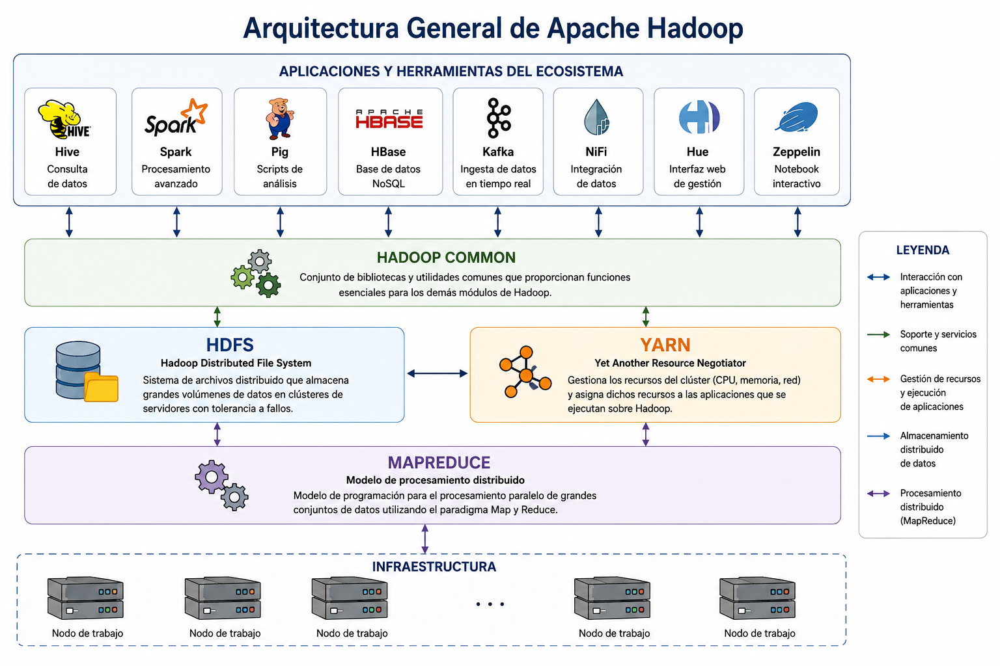

--- 

# PARTE II

# Ecosistema Hadoop

### De la teoría a la infraestructura distribuida

---

# Capítulo 2

# Hadoop: Visión Global y Arquitectura

---

# Pregunta guía

> **¿Cómo permite Hadoop almacenar y procesar grandes volúmenes de datos mediante una arquitectura distribuida y cuáles son los componentes que hacen posible su funcionamiento?**

---

# Objetivos de aprendizaje

Al finalizar este capítulo el estudiante será capaz de:

- Comprender el propósito de Apache Hadoop.
- Explicar el origen de Hadoop y su relación con Google.
- Identificar los componentes principales de la arquitectura Hadoop.
- Reconocer las herramientas que conforman el ecosistema Hadoop.
- Comprender la arquitectura del laboratorio que será utilizado durante el curso.

---

## Introducción

El crecimiento exponencial de los datos ha obligado a las organizaciones a replantear la forma en que almacenan y procesan la información. Las bases de datos tradicionales continúan siendo una excelente alternativa para una amplia variedad de aplicaciones, pero presentan limitaciones cuando el volumen, la velocidad de generación o la diversidad de los datos superan la capacidad de una única infraestructura computacional.

En este contexto surge **Apache Hadoop**, un marco de trabajo (*framework*) de código abierto diseñado para almacenar y procesar grandes volúmenes de datos utilizando múltiples computadores que trabajan de manera coordinada. Su principal fortaleza radica en distribuir tanto los datos como las tareas de procesamiento entre varios nodos, permitiendo construir plataformas escalables, tolerantes a fallos y de menor costo en comparación con soluciones basadas en hardware convencional.

Más que una aplicación específica, Hadoop constituye el núcleo de un amplio ecosistema de herramientas orientadas al almacenamiento, procesamiento y análisis de datos. Componentes como **HDFS**, **Hive**, **Spark**, **Kafka** y **NiFi**, entre otros, permiten desarrollar soluciones Big Data adaptadas a diferentes necesidades organizacionales. En los próximos capítulos, cada una de estas tecnologías será estudiada de forma independiente, comprendiendo primero su propósito y posteriormente su aplicación práctica.

En este capítulo se presentará una visión general de Hadoop y de la arquitectura que sustenta su funcionamiento. Asimismo, se introducirá el entorno de laboratorio que será utilizado durante el curso, basado en contenedores Docker y en el repositorio oficial del curso disponible en GitHub, el cual concentrará todas las actividades prácticas.

Al finalizar este capítulo, el estudiante comprenderá el papel que desempeña Hadoop dentro del ecosistema Big Data y contará con los conocimientos necesarios para abordar los siguientes capítulos, dedicados al almacenamiento distribuido, la consulta de datos y el procesamiento masivo de información.

---

# 2.2 El origen de Hadoop

El origen de Hadoop está estrechamente relacionado con uno de los principales desafíos tecnológicos que comenzó a enfrentar Internet a finales de la década de 1990: el crecimiento explosivo de la información digital. Empresas como Google necesitaban almacenar e indexar miles de millones de páginas web, una tarea que superaba las capacidades de los sistemas tradicionales de almacenamiento y procesamiento de datos.

Para resolver este problema, Google publicó en 2003 un artículo científico donde presentó **Google File System (GFS)**, un sistema de archivos distribuido diseñado para almacenar grandes volúmenes de información en múltiples servidores de bajo costo. Un año más tarde, en 2004, la compañía publicó un segundo trabajo describiendo **MapReduce**, un modelo de programación que permitía procesar grandes conjuntos de datos de forma distribuida y paralela.

Inspirados en estas publicaciones, **Doug Cutting** y **Mike Cafarella**, quienes trabajaban en el proyecto de motor de búsqueda de código abierto **Nutch**, desarrollaron una implementación basada en los conceptos propuestos por Google. Con el tiempo, este desarrollo evolucionó hasta convertirse en un proyecto independiente dentro de la Fundación Apache, dando origen a **Apache Hadoop**.

El nombre *Hadoop* proviene del elefante de juguete de color amarillo que pertenecía al hijo de Doug Cutting. Aunque su origen es anecdótico, el nombre terminó identificando una de las plataformas de procesamiento distribuido más influyentes en la evolución del Big Data.

Desde su incorporación como proyecto de la **Apache Software Foundation** en 2006, Hadoop ha experimentado una evolución constante gracias al aporte de la comunidad de software libre y de numerosas organizaciones tecnológicas. Su arquitectura abierta permitió el desarrollo de un amplio ecosistema de herramientas especializadas para el almacenamiento, procesamiento, consulta, integración y análisis de datos, muchas de las cuales forman parte del contenido de este curso.

Actualmente, aunque han surgido nuevas tecnologías orientadas al procesamiento distribuido y a los servicios en la nube, Hadoop continúa siendo un referente fundamental para comprender los principios que sustentan las arquitecturas Big Data modernas. Por esta razón, conocer su origen y evolución resulta esencial para entender el desarrollo de las plataformas actuales de análisis de datos.

---

# 2.3 ¿Qué es Apache Hadoop?

**Apache Hadoop** es un *framework* de código abierto diseñado para almacenar y procesar grandes volúmenes de datos de forma distribuida utilizando un conjunto de computadores interconectados, denominados **clúster**. Su arquitectura permite distribuir tanto la información como las tareas de procesamiento entre múltiples nodos, logrando una mayor capacidad de almacenamiento, escalabilidad y tolerancia a fallos.

Una de las principales características de Hadoop es que puede ejecutarse sobre hardware convencional, evitando la necesidad de utilizar servidores de alto costo. Si el volumen de datos aumenta, la capacidad del sistema puede ampliarse simplemente incorporando nuevos nodos al clúster, sin modificar la arquitectura general de la plataforma.

Hadoop se encuentra conformado por cuatro módulos principales:

- **Hadoop Common:** proporciona las bibliotecas y utilidades necesarias para el funcionamiento de todos los componentes del framework.
- **HDFS (Hadoop Distributed File System):** sistema de archivos distribuido encargado del almacenamiento de los datos.
- **YARN (Yet Another Resource Negotiator):** administra los recursos del clúster y coordina la ejecución de las aplicaciones.
- **MapReduce:** modelo de programación utilizado para procesar datos de forma distribuida y paralela.

En conjunto, estos módulos constituyen el núcleo de la plataforma Hadoop y permiten desarrollar soluciones capaces de gestionar grandes volúmenes de información de manera eficiente.

Con el paso del tiempo, Hadoop dejó de ser únicamente una plataforma de almacenamiento y procesamiento para convertirse en la base de un amplio ecosistema de herramientas orientadas al análisis de datos. Tecnologías como **Hive**, **Spark**, **Kafka** y **NiFi** amplían sus capacidades y permiten desarrollar soluciones Big Data adaptadas a distintos contextos organizacionales.

En este libro, Hadoop será utilizado como plataforma base para comprender el funcionamiento de las arquitecturas Big Data. Los capítulos siguientes profundizarán en cada uno de sus componentes y en las herramientas que integran su ecosistema, permitiendo avanzar progresivamente desde el almacenamiento distribuido hasta el procesamiento y análisis de datos.

---

# 2.4 Arquitectura de Hadoop

La arquitectura de Hadoop se basa en un modelo de procesamiento distribuido, donde un conjunto de computadores trabaja de manera coordinada para almacenar y procesar grandes volúmenes de datos. En lugar de depender de un único servidor de alta capacidad, Hadoop distribuye la información y las tareas entre múltiples nodos que conforman un **clúster**, permitiendo incrementar la capacidad del sistema simplemente incorporando nuevos equipos.

Esta arquitectura se organiza en torno a cuatro componentes principales, cada uno con una función específica dentro de la plataforma:

- **Hadoop Common:** proporciona las bibliotecas, herramientas y servicios básicos necesarios para el funcionamiento del ecosistema Hadoop.
- **HDFS (Hadoop Distributed File System):** almacena los datos de forma distribuida en los distintos nodos del clúster, garantizando disponibilidad y tolerancia a fallos mediante la replicación de la información.
- **YARN (Yet Another Resource Negotiator):** administra los recursos disponibles en el clúster, asignando memoria y capacidad de procesamiento a las aplicaciones que se ejecutan sobre Hadoop.
- **MapReduce:** ejecuta las tareas de procesamiento distribuido, dividiendo el trabajo en múltiples procesos que pueden ejecutarse simultáneamente en diferentes nodos.

En una implementación típica, los usuarios interactúan con Hadoop mediante herramientas como Hive, Spark o aplicaciones desarrolladas específicamente para el análisis de datos. Estas herramientas solicitan recursos a YARN, acceden a la información almacenada en HDFS y utilizan las bibliotecas proporcionadas por Hadoop Common para ejecutar las distintas operaciones sobre el clúster.

La Figura 2.1 muestra la relación existente entre estos componentes y cómo interactúan para proporcionar una plataforma capaz de almacenar y procesar grandes cantidades de información.

  

  <strong>Figura 2.1.</strong> Arquitectura general de Apache Hadoop.

Esta separación de responsabilidades facilita la administración de la plataforma y permite que cada componente evolucione de forma independiente. Gracias a esta arquitectura modular, Hadoop se ha convertido en la base de numerosos proyectos Big Data utilizados en organizaciones de distintos sectores, desde instituciones académicas hasta empresas tecnológicas y organismos gubernamentales.

En el siguiente apartado se presentará el ecosistema Hadoop, donde se describen las principales herramientas que amplían las capacidades de la plataforma y que serán utilizadas durante el desarrollo de este curso.

---

# 2.5 El ecosistema Hadoop

Aunque Apache Hadoop proporciona la infraestructura básica para almacenar y procesar datos de forma distribuida, por sí solo no cubre todas las necesidades de una solución Big Data. Con el paso de los años, alrededor de Hadoop se desarrolló un conjunto de herramientas especializadas que amplían sus capacidades y facilitan tareas como el análisis de datos, la integración de información, el procesamiento en tiempo real y la administración del clúster. A este conjunto de tecnologías se le conoce como **ecosistema Hadoop**.

Cada herramienta del ecosistema cumple una función específica y puede integrarse con las demás para construir soluciones completas de análisis de datos. Gracias a esta arquitectura modular, las organizaciones pueden seleccionar únicamente los componentes que requieren para resolver un problema determinado.

En este curso se utilizarán las siguientes herramientas:

- **Hadoop:** plataforma base que proporciona la infraestructura para el almacenamiento y procesamiento distribuido de datos.
- **HDFS:** sistema de archivos distribuido encargado de almacenar la información en los distintos nodos del clúster.
- **Hive:** herramienta que permite consultar los datos almacenados en Hadoop utilizando un lenguaje similar a SQL denominado HiveQL.
- **Spark:** motor de procesamiento distribuido diseñado para realizar análisis de datos de manera rápida y eficiente.
- **Kafka:** plataforma orientada a la transmisión de datos en tiempo real mediante el intercambio de mensajes entre aplicaciones.
- **NiFi:** herramienta de integración de datos que facilita la automatización de flujos de información entre diferentes sistemas.
- **Hue:** interfaz web que simplifica la administración del clúster y el acceso a diversas herramientas del ecosistema.
- **Zeppelin:** entorno interactivo basado en cuadernos (*notebooks*) que permite desarrollar consultas, análisis y visualizaciones sobre grandes volúmenes de datos.

Es importante destacar que ninguna de estas herramientas reemplaza a Hadoop; por el contrario, complementan sus capacidades y permiten desarrollar soluciones Big Data adaptadas a distintos escenarios de aplicación.

A lo largo de este libro, cada una de las tecnologías utilizadas en el curso será estudiada en un capítulo específico. De esta forma, el estudiante comprenderá primero el propósito de cada herramienta y posteriormente aprenderá a utilizarla mediante actividades prácticas desarrolladas en el laboratorio.

---

# 2.6 El laboratorio del curso

El aprendizaje de las tecnologías Big Data requiere combinar la comprensión de los conceptos con la experimentación práctica. Por esta razón, las actividades del curso se desarrollarán en un entorno de laboratorio que permitirá al estudiante utilizar las principales herramientas del ecosistema Hadoop en condiciones similares a las que podrían encontrarse en un entorno profesional.

Con el propósito de simplificar la instalación y garantizar que todos los estudiantes trabajen sobre una misma plataforma, el laboratorio se encuentra implementado mediante **Docker Compose**, tecnología que permite ejecutar múltiples servicios de forma integrada utilizando contenedores. Esta estrategia evita configuraciones complejas y facilita la reproducción del entorno en distintos equipos.

El laboratorio incorpora los componentes principales que serán utilizados durante el semestre, entre ellos Hadoop, HDFS, Hive, Spark, Kafka, NiFi, Hue y Zeppelin. Cada uno de estos servicios se ejecuta de manera coordinada, permitiendo al estudiante comprender cómo interactúan las diferentes herramientas dentro de una solución Big Data.

Todas las actividades prácticas, guías de laboratorio, archivos de configuración, conjuntos de datos y recursos complementarios estarán disponibles en el **repositorio oficial del curso en GitHub**:

- **Repositorio GitHub:** [https://github.com/juliopez/Hadoop](https://github.com/juliopez/Hadoop)

El repositorio contiene la infraestructura base del laboratorio, los archivos necesarios para ejecutar los servicios y la documentación práctica que orientará el trabajo desarrollado durante el semestre.

Como apoyo complementario, el curso cuenta con una **lista de reproducción en YouTube**, donde se encuentran disponibles videos explicativos y demostraciones asociadas a la instalación, configuración y utilización de las herramientas:

- **Lista de reproducción:** [https://www.youtube.com/playlist?list=PLrc3rKEj3Qc-TsC79xmu8A9eCEmuW67Ev](https://www.youtube.com/playlist?list=PLrc3rKEj3Qc-TsC79xmu8A9eCEmuW67Ev)

De esta forma, el libro se centra en la comprensión de los conceptos fundamentales, mientras que el repositorio GitHub y la lista de reproducción constituyen los principales recursos para el desarrollo de las actividades prácticas.

Durante los siguientes capítulos, el laboratorio será utilizado de manera progresiva. A medida que se incorporen nuevas tecnologías, el estudiante aplicará los conocimientos adquiridos mediante ejercicios prácticos orientados a consolidar el aprendizaje de cada herramienta del ecosistema Hadoop.

---

# 2.7 Caso de estudio: Diseño de la arquitectura SmartCity Analytics

En el **Capítulo 1** se presentó el caso de estudio **SmartCity Analytics**, cuyo objetivo es diseñar una plataforma Big Data capaz de apoyar la toma de decisiones mediante el análisis de información proveniente de distintos servicios de una ciudad inteligente.

En esta etapa del proyecto no se trabajará aún con los datos ni con su procesamiento. El propósito es definir la **infraestructura tecnológica** que permitirá soportar la solución durante todo su ciclo de vida.

Considerando las características del problema, se propone utilizar una arquitectura basada en **Apache Hadoop**, la cual permitirá almacenar grandes volúmenes de información de manera distribuida y servirá como plataforma para integrar las diferentes herramientas que serán estudiadas en los siguientes capítulos.

La arquitectura general del proyecto se presenta en la Figura 2.2.

  

<b>Figura 2.2.</b> Arquitectura general del caso de estudio <i>SmartCity Analytics</i> basada en el ecosistema Apache Hadoop.

La solución considera diversas fuentes de datos, tales como sensores IoT, sistemas de transporte, estaciones meteorológicas, registros de consumo energético y otros servicios urbanos. Toda esta información será almacenada inicialmente en **HDFS**, para posteriormente ser consultada mediante **Hive**, procesada con **Spark**, integrada a través de **NiFi** y complementada con flujos de datos en tiempo real utilizando **Kafka**.

Durante el desarrollo del libro, cada uno de estos componentes será incorporado progresivamente al caso de estudio. De esta manera, el estudiante podrá observar cómo una arquitectura Big Data evoluciona desde una infraestructura básica hasta convertirse en una solución completamente funcional para el análisis de datos.

En el capítulo siguiente se comenzará con el primer componente de esta arquitectura: **HDFS**, el sistema de archivos distribuido encargado del almacenamiento de la información.

---

# 2.8 Resumen del capítulo

En este capítulo se presentaron los fundamentos de **Apache Hadoop** como la plataforma base para el desarrollo de soluciones Big Data. Se revisó el origen del proyecto, su evolución como software de código abierto y las razones por las cuales se ha consolidado como una de las arquitecturas más utilizadas para el almacenamiento y procesamiento distribuido de grandes volúmenes de datos.

Posteriormente, se analizaron los principales componentes de la arquitectura Hadoop, identificando el rol que desempeñan **Hadoop Common**, **HDFS**, **YARN** y **MapReduce**, así como la forma en que estas tecnologías trabajan de manera integrada para ofrecer escalabilidad, tolerancia a fallos y procesamiento distribuido.

Asimismo, se realizó una introducción al ecosistema Hadoop, describiendo las herramientas que serán estudiadas a lo largo del libro, entre ellas **Hive**, **Spark**, **Kafka**, **NiFi**, **Hue** y **Zeppelin**. Cada una de estas tecnologías cumple una función específica dentro de una plataforma Big Data y, en conjunto, permiten construir soluciones analíticas de alta capacidad.

El capítulo también presentó el entorno de laboratorio que acompañará el desarrollo del curso. Mediante una infraestructura basada en contenedores Docker, un repositorio oficial en GitHub y una colección de recursos audiovisuales, el estudiante dispondrá de un ambiente homogéneo para desarrollar las actividades prácticas propuestas en los capítulos siguientes.

Finalmente, el caso de estudio **SmartCity Analytics** evolucionó desde la definición del problema presentada en el capítulo anterior hacia el diseño de la arquitectura tecnológica que soportará la solución. Esta arquitectura servirá como hilo conductor durante el resto del libro, incorporando progresivamente cada uno de los componentes del ecosistema Hadoop hasta construir una plataforma Big Data completamente funcional.

Con estos fundamentos, el lector se encuentra preparado para estudiar el primer componente esencial de la arquitectura: **HDFS (Hadoop Distributed File System)**, encargado del almacenamiento distribuido de la información.

---

# 2.9 Actividades

Las siguientes actividades tienen como propósito reforzar los conceptos abordados en este capítulo y preparar al estudiante para el trabajo práctico que se desarrollará en los laboratorios posteriores.

## Actividad 2.1. Comprensión conceptual

Responda las siguientes preguntas utilizando los contenidos del capítulo.

1. Explique con sus propias palabras qué es Apache Hadoop y cuál es su propósito dentro del ámbito del Big Data.
2. ¿Qué problemáticas de las bases de datos tradicionales busca resolver Hadoop?
3. Describa las principales características que distinguen a una arquitectura distribuida de una arquitectura centralizada.
4. ¿Cuál es la función de Hadoop Common dentro del ecosistema Hadoop?
5. Explique la relación existente entre HDFS, YARN y MapReduce.

---

## Actividad 2.2. Identificación de componentes

Observe la arquitectura general presentada en la **Figura 2.2** y complete la siguiente tabla.

| Componente | Función principal | ¿Será estudiado en este libro? |
|------------|-------------------|-------------------------------|
| Hadoop Common | | |
| HDFS | | |
| Hive | | |
| Spark | | |
| Kafka | | |
| NiFi | | |
| Hue | | |
| Zeppelin | | |

---

## Actividad 2.3. Aplicación al caso SmartCity Analytics

Considere el caso de estudio **SmartCity Analytics** y responda las siguientes preguntas.

1. Identifique cinco posibles fuentes de datos que podrían formar parte de una ciudad inteligente.
2. ¿Qué tipo de información generaría cada una de ellas?
3. ¿Por qué resulta conveniente utilizar una plataforma Big Data para almacenar esta información?
4. ¿Qué desafíos podrían presentarse si toda la información se almacenara en un único servidor?

---

## Actividad 2.4. Investigación

Investigue en la documentación oficial de Apache Software Foundation y responda:

1. ¿Cuál es la versión estable más reciente de Apache Hadoop?
2. ¿Qué proyectos forman actualmente parte del ecosistema Hadoop?
3. ¿Qué diferencias existen entre MapReduce y Apache Spark?

Elabore un breve informe (máximo dos páginas) citando las fuentes consultadas.

---

## Actividad 2.5. Reflexión

Analice la siguiente afirmación:

> *"La adopción de tecnologías Big Data no depende únicamente del volumen de datos, sino también de la velocidad, variedad y necesidades analíticas de una organización."*

Redacte una reflexión de aproximadamente 300 palabras argumentando si está de acuerdo o en desacuerdo con la afirmación, fundamentando su respuesta con los contenidos revisados en este capítulo.

---

# 2.10 Laboratorio 

## 2.1. Explorando el entorno Hadoop del curso

## Objetivo del laboratorio

Familiarizarse con el entorno de trabajo que será utilizado durante el desarrollo del curso, identificando los principales componentes del ecosistema Hadoop y verificando el correcto funcionamiento de la infraestructura de laboratorio.

---

## Resultados de aprendizaje

Al finalizar este laboratorio, el estudiante será capaz de:

- Reconocer la estructura del entorno de laboratorio basado en Docker.
- Identificar los principales servicios que conforman el ecosistema Hadoop del curso.
- Acceder a la documentación oficial del proyecto disponible en GitHub.
- Utilizar los recursos audiovisuales disponibles como apoyo para el desarrollo de las actividades prácticas.
- Comprender la organización general de la plataforma que será utilizada durante el semestre.

---

## Prerrequisitos

Antes de iniciar este laboratorio, el estudiante debe:

- Haber estudiado los contenidos del Capítulo 2.
- Contar con Docker Desktop (Windows/macOS) o Docker Engine (Linux) instalado.
- Disponer de conexión a Internet.
- Tener acceso al repositorio oficial del curso y a la lista de reproducción en YouTube.

> **Nota:** Los procedimientos detallados de instalación, configuración, actualización y resolución de problemas se encuentran documentados en el repositorio oficial del curso.

---

## Recursos del laboratorio

**Repositorio oficial del curso**

https://github.com/juliopez/Hadoop

**Lista de reproducción oficial**

https://www.youtube.com/playlist?list=PLrc3rKEj3Qc-TsC79xmu8A9eCEmuW67Ev

---

## Desarrollo de la actividad

### Actividad 1. Explorar el repositorio del curso

Acceda al repositorio GitHub e identifique:

- estructura de carpetas;
- documentación disponible;
- archivos de configuración;
- recursos para los laboratorios;
- material complementario.

Registre brevemente el propósito de cada uno de estos elementos.

---

### Actividad 2. Identificar los componentes del laboratorio

Revise la documentación del repositorio e identifique las tecnologías que forman parte del entorno de laboratorio.

Complete la siguiente tabla.

| Tecnología | Función principal | ¿Será estudiada en este libro? |
|------------|-------------------|-------------------------------|
| Hadoop | | |
| HDFS | | |
| Hive | | |
| Spark | | |
| Kafka | | |
| NiFi | | |
| Hue | | |
| Zeppelin | | |

---

### Actividad 3. Revisar el material audiovisual

Acceda a la lista de reproducción oficial del curso e identifique los videos relacionados con:

- instalación del entorno;
- ejecución del laboratorio;
- utilización de las herramientas;
- resolución de problemas frecuentes.

Anote cuáles considera que serán más útiles para el desarrollo de las próximas actividades prácticas.

---

### Actividad 4. Relacionar la arquitectura con el caso SmartCity Analytics

Observe nuevamente la **Figura 2.2** y responda:

1. ¿Qué componente de la arquitectura será estudiado en el próximo capítulo?
2. ¿Cuál considera que será el primer lugar donde se almacenarán los datos de SmartCity Analytics?
3. ¿Por qué es importante disponer de una arquitectura integrada antes de comenzar el procesamiento de datos?

---

## Evidencias esperadas

Al finalizar el laboratorio, el estudiante deberá entregar:

- la tabla de identificación de componentes completa;
- las respuestas a las preguntas de análisis;
- una captura de pantalla que evidencie el acceso al repositorio GitHub;
- una captura de pantalla que evidencie el acceso a la lista de reproducción oficial.

---

## Preguntas de reflexión

1. ¿Qué ventajas presenta disponer de un entorno de laboratorio estandarizado para todos los estudiantes?
2. ¿Por qué resulta conveniente complementar la documentación escrita con recursos audiovisuales?
3. ¿Qué expectativas tiene respecto al uso del ecosistema Hadoop durante el desarrollo del curso?

---

# 2.11 Lecturas recomendadas

Con el propósito de profundizar los contenidos desarrollados en este capítulo, se recomienda consultar la siguiente bibliografía. Las lecturas se presentan en dos categorías: documentación oficial del proyecto Apache Hadoop y bibliografía especializada.

## Documentación oficial

Estas fuentes corresponden a la documentación mantenida por los propios desarrolladores del proyecto Apache Hadoop y constituyen la referencia técnica más actualizada.

- Apache Hadoop. (s. f.). *Apache Hadoop Documentation*. https://hadoop.apache.org/docs/
- Apache Hadoop. (s. f.). *Apache Hadoop Project*. https://hadoop.apache.org/
- Apache Software Foundation. (s. f.). *Apache Projects Directory*. https://projects.apache.org/

---

## Bibliografía básica

Las siguientes obras proporcionan una visión integral de la arquitectura Hadoop y constituyen excelentes textos de consulta para estudiantes y profesionales.

- White, T. (2015). *Hadoop: The Definitive Guide* (4th ed.). O'Reilly Media.
- Minelli, M., Chambers, M., & Dhiraj, A. (2013). *Big Data, Big Analytics: Emerging Business Intelligence and Analytic Trends for Today's Businesses*. Wiley.
- Wessler, M. (2017). *Hadoop Fundamentals LiveLessons* (Video Training). Pearson.

---

## Bibliografía complementaria

Para quienes deseen profundizar en la evolución del procesamiento distribuido y en los fundamentos que dieron origen a Hadoop, se recomienda revisar las siguientes publicaciones.

- Dean, J., & Ghemawat, S. (2004). *MapReduce: Simplified Data Processing on Large Clusters*. Proceedings of the 6th Symposium on Operating Systems Design and Implementation (OSDI).
- Ghemawat, S., Gobioff, H., & Leung, S.-T. (2003). *The Google File System*. Proceedings of the 19th ACM Symposium on Operating Systems Principles.
- Shvachko, K., Kuang, H., Radia, S., & Chansler, R. (2010). *The Hadoop Distributed File System*. IEEE 26th Symposium on Mass Storage Systems and Technologies.

---

## Recursos del curso

Además de la bibliografía especializada, este libro dispone de recursos prácticos que acompañan el desarrollo de todos los capítulos.

**Repositorio oficial del curso**

https://github.com/juliopez/Hadoop

Incluye:

- infraestructura Docker;
- guías de laboratorio;
- conjuntos de datos;
- scripts;
- archivos de configuración;
- material complementario.

**Lista oficial de reproducción**

https://www.youtube.com/playlist?list=PLrc3rKEj3Qc-TsC79xmu8A9eCEmuW67Ev

Contiene videos de apoyo relacionados con:

- instalación del entorno;
- desarrollo de laboratorios;
- configuración de herramientas;
- resolución de problemas;
- demostraciones prácticas del ecosistema Hadoop.

---

# Referencias

Apache Hadoop. (s. f.). *Apache Hadoop*. https://hadoop.apache.org/

Apache Hadoop. (s. f.). *Apache Hadoop Documentation*. https://hadoop.apache.org/docs/

Apache Software Foundation. (s. f.). *Apache Projects Directory*. https://projects.apache.org/

Dean, J., & Ghemawat, S. (2004). *MapReduce: Simplified Data Processing on Large Clusters*. Proceedings of the 6th Symposium on Operating Systems Design and Implementation (OSDI), 137–150.

Ghemawat, S., Gobioff, H., & Leung, S.-T. (2003). *The Google File System*. Proceedings of the 19th ACM Symposium on Operating Systems Principles (SOSP), 29–43. https://doi.org/10.1145/945445.945450

Minelli, M., Chambers, M., & Dhiraj, A. (2013). *Big Data, Big Analytics: Emerging Business Intelligence and Analytic Trends for Today's Businesses*. John Wiley & Sons.

Shvachko, K., Kuang, H., Radia, S., & Chansler, R. (2010). *The Hadoop Distributed File System*. 2010 IEEE 26th Symposium on Mass Storage Systems and Technologies (MSST), 1–10. https://doi.org/10.1109/MSST.2010.5496972

White, T. (2015). *Hadoop: The Definitive Guide* (4th ed.). O'Reilly Media.
