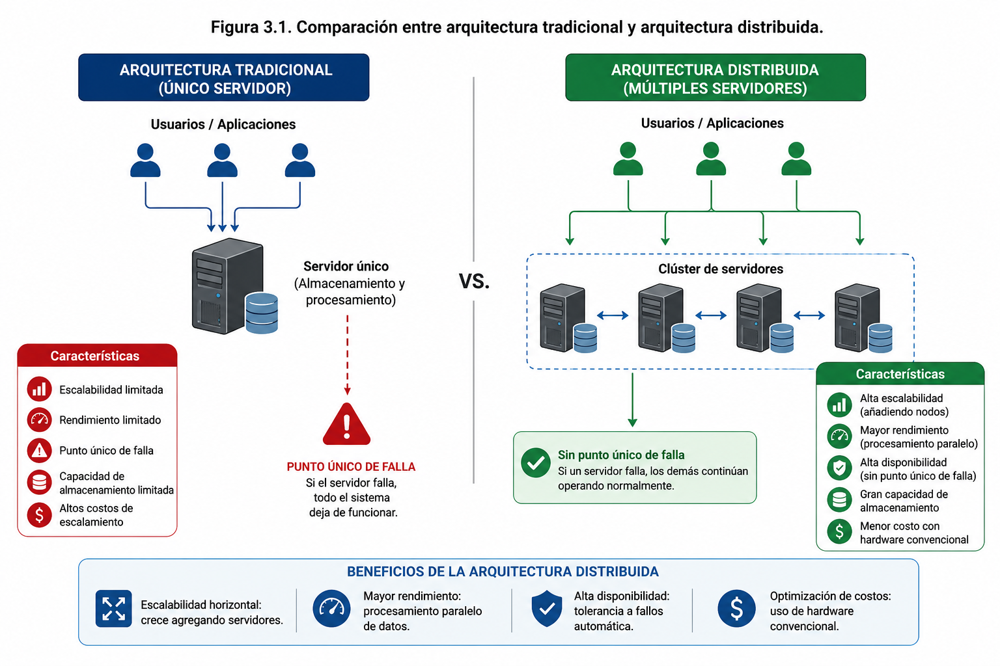
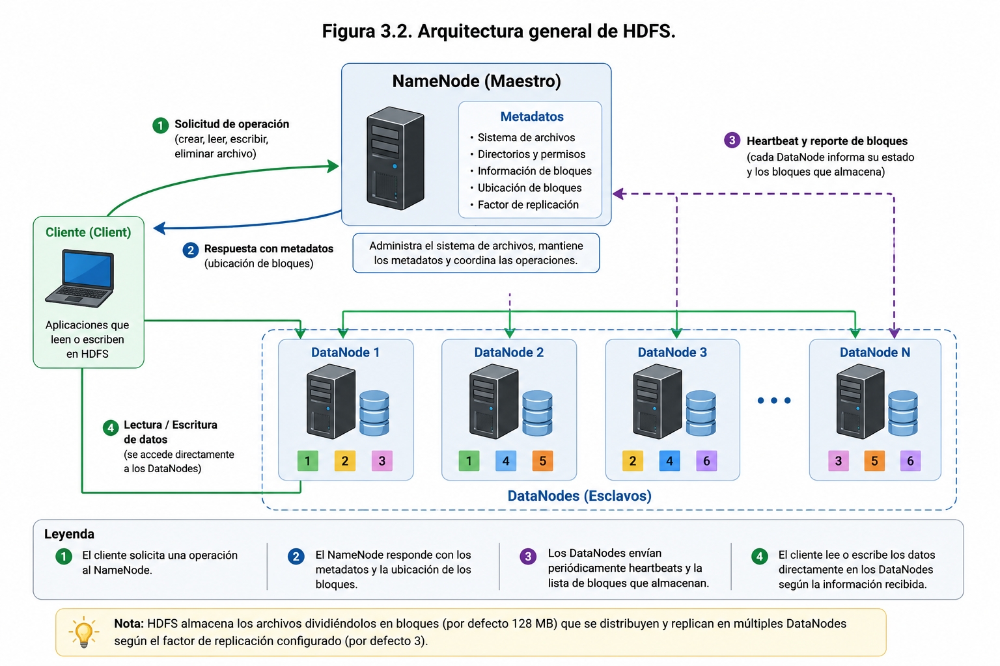
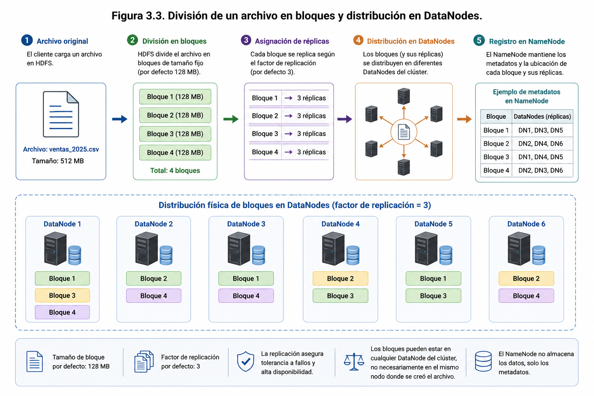
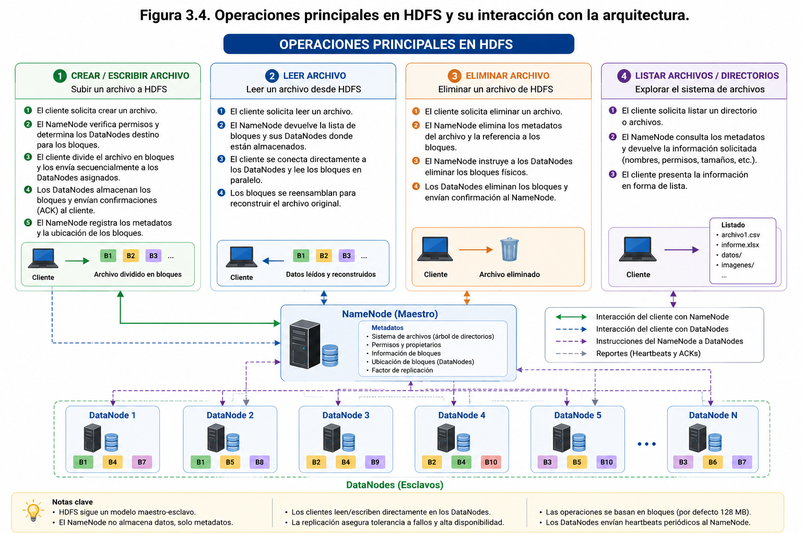

# Capítulo 3

# HDFS: Sistema de Archivos Distribuido

---

# Pregunta guía

> **¿Cómo permite HDFS almacenar grandes volúmenes de datos de forma distribuida, escalable y tolerante a fallos?**

---

# Objetivos de aprendizaje

Al finalizar este capítulo el estudiante será capaz de:

- Comprender el funcionamiento de HDFS como sistema de archivos distribuido.
- Identificar los componentes que conforman HDFS.
- Explicar cómo se almacenan y replican los datos.
- Comprender los mecanismos de tolerancia a fallos de HDFS.
- Utilizar HDFS como plataforma de almacenamiento para los laboratorios del curso.

---

## Introducción

En el capítulo anterior se presentó **Apache Hadoop** como una plataforma diseñada para almacenar y procesar grandes volúmenes de datos de manera distribuida. Sin embargo, para que una arquitectura de estas características sea capaz de gestionar información a gran escala, requiere un sistema de almacenamiento que supere las limitaciones de los sistemas de archivos tradicionales. Esta necesidad dio origen a **HDFS (Hadoop Distributed File System)**, el componente encargado del almacenamiento distribuido dentro del ecosistema Hadoop.

A diferencia de los sistemas de archivos utilizados habitualmente en computadores personales o servidores convencionales, HDFS fue diseñado para operar sobre clústeres compuestos por múltiples nodos, permitiendo distribuir los datos entre diferentes equipos físicos. Esta estrategia no solo incrementa la capacidad total de almacenamiento, sino que también mejora la disponibilidad de la información y proporciona tolerancia frente a fallos de hardware.

Uno de los principios fundamentales de HDFS consiste en dividir los archivos en bloques de tamaño fijo y distribuir dichos bloques entre los distintos nodos del clúster. Además, cada bloque es replicado automáticamente en varios servidores, de manera que, si uno de ellos deja de estar disponible, el sistema puede continuar operando sin pérdida de información ni interrupción significativa del servicio. Gracias a este mecanismo, HDFS ofrece un alto nivel de confiabilidad utilizando hardware convencional, evitando la necesidad de recurrir a servidores especializados de alto costo.

El diseño de HDFS responde a un escenario característico de las aplicaciones Big Data: el almacenamiento de grandes archivos que son leídos y procesados de forma intensiva. En este contexto, el sistema prioriza un elevado rendimiento en operaciones de lectura secuencial y procesamiento distribuido, sacrificando ciertas funcionalidades propias de los sistemas de archivos tradicionales que resultan menos relevantes para este tipo de aplicaciones.

En el marco del caso de estudio **SmartCity Analytics**, HDFS constituye el primer componente operativo de la arquitectura presentada en el capítulo anterior. Será el repositorio donde se almacenarán los datos provenientes de sensores IoT, sistemas de transporte, estaciones meteorológicas, consumo energético y otras fuentes de información urbana. Sobre esta base se incorporarán progresivamente las restantes herramientas del ecosistema Hadoop, tales como Hive, Spark, Kafka y NiFi, las cuales utilizarán la información almacenada en HDFS para desarrollar procesos de análisis y generación de conocimiento.

La **Figura 3.1** ilustra la diferencia entre una arquitectura basada en un único servidor y una arquitectura distribuida, mostrando cómo la distribución del almacenamiento y del procesamiento permite incrementar la escalabilidad, mejorar el rendimiento y eliminar el punto único de falla presente en las soluciones tradicionales.

<p align="center">
  
</p>

<p align="center">
<strong>Figura 3.1.</strong> Comparación entre una arquitectura tradicional basada en un único servidor y una arquitectura distribuida. Mientras la arquitectura tradicional concentra el almacenamiento y el procesamiento en un solo servidor, la arquitectura distribuida reparte ambos procesos entre múltiples nodos, permitiendo incrementar la escalabilidad, mejorar el rendimiento, aumentar la disponibilidad y eliminar el punto único de falla característico de los sistemas centralizados.
</p>

Al finalizar este capítulo, el lector comprenderá los principios de funcionamiento de HDFS, conocerá su arquitectura interna, identificará los mecanismos utilizados para almacenar y replicar la información y será capaz de realizar operaciones básicas sobre el sistema de archivos distribuido, sentando las bases para el estudio de las tecnologías que se abordarán en los capítulos siguientes.

---

## 3.2 ¿Por qué un sistema de archivos distribuido?

El crecimiento exponencial de los datos ha puesto de manifiesto las limitaciones de los sistemas de almacenamiento tradicionales. Durante muchos años, las organizaciones incrementaron la capacidad de sus servidores mediante la incorporación de más memoria, procesadores y discos de mayor capacidad. Este enfoque, conocido como **escalabilidad vertical (scale-up)**, resulta adecuado para aplicaciones de tamaño moderado, pero presenta importantes restricciones cuando el volumen de información continúa aumentando.

En una arquitectura tradicional, toda la información se almacena en un único servidor o en un conjunto muy reducido de equipos. Como consecuencia, la capacidad de almacenamiento, el rendimiento y la disponibilidad del sistema dependen directamente de ese hardware. Si el servidor alcanza su límite de capacidad o presenta una falla crítica, el acceso a los datos puede verse seriamente afectado, generando interrupciones en la operación y elevados costos de recuperación.

La **Figura 3.1** compara una arquitectura tradicional basada en un único servidor con una arquitectura distribuida. En el primer caso, todas las aplicaciones y usuarios envían sus solicitudes al mismo equipo, concentrando la carga de trabajo y generando un único punto de falla. En cambio, en una arquitectura distribuida las solicitudes se reparten entre múltiples nodos, permitiendo distribuir tanto el almacenamiento como el procesamiento de la información.

Ante estas limitaciones surge el concepto de **sistema de archivos distribuido**, cuya finalidad es almacenar los datos de manera transparente sobre un conjunto de servidores interconectados que funcionan como una única plataforma lógica. Desde la perspectiva del usuario o de las aplicaciones, el acceso a los archivos continúa realizándose como si se tratara de un único sistema de almacenamiento, aunque físicamente la información se encuentre distribuida entre numerosos equipos.

Este enfoque ofrece múltiples ventajas para aplicaciones Big Data:

- **Escalabilidad horizontal**, permitiendo aumentar la capacidad del sistema mediante la incorporación de nuevos nodos al clúster, sin necesidad de reemplazar la infraestructura existente.
- **Alta disponibilidad**, ya que la información se encuentra distribuida y replicada en diferentes servidores, reduciendo el impacto de posibles fallas de hardware.
- **Tolerancia a fallos**, gracias a mecanismos automáticos que detectan la pérdida de nodos y recuperan la información utilizando las copias disponibles.
- **Mayor rendimiento**, al permitir que diferentes nodos accedan y procesen simultáneamente distintas partes de un mismo conjunto de datos.
- **Reducción de costos**, utilizando servidores convencionales (*commodity hardware*) en lugar de equipos especializados de alto costo.

Estas características convierten a los sistemas de archivos distribuidos en un componente esencial de las plataformas Big Data, donde es habitual trabajar con conjuntos de datos que alcanzan cientos de gigabytes, terabytes o incluso petabytes.

En el caso de **HDFS**, esta filosofía se implementa mediante la división automática de los archivos en bloques de datos que son almacenados y replicados entre los distintos nodos del clúster. Esta estrategia permite que tanto el almacenamiento como el procesamiento puedan crecer de forma progresiva conforme aumentan las necesidades de la organización, manteniendo un elevado nivel de disponibilidad y confiabilidad.

En el contexto del caso de estudio **SmartCity Analytics**, la utilización de un sistema de archivos distribuido resulta fundamental. Los datos generados por sensores urbanos, dispositivos IoT, sistemas de transporte y otras fuentes de información producen un flujo continuo de datos que supera ampliamente la capacidad de almacenamiento de un único servidor. Gracias a HDFS, esta información podrá distribuirse entre múltiples nodos del clúster, garantizando que el crecimiento futuro de la plataforma no requiera rediseñar toda la infraestructura tecnológica.

---

## 3.3 Arquitectura de HDFS

HDFS (Hadoop Distributed File System) fue diseñado siguiendo una arquitectura **maestro-esclavo (master-slave)**, ampliamente utilizada en sistemas distribuidos debido a su simplicidad y capacidad para administrar grandes volúmenes de información. En este modelo existe un nodo encargado de coordinar el funcionamiento general del sistema, mientras que múltiples nodos se ocupan del almacenamiento físico de los datos.

La arquitectura de HDFS está compuesta por tres elementos principales: **NameNode**, **DataNode** y **cliente (Client)**. Cada uno cumple funciones específicas que, en conjunto, permiten ofrecer un sistema de almacenamiento distribuido, escalable y tolerante a fallos.

La **Figura 3.2** presenta la arquitectura general de HDFS y la interacción existente entre sus principales componentes.

### NameNode

El **NameNode** constituye el componente central de HDFS y es responsable de administrar el sistema de archivos distribuido. A diferencia de lo que muchas personas suponen inicialmente, el NameNode **no almacena los datos de los usuarios**, sino la información necesaria para localizar dichos datos dentro del clúster.

Entre sus principales responsabilidades se encuentran:

- mantener la estructura lógica del sistema de archivos;
- gestionar directorios y archivos;
- almacenar los metadatos asociados a cada archivo;
- registrar la ubicación de cada bloque dentro del clúster;
- coordinar las operaciones de lectura y escritura;
- supervisar el estado de los DataNodes.

En términos prácticos, el NameNode actúa como un "índice" que conoce en qué servidores se encuentra almacenado cada bloque de información.

### DataNodes

Los **DataNodes** son los nodos encargados del almacenamiento físico de los datos. Cada DataNode mantiene en sus discos duros uno o varios bloques pertenecientes a diferentes archivos almacenados en HDFS.

Las principales funciones de un DataNode son:

- almacenar bloques de datos;
- enviar información de estado (*heartbeat*) al NameNode;
- crear, eliminar y replicar bloques cuando el NameNode lo solicita;
- atender las solicitudes de lectura y escritura realizadas por los clientes.

En un clúster Hadoop pueden existir desde unos pocos DataNodes hasta varios miles, dependiendo del tamaño de la infraestructura y del volumen de información que deba gestionarse.

### Cliente (Client)

El **cliente** representa la aplicación o usuario que interactúa con HDFS. Cuando una aplicación necesita almacenar o recuperar un archivo, no accede directamente a los discos donde se encuentran los datos.

El proceso habitual consiste en:

1. El cliente solicita al NameNode información sobre el archivo.
2. El NameNode indica en qué DataNodes se encuentran almacenados los bloques correspondientes.
3. El cliente establece comunicación directa con los DataNodes involucrados.
4. Los datos se transfieren entre el cliente y los DataNodes sin pasar nuevamente por el NameNode.

Esta estrategia evita que el NameNode se convierta en un cuello de botella, permitiendo que múltiples clientes puedan acceder simultáneamente a grandes volúmenes de información.

### Comunicación entre los componentes

El funcionamiento coordinado de estos tres elementos permite que HDFS opere de manera eficiente y confiable.

Durante una operación de escritura, el cliente solicita autorización al NameNode, el cual determina los DataNodes donde serán almacenados los bloques del archivo. Posteriormente, el cliente envía directamente la información a dichos DataNodes, mientras el NameNode actualiza únicamente los metadatos asociados.

En una operación de lectura ocurre el proceso inverso: el cliente consulta al NameNode para conocer la ubicación de los bloques y, posteriormente, recupera la información directamente desde los DataNodes correspondientes.

Gracias a esta separación entre **metadatos** y **datos**, HDFS puede administrar millones de archivos y miles de nodos sin comprometer el rendimiento del sistema.

<p align="center">
  
</p>

<p align="center">
  <strong>Figura 3.2.</strong> Arquitectura general de HDFS. El cliente consulta al NameNode para obtener los metadatos y la ubicación de los bloques, mientras que las operaciones de lectura y escritura se realizan directamente sobre los DataNodes.
</p>

### Arquitectura aplicada al caso SmartCity Analytics

En el contexto del caso de estudio **SmartCity Analytics**, el NameNode administrará la estructura lógica de todos los datos urbanos recopilados por la plataforma. Los DataNodes almacenarán físicamente los bloques correspondientes a sensores ambientales, cámaras de tránsito, dispositivos IoT, registros meteorológicos y sistemas de transporte público.

Cuando herramientas como Hive, Spark o NiFi requieran acceder a esta información, consultarán inicialmente al NameNode para localizar los datos y posteriormente establecerán comunicación directa con los DataNodes donde estos se encuentran almacenados. Este mecanismo permitirá procesar grandes volúmenes de información de manera distribuida y eficiente, incluso cuando el tamaño de los datos continúe creciendo con el tiempo.

---

## 3.4 Almacenamiento y replicación de datos

Uno de los aspectos más innovadores de HDFS es la forma en que almacena la información. A diferencia de los sistemas de archivos tradicionales, donde un archivo se guarda como una unidad continua dentro de un único dispositivo de almacenamiento, HDFS divide automáticamente cada archivo en bloques de tamaño fijo, distribuyéndolos entre los distintos nodos que conforman el clúster.

Este mecanismo permite que múltiples servidores participen simultáneamente en el almacenamiento y posterior procesamiento de la información, incrementando la capacidad total del sistema y mejorando significativamente su rendimiento.

La **Figura 3.3** ilustra el proceso de división de un archivo en bloques y su distribución entre diferentes DataNodes.

### División en bloques

Cuando un usuario almacena un archivo en HDFS, el sistema lo divide en bloques independientes antes de escribirlo en el clúster.

Por ejemplo, si un archivo posee un tamaño de 500 MB y el tamaño de bloque configurado corresponde a 128 MB, HDFS generará automáticamente cuatro bloques completos de 128 MB y un bloque final con el tamaño restante.

Cada uno de estos bloques puede almacenarse en un DataNode diferente, permitiendo que varios servidores participen simultáneamente tanto en el almacenamiento como en la lectura del archivo.

Este diseño ofrece una ventaja importante para el procesamiento distribuido: diferentes nodos pueden trabajar en paralelo sobre distintos bloques del mismo archivo, reduciendo considerablemente los tiempos de procesamiento.

### Replicación de bloques

Además de distribuir los bloques entre múltiples servidores, HDFS implementa un mecanismo de **replicación automática** cuyo propósito es garantizar la disponibilidad de la información frente a posibles fallos de hardware.

Por defecto, cada bloque almacenado en HDFS mantiene **tres copias** distribuidas en diferentes DataNodes del clúster. Este valor recibe el nombre de **factor de replicación (Replication Factor)** y puede modificarse según las necesidades de cada implementación.

Un ejemplo de distribución podría ser:

- Bloque 1 → DataNode A, DataNode C y DataNode D.
- Bloque 2 → DataNode B, DataNode D y DataNode E.
- Bloque 3 → DataNode A, DataNode B y DataNode F.

Gracias a esta estrategia, la pérdida de uno o incluso varios servidores no implica necesariamente la pérdida de los datos, ya que siempre existirán copias disponibles en otros nodos del clúster.

<p align="center">
  
</p>

<p align="center">
  <strong>Figura 3.3.</strong> División de un archivo en bloques y distribución entre diferentes DataNodes. HDFS divide el archivo en bloques de tamaño fijo, genera las réplicas correspondientes y distribuye cada copia entre distintos nodos del clúster.
</p>

### Tolerancia a fallos

Uno de los principales objetivos de HDFS consiste en garantizar la continuidad del servicio incluso cuando ocurren fallos de hardware, situación considerada normal en infraestructuras compuestas por decenas o cientos de servidores convencionales.

Para ello, el NameNode supervisa permanentemente el estado de todos los DataNodes mediante mensajes periódicos denominados **heartbeats**.

Si un DataNode deja de responder durante un intervalo determinado, el NameNode lo considera fuera de servicio y toma automáticamente diversas acciones:

- marca el nodo como no disponible;
- evita enviar nuevas solicitudes hacia dicho servidor;
- localiza las copias existentes de los bloques afectados;
- genera nuevas réplicas en otros DataNodes para restablecer el factor de replicación configurado.

Este proceso ocurre de manera transparente para los usuarios y aplicaciones, permitiendo que el sistema continúe funcionando sin intervención manual.

### Balanceo del almacenamiento

A medida que el clúster incorpora nuevos servidores o aumenta el volumen de información almacenada, algunos DataNodes podrían concentrar una mayor cantidad de bloques que otros.

Para mantener una utilización equilibrada de la infraestructura, HDFS incorpora mecanismos de **balanceo de datos**, capaces de redistribuir bloques entre los diferentes nodos del clúster.

El objetivo es evitar sobrecargas localizadas y aprovechar de forma homogénea la capacidad de almacenamiento disponible, mejorando tanto el rendimiento como la disponibilidad del sistema.

### Almacenamiento distribuido en SmartCity Analytics

En el caso de estudio **SmartCity Analytics**, la información generada diariamente por sensores urbanos, estaciones meteorológicas, cámaras de vigilancia, dispositivos IoT y sistemas de transporte será almacenada en HDFS mediante este esquema de bloques distribuidos.

Por ejemplo, un archivo que contenga los registros de tráfico vehicular de una semana podrá dividirse automáticamente en múltiples bloques distribuidos entre diferentes DataNodes. Si uno de estos servidores presenta una falla, las copias almacenadas en otros nodos permitirán mantener disponible toda la información sin afectar el funcionamiento de la plataforma.

Este mecanismo de almacenamiento distribuido y replicación constituye uno de los pilares fundamentales sobre los cuales se construyen las soluciones Big Data modernas, ya que combina escalabilidad, alta disponibilidad y tolerancia a fallos utilizando infraestructura basada en hardware convencional.

---

## 3.5 Operaciones básicas en HDFS

Una vez comprendida la arquitectura y el mecanismo de almacenamiento distribuido de HDFS, resulta necesario conocer las operaciones básicas que permiten interactuar con el sistema de archivos. Estas operaciones constituyen la base para la administración de la información y serán utilizadas de forma recurrente en los laboratorios desarrollados a lo largo del curso.

Desde la perspectiva del usuario, HDFS ofrece una experiencia similar a la de cualquier sistema de archivos convencional. Es posible crear directorios, copiar archivos, mover información, eliminar recursos y consultar el contenido almacenado. Sin embargo, internamente todas estas acciones son coordinadas por el NameNode y ejecutadas sobre múltiples DataNodes de manera transparente para el usuario.

La **Figura 3.4** resume las principales operaciones que pueden realizarse sobre HDFS y su interacción con los distintos componentes de la arquitectura.

<p align="center">
  
</p>

<p align="center">
  <strong>Figura 3.4.</strong> Principales operaciones en HDFS y su interacción con la arquitectura. La creación, lectura, eliminación y consulta de archivos requieren la coordinación entre el cliente, el NameNode y los DataNodes.
</p>

### Organización del sistema de archivos

Al igual que otros sistemas operativos, HDFS organiza la información mediante una estructura jerárquica de directorios y archivos.

Por ejemplo, una organización podría estructurar sus datos de la siguiente forma:

```text
/
├── datos
│   ├── sensores
│   ├── meteorologia
│   ├── transporte
│   └── energia
├── modelos
├── resultados
└── respaldos
```

Esta estructura facilita la organización de grandes volúmenes de información y simplifica el acceso a los distintos conjuntos de datos utilizados por las aplicaciones analíticas.

### Carga de archivos

Una de las operaciones más frecuentes consiste en incorporar información al sistema distribuido.

Cuando un usuario carga un archivo en HDFS, ocurre el siguiente proceso:

1. El cliente solicita al NameNode la creación del archivo.
2. El NameNode determina los DataNodes donde se almacenarán los bloques.
3. El archivo se divide automáticamente en bloques.
4. Cada bloque se distribuye entre distintos DataNodes.
5. El NameNode registra los metadatos correspondientes.

Este procedimiento se realiza de manera automática y transparente, sin que el usuario deba decidir dónde almacenar físicamente la información.

### Lectura de archivos

El proceso de lectura sigue una lógica similar.

Cuando una aplicación necesita acceder a un archivo:

1. consulta inicialmente al NameNode;
2. obtiene la ubicación de los bloques;
3. establece comunicación directa con los DataNodes correspondientes;
4. recupera los bloques y reconstruye el archivo original.

Gracias a este mecanismo, diferentes bloques pueden leerse simultáneamente desde distintos servidores, incrementando el rendimiento del sistema.

### Administración de archivos

HDFS incorpora diversas operaciones administrativas equivalentes a las disponibles en otros sistemas de archivos.

Entre las más habituales se encuentran:

- crear directorios;
- listar archivos y carpetas;
- copiar archivos hacia y desde HDFS;
- mover archivos entre directorios;
- cambiar permisos de acceso;
- eliminar archivos y directorios;
- consultar el tamaño y ubicación de los archivos.

Estas operaciones permiten mantener organizada la información almacenada dentro del clúster y facilitan la gestión de grandes volúmenes de datos.

### Integridad de los datos

Durante las operaciones de lectura y escritura, HDFS implementa mecanismos de verificación para asegurar que la información almacenada no haya sufrido alteraciones.

Cada bloque incorpora una suma de verificación (*checksum*), utilizada para validar la integridad de los datos antes de ser entregados a las aplicaciones.

Si durante la lectura se detecta un bloque dañado, HDFS recupera automáticamente otra de las réplicas disponibles, evitando que el usuario reciba información corrupta.

### Operaciones sobre SmartCity Analytics

En el caso de estudio **SmartCity Analytics**, estas operaciones serán utilizadas continuamente para administrar los datos generados por la ciudad inteligente.

Por ejemplo:

- cargar diariamente los registros provenientes de sensores IoT;
- organizar la información por tipo de fuente o fecha de captura;
- consultar archivos históricos para realizar análisis temporales;
- eliminar conjuntos de datos obsoletos;
- respaldar información estratégica antes de ejecutar procesos analíticos.

Posteriormente, herramientas como Hive y Spark accederán directamente a estos archivos para desarrollar consultas SQL, análisis estadísticos y modelos de aprendizaje automático, sin necesidad de trasladar previamente los datos hacia otros sistemas de almacenamiento.

En los laboratorios de este libro, estas operaciones serán ejecutadas utilizando tanto la interfaz de línea de comandos de Hadoop como herramientas gráficas disponibles en el ecosistema, permitiendo al estudiante familiarizarse con la administración cotidiana de un sistema de archivos distribuido.

---

## 3.6 Buenas prácticas para el uso de HDFS

El diseño de HDFS responde a necesidades muy diferentes de las que motivaron la creación de los sistemas de archivos tradicionales. Por esta razón, para obtener el máximo rendimiento y aprovechar adecuadamente sus capacidades, es recomendable seguir una serie de buenas prácticas relacionadas con el almacenamiento, la organización y la administración de la información.

La aplicación de estas recomendaciones contribuye a mejorar el rendimiento del sistema, optimizar el uso del almacenamiento distribuido y facilitar el trabajo de las herramientas analíticas que forman parte del ecosistema Hadoop.

### Almacenar archivos de gran tamaño

HDFS fue diseñado para trabajar con archivos de gran volumen, como registros de sensores, archivos de transacciones, imágenes satelitales, datos científicos o archivos históricos de sistemas de información.

El almacenamiento de una gran cantidad de archivos pequeños debe evitarse siempre que sea posible, ya que cada archivo requiere que el NameNode mantenga información adicional sobre sus metadatos. Cuando el número de archivos pequeños crece excesivamente, aumenta el consumo de memoria del NameNode y disminuye la eficiencia general del sistema.

Siempre que resulte factible, es recomendable consolidar múltiples archivos pequeños en archivos de mayor tamaño antes de almacenarlos en HDFS.

### Diseñar una estructura lógica de directorios

Una organización adecuada de los directorios facilita tanto la administración como el procesamiento posterior de los datos.

Una práctica habitual consiste en organizar la información según criterios como:

- origen de los datos;
- fecha de captura;
- tipo de información;
- proyecto;
- área de negocio.

Por ejemplo:

```text
/datos/
    sensores/
        2026/
            enero/
            febrero/
    meteorologia/
    transporte/
    energia/
```

Esta organización simplifica la búsqueda de información y favorece el desarrollo de procesos automatizados de análisis.

### Evitar modificaciones frecuentes

HDFS está optimizado para escenarios donde los archivos se escriben una única vez y posteriormente son consultados múltiples veces.

Por este motivo, no resulta adecuado para aplicaciones que requieren modificaciones constantes sobre un mismo archivo, como sistemas transaccionales, bases de datos operacionales o aplicaciones colaborativas de edición.

Cuando un archivo necesita actualizarse con frecuencia, generalmente resulta más conveniente generar una nueva versión que modificar directamente la existente.

### Configurar adecuadamente el factor de replicación

El factor de replicación determina cuántas copias mantiene HDFS de cada bloque de datos.

Un valor elevado incrementa la disponibilidad y la tolerancia a fallos, aunque también aumenta el espacio de almacenamiento requerido.

Por el contrario, un factor de replicación demasiado bajo reduce el nivel de protección frente a fallos de hardware.

La configuración óptima dependerá del nivel de criticidad de la información y de la infraestructura disponible.

### Supervisar el estado del clúster

El correcto funcionamiento de HDFS depende de la disponibilidad permanente de los diferentes nodos del clúster.

Por ello, resulta recomendable supervisar periódicamente aspectos como:

- utilización del almacenamiento;
- estado de los DataNodes;
- utilización de memoria;
- utilización de CPU;
- procesos de replicación;
- generación de alertas;
- disponibilidad del NameNode.

Una supervisión continua permite detectar oportunamente posibles problemas antes de que afecten la disponibilidad del servicio.

### Implementar políticas de seguridad

Aunque HDFS incorpora mecanismos de control de acceso, una implementación productiva debe complementar estas capacidades mediante políticas institucionales de seguridad.

Entre las recomendaciones más habituales se encuentran:

- definir permisos adecuados para usuarios y grupos;
- restringir el acceso a información sensible;
- registrar las actividades realizadas por los usuarios;
- realizar respaldos de la información crítica;
- proteger los metadatos administrados por el NameNode.

Estas medidas contribuyen a garantizar la confidencialidad, integridad y disponibilidad de la información almacenada.

### Buenas prácticas aplicadas al caso SmartCity Analytics

En el proyecto **SmartCity Analytics**, las buenas prácticas adquieren especial relevancia debido al elevado volumen y diversidad de datos generados diariamente por la ciudad inteligente.

Por ejemplo, los registros provenientes de sensores IoT podrían organizarse por año, mes y tipo de sensor, facilitando posteriormente los análisis históricos desarrollados con Hive o Spark. Asimismo, mantener un factor de replicación adecuado permitirá asegurar la disponibilidad permanente de la información, incluso frente a la falla de uno o más servidores del clúster.

Finalmente, una estructura organizada de directorios y una adecuada administración del almacenamiento facilitarán la incorporación de nuevas fuentes de información a medida que el proyecto evolucione, permitiendo que la plataforma continúe creciendo sin comprometer su rendimiento ni su capacidad de análisis.

---

## 3.7 Caso de estudio: HDFS en la plataforma SmartCity Analytics

A lo largo de este libro se ha utilizado el proyecto **SmartCity Analytics** como hilo conductor para comprender cómo las tecnologías Big Data pueden integrarse en una solución completa de análisis de datos. En este capítulo, HDFS representa el primer componente tecnológico de dicha arquitectura, proporcionando una plataforma de almacenamiento distribuido capaz de soportar el elevado volumen de información generado por una ciudad inteligente.

En una Smart City, miles de dispositivos generan datos de forma continua. Sensores ambientales, cámaras de vigilancia, sistemas de transporte público, medidores inteligentes, estaciones meteorológicas y aplicaciones móviles producen información las 24 horas del día. La gestión eficiente de estos datos requiere una infraestructura capaz de almacenar grandes volúmenes de información de forma segura, escalable y con alta disponibilidad.

### Desafío del almacenamiento

Supongamos que la plataforma SmartCity Analytics recibe diariamente información proveniente de las siguientes fuentes:

| Fuente de datos | Tipo de información |
|-----------------|---------------------|
| Sensores ambientales | Temperatura, humedad, calidad del aire |
| Transporte público | Posición GPS, recorridos, frecuencia |
| Semáforos inteligentes | Flujo vehicular y tiempos de espera |
| Cámaras urbanas | Registros de eventos y metadatos |
| Medidores eléctricos | Consumo energético |
| Estaciones meteorológicas | Variables climáticas |

Cada una de estas fuentes genera archivos de manera continua. Con el paso de los días, semanas y años, el volumen acumulado puede alcanzar varios terabytes o incluso petabytes de información.

Intentar almacenar esta cantidad de datos en un único servidor implicaría importantes riesgos:

- limitaciones de capacidad de almacenamiento;
- incremento de los tiempos de acceso;
- elevados costos de expansión;
- existencia de un único punto de falla;
- dificultades para procesar grandes volúmenes de información de forma simultánea.

### Implementación mediante HDFS

Para resolver este problema, SmartCity Analytics utiliza HDFS como sistema de almacenamiento distribuido.

Cuando llegan nuevos datos desde cualquiera de las fuentes de información, el proceso ocurre de la siguiente manera:

1. Los archivos son recibidos por la plataforma.
2. HDFS divide automáticamente cada archivo en bloques.
3. Los bloques se distribuyen entre diferentes DataNodes.
4. Cada bloque se replica según el factor de replicación configurado.
5. El NameNode registra los metadatos y la ubicación de cada bloque.

Este procedimiento permite que la plataforma continúe creciendo simplemente incorporando nuevos servidores al clúster cuando aumenta el volumen de información.

### Beneficios obtenidos

La incorporación de HDFS aporta múltiples beneficios al proyecto SmartCity Analytics.

**Escalabilidad**

Si la ciudad incorpora nuevos sensores o amplía sus sistemas de monitoreo, bastará con agregar nuevos DataNodes al clúster para aumentar la capacidad de almacenamiento.

**Alta disponibilidad**

La replicación automática garantiza que la información permanezca accesible incluso cuando uno o varios servidores presentan fallas.

**Procesamiento distribuido**

Al encontrarse los datos distribuidos entre múltiples nodos, herramientas como Spark podrán procesar distintos bloques simultáneamente, reduciendo significativamente los tiempos de análisis.

**Reducción de costos**

La infraestructura puede construirse utilizando servidores convencionales (*commodity hardware*), evitando inversiones en equipos especializados de alto costo.

### Integración con el ecosistema Hadoop

HDFS constituye únicamente la capa de almacenamiento de la solución.

En los siguientes capítulos del libro se incorporarán progresivamente nuevas herramientas del ecosistema:

- **Hive**, para realizar consultas SQL sobre los datos almacenados.
- **Spark**, para ejecutar procesos analíticos y algoritmos de aprendizaje automático.
- **Kafka**, para gestionar flujos de datos en tiempo real.
- **NiFi**, para automatizar la ingesta y el movimiento de información entre distintas fuentes.

De esta forma, HDFS actúa como el repositorio central sobre el cual operarán las demás tecnologías Big Data.

### Reflexión

El éxito de una plataforma Big Data no depende únicamente de su capacidad para analizar información, sino también de disponer de una infraestructura de almacenamiento capaz de crecer junto con las necesidades de la organización.

En el caso de SmartCity Analytics, HDFS proporciona esa base tecnológica, permitiendo almacenar grandes volúmenes de datos de forma distribuida, segura y tolerante a fallos. Esta infraestructura constituye el punto de partida para las etapas posteriores de integración, procesamiento y análisis que serán abordadas en los siguientes capítulos del libro.

---

## 3.8 Resumen del capítulo

En este capítulo se estudiaron los fundamentos de **HDFS (Hadoop Distributed File System)**, el sistema de archivos distribuido que constituye la base de almacenamiento del ecosistema Hadoop. A diferencia de los sistemas de archivos tradicionales, HDFS fue diseñado para gestionar grandes volúmenes de información distribuyendo los datos entre múltiples servidores, lo que permite incrementar la capacidad de almacenamiento, mejorar el rendimiento y garantizar la disponibilidad de la información.

Se analizó la necesidad de utilizar un sistema de archivos distribuido en proyectos Big Data, identificando las limitaciones de las arquitecturas centralizadas y las ventajas de la escalabilidad horizontal. Asimismo, se describió la arquitectura de HDFS, compuesta por el **NameNode**, responsable de administrar los metadatos del sistema, y los **DataNodes**, encargados del almacenamiento físico de los bloques de información.

Posteriormente, se explicó el mecanismo mediante el cual HDFS divide automáticamente los archivos en bloques y distribuye sus réplicas entre diferentes nodos del clúster. Este proceso permite ofrecer alta disponibilidad y tolerancia a fallos, incluso cuando uno o varios servidores dejan de estar operativos.

También se revisaron las principales operaciones que pueden realizarse sobre HDFS, junto con un conjunto de buenas prácticas orientadas a optimizar el almacenamiento, la organización de los datos y la administración del clúster.

Finalmente, el caso de estudio **SmartCity Analytics** permitió visualizar cómo HDFS proporciona la infraestructura de almacenamiento necesaria para soportar aplicaciones que generan grandes volúmenes de datos provenientes de sensores IoT, sistemas de transporte, estaciones meteorológicas y otros dispositivos urbanos.

### Ideas clave

Al finalizar este capítulo, el estudiante debería ser capaz de comprender que:

- HDFS es un sistema de archivos distribuido diseñado para almacenar grandes volúmenes de datos.
- La arquitectura de HDFS se basa en un modelo maestro-esclavo compuesto por NameNode y DataNodes.
- Los archivos se dividen automáticamente en bloques que se distribuyen entre distintos nodos del clúster.
- La replicación de bloques proporciona alta disponibilidad y tolerancia a fallos.
- HDFS está optimizado para almacenar archivos de gran tamaño y realizar lecturas masivas de información.
- Una adecuada organización de directorios y una correcta configuración del clúster mejoran el rendimiento del sistema.
- HDFS constituye la capa de almacenamiento sobre la cual operan herramientas como Hive, Spark, Kafka y NiFi dentro del ecosistema Hadoop.

En el siguiente capítulo se estudiará **Apache Hive**, herramienta que permite consultar y analizar la información almacenada en HDFS utilizando un lenguaje similar a SQL, facilitando el acceso a grandes conjuntos de datos sin necesidad de desarrollar aplicaciones distribuidas de bajo nivel.

---

## 3.9 Actividades

Las siguientes actividades tienen como propósito reforzar los conceptos desarrollados en este capítulo y preparar al estudiante para la implementación práctica de HDFS en los laboratorios del curso. Se recomienda realizar las actividades en el orden propuesto, ya que avanzan desde la comprensión conceptual hacia el análisis de escenarios reales de aplicación.

### Actividad 3.1. Comprensión de conceptos

**Objetivo:** Verificar la comprensión de los conceptos fundamentales relacionados con HDFS.

Responda las siguientes preguntas:

1. ¿Cuál es el principal objetivo de HDFS dentro del ecosistema Hadoop?
2. ¿Qué diferencia existe entre un sistema de archivos tradicional y un sistema de archivos distribuido?
3. ¿Cuál es la función del NameNode?
4. ¿Cuál es la función de los DataNodes?
5. ¿Por qué HDFS divide los archivos en bloques?
6. ¿Qué es el factor de replicación?
7. ¿Qué ventajas ofrece la replicación de datos?
8. ¿Por qué HDFS utiliza hardware convencional (*commodity hardware*)?

---

### Actividad 3.2. Análisis de un escenario

**Objetivo:** Aplicar los conceptos de HDFS a un problema organizacional.

Una municipalidad implementará una plataforma para almacenar información proveniente de:

- sensores ambientales;
- cámaras de seguridad;
- GPS de buses;
- estaciones meteorológicas;
- medidores inteligentes.

El volumen estimado es de **5 TB mensuales**, con un crecimiento anual del **25 %**.

A partir de esta situación, responda:

1. ¿Por qué un servidor tradicional no sería suficiente para esta solución?
2. ¿Qué beneficios ofrece HDFS para este escenario?
3. ¿Qué ocurriría si uno de los DataNodes dejara de funcionar?
4. ¿Cómo contribuiría la replicación de bloques a mantener disponible la información?

---

### Actividad 3.3. Interpretación de la arquitectura

**Objetivo:** Relacionar los componentes de HDFS con sus funciones.

Complete la siguiente tabla.

| Componente | Función principal |
|------------|-------------------|
| Cliente | |
| NameNode | |
| DataNode | |
| Bloque | |
| Réplica | |

Posteriormente, explique cómo interactúan estos componentes durante una operación de lectura de un archivo.

---

### Actividad 3.4. Reflexión sobre buenas prácticas

**Objetivo:** Analizar decisiones de diseño para un sistema distribuido.

Explique por qué las siguientes recomendaciones son importantes en HDFS:

- almacenar archivos de gran tamaño;
- organizar adecuadamente los directorios;
- evitar modificaciones frecuentes de los archivos;
- supervisar permanentemente el estado del clúster.

Finalmente, proponga una recomendación adicional que considere relevante para administrar una plataforma Big Data.

---

### Actividad 3.5. Integración con SmartCity Analytics

**Objetivo:** Relacionar HDFS con el caso de estudio del libro.

Considere el proyecto **SmartCity Analytics** desarrollado a lo largo del texto.

Elabore un esquema conceptual que muestre:

- las principales fuentes de datos de la ciudad;
- el proceso mediante el cual los datos ingresan a HDFS;
- el almacenamiento distribuido en DataNodes;
- la función del NameNode;
- las herramientas que posteriormente utilizarán estos datos (Hive, Spark, Kafka y NiFi).

Finalice la actividad respondiendo la siguiente pregunta:

> ¿Por qué HDFS constituye la base tecnológica sobre la cual se construye toda la arquitectura Big Data presentada en este libro?

---

## 3.10 Laboratorio

# Laboratorio 3.1. Explorando HDFS: almacenamiento distribuido y administración básica de archivos

### Objetivos

Al finalizar este laboratorio, el estudiante será capaz de:

- comprender el funcionamiento básico de HDFS dentro del ecosistema Hadoop;
- identificar los principales componentes de la arquitectura HDFS;
- administrar directorios y archivos en un sistema de archivos distribuido;
- interpretar cómo HDFS organiza y almacena la información;
- relacionar las operaciones realizadas con el caso de estudio SmartCity Analytics.

---

### Resultados de aprendizaje

Al desarrollar esta actividad, el estudiante podrá:

- explicar el funcionamiento de HDFS;
- reconocer el papel del NameNode y los DataNodes;
- administrar información utilizando las operaciones básicas de HDFS;
- analizar la estructura lógica del sistema de archivos distribuido.

---

### Prerrequisitos

Antes de iniciar este laboratorio, el estudiante debe haber:

- estudiado los Capítulos 1, 2 y 3 del presente libro;
- revisado los recursos audiovisuales del curso;
- contar con el entorno Hadoop instalado y funcionando según la guía disponible en el repositorio oficial del curso.

---

### Recursos necesarios

- Máquina virtual o entorno Docker con Hadoop.
- Acceso al sistema HDFS.
- Terminal Linux o consola de comandos.
- Repositorio oficial del curso.
- Playlist oficial de YouTube.

**Repositorio GitHub**

https://github.com/juliopez/Hadoop

**Lista de reproducción**

https://www.youtube.com/playlist?list=PLrc3rKEj3Qc-TsC79xmu8A9eCEmuW67Ev

---

## Parte A. Exploración del sistema HDFS

1. Inicie el entorno Hadoop.

2. Verifique que los servicios de HDFS se encuentren funcionando correctamente.

3. Acceda al sistema de archivos distribuido.

4. Observe la estructura inicial del sistema.

5. Identifique los directorios disponibles.

**Preguntas de reflexión**

- ¿Qué diferencias observa respecto del sistema de archivos local?
- ¿Quién administra esta estructura de directorios?

---

## Parte B. Administración básica de directorios

Realice las siguientes tareas:

- crear un directorio denominado **smartcity**;
- crear los subdirectorios:

```
sensores
meteorologia
transporte
energia
```

Posteriormente:

- verifique que la estructura haya sido creada correctamente;
- describa la organización implementada.

---

## Parte C. Incorporación de información

Seleccione un conjunto de datos pequeño (CSV, TXT o JSON) y cárguelo al directorio correspondiente.

Una vez finalizada la carga:

- compruebe que el archivo exista en HDFS;
- identifique su tamaño;
- verifique su ubicación lógica.

Responda:

- ¿El archivo permanece almacenado únicamente en el computador del usuario?
- ¿Qué componente de HDFS registra su existencia?

---

## Parte D. Administración de archivos

Realice las siguientes operaciones:

- copiar un archivo dentro de HDFS;
- mover un archivo hacia otro directorio;
- eliminar un archivo;
- crear nuevamente el archivo eliminado.

Finalmente, responda:

- ¿Qué ventajas ofrece administrar archivos mediante HDFS en lugar de un sistema local?

---

## Parte E. Relación con SmartCity Analytics

Suponga que diariamente llegan archivos provenientes de:

- sensores ambientales;
- estaciones meteorológicas;
- GPS del transporte público;
- medidores inteligentes.

Diseñe una estructura de directorios para almacenar esta información durante un año completo.

Su propuesta debe considerar:

- organización lógica;
- facilidad para futuras consultas;
- posibilidad de crecimiento de la plataforma.

---

## Evidencias esperadas

Cada estudiante deberá entregar:

- capturas de pantalla de las principales operaciones realizadas;
- descripción de la estructura de directorios creada;
- respuestas a las preguntas de reflexión;
- propuesta de organización para SmartCity Analytics;
- breve conclusión (máximo una página) indicando qué ventajas ofrece HDFS respecto de un sistema de archivos tradicional.

---

## Reflexión final

El almacenamiento distribuido constituye la base sobre la cual se construyen las plataformas Big Data modernas. Comprender cómo HDFS organiza, distribuye y protege la información permitirá aprovechar de mejor manera las herramientas que se estudiarán en los siguientes capítulos, particularmente Apache Hive y Apache Spark, las cuales utilizan HDFS como repositorio principal de datos.

---

### Consulta rápida

Como complemento a los contenidos desarrollados en este capítulo, revisar el **[Anexo A. Comandos básicos de HDFS](https://github.com/juliopez/Hadoop/blob/master/material_docente/libro/anexos/anexo-a-comandos-basicos-de-hdfs.md)**, el cual reúne las principales instrucciones utilizadas para administrar archivos, directorios y el clúster Hadoop desde la línea de comandos. Este anexo está concebido como una guía de referencia permanente y será utilizado de forma recurrente en los laboratorios de Apache Hive, Apache Spark, Apache Kafka y Apache NiFi desarrollados en los capítulos posteriores.

---

## 3.11 Lecturas recomendadas

Con el propósito de profundizar los contenidos abordados en este capítulo, se recomienda revisar la siguiente bibliografía y recursos técnicos. Las referencias se presentan diferenciadas entre documentación oficial, textos de apoyo y materiales específicos del curso.

### Documentación oficial

- Apache Software Foundation. (s.f.). *HDFS Users Guide*. https://hadoop.apache.org/docs/
- Apache Software Foundation. (s.f.). *HDFS Architecture Guide*. https://hadoop.apache.org/docs/

Estas guías constituyen la referencia oficial para comprender la arquitectura, funcionamiento y administración de HDFS.

---

### Bibliografía básica

- White, T. (2015). *Hadoop: The Definitive Guide* (4.ª ed.). O'Reilly Media.

- Garzón, C. (2021). *Big Data: procesamiento y análisis de grandes volúmenes de datos*. RA-MA Editorial.

- Minelli, M., Chambers, M., & Dhiraj, A. (2013). *Big Data, Big Analytics*. Wiley.

Estos textos permiten comprender tanto los fundamentos de HDFS como su integración dentro de proyectos Big Data.

---

### Bibliografía complementaria

- Dean, J., & Ghemawat, S. (2008). *MapReduce: Simplified Data Processing on Large Clusters*. Communications of the ACM, 51(1), 107–113.

- Kleppmann, M. (2017). *Designing Data-Intensive Applications*. O'Reilly Media.

- Shvachko, K., Kuang, H., Radia, S., & Chansler, R. (2010). *The Hadoop Distributed File System*. Proceedings of the IEEE Mass Storage Systems and Technologies Conference.

Estas publicaciones permiten profundizar en los principios de los sistemas distribuidos y comprender las decisiones de diseño que dieron origen a HDFS.

---

### Recursos del curso

Los recursos prácticos del curso complementan los contenidos teóricos del capítulo mediante laboratorios guiados, ejemplos de configuración y demostraciones paso a paso.

**Repositorio oficial del curso**

https://github.com/juliopez/Hadoop

Incluye:

- instalación del entorno Hadoop;
- configuración de HDFS;
- laboratorios;
- ejemplos utilizados durante las clases;
- datasets de práctica;
- recursos complementarios.

**Lista oficial de reproducción en YouTube**

https://www.youtube.com/playlist?list=PLrc3rKEj3Qc-TsC79xmu8A9eCEmuW67Ev

Contiene:

- demostraciones prácticas;
- instalación y configuración de Hadoop;
- administración de HDFS;
- laboratorios paso a paso;
- resolución de ejercicios del curso.

Se recomienda revisar estos recursos antes de desarrollar los laboratorios propuestos, ya que constituyen el apoyo práctico para los contenidos presentados en este capítulo.

## Referencias

Apache Software Foundation. (s.f.). *Apache Hadoop*. https://hadoop.apache.org/

Apache Software Foundation. (s.f.). *Apache Hadoop Documentation*. https://hadoop.apache.org/docs/

Apache Software Foundation. (s.f.). *HDFS Architecture Guide*. https://hadoop.apache.org/docs/stable/hadoop-project-dist/hadoop-hdfs/HdfsDesign.html

Apache Software Foundation. (s.f.). *HDFS User Guide*. https://hadoop.apache.org/docs/stable/hadoop-project-dist/hadoop-hdfs/HdfsUserGuide.html

Dean, J., & Ghemawat, S. (2008). *MapReduce: Simplified Data Processing on Large Clusters*. *Communications of the ACM, 51*(1), 107–113. https://doi.org/10.1145/1327452.1327492

Garzón, C. (2021). *Big Data: procesamiento y análisis de grandes volúmenes de datos*. RA-MA Editorial.

Kleppmann, M. (2017). *Designing Data-Intensive Applications: The Big Ideas Behind Reliable, Scalable, and Maintainable Systems*. O'Reilly Media.

Minelli, M., Chambers, M., & Dhiraj, A. (2013). *Big Data, Big Analytics: Emerging Business Intelligence and Analytic Trends for Today's Businesses*. John Wiley & Sons.

Shvachko, K., Kuang, H., Radia, S., & Chansler, R. (2010). *The Hadoop Distributed File System*. *2010 IEEE 26th Symposium on Mass Storage Systems and Technologies (MSST)*, 1–10. https://doi.org/10.1109/MSST.2010.5496972

White, T. (2015). *Hadoop: The Definitive Guide* (4.ª ed.). O'Reilly Media.

---

### Recursos complementarios del curso

Repositorio oficial del curso:

https://github.com/juliopez/Hadoop

Lista oficial de reproducción en YouTube:

https://www.youtube.com/playlist?list=PLrc3rKEj3Qc-TsC79xmu8A9eCEmuW67Ev
