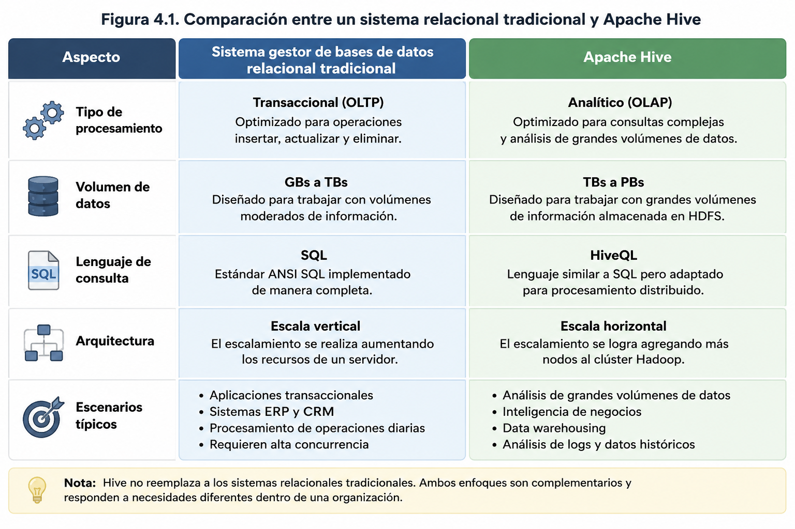
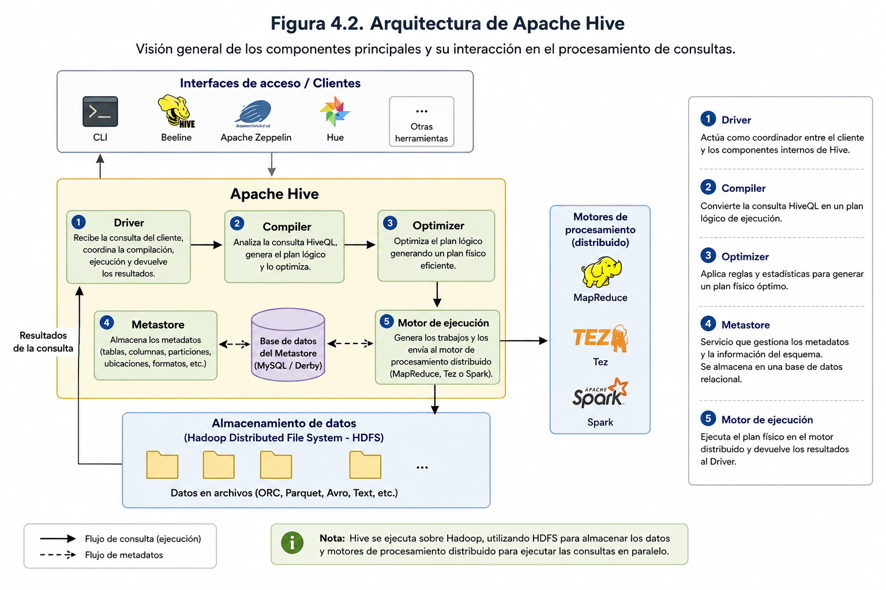
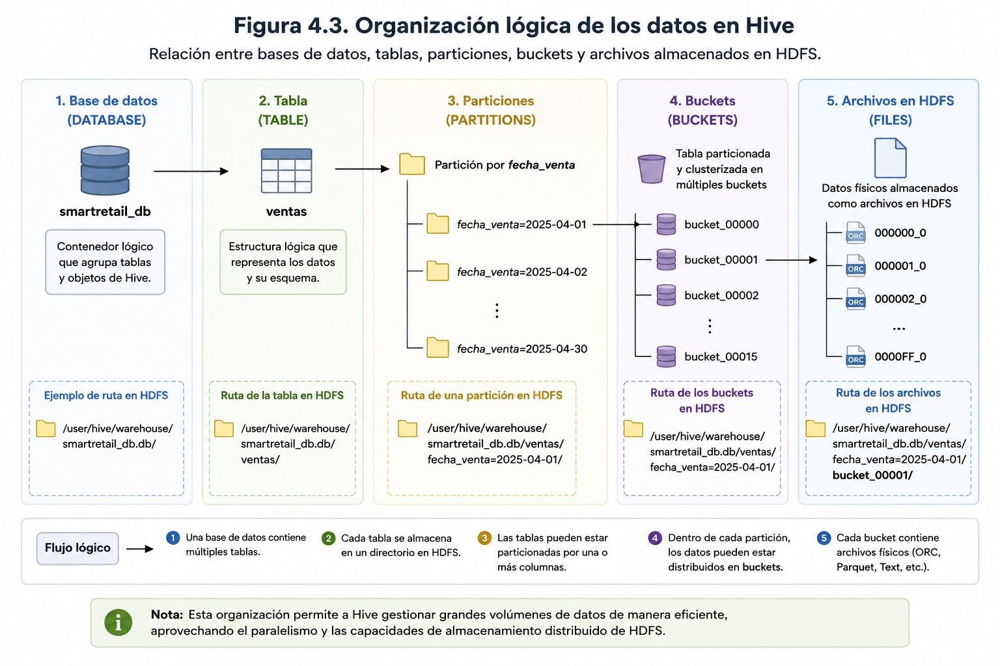
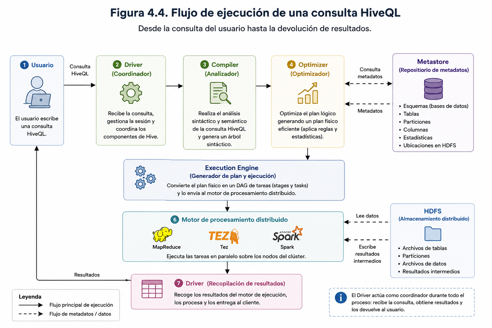

# Capítulo 4

# Apache Hive: Almacén de Datos y Consultas SQL

---

# Pregunta guía

> **¿Cómo permite Apache Hive consultar y analizar grandes volúmenes de datos almacenados en Hadoop utilizando un lenguaje similar a SQL?**

---

# Objetivos de aprendizaje

Al finalizar este capítulo el estudiante será capaz de:

- Comprender el propósito de Apache Hive dentro del ecosistema Hadoop.
- Explicar la arquitectura y el funcionamiento de Hive.
- Identificar los componentes principales de Hive.
- Comprender cómo Hive organiza y administra los datos.
- Utilizar HiveQL para consultar información almacenada en HDFS.

---

## Introducción

En los capítulos anteriores se estudiaron los fundamentos del ecosistema Hadoop y el funcionamiento del Sistema de Archivos Distribuido Hadoop (HDFS), comprendiendo cómo es posible almacenar grandes volúmenes de información de manera distribuida y tolerante a fallos. Sin embargo, una vez que los datos han sido almacenados, surge un nuevo desafío: **¿cómo consultarlos y analizarlos de manera sencilla sin necesidad de desarrollar aplicaciones complejas utilizando Java o MapReduce?**

Apache Hive surge precisamente para resolver este problema. Desarrollado originalmente por Facebook en 2007 y posteriormente incorporado como proyecto de la Apache Software Foundation, Hive proporciona un **data warehouse** distribuido que facilita la consulta, organización y análisis de grandes volúmenes de datos almacenados en Hadoop mediante un lenguaje denominado **HiveQL**, cuya sintaxis es muy similar al lenguaje SQL utilizado en los sistemas de bases de datos relacionales.

Esta característica permitió que analistas de datos, ingenieros de datos y profesionales con experiencia en bases de datos relacionales pudieran aprovechar la capacidad de procesamiento distribuido de Hadoop sin necesidad de conocer los detalles internos de MapReduce. En lugar de programar algoritmos distribuidos, el usuario simplemente escribe consultas utilizando HiveQL, mientras que Hive se encarga de traducir dichas instrucciones en trabajos que serán ejecutados por el motor de procesamiento correspondiente.

Es importante comprender que **Apache Hive no constituye un sistema gestor de bases de datos relacional (RDBMS)** como MySQL, PostgreSQL o Microsoft SQL Server. Aunque utiliza un lenguaje similar a SQL, su objetivo principal no es soportar transacciones en tiempo real ni aplicaciones operacionales, sino facilitar el procesamiento analítico de grandes conjuntos de datos almacenados en sistemas distribuidos.

La arquitectura de Hive se apoya directamente sobre HDFS. Los datos permanecen almacenados en el sistema de archivos distribuido, mientras Hive administra los metadatos necesarios para describir su estructura, ubicación y organización lógica. Gracias a esta separación entre almacenamiento y metadatos, es posible consultar archivos de diversos formatos sin necesidad de trasladarlos hacia una base de datos tradicional.

Entre los formatos de datos que Hive puede consultar se encuentran:

- Archivos de texto (CSV y TSV).
- JSON.
- Avro.
- ORC (Optimized Row Columnar).
- Parquet.
- Sequence Files.
- Otros formatos compatibles mediante *SerDes* (Serializer/Deserializer).

Uno de los principales aportes de Hive al ecosistema Hadoop consiste en incorporar una **capa de abstracción** entre el usuario y el procesamiento distribuido. El analista interactúa mediante consultas HiveQL, mientras que Hive transforma automáticamente dichas consultas en planes de ejecución que posteriormente son procesados por motores como MapReduce, Apache Tez o Apache Spark, dependiendo de la configuración del clúster.

Esta arquitectura permite concentrar el esfuerzo en el análisis de la información, reduciendo significativamente la complejidad técnica asociada al procesamiento distribuido.

En la actualidad, Apache Hive continúa siendo una herramienta ampliamente utilizada dentro de ecosistemas Big Data orientados al almacenamiento masivo y al análisis histórico de información. Su integración con HDFS, su compatibilidad con múltiples formatos de datos y la familiaridad de HiveQL para usuarios provenientes del mundo SQL han convertido a Hive en uno de los componentes fundamentales del ecosistema Hadoop.

En las siguientes secciones se estudiará con mayor profundidad la arquitectura de Hive, la organización de sus tablas, el funcionamiento del lenguaje HiveQL y su integración con HDFS, culminando con un caso práctico basado en **SmartCity Analytics**, donde se aplicarán los conceptos desarrollados a lo largo del capítulo.

---

## 4.2 ¿Por qué utilizar Hive?

A medida que las organizaciones comenzaron a almacenar cantidades cada vez mayores de información en Hadoop, quedó en evidencia una limitación importante: acceder a esos datos mediante programas escritos en Java o utilizando directamente MapReduce resultaba un proceso complejo, lento y poco accesible para la mayoría de los analistas de datos.

Antes de la aparición de Apache Hive, cualquier consulta sobre información almacenada en HDFS requería desarrollar un programa específico, compilarlo, ejecutarlo sobre el clúster y esperar la finalización del procesamiento distribuido para obtener los resultados. Este enfoque era adecuado para desarrolladores con experiencia en programación distribuida, pero representaba una barrera significativa para profesionales provenientes del ámbito de la inteligencia de negocios, la estadística o la administración de bases de datos.

Apache Hive fue diseñado precisamente para reducir esta complejidad. Su principal objetivo consiste en ofrecer una interfaz de consulta de alto nivel basada en un lenguaje similar a SQL, permitiendo que usuarios con conocimientos previos en bases de datos relacionales puedan consultar grandes volúmenes de información sin necesidad de comprender los detalles internos del procesamiento distribuido.

La diferencia conceptual puede resumirse de la siguiente manera:

- **Sin Hive**, el usuario debe desarrollar programas MapReduce para cada análisis.
- **Con Hive**, el usuario escribe consultas HiveQL y el sistema genera automáticamente el procesamiento distribuido necesario.

Esta capacidad transforma el análisis de datos masivos en una tarea considerablemente más simple y productiva.

### Ventajas de Apache Hive

Entre las principales ventajas que ofrece Apache Hive destacan las siguientes:

- **Lenguaje familiar para analistas.** HiveQL mantiene una sintaxis muy similar al estándar SQL, reduciendo la curva de aprendizaje para usuarios provenientes de sistemas gestores de bases de datos relacionales.

- **Abstracción del procesamiento distribuido.** El usuario no necesita programar algoritmos MapReduce ni conocer la arquitectura interna del clúster Hadoop.

- **Escalabilidad.** Hive permite consultar conjuntos de datos de varios terabytes o incluso petabytes aprovechando la capacidad de procesamiento distribuido de Hadoop.

- **Compatibilidad con múltiples formatos de almacenamiento.** Puede trabajar sobre archivos CSV, JSON, ORC, Parquet, Avro y otros formatos sin requerir transformaciones significativas.

- **Integración con el ecosistema Hadoop.** Hive se conecta de forma nativa con HDFS y puede ejecutar consultas utilizando motores como MapReduce, Apache Tez o Apache Spark.

- **Administración mediante metadatos.** La información estructural de las tablas se almacena en el Metastore, permitiendo organizar grandes volúmenes de información sin modificar físicamente los archivos almacenados en HDFS.

### ¿Cuándo utilizar Apache Hive?

Apache Hive resulta especialmente apropiado cuando se requiere analizar grandes volúmenes de información histórica y generar consultas analíticas sobre datos almacenados en Hadoop.

Algunos escenarios habituales incluyen:

- Elaboración de reportes corporativos.
- Construcción de Data Warehouses.
- Procesamiento de registros (*logs*) de aplicaciones.
- Análisis de comportamiento de clientes.
- Inteligencia de negocios (Business Intelligence).
- Integración con herramientas de visualización como Power BI, Tableau o Apache Superset.
- Preparación de datos para modelos de minería de datos y aprendizaje automático.

En todos estos casos, el tiempo de respuesta suele medirse en segundos o minutos, dependiendo del tamaño de los datos y de la infraestructura disponible, privilegiando la capacidad de análisis sobre la velocidad de ejecución de operaciones transaccionales.

### ¿Cuándo no utilizar Hive?

A pesar de sus numerosas ventajas, Hive no fue diseñado para reemplazar a un sistema gestor de bases de datos relacional tradicional. Existen escenarios donde otras tecnologías resultan más apropiadas.

No es recomendable utilizar Hive para:

- Sistemas transaccionales con miles de operaciones por segundo.
- Aplicaciones bancarias o financieras que requieren propiedades ACID estrictas en todas sus operaciones.
- Sistemas de comercio electrónico con consultas en tiempo real de muy baja latencia.
- Aplicaciones donde múltiples usuarios modifican simultáneamente los mismos registros.
- Procesamiento operacional (*Online Transaction Processing*, OLTP).

En estos contextos, bases de datos relacionales como PostgreSQL, MySQL o SQL Server continúan siendo alternativas más adecuadas.

Por el contrario, Hive está orientado al procesamiento analítico (*Online Analytical Processing*, OLAP), donde el objetivo principal consiste en explorar grandes volúmenes de información para apoyar la toma de decisiones estratégicas.

La **Figura 4.1** resume las principales diferencias entre un sistema gestor de bases de datos relacional tradicional y Apache Hive, destacando el tipo de procesamiento, el volumen de datos soportado y los escenarios para los cuales fue diseñado cada enfoque.

<p align="center">
  
</p>

<p align="center">
<strong>Figura 4.1.</strong> Comparación entre un sistema gestor de bases de datos relacional tradicional y Apache Hive. La figura resume las principales diferencias entre ambos enfoques en términos del tipo de procesamiento, volumen de datos soportado, lenguaje de consulta, arquitectura y escenarios de aplicación. Mientras los sistemas relacionales están orientados al procesamiento transaccional (OLTP), Apache Hive está diseñado para el análisis de grandes volúmenes de datos (OLAP) dentro del ecosistema Hadoop.
</p>

---

## 4.3 Arquitectura de Hive

Apache Hive está compuesto por un conjunto de componentes que trabajan de manera coordinada para transformar consultas escritas en HiveQL en tareas de procesamiento distribuido sobre los datos almacenados en HDFS. Esta arquitectura permite separar las responsabilidades de almacenamiento, administración de metadatos, optimización de consultas y ejecución, facilitando el análisis de grandes volúmenes de información.

Desde la perspectiva del usuario, el funcionamiento de Hive resulta relativamente sencillo: el analista escribe una consulta utilizando HiveQL y recibe un conjunto de resultados. Sin embargo, internamente Hive ejecuta una serie de procesos que permiten interpretar la consulta, validar la estructura de las tablas, generar un plan de ejecución y coordinar el procesamiento distribuido dentro del clúster Hadoop.

La **Figura 4.2** presenta una visión general de la arquitectura de Apache Hive y la interacción entre sus principales componentes.

### Cliente (Client)

El cliente constituye el punto de entrada para los usuarios. A través de este componente es posible enviar consultas HiveQL utilizando diferentes interfaces, entre ellas:

- Consola interactiva de Hive.
- Beeline.
- Aplicaciones Java mediante JDBC.
- Aplicaciones ODBC.
- Herramientas de inteligencia de negocios como Power BI o Tableau.

Independientemente del mecanismo utilizado, todas las consultas siguen el mismo flujo interno de procesamiento.

### Driver

El **Driver** coordina toda la ejecución de una consulta. Su función consiste en recibir la instrucción enviada por el cliente y administrar cada una de las etapas necesarias hasta obtener el resultado final.

Entre sus principales responsabilidades se encuentran:

- Administrar la sesión del usuario.
- Controlar el ciclo completo de ejecución de la consulta.
- Coordinar la comunicación entre los distintos componentes de Hive.
- Entregar los resultados al cliente.

Puede considerarse como el "orquestador" de toda la arquitectura.

<p align="center">
  
</p>

<p align="center">
<strong>Figura 4.2.</strong> Arquitectura general de Apache Hive. La figura presenta la interacción entre los principales componentes del sistema, incluyendo las interfaces de acceso (CLI, Beeline y aplicaciones externas), el <em>Driver</em>, el <em>Compiler</em>, el <em>Optimizer</em>, el <em>Metastore</em>, el <em>Execution Engine</em>, los motores de procesamiento distribuido (MapReduce, Tez o Spark) y el sistema de almacenamiento HDFS. Asimismo, ilustra el flujo seguido por una consulta HiveQL desde su recepción hasta la obtención de los resultados.
</p>


### Compilador (Compiler)

Una vez recibida la consulta, el Driver la envía al **Compiler**, cuyo objetivo es analizar la sintaxis de HiveQL y verificar que todos los elementos utilizados sean válidos.

Durante esta etapa se realizan tareas como:

- Validación sintáctica de la consulta.
- Verificación de nombres de tablas y columnas.
- Consulta del Metastore para recuperar la definición de los objetos involucrados.
- Construcción del árbol lógico de ejecución.

Si la consulta presenta errores de sintaxis o hace referencia a objetos inexistentes, el proceso finaliza en esta etapa mostrando el mensaje correspondiente.

### Metastore

El **Metastore** constituye uno de los componentes más importantes de Apache Hive.

Contrario a lo que muchas personas creen, Hive **no almacena los datos** dentro del Metastore. Su función consiste exclusivamente en administrar los **metadatos**, es decir, la información que describe cómo están organizados los datos almacenados en HDFS.

Entre la información almacenada se encuentra:

- Bases de datos.
- Tablas.
- Columnas.
- Tipos de datos.
- Particiones.
- Buckets.
- Ubicación física de los archivos en HDFS.
- Estadísticas utilizadas por el optimizador.

El Metastore suele implementarse sobre una base de datos relacional como MySQL, PostgreSQL o Apache Derby.

Gracias a este componente, Hive puede localizar rápidamente los archivos necesarios para ejecutar una consulta sin recorrer todo el sistema de archivos distribuido.

### Optimizador (Optimizer)

Una vez validada la consulta, Hive genera un plan lógico que posteriormente es optimizado.

El **Optimizer** analiza diferentes alternativas de ejecución con el objetivo de reducir el tiempo de procesamiento y el consumo de recursos del clúster.

Entre las optimizaciones más habituales se encuentran:

- Eliminación de operaciones innecesarias.
- Reordenamiento de filtros.
- Selección del orden óptimo de los JOIN.
- Aprovechamiento de particiones.
- Uso de estadísticas almacenadas en el Metastore.

Gracias a estas optimizaciones, dos consultas equivalentes pueden presentar tiempos de ejecución significativamente distintos dependiendo de la estrategia seleccionada.

### Motor de ejecución (Execution Engine)

El **Execution Engine** transforma el plan optimizado en uno o varios trabajos que serán ejecutados sobre el ecosistema Hadoop.

Dependiendo de la configuración del entorno, Hive puede utilizar distintos motores de procesamiento:

- **Apache MapReduce**, utilizado tradicionalmente en las primeras versiones de Hive.
- **Apache Tez**, diseñado para reducir el número de operaciones intermedias y mejorar el rendimiento.
- **Apache Spark**, ampliamente utilizado en implementaciones modernas debido a su procesamiento en memoria.

La posibilidad de utilizar diferentes motores permite adaptar Hive a distintas necesidades de rendimiento y escalabilidad.

### HDFS

Finalmente, el procesamiento se realiza directamente sobre los datos almacenados en **HDFS**.

Durante la ejecución, Hive no mueve la información hacia otro sistema. En cambio, consulta los archivos ubicados en el sistema distribuido, procesa únicamente los bloques necesarios y devuelve el resultado solicitado al usuario.

Esta integración constituye una de las principales fortalezas del ecosistema Hadoop, ya que evita duplicar grandes volúmenes de información y permite aprovechar la capacidad de almacenamiento distribuido de HDFS.

### Flujo general de una consulta HiveQL

El procesamiento de una consulta puede resumirse en las siguientes etapas:

1. El usuario envía una consulta utilizando HiveQL.
2. El Driver recibe la consulta y coordina su ejecución.
3. El Compiler valida la sintaxis y consulta el Metastore.
4. El Optimizer genera el plan de ejecución más eficiente.
5. El Execution Engine transforma el plan en trabajos distribuidos.
6. Los datos son procesados directamente desde HDFS.
7. El resultado es devuelto al cliente.

Este flujo permite abstraer la complejidad del procesamiento distribuido, ofreciendo al usuario una experiencia similar a la de trabajar con una base de datos relacional tradicional, pero aprovechando la capacidad de almacenamiento y procesamiento de un clúster Hadoop.

En la siguiente sección se analizará cómo Hive organiza la información mediante bases de datos, tablas, particiones y *buckets*, elementos fundamentales para optimizar el almacenamiento y las consultas sobre grandes volúmenes de datos.

---

## 4.4 Organización de los datos en Hive

Uno de los principales aportes de Apache Hive consiste en proporcionar una organización lógica de los datos almacenados en HDFS. Mientras HDFS administra únicamente archivos y directorios, Hive incorpora conceptos propios de un sistema de bases de datos, permitiendo trabajar con bases de datos, tablas, columnas y particiones sin modificar físicamente la forma en que los archivos se almacenan en el sistema distribuido.

Esta organización facilita el análisis de grandes volúmenes de información, ya que permite acceder a los datos utilizando una estructura familiar para quienes poseen experiencia en bases de datos relacionales.

### Bases de datos

El nivel superior de organización en Hive corresponde a las **bases de datos** (*databases*).

Una base de datos constituye un contenedor lógico que agrupa tablas relacionadas entre sí. Su propósito es organizar la información y facilitar la administración de diferentes proyectos o áreas de negocio.

Por ejemplo, una organización podría definir las siguientes bases de datos:

- **ventas**
- **recursos_humanos**
- **marketing**
- **produccion**

Cada una contendrá únicamente las tablas relacionadas con su dominio de información.

Es importante destacar que una base de datos en Hive no representa un archivo independiente, sino un conjunto de metadatos administrados por el Metastore.

### Tablas

Dentro de cada base de datos se encuentran las **tablas**, las cuales representan la estructura lógica utilizada para consultar la información almacenada en HDFS.

Cada tabla define:

- Nombre de la tabla.
- Columnas.
- Tipo de datos.
- Formato de almacenamiento.
- Ubicación física de los archivos.
- Propiedades adicionales.

A diferencia de una base de datos relacional tradicional, los registros no se almacenan dentro de Hive, sino en archivos ubicados en HDFS.

Hive únicamente administra la definición de la tabla y la relación entre dicha estructura y los archivos físicos.

### Tipos de tablas

Apache Hive distingue dos tipos principales de tablas:

#### Tablas administradas (*Managed Tables*)

En una tabla administrada, Hive controla completamente tanto los metadatos como los archivos almacenados en HDFS.

Cuando una tabla administrada es eliminada mediante la instrucción `DROP TABLE`, Hive elimina:

- La definición de la tabla.
- Los metadatos asociados.
- Los archivos almacenados en HDFS.

Este comportamiento resulta apropiado cuando Hive es el único responsable del ciclo de vida de los datos.

#### Tablas externas (*External Tables*)

Las tablas externas permiten trabajar con datos cuya administración corresponde a otro sistema o aplicación.

En este caso, Hive únicamente administra los metadatos.

Si la tabla es eliminada:

- Se eliminan únicamente los metadatos.
- Los archivos continúan almacenados en HDFS.

Este tipo de tablas es ampliamente utilizado en entornos productivos, donde múltiples aplicaciones comparten los mismos conjuntos de datos.

### Columnas y tipos de datos

Cada tabla está compuesta por un conjunto de columnas, las cuales describen la estructura de la información.

Hive soporta diversos tipos de datos, entre ellos:

| Categoría | Ejemplos |
|-----------|----------|
| Numéricos | `INT`, `BIGINT`, `FLOAT`, `DOUBLE`, `DECIMAL` |
| Texto | `STRING`, `VARCHAR`, `CHAR` |
| Fecha y hora | `DATE`, `TIMESTAMP` |
| Booleanos | `BOOLEAN` |
| Complejos | `ARRAY`, `MAP`, `STRUCT`, `UNIONTYPE` |

Los tipos complejos constituyen una característica diferenciadora de Hive respecto de muchos sistemas relacionales, ya que permiten representar estructuras semiestructuradas como documentos JSON o registros jerárquicos.

### Particiones

Cuando una tabla contiene millones o miles de millones de registros, consultar toda la información para responder una pregunta específica resulta poco eficiente.

Para resolver este problema, Hive incorpora el concepto de **particiones** (*partitions*).

Una partición consiste en dividir lógicamente una tabla en múltiples subconjuntos, utilizando el valor de una o más columnas.

Por ejemplo, una tabla de ventas podría particionarse por año:

```
Ventas
├── Año = 2023
├── Año = 2024
└── Año = 2025
```

Si posteriormente se ejecuta una consulta como:

```sql
SELECT *
FROM ventas
WHERE anio = 2025;
```

Hive accederá únicamente a la partición correspondiente al año 2025, evitando recorrer el resto de los datos almacenados.

Este mecanismo reduce considerablemente el tiempo de procesamiento y el consumo de recursos del clúster.

Las columnas utilizadas como particiones suelen corresponder a variables con pocos valores distintos, por ejemplo:

- Año.
- Mes.
- Región.
- País.
- Tipo de producto.

### Buckets

Además de las particiones, Hive incorpora un segundo mecanismo de organización denominado **bucketing**.

Mientras las particiones dividen la información según el valor de una columna, los *buckets* distribuyen los registros en un número fijo de archivos mediante una función hash.

Por ejemplo, una tabla podría organizarse en ocho *buckets* utilizando el identificador del cliente.

Este mecanismo mejora el rendimiento de operaciones como:

- JOIN.
- Muestreo (*sampling*).
- Consultas paralelas.
- Procesamiento distribuido.

En términos generales:

- Las **particiones** reducen la cantidad de datos que deben leerse.
- Los **buckets** mejoran la distribución interna de los datos dentro de cada partición.

Ambas estrategias pueden utilizarse simultáneamente para optimizar consultas sobre conjuntos de datos de gran tamaño.

### Organización física en HDFS

Aunque Hive presenta una estructura similar a la de una base de datos relacional, los datos continúan almacenándose como archivos dentro de HDFS.

Por ejemplo, una tabla particionada por año podría organizarse físicamente de la siguiente manera:

```
/warehouse/ventas/
├── anio=2023/
│   ├── part-00000.parquet
│   └── part-00001.parquet
├── anio=2024/
│   ├── part-00000.parquet
│   └── part-00001.parquet
└── anio=2025/
    ├── part-00000.parquet
    └── part-00001.parquet
```

Esta estructura evidencia que Hive no almacena la información en un formato propietario. Los datos permanecen como archivos en HDFS, mientras el Metastore mantiene la descripción lógica necesaria para consultarlos mediante HiveQL.

La **Figura 4.3** resume la organización lógica de los datos en Hive, mostrando la relación entre bases de datos, tablas, particiones, *buckets* y los archivos almacenados en HDFS.

<p align="center">
  
</p>

<p align="center">
<strong>Figura 4.3.</strong> Organización lógica de los datos en Apache Hive. La figura muestra la relación jerárquica entre bases de datos, tablas, particiones, <em>buckets</em> y archivos físicos almacenados en HDFS. Esta estructura permite organizar grandes volúmenes de información de manera lógica y eficiente, facilitando el procesamiento distribuido y la optimización de las consultas.
</p>

---

## 4.5 Introducción a HiveQL

Uno de los factores que explica la amplia adopación de Apache Hive dentro del ecosistema Hadoop es la incorporación de **Hive Query Language (HiveQL)**, un lenguaje declarativo inspirado en SQL que permite consultar y analizar grandes volúmenes de datos almacenados en HDFS sin necesidad de desarrollar programas distribuidos utilizando Java o MapReduce.

Desde la perspectiva del usuario, HiveQL resulta muy similar al lenguaje SQL utilizado en sistemas gestores de bases de datos relacionales como MySQL, PostgreSQL o Microsoft SQL Server. Esta similitud reduce considerablemente la curva de aprendizaje para analistas de datos, ingenieros de datos y profesionales de inteligencia de negocios que ya poseen experiencia trabajando con consultas SQL.

Sin embargo, aunque ambos lenguajes comparten gran parte de su sintaxis, es importante comprender que **HiveQL no fue diseñado para aplicaciones transaccionales**, sino para el procesamiento analítico de grandes conjuntos de datos distribuidos.

### ¿Cómo funciona una consulta HiveQL?

Cuando un usuario ejecuta una consulta en HiveQL, el proceso ocurre de manera transparente:

1. El usuario escribe una consulta utilizando una sintaxis similar a SQL.
2. Hive valida la consulta y consulta el Metastore para conocer la estructura de las tablas.
3. El optimizador genera el plan de ejecución más eficiente.
4. La consulta es transformada en tareas distribuidas que serán ejecutadas por MapReduce, Apache Tez o Apache Spark.
5. Los resultados son devueltos al usuario.

Este proceso permite que el usuario se concentre exclusivamente en el análisis de la información, mientras Hive administra toda la complejidad asociada al procesamiento distribuido.

### Sentencias más utilizadas

HiveQL incorpora la mayoría de las instrucciones habituales del lenguaje SQL, permitiendo realizar operaciones de definición, consulta y manipulación de datos.

Entre las sentencias más utilizadas se encuentran:

| Tipo de operación | Sentencias principales |
|-------------------|------------------------|
| Bases de datos | `CREATE DATABASE`, `USE`, `SHOW DATABASES`, `DROP DATABASE` |
| Tablas | `CREATE TABLE`, `ALTER TABLE`, `DROP TABLE`, `DESCRIBE`, `SHOW TABLES` |
| Consulta de datos | `SELECT`, `WHERE`, `GROUP BY`, `HAVING`, `ORDER BY`, `LIMIT` |
| Carga de datos | `LOAD DATA`, `INSERT INTO`, `INSERT OVERWRITE` |
| Objetos adicionales | `CREATE VIEW`, `CREATE EXTERNAL TABLE` |

En este capítulo se revisarán únicamente los conceptos fundamentales del lenguaje. El desarrollo práctico de consultas más complejas se abordará en los laboratorios y en los capítulos posteriores.

### Ejemplo de consulta

La siguiente consulta obtiene el nombre del producto y el monto total vendido para cada uno de ellos.

```sql
SELECT
    producto,
    SUM(total_venta) AS ventas_totales
FROM ventas
GROUP BY producto
ORDER BY ventas_totales DESC;
```

Aunque la consulta es prácticamente idéntica a una sentencia SQL tradicional, Hive ejecutará internamente un conjunto de tareas distribuidas sobre los datos almacenados en HDFS.

### Diferencias entre SQL y HiveQL

A pesar de su gran similitud sintáctica, HiveQL presenta diferencias importantes respecto a los sistemas gestores de bases de datos relacionales.

| SQL tradicional | HiveQL |
|-----------------|---------|
| Orientado a sistemas OLTP | Orientado a sistemas OLAP |
| Optimizado para transacciones | Optimizado para análisis masivo |
| Procesa miles de registros | Procesa millones o miles de millones de registros |
| Baja latencia | Alto rendimiento sobre grandes volúmenes de datos |
| Los datos se almacenan en la base de datos | Los datos permanecen almacenados en HDFS |

Estas diferencias reflejan que ambos enfoques persiguen objetivos distintos. Mientras un sistema relacional prioriza la rapidez de las transacciones individuales, Hive privilegia la capacidad para analizar grandes conjuntos de datos distribuidos.

### Limitaciones de HiveQL

Si bien HiveQL constituye una herramienta muy potente para el análisis de datos, también presenta algunas limitaciones derivadas de su orientación analítica.

Entre las principales destacan:

- No está diseñado para transacciones de alta frecuencia.
- El tiempo de respuesta suele ser mayor que el de una base de datos relacional para consultas pequeñas.
- Las operaciones de actualización y eliminación de registros son más limitadas que en un sistema OLTP.
- El rendimiento depende del motor de ejecución utilizado (MapReduce, Apache Tez o Apache Spark) y de la organización física de los datos.

En consecuencia, Hive debe entenderse como una herramienta especializada para el análisis de grandes volúmenes de información y no como un reemplazo de un sistema gestor de bases de datos transaccional.

La **Figura 4.4** resume el flujo de ejecución de una consulta HiveQL, desde que el usuario escribe la instrucción hasta que el motor de procesamiento distribuido ejecuta las tareas sobre los datos almacenados en HDFS y devuelve los resultados correspondientes.

<p align="center">
  
</p>

<p align="center">
<strong>Figura 4.4.</strong> Flujo de ejecución de una consulta HiveQL. La figura representa el proceso que se inicia cuando el usuario escribe una consulta y continúa a través del <em>Driver</em>, el <em>Compiler</em>, el <em>Optimizer</em> y el <em>Execution Engine</em>. Posteriormente, el motor de procesamiento distribuido ejecuta las tareas sobre los datos almacenados en HDFS, recopila los resultados y los devuelve al usuario.
</p>

---

## 4.6 Integración entre Hive y HDFS

Apache Hive y Hadoop Distributed File System (HDFS) constituyen dos componentes estrechamente integrados dentro del ecosistema Hadoop. Mientras HDFS proporciona la infraestructura de almacenamiento distribuido, Hive ofrece una capa de abstracción que permite consultar y analizar la información almacenada mediante un lenguaje similar a SQL.

Esta integración permite separar claramente dos responsabilidades:

- **HDFS** administra el almacenamiento físico de los archivos.
- **Hive** administra la organización lógica de esos datos mediante metadatos.

Como resultado, los usuarios pueden trabajar con tablas y consultas sin necesidad de conocer la ubicación exacta de los archivos dentro del sistema distribuido.

### Almacenamiento físico y organización lógica

Una característica fundamental de Hive es que **no almacena los datos por sí mismo**. Los archivos permanecen en HDFS, mientras que Hive registra en el Metastore la información necesaria para interpretarlos correctamente.

Por ejemplo, una tabla denominada `ventas` puede estar asociada a un conjunto de archivos almacenados en la siguiente ubicación:

```
/warehouse/ventas/
```

Desde la perspectiva del usuario, basta con ejecutar una consulta como:

```sql
SELECT *
FROM ventas;
```

Hive localizará automáticamente los archivos correspondientes en HDFS, interpretará su estructura y enviará la consulta al motor de ejecución, sin que el usuario deba especificar la ruta física donde se encuentran los datos.

### El papel del Metastore

La integración entre Hive y HDFS depende del **Metastore**, encargado de almacenar los metadatos de las tablas.

Para cada tabla registrada, el Metastore mantiene información como:

- Nombre de la base de datos.
- Nombre de la tabla.
- Definición de columnas.
- Tipos de datos.
- Formato de almacenamiento.
- Ubicación física en HDFS.
- Particiones.
- Buckets.
- Estadísticas utilizadas por el optimizador.

Cuando un usuario ejecuta una consulta, Hive consulta primero el Metastore para determinar dónde se encuentran los archivos que deben procesarse.

### Lectura de archivos desde HDFS

Durante la ejecución de una consulta, Hive no copia los datos hacia otro sistema.

En su lugar:

1. Consulta el Metastore.
2. Identifica la ubicación de los archivos en HDFS.
3. Lee únicamente los bloques necesarios.
4. Envía las tareas al motor de ejecución.
5. Devuelve el resultado solicitado al usuario.

Este mecanismo evita duplicar grandes volúmenes de información y aprovecha la capacidad de almacenamiento distribuido proporcionada por HDFS.

### Compatibilidad con distintos formatos

Otra ventaja de esta integración es que Hive puede consultar información almacenada en diversos formatos de archivo sin modificar su ubicación en HDFS.

Entre los formatos más utilizados destacan:

| Formato | Características |
|----------|-----------------|
| CSV | Simple y ampliamente utilizado para intercambio de datos. |
| TSV | Similar al CSV, utilizando tabulaciones como separador. |
| JSON | Adecuado para datos semiestructurados. |
| Avro | Formato binario orientado al intercambio de datos. |
| ORC | Formato columnar optimizado para Hive, con alta compresión y excelente rendimiento. |
| Parquet | Formato columnar ampliamente utilizado en ecosistemas Big Data y Apache Spark. |
| Sequence File | Formato binario propio del ecosistema Hadoop. |

La elección del formato influye directamente en el rendimiento de las consultas. En entornos analíticos es habitual utilizar formatos columnares como **ORC** o **Parquet**, ya que permiten leer únicamente las columnas requeridas y reducir significativamente el volumen de datos procesados.

### Tablas administradas y tablas externas

La integración entre Hive y HDFS también depende del tipo de tabla utilizado.

En una **tabla administrada (Managed Table)**, Hive controla tanto los metadatos como los archivos almacenados en HDFS. Si la tabla se elimina, también se eliminan los archivos asociados.

En una **tabla externa (External Table)**, Hive administra únicamente los metadatos. Los archivos permanecen en HDFS incluso si la definición de la tabla es eliminada.

Esta diferencia resulta especialmente importante en ambientes empresariales, donde los mismos archivos pueden ser compartidos por distintas aplicaciones del ecosistema Hadoop.

### Flujo de integración

La interacción entre Hive y HDFS puede resumirse mediante las siguientes etapas:

1. El usuario ejecuta una consulta HiveQL.
2. Hive consulta el Metastore para recuperar la definición de la tabla.
3. El Metastore indica la ubicación física de los datos en HDFS.
4. Hive genera el plan de ejecución correspondiente.
5. El motor de procesamiento distribuido accede directamente a los archivos almacenados en HDFS.
6. Los resultados son devueltos al usuario.

Este flujo permite combinar la capacidad de almacenamiento masivo de HDFS con la facilidad de consulta proporcionada por HiveQL, ofreciendo una solución eficiente para el análisis de grandes volúmenes de información.

En el siguiente apartado se aplicarán estos conceptos mediante un caso de estudio basado en **SmartCity Analytics**, donde se analizará cómo Hive puede utilizarse para organizar y consultar información proveniente de una ciudad inteligente.

---

## 4.7 Caso de estudio: SmartCity Analytics

A lo largo de este libro se ha utilizado el caso **SmartCity Analytics** como hilo conductor para ilustrar la aplicación de las distintas tecnologías que conforman el ecosistema Hadoop. En este capítulo se analizará cómo Apache Hive facilita la consulta y el análisis de la información almacenada en HDFS mediante un lenguaje similar a SQL.

### Contexto

La ciudad inteligente **SmartCity Analytics** dispone de miles de sensores distribuidos en distintos puntos urbanos, los cuales registran información relacionada con:

- Flujo vehicular.
- Calidad del aire.
- Consumo energético.
- Condiciones meteorológicas.
- Disponibilidad de estacionamientos.
- Niveles de ruido ambiental.
- Uso del transporte público.

Cada uno de estos dispositivos genera información de manera continua, produciendo millones de registros diariamente que son almacenados en HDFS.

Aunque el sistema de archivos distribuido proporciona una infraestructura eficiente para almacenar esta información, los analistas municipales requieren una forma sencilla de consultar los datos para apoyar la planificación urbana y la toma de decisiones.

En este escenario, Apache Hive permite organizar los datos mediante tablas y consultarlos utilizando HiveQL, sin necesidad de desarrollar aplicaciones distribuidas.

### Organización de la información

Supóngase que la municipalidad decide almacenar las mediciones de los sensores ambientales en una tabla denominada **calidad_aire**.

La estructura lógica podría incluir los siguientes atributos:

| Columna | Descripción |
|----------|-------------|
| id_sensor | Identificador del sensor. |
| fecha | Fecha de la medición. |
| hora | Hora del registro. |
| comuna | Comuna donde se encuentra instalado el sensor. |
| contaminante | Tipo de contaminante medido. |
| concentracion | Concentración registrada. |
| temperatura | Temperatura ambiente. |
| humedad | Humedad relativa. |

Físicamente, los archivos continúan almacenados en HDFS, mientras Hive registra únicamente la definición de la tabla y su ubicación en el Metastore.

### Uso de particiones

Dado que diariamente se generan millones de registros, consultar toda la información para responder una pregunta puntual resultaría ineficiente.

Para optimizar el rendimiento, la tabla puede particionarse por año y mes.

Una organización simplificada podría ser:

```
calidad_aire
├── anio = 2025
│   ├── mes = 01
│   ├── mes = 02
│   └── mes = 03
└── anio = 2026
    ├── mes = 01
    ├── mes = 02
    └── mes = 03
```

Cuando un analista consulta únicamente la información correspondiente a un determinado período, Hive accederá exclusivamente a las particiones necesarias, reduciendo significativamente el volumen de datos procesados.

### Consultas analíticas

Gracias a HiveQL, los analistas pueden responder preguntas relevantes para la gestión de la ciudad utilizando consultas similares a SQL.

Algunos ejemplos son:

- ¿Cuál fue la concentración promedio de material particulado durante el último mes?
- ¿Qué comunas presentan mayores niveles de contaminación?
- ¿En qué horarios se registran los mayores niveles de congestión vehicular?
- ¿Cómo varía el consumo energético según la estación del año?
- ¿Qué zonas presentan mayor ocupación de estacionamientos públicos?

Este tipo de consultas permite transformar grandes volúmenes de datos en información útil para la toma de decisiones.

### Beneficios para SmartCity Analytics

La incorporación de Apache Hive aporta múltiples beneficios al proyecto SmartCity Analytics:

- Facilita el acceso a la información mediante un lenguaje similar a SQL.
- Reduce la complejidad técnica asociada al procesamiento distribuido.
- Permite consultar datos almacenados en HDFS sin duplicarlos.
- Aprovecha las particiones para disminuir los tiempos de respuesta.
- Se integra con herramientas de inteligencia de negocios para la construcción de dashboards e informes ejecutivos.
- Escala de manera eficiente a medida que aumenta el número de sensores y el volumen de datos generado.

### Relación con los capítulos siguientes

En este capítulo se ha estudiado cómo Hive organiza y consulta grandes volúmenes de información almacenados en HDFS. Sin embargo, en muchos escenarios analíticos es necesario realizar transformaciones más complejas, integrar múltiples fuentes de datos o ejecutar algoritmos avanzados de análisis y aprendizaje automático.

Estas necesidades serán abordadas en la **Parte III** de este libro, donde se estudiará **Apache Spark**, una plataforma de procesamiento distribuido que amplía las capacidades del ecosistema Hadoop al proporcionar un procesamiento en memoria significativamente más rápido que los enfoques tradicionales basados en MapReduce.

---

## 4.8 Resumen del capítulo

En este capítulo se analizó el papel de **Apache Hive** como uno de los componentes fundamentales del ecosistema Hadoop para el almacenamiento lógico y el análisis de grandes volúmenes de datos. A diferencia de HDFS, cuya responsabilidad consiste en administrar el almacenamiento físico de la información, Hive proporciona una capa de abstracción que permite consultar dichos datos mediante un lenguaje similar a SQL, denominado **HiveQL**.

Se explicó que Hive fue desarrollado para simplificar el acceso a los datos almacenados en Hadoop, eliminando la necesidad de programar aplicaciones utilizando MapReduce para realizar consultas analíticas. Gracias a esta característica, profesionales con experiencia en bases de datos relacionales pueden aprovechar la capacidad de procesamiento distribuido del clúster utilizando una sintaxis ampliamente conocida.

Posteriormente, se estudió la arquitectura de Hive, identificando el rol de sus principales componentes: el cliente, el Driver, el Compiler, el Metastore, el Optimizer y el Execution Engine. Asimismo, se revisó el flujo completo de ejecución de una consulta HiveQL, desde que el usuario envía una instrucción hasta que los datos son procesados directamente desde HDFS.

Otro aspecto abordado fue la organización lógica de la información mediante bases de datos, tablas, particiones y *buckets*. Estos mecanismos permiten mejorar significativamente el rendimiento de las consultas, especialmente cuando se trabaja con conjuntos de datos de gran tamaño. También se analizaron las diferencias entre las tablas administradas y las tablas externas, destacando la importancia de esta distinción en ambientes productivos.

En relación con HiveQL, se introdujeron las principales características del lenguaje, sus similitudes y diferencias con SQL tradicional, así como sus ventajas y limitaciones en escenarios de análisis de datos masivos. Se destacó que Hive está orientado al procesamiento analítico (**OLAP**) y no al procesamiento transaccional (**OLTP**).

Finalmente, mediante el caso de estudio **SmartCity Analytics**, se ilustró cómo Hive permite organizar y consultar información proveniente de sensores urbanos distribuidos, demostrando su utilidad para apoyar la toma de decisiones mediante el análisis eficiente de grandes volúmenes de datos.

Con este capítulo concluye la segunda parte del libro, dedicada a los componentes fundamentales del ecosistema Hadoop relacionados con el almacenamiento y la consulta de datos. En la siguiente parte se estudiará **Apache Spark**, una plataforma de procesamiento distribuido que amplía las capacidades analíticas de Hadoop mediante el procesamiento en memoria, permitiendo desarrollar aplicaciones de análisis de datos, aprendizaje automático y procesamiento de flujos con un rendimiento significativamente superior al de los enfoques tradicionales basados en MapReduce.

---

## 4.9 Actividades

Las siguientes actividades tienen como propósito reforzar los conceptos fundamentales estudiados en este capítulo. Se recomienda responderlas antes de desarrollar el laboratorio, ya que permiten verificar la comprensión de la arquitectura de Hive, la organización de los datos y el uso de HiveQL.

### Actividad 1. Conceptos fundamentales

Responda las siguientes preguntas:

1. ¿Cuál es el objetivo principal de Apache Hive dentro del ecosistema Hadoop?
2. ¿Qué ventajas ofrece Hive respecto al desarrollo de aplicaciones utilizando MapReduce?
3. ¿Qué diferencias existen entre Hive y un sistema gestor de bases de datos relacional tradicional?
4. ¿Cuál es la función del Metastore dentro de la arquitectura de Hive?
5. ¿Qué papel desempeña HDFS en el funcionamiento de Hive?

---

### Actividad 2. Arquitectura de Hive

Observe la **Figura 4.2** y explique el recorrido que realiza una consulta HiveQL desde que el usuario la ejecuta hasta que obtiene el resultado.

En su explicación considere los siguientes componentes:

- Cliente.
- Driver.
- Compiler.
- Metastore.
- Optimizer.
- Execution Engine.
- HDFS.

---

### Actividad 3. Organización de los datos

Complete la siguiente tabla comparativa.

| Concepto | Descripción | Ejemplo |
|----------|-------------|----------|
| Base de datos | | |
| Tabla | | |
| Partición | | |
| Bucket | | |
| Metastore | | |

---

### Actividad 4. Tablas administradas y externas

Una empresa almacena diariamente información de sensores IoT en HDFS. Los mismos archivos son utilizados por Hive, Apache Spark y un sistema de Machine Learning.

Responda:

1. ¿Qué tipo de tabla recomendaría crear en Hive?
2. Justifique técnicamente su respuesta.
3. ¿Qué ocurriría si la tabla fuese eliminada?

---

### Actividad 5. HiveQL

Explique con sus propias palabras la diferencia entre las siguientes operaciones:

- `SELECT`
- `WHERE`
- `GROUP BY`
- `ORDER BY`
- `LIMIT`

Indique un ejemplo de uso para cada una de ellas.

---

### Actividad 6. Aplicación al caso SmartCity Analytics

Considere el caso presentado en la Sección 4.7 y responda las siguientes preguntas:

1. ¿Por qué resulta conveniente utilizar Hive para consultar la información generada por los sensores de la ciudad?
2. ¿Qué ventajas ofrece particionar la tabla por año y mes?
3. ¿Qué tipo de consultas podrían apoyar la planificación urbana utilizando HiveQL?
4. ¿Qué formato de almacenamiento (CSV, ORC o Parquet) recomendaría para este escenario? Justifique su respuesta.

---

### Actividad de reflexión

En los sistemas tradicionales, las consultas SQL se ejecutan sobre una base de datos relacional. En Hadoop, las consultas HiveQL se ejecutan sobre archivos almacenados en HDFS.

**¿Cuáles son las principales ventajas y desafíos de separar el almacenamiento físico de los datos de su organización lógica?** Fundamente su respuesta considerando aspectos de escalabilidad, rendimiento y administración de la información.

---

## 4.9 Actividades

Las siguientes actividades tienen como propósito reforzar los conceptos fundamentales estudiados en este capítulo. Se recomienda responderlas antes de desarrollar el laboratorio, ya que permiten verificar la comprensión de la arquitectura de Hive, la organización de los datos y el uso de HiveQL.

### Actividad 1. Conceptos fundamentales

Responda las siguientes preguntas:

1. ¿Cuál es el objetivo principal de Apache Hive dentro del ecosistema Hadoop?
2. ¿Qué ventajas ofrece Hive respecto al desarrollo de aplicaciones utilizando MapReduce?
3. ¿Qué diferencias existen entre Hive y un sistema gestor de bases de datos relacional tradicional?
4. ¿Cuál es la función del Metastore dentro de la arquitectura de Hive?
5. ¿Qué papel desempeña HDFS en el funcionamiento de Hive?

---

### Actividad 2. Arquitectura de Hive

Observe la **Figura 4.2** y explique el recorrido que realiza una consulta HiveQL desde que el usuario la ejecuta hasta que obtiene el resultado.

En su explicación considere los siguientes componentes:

- Cliente.
- Driver.
- Compiler.
- Metastore.
- Optimizer.
- Execution Engine.
- HDFS.

---

### Actividad 3. Organización de los datos

Complete la siguiente tabla comparativa.

| Concepto | Descripción | Ejemplo |
|----------|-------------|----------|
| Base de datos | | |
| Tabla | | |
| Partición | | |
| Bucket | | |
| Metastore | | |

---

### Actividad 4. Tablas administradas y externas

Una empresa almacena diariamente información de sensores IoT en HDFS. Los mismos archivos son utilizados por Hive, Apache Spark y un sistema de Machine Learning.

Responda:

1. ¿Qué tipo de tabla recomendaría crear en Hive?
2. Justifique técnicamente su respuesta.
3. ¿Qué ocurriría si la tabla fuese eliminada?

---

### Actividad 5. HiveQL

Explique con sus propias palabras la diferencia entre las siguientes operaciones:

- `SELECT`
- `WHERE`
- `GROUP BY`
- `ORDER BY`
- `LIMIT`

Indique un ejemplo de uso para cada una de ellas.

---

### Actividad 6. Aplicación al caso SmartCity Analytics

Considere el caso presentado en la Sección 4.7 y responda las siguientes preguntas:

1. ¿Por qué resulta conveniente utilizar Hive para consultar la información generada por los sensores de la ciudad?
2. ¿Qué ventajas ofrece particionar la tabla por año y mes?
3. ¿Qué tipo de consultas podrían apoyar la planificación urbana utilizando HiveQL?
4. ¿Qué formato de almacenamiento (CSV, ORC o Parquet) recomendaría para este escenario? Justifique su respuesta.

---

### Actividad de reflexión

En los sistemas tradicionales, las consultas SQL se ejecutan sobre una base de datos relacional. En Hadoop, las consultas HiveQL se ejecutan sobre archivos almacenados en HDFS.

**¿Cuáles son las principales ventajas y desafíos de separar el almacenamiento físico de los datos de su organización lógica?** Fundamente su respuesta considerando aspectos de escalabilidad, rendimiento y administración de la información.

---

### Consulta rápida

Como complemento a los contenidos desarrollados en este capítulo, al final del mismo se incorpora el [**Anexo B. Principales comandos de Apache Hive**](#anexo-b-anexo-hive), el cual reúne las instrucciones más utilizadas del lenguaje HiveQL para la administración de bases de datos, tablas y consultas analíticas. Este anexo está concebido como una guía de referencia permanente y será utilizado de forma recurrente en los laboratorios de Apache Spark, Apache Kafka y Apache NiFi desarrollados en los capítulos posteriores.

---

## 4.11 Lecturas recomendadas

Las siguientes referencias permiten profundizar los conceptos desarrollados en este capítulo y ampliar los conocimientos sobre Apache Hive, HiveQL y su integración con el ecosistema Hadoop. Se recomienda revisar especialmente la documentación oficial de Apache Hive, ya que constituye la principal fuente de consulta para el desarrollo de aplicaciones y proyectos de análisis de datos.

### Documentación oficial

**Apache Software Foundation.** *Apache Hive Documentation.*

https://hive.apache.org/

Contiene la documentación oficial del proyecto, incluyendo arquitectura, lenguaje HiveQL, administración, optimización de consultas y ejemplos de implementación.

---

### Manual de lenguaje HiveQL

**Apache Software Foundation.** *Hive Language Manual.*

https://cwiki.apache.org/confluence/display/Hive/LanguageManual

Describe detalladamente la sintaxis de HiveQL, incluyendo creación de tablas, consultas, funciones integradas, particiones, vistas y operaciones de administración.

---

### Repositorio oficial del curso

**Repositorio GitHub del curso**

https://github.com/juliopez/Hadoop

Incluye:

- Material complementario.
- Scripts utilizados en los laboratorios.
- Archivos de ejemplo.
- Recursos para la instalación del entorno.
- Guías prácticas.

---

### Videos del curso

**Lista de reproducción oficial**

https://www.youtube.com/playlist?list=PLrc3rKEj3Qc-TsC79xmu8A9eCEmuW67Ev

Contiene demostraciones prácticas sobre:

- Ecosistema Hadoop.
- HDFS.
- Apache Hive.
- Laboratorios desarrollados durante el curso.

---

### Lecturas complementarias

White, T. (2015). *Hadoop: The Definitive Guide* (4th ed.). O'Reilly Media.

Capítulos dedicados a Hive, HDFS y al ecosistema Hadoop.

---

Kleppmann, M. (2017). *Designing Data-Intensive Applications*. O'Reilly Media.

Presenta una visión moderna sobre arquitecturas de datos distribuidos, almacenamiento masivo y procesamiento de grandes volúmenes de información.

---

Miner, D., & Shook, A. (2016). *MapReduce Design Patterns: Building Effective Algorithms and Analytics for Hadoop and Other Systems* (2nd ed.). O'Reilly Media.

Describe patrones de procesamiento distribuido y su relación con herramientas del ecosistema Hadoop, incluyendo Apache Hive.

---

### Recomendación

Antes de continuar con la **Parte III** de este libro, se recomienda que el estudiante practique la creación de bases de datos, tablas y consultas utilizando HiveQL, así como la administración de archivos en HDFS mediante los comandos revisados en el capítulo anterior. Estos conocimientos constituyen la base para comprender el funcionamiento de **Apache Spark**, plataforma que será estudiada en el siguiente capítulo.

---

## Referencias

Apache Software Foundation. (2025). *Apache Hive*. https://hive.apache.org/

Apache Software Foundation. (2025). *Apache Hive Language Manual*. https://cwiki.apache.org/confluence/display/Hive/LanguageManual

Apache Software Foundation. (2025). *Apache Hadoop*. https://hadoop.apache.org/

Chambers, B., & Zaharia, M. (2018). *Spark: The Definitive Guide*. O'Reilly Media.

Dean, J., & Ghemawat, S. (2008). MapReduce: Simplified Data Processing on Large Clusters. *Communications of the ACM, 51*(1), 107–113. https://doi.org/10.1145/1327452.1327492

Karau, H., Warren, R., Konwinski, A., Wendell, P., & Zaharia, M. (2021). *High Performance Spark* (2nd ed.). O'Reilly Media.

Kleppmann, M. (2017). *Designing Data-Intensive Applications*. O'Reilly Media.

Miner, D., & Shook, A. (2016). *MapReduce Design Patterns: Building Effective Algorithms and Analytics for Hadoop and Other Systems* (2nd ed.). O'Reilly Media.

White, T. (2015). *Hadoop: The Definitive Guide* (4th ed.). O'Reilly Media.

Zikopoulos, P., Eaton, C., deRoos, D., Deutsch, T., & Lapis, G. (2012). *Understanding Big Data: Analytics for Enterprise Class Hadoop and Streaming Data*. McGraw-Hill Education.

