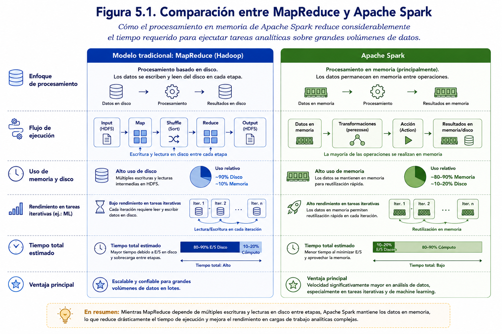
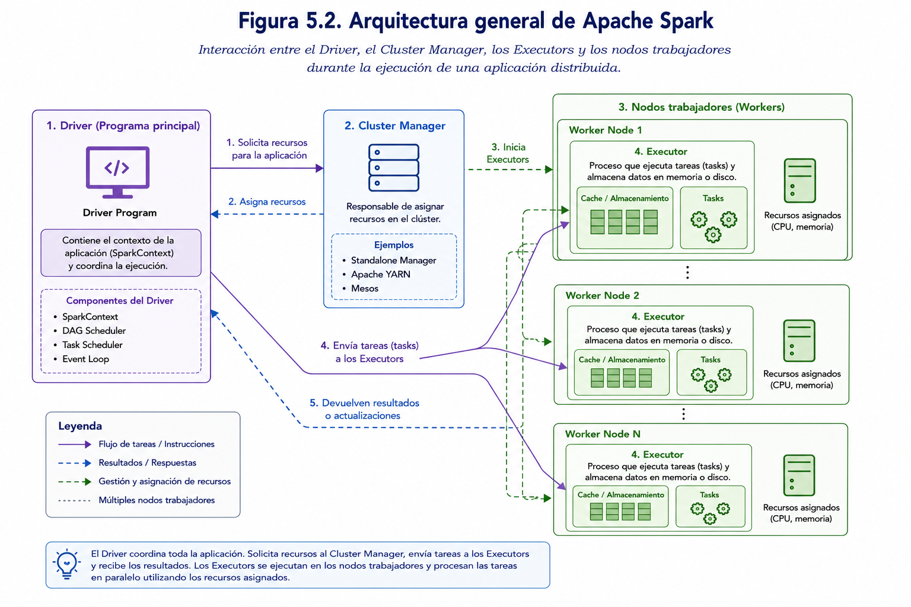
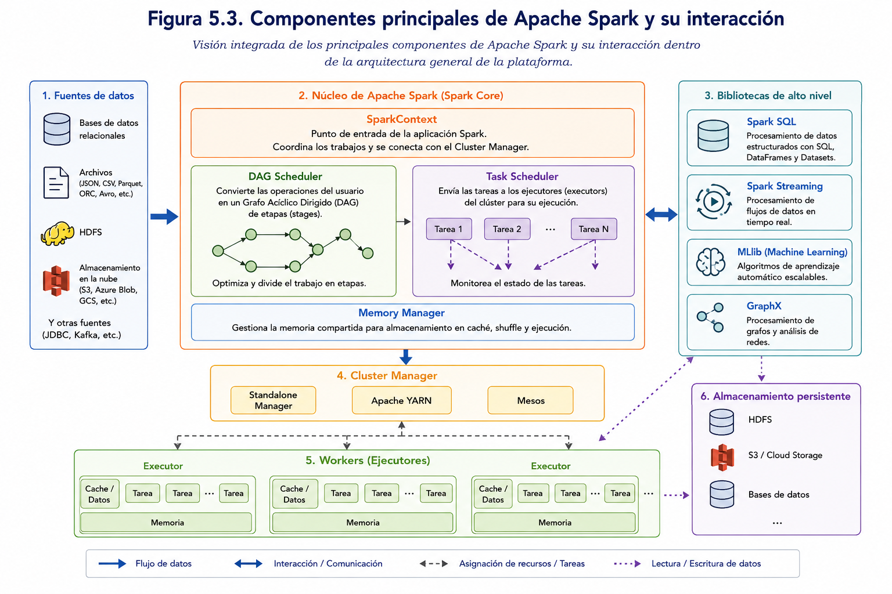
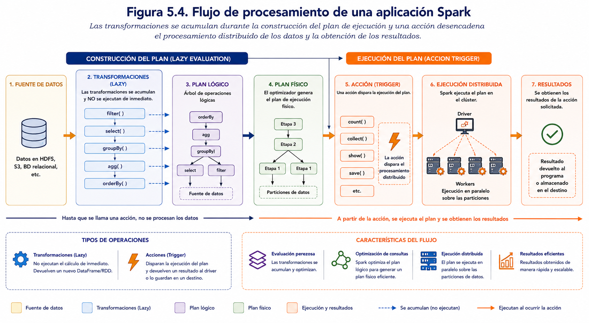
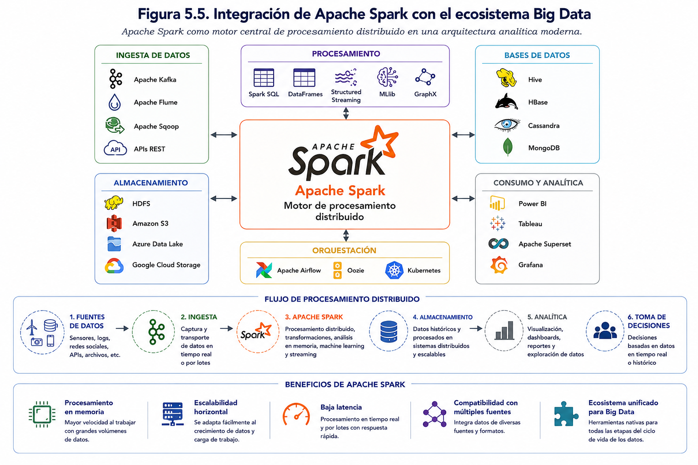
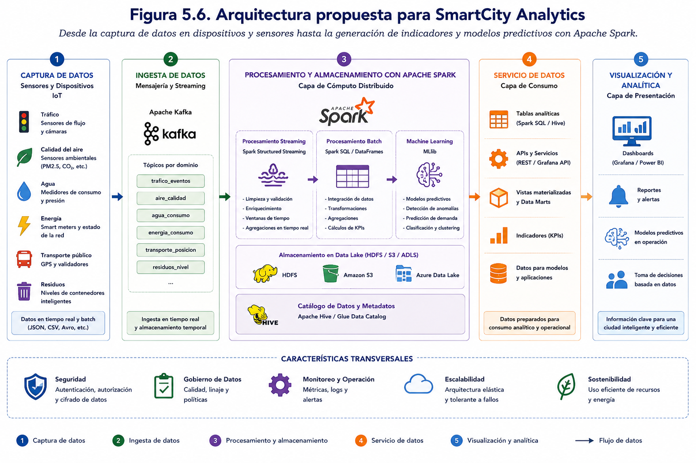

--- 


# PARTE III

# Procesamiento Distribuido

### Del almacenamiento al procesamiento masivo


---

# Capítulo 5. Apache Spark

---

## Pregunta guía 

> **¿Cómo permite Apache Spark procesar y analizar grandes volúmenes de datos de manera distribuida y eficiente, integrándose con el ecosistema Hadoop y utilizando PySpark como herramienta de desarrollo?** 

--- 

## Objetivos de aprendizaje
Al finalizar este capítulo el estudiante será capaz de: 
- Comprender el propósito de Apache Spark dentro del ecosistema Hadoop. 
- Explicar la arquitectura y el funcionamiento de Apache Spark. 
- Identificar los principales componentes de la plataforma Spark. 
- Diferenciar los conceptos de RDD, DataFrame y Dataset. 
- Comprender el modelo de procesamiento basado en transformaciones, acciones y evaluación diferida (*Lazy Evaluation*). 
- Analizar la integración de Spark con HDFS, Hive, YARN y otros componentes del ecosistema Big Data. 
- Utilizar PySpark para desarrollar aplicaciones básicas de procesamiento distribuido.

---

## Introducción

En los capítulos anteriores se estudiaron los fundamentos del ecosistema Hadoop, el funcionamiento del sistema de archivos distribuido HDFS y el uso de Apache Hive como herramienta para consultar grandes volúmenes de información mediante un lenguaje similar a SQL. Estas tecnologías permiten almacenar y organizar datos de manera eficiente; sin embargo, cuando las organizaciones requieren procesarlos rápidamente para realizar análisis complejos, entrenar modelos de aprendizaje automático o responder a eventos en tiempo real, las limitaciones del procesamiento tradicional basado en disco comienzan a hacerse evidentes.

Apache Spark surge como una plataforma de procesamiento distribuido diseñada para superar estas limitaciones. Su principal innovación consiste en mantener los datos en memoria durante la mayor parte del proceso de ejecución, reduciendo considerablemente el tiempo requerido para realizar operaciones repetitivas sobre grandes conjuntos de datos. Gracias a este enfoque, Spark puede ejecutar numerosos algoritmos entre diez y cien veces más rápido que los modelos tradicionales basados exclusivamente en MapReduce, dependiendo del tipo de procesamiento realizado.

Originalmente desarrollado en el laboratorio AMPLab de la Universidad de California, Berkeley, Apache Spark fue concebido con el propósito de ofrecer un motor de procesamiento distribuido más flexible y eficiente que MapReduce. Posteriormente, el proyecto fue transferido a la Apache Software Foundation, donde continúa evolucionando como uno de los proyectos de código abierto más utilizados en el ámbito del Big Data y la Ciencia de Datos.

A diferencia de Hadoop, Spark no reemplaza al ecosistema existente, sino que lo complementa. Mientras HDFS continúa proporcionando almacenamiento distribuido y tolerancia a fallos, Spark se encarga del procesamiento de la información almacenada, pudiendo trabajar no solo con HDFS, sino también con múltiples fuentes de datos como bases de datos relacionales, Apache Hive, Apache Kafka, servicios en la nube y sistemas de almacenamiento de objetos.

Una de las características más importantes de Apache Spark es que integra, dentro de una única plataforma, diferentes tipos de procesamiento que anteriormente requerían herramientas independientes. Con Spark es posible desarrollar procesos ETL, ejecutar consultas SQL, analizar flujos de datos en tiempo real (*streaming*), construir modelos de aprendizaje automático y realizar análisis sobre grafos sin abandonar el mismo entorno de trabajo.

Esta integración ha convertido a Apache Spark en uno de los motores de procesamiento distribuido más utilizados por organizaciones que administran grandes volúmenes de información. Empresas tecnológicas, instituciones financieras, plataformas de comercio electrónico, centros de investigación y organismos públicos utilizan Spark para analizar datos provenientes de millones de transacciones, dispositivos IoT, redes sociales, sensores industriales y sistemas corporativos, permitiendo generar información útil para la toma de decisiones en tiempos considerablemente menores que con arquitecturas tradicionales.

En el contexto de este libro, Apache Spark constituye el siguiente paso natural después del estudio de HDFS y Apache Hive. Una vez que los datos se encuentran almacenados y organizados dentro del ecosistema Hadoop, resulta necesario procesarlos eficientemente para obtener conocimiento. Durante este capítulo se estudiará la arquitectura de Spark, sus principales componentes, el modelo de procesamiento basado en **RDD**, **DataFrames** y **Datasets**, así como su integración con Hadoop y otros componentes del ecosistema Big Data. Finalmente, se desarrollará un caso práctico utilizando **PySpark**, lenguaje que actualmente representa el estándar de facto para el desarrollo de aplicaciones analíticas sobre Apache Spark.

---

## 5.2 ¿Por qué utilizar Apache Spark?

El crecimiento exponencial de los datos ha obligado a las organizaciones a replantear la forma en que procesan la información. Aunque Hadoop y el modelo MapReduce marcaron un hito en el procesamiento distribuido, su arquitectura basada en la escritura y lectura permanente desde disco presenta limitaciones cuando las tareas requieren múltiples etapas de cálculo o respuestas en tiempos reducidos.

Apache Spark fue diseñado precisamente para resolver este problema. Su principal ventaja radica en la capacidad de mantener los datos en memoria (RAM) durante gran parte de la ejecución, evitando accesos repetitivos al sistema de almacenamiento y reduciendo significativamente los tiempos de procesamiento. Este enfoque resulta especialmente beneficioso para aplicaciones analíticas, algoritmos iterativos y procesos de aprendizaje automático, donde los mismos datos son utilizados en múltiples operaciones consecutivas.

Además del rendimiento, Spark simplifica el desarrollo de aplicaciones de Big Data al integrar diversas capacidades dentro de una única plataforma. En lugar de utilizar herramientas independientes para consultas SQL, procesamiento por lotes, análisis en tiempo real o aprendizaje automático, el desarrollador puede trabajar con un único entorno y una misma interfaz de programación. Esto reduce la complejidad de las soluciones y facilita el mantenimiento de los proyectos.

Otra característica destacada es su flexibilidad para conectarse con múltiples fuentes de datos. Apache Spark puede procesar información almacenada en HDFS, Apache Hive, bases de datos relacionales, archivos CSV, JSON, Parquet, ORC, sistemas NoSQL, servicios de almacenamiento en la nube e incluso flujos continuos de datos provenientes de plataformas como Apache Kafka. Esta capacidad lo convierte en una herramienta idónea para integrar diferentes orígenes de información dentro de una misma arquitectura analítica.

Desde el punto de vista del desarrollo, Spark ofrece APIs para distintos lenguajes de programación, entre ellos Scala, Java, Python y R. En este libro se utilizará **PySpark**, la implementación de Spark para Python, debido a su amplia adopción en proyectos de Ciencia de Datos e Ingeniería de Datos, así como por su facilidad de integración con el ecosistema científico de Python.

La Tabla 5.1 resume las principales ventajas que ofrece Apache Spark frente a otros motores de procesamiento distribuido.

| Característica | Apache Spark |
|----------------|--------------|
| Procesamiento en memoria | Sí |
| Procesamiento distribuido | Sí |
| Procesamiento por lotes | Sí |
| Procesamiento en tiempo real (*Streaming*) | Sí |
| Consultas SQL | Sí (Spark SQL) |
| Aprendizaje automático | Sí (MLlib) |
| Procesamiento de grafos | Sí (GraphX) |
| Integración con Hadoop | Completa |
| Compatibilidad con múltiples fuentes de datos | Sí |

No obstante, Apache Spark no constituye la solución óptima para todos los escenarios. Debido a que aprovecha intensivamente la memoria principal, requiere nodos con una mayor cantidad de recursos que otras arquitecturas tradicionales. Asimismo, para tareas simples o conjuntos de datos de pequeño tamaño, el costo de inicializar un entorno distribuido puede superar los beneficios obtenidos, siendo más conveniente utilizar herramientas convencionales de procesamiento local.

En consecuencia, la elección de Apache Spark debe responder a las necesidades del problema que se desea resolver. Cuando el objetivo consiste en procesar grandes volúmenes de información, ejecutar algoritmos complejos, analizar datos provenientes de múltiples fuentes o construir aplicaciones analíticas escalables, Spark representa una de las plataformas más completas y eficientes disponibles en la actualidad.

La **Figura 5.1** compara el modelo tradicional de procesamiento basado en MapReduce con el enfoque utilizado por Apache Spark, destacando cómo el procesamiento en memoria reduce considerablemente el tiempo requerido para ejecutar tareas analíticas sobre grandes volúmenes de datos.

<p align="center">
  
</p>

<p align="center">
  <strong>Figura 5.1.</strong> Comparación entre el modelo tradicional de procesamiento basado en MapReduce (Hadoop) y el enfoque utilizado por Apache Spark, destacando cómo el procesamiento en memoria reduce considerablemente el tiempo requerido para ejecutar tareas analíticas sobre grandes volúmenes de datos.
</p>

---

## 5.3 Arquitectura de Apache Spark

Apache Spark está diseñado siguiendo una arquitectura distribuida que permite ejecutar aplicaciones de forma paralela sobre múltiples nodos de un clúster. En lugar de procesar toda la información en un único computador, Spark divide el trabajo en numerosas tareas que son ejecutadas simultáneamente por diferentes máquinas, coordinando posteriormente los resultados para entregar una respuesta unificada al usuario.

La arquitectura de Spark se basa en un modelo **maestro–trabajador (master–worker)**, donde un nodo principal coordina la ejecución de la aplicación y uno o más nodos trabajadores realizan el procesamiento efectivo de los datos. Este diseño permite distribuir la carga computacional, mejorar el rendimiento y garantizar la escalabilidad de la plataforma a medida que aumenta el volumen de información.

Los principales componentes que intervienen en la ejecución de una aplicación Spark son el **Driver**, el **Cluster Manager**, los **Executors** y las **Tasks**. Cada uno desempeña un rol específico dentro del procesamiento distribuido.

### Driver

El **Driver** constituye el punto de entrada de toda aplicación Spark. Es el proceso que ejecuta el programa desarrollado por el usuario y actúa como coordinador de toda la ejecución.

Entre sus principales responsabilidades se encuentran:

- crear la sesión de Spark (*SparkSession*);
- construir el plan lógico de ejecución;
- dividir el trabajo en etapas (*Stages*);
- distribuir las tareas hacia los nodos trabajadores;
- coordinar la ejecución completa de la aplicación;
- recopilar los resultados obtenidos.

En otras palabras, el Driver nunca realiza el procesamiento masivo de los datos; su función consiste en organizar y controlar todo el proceso.

### Cluster Manager

El **Cluster Manager** administra los recursos computacionales disponibles dentro del clúster.

Su función principal consiste en decidir:

- qué nodos participarán en la ejecución;
- cuánta memoria utilizará cada proceso;
- cuántos núcleos de procesamiento serán asignados;
- cuándo iniciar o finalizar los procesos de ejecución.

Apache Spark puede trabajar con distintos administradores de clúster, entre ellos:

- Spark Standalone;
- Apache Hadoop YARN;
- Apache Mesos;
- Kubernetes.

Esta flexibilidad permite integrar Spark en diferentes infraestructuras tecnológicas sin modificar el código de las aplicaciones.

### Executors

Los **Executors** son procesos que se ejecutan en los nodos trabajadores del clúster y constituyen los responsables del procesamiento efectivo de los datos.

Cada Executor recibe tareas enviadas por el Driver y realiza operaciones como:

- lectura de datos desde HDFS;
- aplicación de transformaciones;
- ejecución de cálculos;
- almacenamiento temporal de resultados en memoria;
- envío de los resultados parciales al Driver.

Un mismo nodo puede ejecutar uno o varios Executors, dependiendo de la cantidad de recursos disponibles.

### Tasks

Las **Tasks** representan la unidad mínima de trabajo dentro de Spark.

Cuando el Driver analiza una aplicación, divide el procesamiento en numerosas tareas independientes que pueden ejecutarse simultáneamente sobre distintas particiones de los datos.

Cada Task trabaja únicamente sobre una partición específica del conjunto de datos, permitiendo que cientos o incluso miles de tareas se ejecuten de manera paralela en un clúster de gran tamaño.

### Flujo general de ejecución

De forma simplificada, el procesamiento de una aplicación Spark sigue la siguiente secuencia:

1. El usuario ejecuta un programa desarrollado en PySpark.
2. El Driver crea la sesión Spark y genera el plan de ejecución.
3. El Cluster Manager asigna recursos dentro del clúster.
4. Se crean los Executors en los nodos trabajadores.
5. El Driver divide el trabajo en múltiples Tasks.
6. Cada Executor ejecuta las Tasks asignadas sobre su partición de datos.
7. Los resultados parciales son enviados nuevamente al Driver.
8. El Driver consolida los resultados y los entrega al usuario.

Gracias a esta arquitectura, Spark puede procesar grandes volúmenes de información distribuyendo automáticamente la carga de trabajo entre decenas, cientos o incluso miles de computadores, manteniendo un elevado nivel de paralelismo y tolerancia a fallos.

La **Figura 5.2** presenta la arquitectura general de Apache Spark, mostrando la interacción entre el Driver, el Cluster Manager, los Executors y los nodos trabajadores durante la ejecución de una aplicación distribuida.

<p align="center">
  
</p>

<p align="center">
  <strong>Figura 5.2.</strong> Arquitectura general de Apache Spark, mostrando la interacción entre el <em>Driver</em>, el <em>Cluster Manager</em>, los <em>Executors</em> y los nodos trabajadores (<em>Workers</em>) durante la ejecución de una aplicación distribuida, desde la asignación de recursos hasta el procesamiento paralelo y la devolución de resultados.
</p>

---

## 5.4 Componentes principales de Apache Spark

Apache Spark no es únicamente un motor de procesamiento distribuido, sino una plataforma completa para el análisis de grandes volúmenes de datos. Una de sus principales fortalezas radica en integrar diferentes bibliotecas especializadas dentro de un mismo ecosistema, permitiendo desarrollar aplicaciones analíticas sin necesidad de utilizar herramientas independientes para cada tipo de procesamiento.

Actualmente, Apache Spark se organiza en torno a cinco componentes principales: **Spark Core**, **Spark SQL**, **Spark Streaming**, **MLlib** y **GraphX**. Cada uno de ellos aborda un tipo específico de problema, aunque todos comparten la misma arquitectura distribuida y pueden utilizarse de manera integrada dentro de una aplicación.

### Spark Core

Spark Core constituye el núcleo de toda la plataforma y es responsable de las funciones fundamentales de procesamiento distribuido.

Entre sus principales responsabilidades se encuentran:

- administración de memoria;
- planificación de tareas;
- comunicación entre nodos;
- tolerancia a fallos;
- programación de trabajos distribuidos;
- operaciones sobre RDD.

Todos los demás módulos de Spark se apoyan sobre Spark Core para ejecutar sus operaciones.

Además, Spark Core proporciona las primitivas necesarias para realizar transformaciones y acciones sobre los datos, permitiendo distribuir automáticamente el procesamiento entre múltiples nodos del clúster.

---

### Spark SQL

Spark SQL incorpora capacidades de consulta estructurada sobre grandes conjuntos de datos.

Este componente permite trabajar con información almacenada en formatos como:

- CSV;
- JSON;
- Parquet;
- ORC;
- Avro;
- Apache Hive;
- bases de datos relacionales.

Spark SQL utiliza el concepto de **DataFrame**, una estructura tabular similar a una tabla de base de datos, que facilita el procesamiento de datos estructurados y semiestructurados mediante una sintaxis sencilla y altamente optimizada.

Asimismo, permite ejecutar consultas utilizando SQL estándar, integrando el procesamiento distribuido con un lenguaje ampliamente conocido por analistas y desarrolladores.

---

### Spark Streaming

Muchas organizaciones necesitan analizar información inmediatamente después de que esta es generada.

Ejemplos de ello incluyen:

- sensores IoT;
- transacciones bancarias;
- redes sociales;
- monitoreo industrial;
- plataformas de comercio electrónico.

Spark Streaming proporciona mecanismos para procesar estos flujos continuos de datos prácticamente en tiempo real, permitiendo construir aplicaciones capaces de reaccionar rápidamente frente a eventos relevantes.

En las versiones actuales de Spark, esta funcionalidad se implementa principalmente mediante **Structured Streaming**, el cual aprovecha las mismas optimizaciones utilizadas por Spark SQL y los DataFrames.

---

### MLlib

MLlib es la biblioteca de aprendizaje automático de Apache Spark.

Proporciona algoritmos distribuidos para desarrollar modelos predictivos sobre grandes volúmenes de información sin necesidad de trasladar los datos hacia una única máquina.

Entre las tareas soportadas se encuentran:

- clasificación;
- regresión;
- agrupamiento (*clustering*);
- recomendación;
- reducción de dimensionalidad;
- evaluación de modelos;
- ingeniería de características.

Gracias a su arquitectura distribuida, MLlib puede entrenar modelos utilizando conjuntos de datos considerablemente mayores que aquellos que pueden procesarse en memoria en un computador individual.

---

### GraphX

Algunos problemas requieren representar la información mediante grafos en lugar de tablas.

Ejemplos típicos incluyen:

- redes sociales;
- relaciones entre organizaciones;
- redes de transporte;
- redes eléctricas;
- análisis de fraude;
- sistemas de recomendación.

GraphX proporciona estructuras y algoritmos especializados para representar vértices y relaciones, facilitando el análisis de redes complejas mediante procesamiento distribuido.

Aunque actualmente su utilización es menor que la de Spark SQL o MLlib, continúa siendo una herramienta importante para aplicaciones donde las relaciones entre entidades constituyen el elemento principal del análisis.

---

### Integración de los componentes

Una característica distintiva de Apache Spark es que todos estos componentes funcionan sobre la misma infraestructura distribuida.

Por ejemplo, una organización puede desarrollar un flujo analítico donde:

1. Spark SQL extrae información desde Apache Hive.
2. Spark Streaming incorpora nuevos datos provenientes de Apache Kafka.
3. MLlib construye un modelo predictivo utilizando toda la información disponible.
4. Finalmente, los resultados son almacenados nuevamente en HDFS para su posterior análisis mediante herramientas de Inteligencia de Negocios.

Esta integración reduce considerablemente la complejidad de las soluciones Big Data y evita la necesidad de migrar continuamente los datos entre distintas plataformas.

La **Figura 5.3** presenta una visión integrada de los principales componentes de Apache Spark y su interacción dentro de la arquitectura general de la plataforma.

<p align="center">
  
</p>

<p align="center">
  <strong>Figura 5.3.</strong> Visión integrada de los principales componentes de Apache Spark y su interacción dentro de la arquitectura general de la plataforma, mostrando el flujo de datos entre las fuentes de información, el núcleo de procesamiento (Spark Core), las bibliotecas de alto nivel, el gestor del clúster, los ejecutores (<em>workers</em>) y los mecanismos de almacenamiento persistente.
</p>

---

## 5.5 Modelo de procesamiento de datos

Una de las principales diferencias entre Apache Spark y otros motores de procesamiento distribuido radica en la forma en que organiza y ejecuta las operaciones sobre los datos. En lugar de procesar cada instrucción de manera independiente, Spark construye un plan de ejecución optimizado que agrupa las operaciones antes de enviarlas al clúster. Este modelo permite reducir operaciones innecesarias, aprovechar el procesamiento en memoria y ejecutar múltiples tareas en paralelo.

A lo largo de su evolución, Apache Spark ha incorporado diferentes estructuras para representar los datos. Inicialmente, el modelo se basaba exclusivamente en los **RDD (Resilient Distributed Datasets)**. Posteriormente se introdujeron los **DataFrames** y, más adelante, los **Datasets**, proporcionando niveles crecientes de optimización, facilidad de programación y rendimiento.

### RDD (Resilient Distributed Dataset)

El **RDD** constituye la estructura de datos original de Apache Spark y representa una colección distribuida e inmutable de elementos que pueden procesarse de forma paralela.

Cada RDD se divide automáticamente en múltiples particiones, las cuales son distribuidas entre los nodos del clúster para su procesamiento simultáneo.

Entre sus principales características destacan:

- distribución automática de los datos;
- tolerancia a fallos mediante reconstrucción de particiones;
- procesamiento paralelo;
- evaluación diferida (*Lazy Evaluation*);
- inmutabilidad.

Aunque los RDD continúan siendo una parte fundamental de Spark, actualmente se utilizan principalmente en aplicaciones que requieren un control muy fino sobre el procesamiento distribuido.

---

### DataFrames

Los **DataFrames** representan actualmente la estructura de datos más utilizada en Apache Spark.

Conceptualmente, un DataFrame puede entenderse como una tabla distribuida compuesta por filas y columnas, similar a una tabla de una base de datos relacional o a un DataFrame de la biblioteca Pandas de Python.

Sin embargo, a diferencia de estas herramientas, los DataFrames de Spark se encuentran distribuidos entre múltiples nodos del clúster y pueden contener miles de millones de registros.

Entre sus principales ventajas se encuentran:

- esquema definido de columnas;
- optimización automática mediante el optimizador Catalyst;
- ejecución distribuida;
- integración con Spark SQL;
- menor cantidad de código respecto al uso de RDD.

Actualmente, la mayoría de las aplicaciones desarrolladas con PySpark utilizan DataFrames como estructura principal de trabajo.

---

### Datasets

Los **Datasets** constituyen una evolución de los DataFrames, incorporando tipado fuerte (*strong typing*) para mejorar la seguridad durante la compilación de las aplicaciones.

Esta estructura combina la eficiencia de los DataFrames con la flexibilidad de los RDD.

No obstante, en el entorno de **PySpark** los Datasets no se encuentran implementados como una API independiente, por lo que el trabajo práctico desarrollado en este libro utilizará exclusivamente DataFrames.

---

### Transformaciones

Las **transformaciones** corresponden a operaciones que generan un nuevo conjunto de datos a partir de otro existente.

Una característica fundamental es que **no ejecutan inmediatamente el procesamiento**, sino que únicamente registran las operaciones que deberán realizarse posteriormente.

Algunos ejemplos de transformaciones son:

- `select()`
- `filter()`
- `where()`
- `groupBy()`
- `join()`
- `orderBy()`
- `withColumn()`
- `drop()`

Cada transformación produce un nuevo DataFrame, manteniendo inalterado el conjunto de datos original.

---

### Acciones

Las **acciones** representan las operaciones que efectivamente ejecutan el procesamiento distribuido.

Cuando Spark encuentra una acción, analiza todas las transformaciones acumuladas, construye el plan físico de ejecución y distribuye las tareas entre los nodos del clúster.

Entre las acciones más utilizadas se encuentran:

- `show()`
- `collect()`
- `count()`
- `first()`
- `take()`
- `write()`
- `save()`

Es únicamente en este momento cuando Spark accede a los datos almacenados en HDFS o en cualquier otra fuente de información.

---

### Evaluación diferida (*Lazy Evaluation*)

Una de las características más importantes de Apache Spark es el mecanismo denominado **Lazy Evaluation** o **evaluación diferida**.

En lugar de ejecutar inmediatamente cada instrucción escrita por el programador, Spark registra todas las transformaciones en un **grafo de dependencias** (*Directed Acyclic Graph, DAG*). Solo cuando aparece una acción, el motor analiza el conjunto completo de operaciones y determina la estrategia más eficiente para ejecutarlas.

Este enfoque ofrece múltiples ventajas:

- elimina operaciones redundantes;
- optimiza el orden de ejecución;
- reduce el movimiento de datos entre nodos;
- mejora el aprovechamiento de la memoria;
- incrementa el rendimiento general de la aplicación.

Gracias a este mecanismo, Spark puede ejecutar procesos complejos con una eficiencia considerablemente superior a la obtenida mediante arquitecturas tradicionales de procesamiento secuencial.

En la práctica, el desarrollador escribe una secuencia de transformaciones sobre un DataFrame, pero el procesamiento real no comienza hasta que solicita un resultado mediante una acción. Esta separación entre la definición del flujo de trabajo y su ejecución constituye uno de los principios fundamentales del modelo de programación de Apache Spark.

La **Figura 5.4** ilustra el flujo de procesamiento de una aplicación Spark, mostrando cómo las transformaciones se acumulan durante la construcción del plan de ejecución y cómo la aparición de una acción desencadena el procesamiento distribuido de los datos y la obtención de los resultados.

<p align="center">
  
</p>

<p align="center">
  <strong>Figura 5.4.</strong> Flujo de procesamiento de una aplicación Spark, donde las transformaciones se acumulan durante la construcción del plan de ejecución y una acción desencadena el procesamiento distribuido de los datos y la obtención de los resultados.
</p>

---

## 5.6 Integración entre Spark y el ecosistema Hadoop

Una de las principales fortalezas de Apache Spark es su capacidad para integrarse de forma nativa con los distintos componentes del ecosistema Hadoop. Aunque Spark puede ejecutarse de manera independiente, en la práctica suele formar parte de arquitecturas Big Data donde comparte funciones con herramientas especializadas en almacenamiento, administración de recursos, consultas analíticas, procesamiento de flujos de datos y bases de datos distribuidas.

Esta integración permite construir soluciones completas para el procesamiento masivo de información, aprovechando las capacidades específicas de cada tecnología sin necesidad de duplicar datos o desarrollar mecanismos complejos de interoperabilidad.

### Integración con HDFS

La integración más común de Spark es con el **Hadoop Distributed File System (HDFS)**.

En este escenario, HDFS actúa como sistema de almacenamiento distribuido, mientras que Spark se encarga del procesamiento de los datos almacenados.

El flujo general de trabajo consiste en:

1. Los datos son almacenados en HDFS.
2. Spark accede directamente a los bloques distribuidos.
3. Cada Executor procesa las particiones asignadas.
4. Los resultados pueden almacenarse nuevamente en HDFS.

Este modelo permite aprovechar la escalabilidad de HDFS junto con la velocidad de procesamiento de Spark.

---

### Integración con YARN

En numerosos clústeres Hadoop, la administración de recursos es realizada por **YARN (Yet Another Resource Negotiator)**.

En esta configuración:

- YARN administra la memoria y los núcleos disponibles.
- Spark solicita recursos para ejecutar la aplicación.
- YARN crea los procesos necesarios en los nodos del clúster.
- Spark utiliza dichos recursos para ejecutar las tareas distribuidas.

De esta forma, múltiples aplicaciones pueden compartir la infraestructura de procesamiento de manera eficiente.

---

### Integración con Apache Hive

Spark también puede trabajar directamente con las bases de datos y tablas administradas por Apache Hive.

Gracias al **Hive Metastore**, Spark puede acceder a:

- bases de datos;
- tablas administradas;
- tablas externas;
- particiones;
- esquemas de los datos.

Esto permite ejecutar consultas utilizando Spark SQL sin necesidad de recrear las estructuras previamente definidas en Hive.

Por ejemplo, una organización puede almacenar sus datos en tablas Hive y posteriormente procesarlos mediante PySpark para construir modelos predictivos o generar indicadores analíticos.

---

### Integración con Apache Kafka

Muchas aplicaciones modernas requieren analizar información en tiempo real.

En estos casos, Apache Spark puede integrarse con **Apache Kafka**, plataforma especializada en transmisión de eventos (*streaming*).

El flujo general es el siguiente:

1. Los dispositivos o aplicaciones generan eventos.
2. Kafka recibe y distribuye dichos eventos.
3. Spark Structured Streaming consume la información.
4. Los datos son procesados prácticamente en tiempo real.
5. Los resultados pueden almacenarse nuevamente en HDFS o visualizarse mediante dashboards.

Esta integración resulta especialmente útil en aplicaciones IoT, monitoreo industrial, comercio electrónico y análisis financiero.

---

### Integración con bases de datos

Spark incorpora conectores que permiten leer y escribir información desde diversos sistemas gestores de bases de datos.

Entre ellos destacan:

- PostgreSQL;
- MySQL;
- SQL Server;
- Oracle;
- MariaDB.

Asimismo, puede trabajar con sistemas NoSQL como:

- MongoDB;
- Cassandra;
- HBase.

Esta capacidad facilita la integración entre plataformas transaccionales y entornos analíticos.

---

### Integración con almacenamiento en la nube

En arquitecturas modernas, los datos no siempre se almacenan en HDFS.

Apache Spark puede acceder directamente a servicios de almacenamiento en la nube, entre ellos:

- Amazon S3;
- Azure Data Lake Storage;
- Google Cloud Storage.

Gracias a esta flexibilidad, Spark puede ejecutarse tanto en centros de datos tradicionales como en plataformas completamente basadas en servicios cloud.

---

### Integración con herramientas de Inteligencia de Negocios

Una vez procesados los datos, los resultados generados por Spark pueden ser utilizados por herramientas de análisis y visualización.

Entre las más utilizadas se encuentran:

- Microsoft Power BI;
- Tableau;
- Apache Superset;
- Looker.

En estos escenarios, Spark actúa como motor de procesamiento y preparación de datos, mientras que las plataformas de Inteligencia de Negocios permiten construir dashboards e indicadores para apoyar la toma de decisiones.

---

### Una plataforma para todo el ciclo analítico

La capacidad de integrarse con múltiples tecnologías convierte a Apache Spark en uno de los componentes centrales de una arquitectura Big Data moderna.

Un flujo típico de procesamiento puede seguir las siguientes etapas:

1. Los datos son capturados desde diversas fuentes.
2. Se almacenan en HDFS o en la nube.
3. Spark realiza procesos ETL y análisis distribuidos.
4. Los resultados son enriquecidos mediante modelos de aprendizaje automático.
5. Finalmente, la información procesada es publicada en plataformas de Inteligencia de Negocios para apoyar la toma de decisiones.

Esta integración permite construir soluciones escalables, reutilizables y altamente eficientes, aprovechando las fortalezas de cada componente del ecosistema Hadoop sin perder la coherencia de la arquitectura global.

La **Figura 5.5** resume la integración de Apache Spark con los principales componentes del ecosistema Big Data, destacando su papel como motor central de procesamiento distribuido dentro de una arquitectura analítica moderna.

<p align="center">
  
</p>

<p align="center">
  <strong>Figura 5.5.</strong> Integración de Apache Spark con los principales componentes del ecosistema Big Data, destacando su función como motor central de procesamiento distribuido dentro de una arquitectura analítica moderna.
</p>

---

## 5.7 Caso de estudio: SmartCity Analytics con Apache Spark

### Contexto

Las ciudades inteligentes (*Smart Cities*) generan diariamente enormes volúmenes de información provenientes de múltiples fuentes, tales como sensores ambientales, cámaras de vigilancia, sistemas de transporte público, dispositivos IoT, aplicaciones móviles, medidores inteligentes y plataformas de servicios ciudadanos.

El procesamiento de estos datos permite comprender el comportamiento de la ciudad en tiempo casi real, optimizar la gestión de los recursos públicos y apoyar la toma de decisiones basada en evidencia. Sin embargo, la magnitud y velocidad de generación de esta información hacen inviable su análisis utilizando herramientas tradicionales.

En este contexto, Apache Spark constituye una plataforma idónea para desarrollar soluciones analíticas capaces de procesar grandes volúmenes de datos distribuidos de forma eficiente y escalable.

---

### Problema

Una municipalidad desea mejorar la movilidad urbana utilizando información proveniente de distintos sistemas tecnológicos.

Para ello dispone de datos provenientes de:

- sensores de tráfico instalados en las principales avenidas;
- dispositivos GPS de la flota de transporte público;
- estaciones meteorológicas;
- registros históricos de accidentes de tránsito;
- eventos masivos programados por la ciudad;
- cámaras inteligentes que contabilizan flujo vehicular.

El objetivo consiste en identificar patrones de congestión, predecir condiciones de tráfico y apoyar la planificación de medidas de mitigación.

---

### Arquitectura propuesta

La solución considera una arquitectura basada en el ecosistema Hadoop y Apache Spark.

El flujo general es el siguiente:

1. Los sensores generan datos continuamente.
2. La información es almacenada en HDFS.
3. Spark procesa los datos mediante DataFrames distribuidos.
4. Spark SQL integra información histórica y operacional.
5. MLlib construye modelos predictivos de congestión.
6. Los resultados son publicados en un dashboard para apoyar la toma de decisiones.

Este enfoque permite analizar simultáneamente información histórica y datos generados en tiempo casi real.

---

### Procesamiento distribuido

Durante el procesamiento, Spark realiza diversas operaciones sobre millones de registros.

Entre ellas destacan:

- eliminación de registros incompletos;
- integración de distintas fuentes de información;
- cálculo de velocidades promedio;
- detección de zonas críticas;
- agregación temporal por hora, día o semana;
- generación de indicadores de movilidad.

Cada una de estas tareas es distribuida automáticamente entre los distintos nodos del clúster, reduciendo significativamente el tiempo total de procesamiento.

---

### Aplicación de Spark SQL

Una parte importante del análisis consiste en responder consultas de negocio.

Por ejemplo:

- ¿Cuáles son las intersecciones con mayor congestión durante las horas punta?
- ¿Cómo afecta la lluvia al tiempo promedio de desplazamiento?
- ¿Qué comunas presentan mayores niveles de saturación vial?
- ¿Qué días de la semana registran más incidentes?

Estas consultas pueden ejecutarse mediante Spark SQL sobre DataFrames distribuidos, obteniendo resultados incluso cuando la información corresponde a cientos de millones de registros.

---

### Incorporación de aprendizaje automático

Una vez preparados los datos, MLlib permite desarrollar modelos predictivos que apoyen la gestión de la ciudad.

Entre las aplicaciones posibles se encuentran:

- predicción de congestión vehicular;
- estimación de tiempos de viaje;
- clasificación de zonas de alto riesgo;
- detección de anomalías en sensores;
- predicción de demanda de transporte público.

Estos modelos pueden entrenarse utilizando información histórica y posteriormente actualizarse de manera periódica conforme ingresan nuevos datos al sistema.

---

### Beneficios obtenidos

La utilización de Apache Spark aporta diversas ventajas para este tipo de proyectos.

Desde el punto de vista técnico:

- procesamiento paralelo sobre múltiples servidores;
- reducción significativa de los tiempos de análisis;
- integración con diversas fuentes de datos;
- escalabilidad horizontal;
- reutilización de una única plataforma para ETL, consultas SQL y modelos predictivos.

Desde la perspectiva de la gestión pública:

- mejor planificación del transporte urbano;
- optimización de los tiempos de respuesta ante incidentes;
- utilización más eficiente de la infraestructura vial;
- apoyo a la toma de decisiones basada en datos;
- mejora en la calidad de los servicios ofrecidos a la ciudadanía.

---

### Relación con los contenidos del capítulo

Este caso de estudio integra los principales conceptos desarrollados en el presente capítulo.

Durante la solución participan:

- la arquitectura distribuida de Spark;
- los DataFrames como estructura principal de procesamiento;
- las transformaciones y acciones para preparar la información;
- Spark SQL para el análisis de datos estructurados;
- MLlib para construir modelos predictivos;
- la integración con HDFS como sistema de almacenamiento distribuido.

En conjunto, estos componentes permiten implementar una plataforma analítica capaz de transformar grandes volúmenes de datos en información útil para apoyar decisiones estratégicas dentro del contexto de una ciudad inteligente.

La **Figura 5.6** presenta una visión general de la arquitectura propuesta para el caso **SmartCity Analytics**, mostrando el flujo completo desde la captura de datos mediante sensores hasta la generación de indicadores y modelos predictivos utilizando Apache Spark.

<p align="center">
  
</p>

<p align="center">
  <strong>Figura 5.6.</strong> Arquitectura propuesta para el caso <em>SmartCity Analytics</em>, mostrando el flujo completo desde la captura de datos mediante sensores y dispositivos IoT hasta la generación de indicadores y modelos predictivos utilizando Apache Spark.
</p>

---

## 5.8 Resumen

Apache Spark se ha consolidado como una de las plataformas más importantes para el procesamiento distribuido de grandes volúmenes de datos. Su capacidad para ejecutar operaciones en memoria, junto con su arquitectura escalable y su integración con el ecosistema Hadoop, permite desarrollar soluciones analíticas de alto rendimiento para organizaciones que requieren procesar información de manera eficiente.

A diferencia del modelo tradicional basado en MapReduce, Spark optimiza la ejecución de los procesos mediante la evaluación diferida (*Lazy Evaluation*) y la construcción automática de planes de ejecución, reduciendo el movimiento innecesario de datos y aprovechando al máximo los recursos computacionales disponibles.

Durante este capítulo se revisó la arquitectura general de Spark, identificando el papel del **Driver**, el **Cluster Manager**, los **Executors** y las **Tasks** dentro del procesamiento distribuido. Asimismo, se analizaron los principales componentes de la plataforma, comprendiendo cómo Spark Core, Spark SQL, Spark Streaming, MLlib y GraphX permiten abordar distintos tipos de problemas utilizando una infraestructura común.

También se estudiaron las principales estructuras de datos utilizadas por Spark. Los **RDD** representan el modelo original de procesamiento distribuido, mientras que los **DataFrames** constituyen actualmente la alternativa más utilizada gracias a sus capacidades de optimización y facilidad de programación. Se revisaron además los conceptos de **transformaciones**, **acciones** y **evaluación diferida**, fundamentales para comprender el funcionamiento interno del motor de ejecución de Spark.

Posteriormente, se analizó la integración de Spark con el ecosistema Hadoop, destacando su interacción con HDFS, YARN, Hive, Kafka, bases de datos relacionales, sistemas NoSQL y plataformas de almacenamiento en la nube. Esta interoperabilidad convierte a Spark en un componente central dentro de las arquitecturas Big Data modernas.

Finalmente, el caso de estudio **SmartCity Analytics** permitió visualizar la aplicación práctica de los conceptos desarrollados en el capítulo, mostrando cómo Apache Spark puede integrarse en proyectos de ciudades inteligentes para procesar información proveniente de múltiples fuentes, generar indicadores analíticos y construir modelos predictivos que apoyen la toma de decisiones.

Con los conocimientos adquiridos en este capítulo, el lector dispone de las bases conceptuales necesarias para comenzar a desarrollar aplicaciones distribuidas utilizando PySpark. En el siguiente capítulo se abordarán los fundamentos de la programación con Spark, trabajando directamente con DataFrames, operaciones de transformación y acciones mediante ejemplos prácticos que servirán como punto de partida para el desarrollo de soluciones analíticas sobre grandes volúmenes de datos.

---

# 5.9 Actividades

Las siguientes actividades tienen como propósito consolidar los conceptos desarrollados en este capítulo, promoviendo la comprensión de la arquitectura de Apache Spark y su aplicación en escenarios reales de procesamiento distribuido. Se recomienda responder utilizando los contenidos revisados en el capítulo y complementar, cuando corresponda, con la documentación oficial de Apache Spark.

---

## Actividad 5.1. Comprensión conceptual

Responda las siguientes preguntas de desarrollo.

1. Explique por qué Apache Spark surgió como una evolución respecto del modelo MapReduce.

2. Describa las principales ventajas del procesamiento en memoria utilizado por Spark.

3. ¿Cuál es la función del Driver dentro de una aplicación Spark?

4. ¿Qué diferencia existe entre un Executor y una Task?

5. Explique el rol que desempeña el Cluster Manager durante la ejecución de una aplicación.

---

## Actividad 5.2. Componentes de Spark

Complete la siguiente tabla indicando la función principal de cada componente.

| Componente | Función principal |
|------------|-------------------|
| Spark Core | |
| Spark SQL | |
| Spark Streaming | |
| MLlib | |
| GraphX | |

---

## Actividad 5.3. Transformaciones y acciones

Clasifique las siguientes operaciones indicando si corresponden a una **Transformación** o una **Acción**.

| Operación | Tipo |
|-----------|------|
| `filter()` | |
| `count()` | |
| `select()` | |
| `show()` | |
| `groupBy()` | |
| `collect()` | |
| `withColumn()` | |
| `write()` | |

Posteriormente, explique por qué Spark no ejecuta inmediatamente las transformaciones.

---

## Actividad 5.4. Integración con Hadoop

Observe la siguiente situación.

Una empresa almacena sus datos históricos en HDFS, mantiene información estructurada mediante Apache Hive y recibe continuamente eventos desde Apache Kafka.

Responda:

1. ¿Qué función desempeña HDFS dentro de esta arquitectura?

2. ¿Cómo utiliza Spark la información almacenada en Hive?

3. ¿Cuál es el papel de Kafka?

4. ¿Por qué resulta conveniente utilizar Spark como plataforma central de procesamiento?

---

## Actividad 5.5. Análisis del caso SmartCity Analytics

A partir del caso presentado en la Sección 5.7, responda las siguientes preguntas.

1. ¿Cuáles son las principales fuentes de datos utilizadas por la ciudad inteligente?

2. ¿Qué ventajas aporta el procesamiento distribuido frente a un procesamiento tradicional?

3. ¿Qué tareas podrían resolverse utilizando Spark SQL?

4. ¿Qué tipo de problemas podrían abordarse mediante MLlib?

5. Proponga otro ámbito de aplicación donde Apache Spark pueda generar valor para una organización.

---

## Actividad 5.6. Reflexión

Lea la siguiente afirmación:

> "Apache Spark no reemplaza completamente a Hadoop; ambos forman parte de un mismo ecosistema de procesamiento de datos."

Redacte una reflexión de aproximadamente una página donde explique el significado de esta afirmación, incorporando los conceptos de HDFS, YARN, Spark SQL y procesamiento distribuido revisados en este capítulo.

---

# 5.10 Laboratorio 

## 5.1: Procesamiento distribuido con Apache Spark utilizando PySpark

## Objetivos de aprendizaje

Al finalizar este laboratorio, el estudiante será capaz de:

- configurar un entorno básico de trabajo con Apache Spark y PySpark;
- crear una sesión de Spark (*SparkSession*);
- cargar conjuntos de datos utilizando DataFrames;
- aplicar transformaciones y acciones sobre datos distribuidos;
- comprender el funcionamiento de la evaluación diferida (*Lazy Evaluation*);
- interpretar el comportamiento de Spark durante la ejecución de un proceso distribuido.

---

## Contexto

Una empresa de comercio electrónico desea comenzar a analizar la información histórica de sus ventas utilizando Apache Spark. Para ello dispone de un archivo CSV que contiene las ventas realizadas durante un período determinado.

El objetivo consiste en explorar la información y generar algunos indicadores básicos que permitan comprender el funcionamiento del procesamiento distribuido mediante DataFrames.

---

## Recursos necesarios

- Docker Desktop.
- Repositorio oficial del curso:
  
  https://github.com/juliopez/Hadoop

- Ambiente Docker con Apache Spark.
- Jupyter Notebook incluido en el entorno.
- Python 3.
- PySpark.

---

## Dataset

Se utilizará el archivo:

```
ventas.csv
```

El conjunto de datos contiene los siguientes atributos:

| Campo | Descripción |
|--------|-------------|
| id_venta | Identificador de la venta |
| fecha | Fecha de la venta |
| ciudad | Ciudad donde se realizó la venta |
| categoria | Categoría del producto |
| producto | Nombre del producto |
| cantidad | Cantidad vendida |
| precio | Precio unitario |

---

# Parte 1. Creación de la sesión Spark

Crear una nueva sesión utilizando PySpark.

```python
from pyspark.sql import SparkSession

spark = SparkSession.builder \
    .appName("Laboratorio5") \
    .getOrCreate()
```

Verificar la versión instalada.

```python
spark.version
```

---

# Parte 2. Carga del conjunto de datos

Cargar el archivo CSV.

```python
ventas = spark.read.csv(
    "ventas.csv",
    header=True,
    inferSchema=True
)
```

Visualizar los primeros registros.

```python
ventas.show()
```

---

# Parte 3. Exploración del DataFrame

Visualizar la estructura del conjunto de datos.

```python
ventas.printSchema()
```

Obtener la cantidad de registros.

```python
ventas.count()
```

Visualizar únicamente algunas columnas.

```python
ventas.select(
    "producto",
    "cantidad",
    "precio"
).show()
```

---

# Parte 4. Aplicación de transformaciones

Filtrar únicamente las ventas correspondientes a la categoría Tecnología.

```python
tecnologia = ventas.filter(
    ventas.categoria == "Tecnología"
)
```

Visualizar los resultados.

```python
tecnologia.show()
```

Ordenar por cantidad vendida.

```python
ventas.orderBy(
    ventas.cantidad.desc()
).show()
```

---

# Parte 5. Agrupación de datos

Calcular el total de ventas por ciudad.

```python
from pyspark.sql.functions import sum

ventas.groupBy("ciudad") \
      .agg(sum("cantidad")) \
      .show()
```

Calcular el monto promedio por categoría.

```python
from pyspark.sql.functions import avg

ventas.groupBy("categoria") \
      .agg(avg("precio")) \
      .show()
```

---

# Parte 6. Creación de una nueva columna

Agregar el monto total de cada venta.

```python
from pyspark.sql.functions import col

ventas = ventas.withColumn(
    "total",
    col("cantidad") * col("precio")
)
```

Visualizar los resultados.

```python
ventas.show()
```

---

# Parte 7. Comprendiendo la evaluación diferida

Ejecutar el siguiente código.

```python
resultado = ventas.filter(
    ventas.cantidad > 10
).select(
    "producto",
    "cantidad"
)
```

Responder:

- ¿Se ejecutó realmente alguna operación sobre los datos?

Posteriormente ejecutar:

```python
resultado.show()
```

Responder:

- ¿En qué momento comenzó realmente el procesamiento?

---

# Parte 8. Guardado del resultado

Guardar el DataFrame generado.

```python
resultado.write.mode("overwrite").csv(
    "resultado"
)
```

Verificar que Spark creó automáticamente múltiples archivos dentro del directorio de salida.

---

# Actividades de análisis

Responda las siguientes preguntas.

1. ¿Qué diferencia existe entre un DataFrame y un RDD?

2. ¿Qué operaciones del laboratorio corresponden a transformaciones?

3. ¿Qué operaciones corresponden a acciones?

4. ¿Qué ventaja ofrece la evaluación diferida en Apache Spark?

5. ¿Por qué Spark genera múltiples archivos al guardar un DataFrame?

6. ¿Qué ocurriría si el conjunto de datos contuviera cientos de millones de registros?

7. ¿Qué ventajas ofrece el procesamiento distribuido frente al procesamiento tradicional realizado en un único computador?

---

# Desafío

Realice las siguientes tareas utilizando únicamente PySpark.

1. Calcule el monto total vendido por cada producto.

2. Determine la ciudad con mayor volumen de ventas.

3. Identifique los cinco productos con mayor cantidad vendida.

4. Cree una nueva columna denominada **IVA**, correspondiente al 19% del monto total.

5. Guarde el resultado final en formato Parquet.

---

## Entregables

Cada estudiante deberá entregar:

- Notebook de Jupyter (`.ipynb`) con el desarrollo completo.
- Capturas de pantalla que evidencien la ejecución del laboratorio.
- Archivo Parquet generado.
- Documento breve (máximo dos páginas) donde explique:
  - las transformaciones realizadas;
  - las acciones ejecutadas;
  - el comportamiento observado respecto a la evaluación diferida;
  - las principales ventajas del procesamiento distribuido utilizando Apache Spark.
  
---

### Consulta rápida

Como complemento a los contenidos desarrollados en este capítulo, al final del mismo se incorpora el **[Anexo C. Principales comandos de Apache Spark (PySpark)](#anexo-c-spark.md)**, el cual reúne las instrucciones más utilizadas durante el desarrollo de aplicaciones con Apache Spark. Este material constituye una guía de consulta rápida para la creación de sesiones de trabajo, manipulación de DataFrames, transformaciones, acciones, consultas mediante Spark SQL, lectura y escritura de datos, así como la ejecución de aplicaciones utilizando `spark-submit`. Se recomienda utilizar este anexo como apoyo permanente durante la realización de los laboratorios y proyectos del curso.

---

# 5.11 Lecturas recomendadas

Las siguientes referencias permiten profundizar los contenidos desarrollados en este capítulo. Se recomienda comenzar por la documentación oficial de Apache Spark, ya que constituye la fuente primaria de consulta para comprender la evolución de la plataforma, sus componentes y las mejores prácticas de desarrollo con PySpark.

---

## Documentación oficial

Apache Spark Project. (s.f.). *Apache Spark Documentation*.

https://spark.apache.org/docs/latest/

Documentación oficial de Apache Spark que incluye guías de instalación, arquitectura, programación con PySpark, Spark SQL, Structured Streaming, MLlib y GraphX.

---

Apache Spark Project. (s.f.). *PySpark Documentation*.

https://spark.apache.org/docs/latest/api/python/

Manual oficial de programación utilizando PySpark, con ejemplos y descripción completa de las principales clases y funciones.

---

## Libros

Karau, H., Warren, R. (2017). *High Performance Spark: Best Practices for Scaling and Optimizing Apache Spark*. O'Reilly Media.

Obra orientada a optimizar aplicaciones Spark mediante buenas prácticas de diseño, administración de memoria y procesamiento distribuido.

---

Damji, J., Wenig, B., Das, T., Lee, D. (2020). *Learning Spark (2nd Edition): Lightning-Fast Data Analytics*. O'Reilly Media.

Texto ampliamente utilizado para aprender Apache Spark, DataFrames, Spark SQL, Structured Streaming y aprendizaje automático mediante MLlib.

---

White, T. (2015). *Hadoop: The Definitive Guide* (4th ed.). O'Reilly Media.

Aunque está centrado en Hadoop, dedica capítulos relevantes a la integración entre Spark y el ecosistema Hadoop.

---

## Recursos complementarios

Repositorio oficial del curso.

https://github.com/juliopez/Hadoop

Contiene el ambiente Docker utilizado en el libro, notebooks de PySpark, datasets, laboratorios y material complementario para cada capítulo.

---

Lista de reproducción del curso.

https://www.youtube.com/playlist?list=PLrc3rKEj3Qc-TsC79xmu8A9eCEmuW67Ev

Incluye videos demostrativos sobre instalación, configuración del entorno, desarrollo de laboratorios y ejemplos prácticos utilizando Apache Spark y PySpark.

---

## Recomendación de estudio

Se sugiere abordar los recursos en el siguiente orden:

1. Revisar la Sección 5 del presente capítulo.
2. Desarrollar completamente el Laboratorio 5.1 utilizando PySpark.
3. Consultar la documentación oficial de Apache Spark para comprender con mayor profundidad las operaciones utilizadas.
4. Explorar los notebooks disponibles en el repositorio GitHub del curso.
5. Profundizar posteriormente mediante el libro *Learning Spark*, especialmente en los capítulos dedicados a DataFrames, Spark SQL y Structured Streaming.

---

# Referencias

Apache Spark Project. (s.f.). *Apache Spark Documentation*. https://spark.apache.org/docs/latest/

Apache Spark Project. (s.f.). *PySpark API Documentation*. https://spark.apache.org/docs/latest/api/python/

Armbrust, M., Das, T., Davidson, A., Ghodsi, A., Or, A., Rosen, J., Stoica, I., Wendell, P., Xin, R., & Zaharia, M. (2015). *Spark SQL: Relational Data Processing in Spark*. Proceedings of the ACM SIGMOD International Conference on Management of Data, 1383–1394.

Chambers, B., & Zaharia, M. (2018). *Spark: The Definitive Guide*. O'Reilly Media.

Damji, J., Wenig, B., Das, T., & Lee, D. (2020). *Learning Spark* (2nd ed.). O'Reilly Media.

Dean, J., & Ghemawat, S. (2008). *MapReduce: Simplified Data Processing on Large Clusters*. Communications of the ACM, 51(1), 107–113.

Karau, H., & Warren, R. (2017). *High Performance Spark: Best Practices for Scaling and Optimizing Apache Spark*. O'Reilly Media.

Matei Zaharia, M., Chowdhury, M., Franklin, M. J., Shenker, S., & Stoica, I. (2010). *Spark: Cluster Computing with Working Sets*. Proceedings of the 2nd USENIX Conference on Hot Topics in Cloud Computing.

White, T. (2015). *Hadoop: The Definitive Guide* (4th ed.). O'Reilly Media.

Zaharia, M., Xin, R. S., Wendell, P., Das, T., Armbrust, M., Dave, A., Meng, X., Rosen, J., Venkataraman, S., Franklin, M. J., Ghodsi, A., Gonzalez, J., Shenker, S., & Stoica, I. (2016). *Apache Spark: A Unified Engine for Big Data Processing*. Communications of the ACM, 59(11), 56–65.
