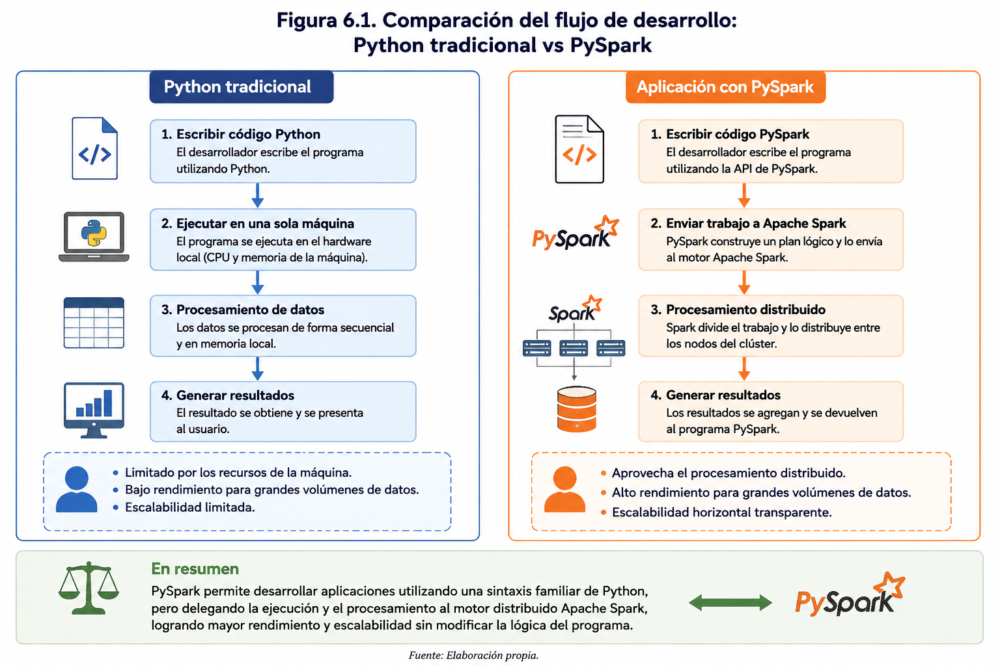
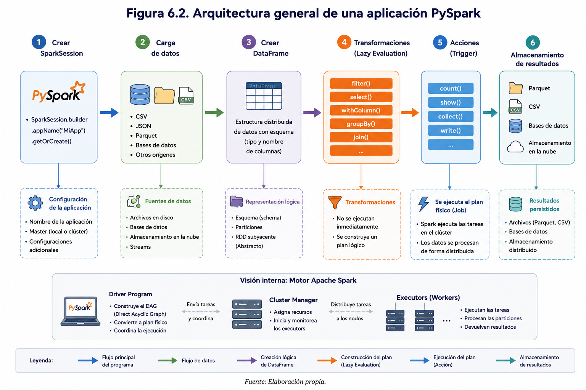
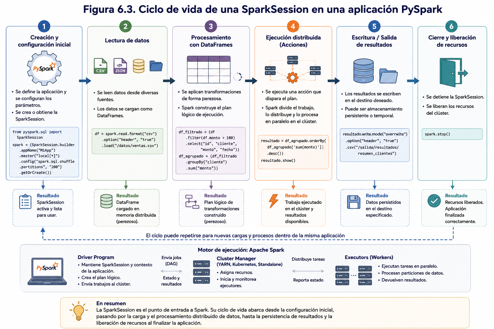
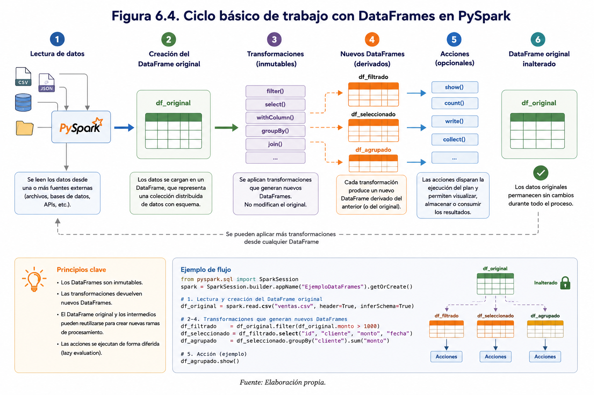
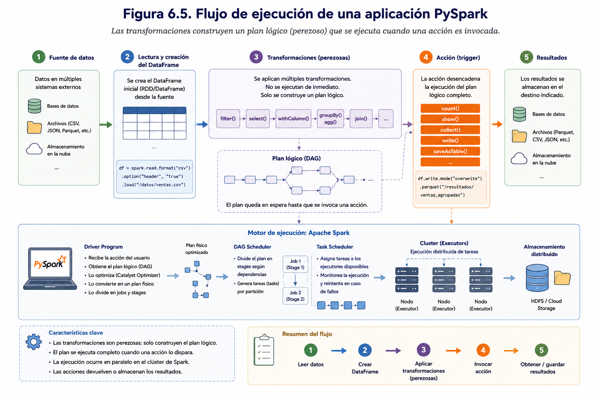
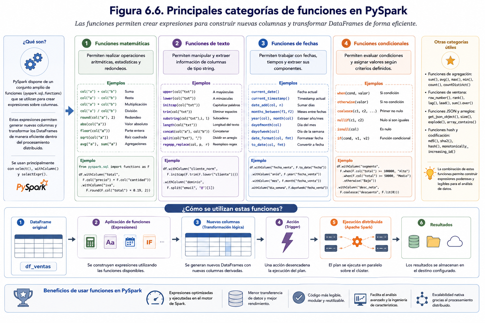
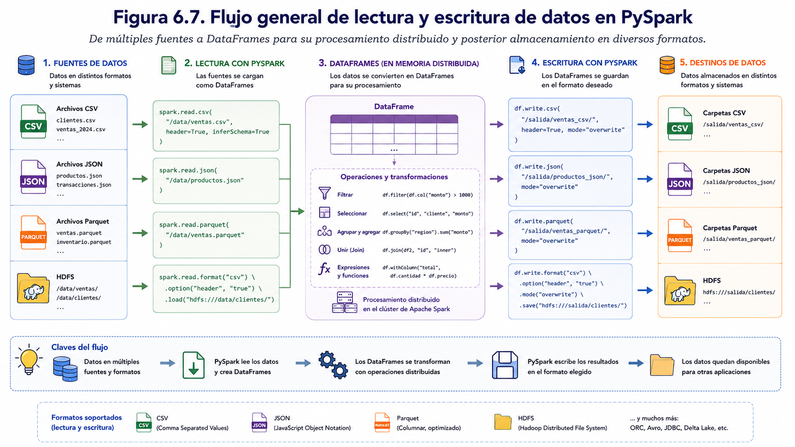
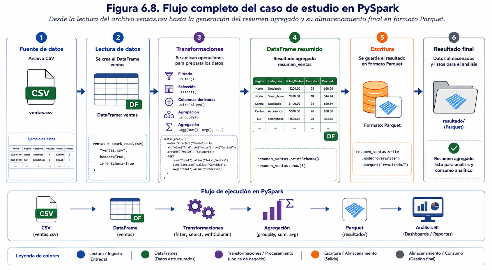

## Capítulo 6. Programación con PySpark

---

## Pregunta guía

> **¿Cómo permite PySpark desarrollar aplicaciones capaces de procesar grandes volúmenes de datos mediante DataFrames y operaciones distribuidas sobre Apache Spark?**

---

## Objetivos de aprendizaje

Al finalizar este capítulo el estudiante será capaz de:

- Comprender la estructura básica de una aplicación desarrollada con PySpark.
- Crear y configurar una sesión de trabajo utilizando **SparkSession**.
- Cargar conjuntos de datos desde diferentes fuentes utilizando DataFrames.
- Aplicar operaciones de exploración, selección, filtrado, ordenamiento y agregación de datos mediante PySpark.
- Crear y modificar columnas utilizando las funciones incorporadas de Spark.
- Interpretar el comportamiento de las transformaciones y acciones durante la ejecución de una aplicación.
- Desarrollar aplicaciones básicas de procesamiento distribuido utilizando PySpark.

---

## Introducción

En el capítulo anterior se estudiaron los fundamentos de Apache Spark, su arquitectura distribuida y los principales componentes que conforman la plataforma. Asimismo, se analizaron conceptos como los **DataFrames**, las **transformaciones**, las **acciones** y la **evaluación diferida**, estableciendo las bases necesarias para comprender el funcionamiento interno del motor de procesamiento.

A partir de este capítulo, el enfoque pasa desde la comprensión conceptual hacia el desarrollo de aplicaciones utilizando **PySpark**, la API de Apache Spark para el lenguaje de programación Python. El propósito es que el estudiante adquiera las competencias necesarias para construir programas capaces de procesar grandes volúmenes de datos mediante técnicas de procesamiento distribuido.

PySpark permite acceder a todas las capacidades de Apache Spark utilizando una sintaxis familiar para quienes ya poseen conocimientos de Python. Gracias a ello, es posible desarrollar aplicaciones de análisis de datos, procesos ETL, consultas analíticas y modelos de aprendizaje automático sin necesidad de utilizar lenguajes como Scala o Java.

Una de las principales ventajas de PySpark es que mantiene la misma filosofía de programación que caracteriza a Spark: el desarrollador define un conjunto de operaciones sobre los datos y el motor de ejecución se encarga de distribuir automáticamente el procesamiento entre los distintos nodos del clúster. De esta manera, el programador puede concentrarse en resolver el problema analítico, mientras Spark administra aspectos como la paralelización, la planificación de tareas, la comunicación entre nodos y la tolerancia a fallos.

Durante este capítulo se trabajará principalmente con **DataFrames**, ya que constituyen la estructura de datos recomendada para la mayoría de las aplicaciones desarrolladas con Apache Spark. Los DataFrames ofrecen una representación tabular de la información, similar a una tabla de una base de datos relacional o a un DataFrame de la biblioteca Pandas, pero con la capacidad de distribuir automáticamente los datos entre múltiples servidores y aprovechar las optimizaciones del motor de ejecución de Spark.

Asimismo, se abordarán las operaciones más utilizadas durante el desarrollo de aplicaciones con PySpark, entre ellas:

- creación de una sesión de Spark;
- carga de conjuntos de datos;
- exploración de DataFrames;
- selección y filtrado de registros;
- creación y modificación de columnas;
- agrupamiento y agregación de datos;
- ordenamiento de resultados;
- almacenamiento de la información procesada.

Cada uno de estos procedimientos será desarrollado mediante ejemplos prácticos que podrán ejecutarse en el entorno Docker preparado para el curso, permitiendo al estudiante experimentar directamente con el procesamiento distribuido sobre Apache Spark.

Es importante destacar que, aunque los ejemplos presentados utilizarán conjuntos de datos de tamaño reducido para facilitar su comprensión, las mismas instrucciones pueden aplicarse sobre millones o incluso miles de millones de registros sin modificar el código desarrollado. Esta capacidad de escalar una aplicación desde un entorno local hasta un clúster distribuido constituye una de las principales fortalezas de Apache Spark.

Al finalizar este capítulo, el lector será capaz de desarrollar aplicaciones básicas utilizando PySpark, comprender el flujo de trabajo asociado al procesamiento distribuido y aplicar las operaciones fundamentales para manipular grandes volúmenes de datos de manera eficiente. Estos conocimientos servirán como base para los capítulos posteriores, donde se abordarán técnicas más avanzadas de análisis, integración de datos y aprendizaje automático sobre plataformas Big Data.

---

## 6.2 ¿Por qué utilizar PySpark?

Apache Spark ofrece interfaces de programación para diversos lenguajes, entre ellos Scala, Java, Python y R. Aunque todos permiten acceder a las capacidades del motor de procesamiento distribuido, **PySpark** se ha convertido en una de las alternativas más utilizadas debido a la popularidad de Python en áreas como la Ciencia de Datos, la Ingeniería de Datos y el Aprendizaje Automático.

Python es reconocido por su sintaxis sencilla, su amplia comunidad de desarrolladores y su extenso ecosistema de bibliotecas para el análisis de datos. Gracias a PySpark, los desarrolladores pueden aprovechar estas ventajas sin renunciar a la capacidad de procesamiento distribuido que ofrece Apache Spark. De esta manera, es posible construir aplicaciones capaces de procesar millones de registros utilizando un lenguaje accesible y ampliamente conocido.

Una de las principales fortalezas de PySpark es que permite desarrollar aplicaciones distribuidas sin que el programador deba preocuparse por aspectos complejos relacionados con la administración del clúster. Operaciones como la distribución de los datos, la planificación de tareas, la comunicación entre nodos y la recuperación ante fallos son gestionadas automáticamente por Spark, permitiendo que el desarrollador concentre sus esfuerzos en resolver el problema analítico.

Otra ventaja importante es su integración con el ecosistema científico de Python. PySpark puede utilizarse conjuntamente con bibliotecas como **NumPy**, **Pandas** y **Matplotlib**, así como con herramientas de aprendizaje automático cuando el volumen de datos lo permite. Esta interoperabilidad facilita la transición desde el análisis de datos tradicional hacia el procesamiento distribuido, reutilizando conocimientos previamente adquiridos por los estudiantes.

Asimismo, PySpark proporciona una API basada en **DataFrames**, cuya estructura resulta familiar para quienes han trabajado con bases de datos relacionales o con la biblioteca Pandas. Esto reduce la curva de aprendizaje y favorece el desarrollo de aplicaciones más legibles y fáciles de mantener.

La Tabla 6.1 resume algunas de las principales ventajas que ofrece PySpark para el desarrollo de aplicaciones Big Data.

| Característica | PySpark |
|----------------|---------|
| Sintaxis sencilla basada en Python | Sí |
| Procesamiento distribuido | Sí |
| Procesamiento en memoria | Sí |
| Integración con Spark SQL | Sí |
| Compatibilidad con DataFrames | Sí |
| Integración con HDFS y Hive | Sí |
| Acceso a MLlib | Sí |
| Escalabilidad horizontal | Sí |
| Amplia comunidad y documentación | Sí |

No obstante, PySpark también presenta algunas limitaciones. Al ejecutarse sobre Python, determinadas operaciones pueden tener un rendimiento ligeramente inferior al obtenido con Scala, lenguaje en el que fue desarrollado Apache Spark. Sin embargo, esta diferencia suele ser poco significativa en la mayoría de las aplicaciones analíticas y queda ampliamente compensada por la facilidad de desarrollo y mantenimiento del código.

En el ámbito profesional, PySpark es utilizado en organizaciones de diversos sectores para implementar procesos ETL, construir canalizaciones de datos (*data pipelines*), preparar información para modelos predictivos y desarrollar soluciones de análisis sobre grandes volúmenes de datos. Su combinación de simplicidad, escalabilidad e integración con el ecosistema Spark explica por qué se ha convertido en una de las herramientas más demandadas para el procesamiento distribuido.

En este libro, todos los ejemplos y laboratorios serán desarrollados utilizando PySpark. Esta decisión busca que el estudiante adquiera competencias directamente transferibles al entorno profesional, comprendiendo tanto la lógica de programación en Python como los principios del procesamiento distribuido sobre Apache Spark.

La **Figura 6.1** compara el flujo de desarrollo de una aplicación Python tradicional con una aplicación implementada mediante PySpark, destacando cómo esta última incorpora de forma transparente las capacidades de procesamiento distribuido del motor Apache Spark.

<p align="center">
  
</p>

<p align="center">
  <strong>Figura 6.1.</strong> Comparación del flujo de desarrollo de una aplicación Python tradicional y una aplicación implementada mediante PySpark.
</p>

---

## 6.3 Arquitectura de una aplicación PySpark

Toda aplicación desarrollada con PySpark sigue una estructura lógica que permite interactuar con el motor de procesamiento distribuido de Apache Spark. Aunque los programas pueden variar considerablemente en tamaño y complejidad, la mayoría comparten una secuencia de trabajo similar: establecer una conexión con Spark, cargar los datos, aplicar operaciones de transformación, ejecutar acciones y almacenar o visualizar los resultados obtenidos.

Comprender esta arquitectura resulta fundamental para desarrollar aplicaciones eficientes y facilitar posteriormente la incorporación de nuevas funcionalidades, como consultas SQL, procesamiento de flujos de datos o modelos de aprendizaje automático.

### Componentes de una aplicación PySpark

Desde una perspectiva general, una aplicación PySpark está compuesta por cinco elementos principales:

- **SparkSession**
- **Origen de datos**
- **DataFrames**
- **Transformaciones y acciones**
- **Destino de los resultados**

Cada uno de estos componentes cumple una función específica dentro del flujo de procesamiento.

---

### SparkSession

Toda aplicación comienza con la creación de una **SparkSession**, que constituye el punto de entrada al entorno de ejecución de Apache Spark.

La SparkSession permite establecer la comunicación entre el programa desarrollado por el usuario y el motor de procesamiento distribuido. A través de ella se crean DataFrames, se ejecutan consultas SQL, se accede a los archivos almacenados en HDFS y se administran los recursos utilizados durante la ejecución.

En las versiones actuales de Apache Spark, la SparkSession reemplaza a los antiguos objetos **SparkContext** y **SQLContext**, integrando sus funcionalidades en una única interfaz de programación.

---

### Origen de datos

Una vez creada la sesión, la aplicación debe acceder a la información que será procesada.

PySpark permite leer datos desde múltiples fuentes, entre ellas:

- archivos CSV;
- archivos JSON;
- archivos Parquet;
- tablas Hive;
- HDFS;
- bases de datos relacionales;
- servicios de almacenamiento en la nube.

Independientemente del origen, la información suele convertirse en un **DataFrame**, facilitando su manipulación mediante una interfaz homogénea.

---

### DataFrames

El **DataFrame** constituye la estructura principal de trabajo en PySpark.

Cada DataFrame representa una colección distribuida de datos organizada en filas y columnas, sobre la cual pueden aplicarse distintas operaciones de análisis y transformación.

A diferencia de una tabla tradicional almacenada en memoria local, un DataFrame puede distribuirse automáticamente entre múltiples nodos del clúster, permitiendo procesar conjuntos de datos de gran tamaño.

Durante el desarrollo de una aplicación, es habitual trabajar con varios DataFrames que representan diferentes etapas del procesamiento.

---

### Transformaciones y acciones

Una vez cargados los datos, la aplicación aplica distintas operaciones para obtener la información deseada.

Las **transformaciones** permiten modificar el contenido de un DataFrame sin ejecutar inmediatamente el procesamiento.

Entre las transformaciones más habituales se encuentran:

- selección de columnas;
- filtrado de registros;
- creación de nuevas columnas;
- agrupamiento de datos;
- unión de DataFrames;
- ordenamiento.

Por su parte, las **acciones** desencadenan la ejecución efectiva del procesamiento distribuido.

Ejemplos de acciones incluyen:

- visualizar registros;
- contar elementos;
- guardar resultados;
- exportar información.

Esta separación entre transformaciones y acciones constituye uno de los principios fundamentales del modelo de programación de Spark.

---

### Destino de los resultados

Una vez finalizado el procesamiento, los resultados pueden utilizarse de diversas maneras.

Entre las opciones más frecuentes se encuentran:

- almacenar los datos en HDFS;
- guardar archivos CSV o Parquet;
- crear tablas Hive;
- enviar información hacia bases de datos;
- publicar resultados para procesos analíticos posteriores.

Esta flexibilidad permite integrar PySpark dentro de arquitecturas Big Data de distinta naturaleza.

---

### Flujo general de una aplicación

Desde una perspectiva simplificada, una aplicación desarrollada con PySpark sigue el siguiente flujo de trabajo:

1. Crear la SparkSession.
2. Leer los datos desde una o varias fuentes.
3. Crear uno o más DataFrames.
4. Aplicar transformaciones sobre los datos.
5. Ejecutar una acción para iniciar el procesamiento distribuido.
6. Almacenar o visualizar los resultados obtenidos.

Este flujo se mantiene prácticamente inalterado tanto en aplicaciones sencillas ejecutadas sobre un computador personal como en soluciones empresariales desplegadas sobre clústeres con cientos de nodos.

Comprender esta arquitectura facilita la lectura, el diseño y el mantenimiento del código, además de proporcionar una base sólida para incorporar funcionalidades más avanzadas en capítulos posteriores.

La **Figura 6.2** presenta la arquitectura general de una aplicación PySpark, mostrando el flujo completo desde la creación de la **SparkSession** hasta el almacenamiento de los resultados, pasando por la carga de datos, el procesamiento mediante DataFrames y la ejecución de transformaciones y acciones.

<p align="center">
  
</p>

<p align="center">
  <strong>Figura 6.2.</strong> Arquitectura general de una aplicación PySpark, desde la creación de la SparkSession hasta el almacenamiento de los resultados.
</p>


---

## 6.4 SparkSession: punto de entrada a Apache Spark

Toda aplicación desarrollada con PySpark comienza con la creación de una **SparkSession**. Este objeto constituye el punto de acceso principal al motor de procesamiento distribuido de Apache Spark y permite que el programa interactúe con los recursos disponibles en el clúster o en un entorno de ejecución local.

Desde la versión 2.0 de Apache Spark, la SparkSession reemplazó a objetos que anteriormente se utilizaban de manera independiente, como **SparkContext**, **SQLContext** y **HiveContext**, integrando sus principales funcionalidades en una única interfaz de programación. Esta simplificación facilita el desarrollo de aplicaciones y proporciona una experiencia de programación más uniforme.

En términos prácticos, sin una SparkSession no es posible leer datos, crear DataFrames, ejecutar consultas SQL ni utilizar las bibliotecas que forman parte del ecosistema Spark.

---

### Creación de una SparkSession

La creación de una sesión es una de las primeras instrucciones que aparece en cualquier programa desarrollado con PySpark.

El siguiente ejemplo muestra la estructura básica para crear una sesión de trabajo:

```python
from pyspark.sql import SparkSession

spark = SparkSession.builder \
    .appName("MiAplicacion") \
    .getOrCreate()
```

En este ejemplo:

- `SparkSession.builder` inicia el proceso de configuración de la sesión.
- `appName()` asigna un nombre a la aplicación, facilitando su identificación durante la ejecución.
- `getOrCreate()` crea una nueva sesión o reutiliza una existente si ya se encuentra disponible.

Esta instrucción suele ejecutarse una única vez al inicio del programa.

---

### Configuración de la aplicación

La SparkSession permite definir distintos parámetros que controlan el comportamiento de la aplicación.

Entre las configuraciones más habituales se encuentran:

- nombre de la aplicación;
- cantidad de memoria disponible;
- número de núcleos de procesamiento;
- dirección del clúster;
- configuración del catálogo Hive;
- parámetros de optimización.

Por ejemplo, para indicar que la aplicación se ejecutará localmente utilizando todos los núcleos disponibles del computador, puede emplearse la siguiente configuración:

```python
spark = SparkSession.builder \
    .master("local[*]") \
    .appName("MiAplicacion") \
    .getOrCreate()
```

En este caso:

- `local` indica que Spark se ejecutará en el computador local.
- El símbolo `*` representa la utilización de todos los núcleos disponibles del procesador.

Durante el desarrollo de los laboratorios de este libro se trabajará principalmente con esta modalidad de ejecución.

---

### Acceso a los componentes de Spark

Una vez creada la sesión, el objeto `spark` permite acceder a las distintas funcionalidades de Apache Spark.

Entre las operaciones más comunes se encuentran:

- leer archivos;
- crear DataFrames;
- ejecutar consultas SQL;
- acceder a tablas Hive;
- consultar información del entorno de ejecución;
- administrar configuraciones de la aplicación.

Por esta razón, la SparkSession puede considerarse el centro de operaciones de cualquier aplicación PySpark.

---

### Verificación de la sesión

Es recomendable comprobar que la sesión fue creada correctamente antes de comenzar a trabajar con los datos.

Algunas instrucciones útiles son:

Visualizar la versión instalada de Spark.

```python
spark.version
```

Obtener información sobre la configuración utilizada.

```python
spark.sparkContext.getConf().getAll()
```

Mostrar el modo de ejecución.

```python
spark.sparkContext.master
```

Estas instrucciones permiten verificar que el entorno se encuentra correctamente configurado antes de iniciar el procesamiento distribuido.

---

### Finalización de la sesión

Una vez concluido el procesamiento, es recomendable cerrar la SparkSession para liberar los recursos utilizados por la aplicación.

Esto puede realizarse mediante la siguiente instrucción:

```python
spark.stop()
```

Aunque en muchos entornos interactivos, como Jupyter Notebook, la sesión permanece disponible hasta finalizar el cuaderno, cerrar explícitamente la SparkSession constituye una buena práctica de programación, especialmente en aplicaciones de producción.

---

### Buenas prácticas

Durante el desarrollo de aplicaciones con PySpark se recomienda seguir algunas prácticas básicas relacionadas con la gestión de la SparkSession:

- crear una única SparkSession por aplicación;
- asignar nombres descriptivos mediante `appName()`;
- verificar la configuración antes de procesar grandes volúmenes de datos;
- cerrar la sesión al finalizar el programa;
- evitar crear múltiples sesiones innecesarias dentro de una misma aplicación.

Estas recomendaciones contribuyen a mejorar la organización del código y facilitan la administración de los recursos disponibles.

La **Figura 6.3** muestra el ciclo de vida de una SparkSession dentro de una aplicación PySpark, desde su creación y configuración inicial hasta la lectura de datos, el procesamiento distribuido y la liberación de los recursos al finalizar la ejecución.

<p align="center">
  
</p>

<p align="center">
  <strong>Figura 6.3.</strong> Ciclo de vida de una SparkSession, desde su creación y configuración inicial hasta la lectura de datos, el procesamiento distribuido, el almacenamiento de resultados y la liberación de recursos.
</p>


---

## 6.5 Creación y manipulación de DataFrames

Los **DataFrames** constituyen la estructura de datos más utilizada en PySpark y representan el elemento central sobre el cual se desarrollan la mayoría de las aplicaciones de procesamiento distribuido. Un DataFrame puede entenderse como una tabla compuesta por filas y columnas, donde cada columna posee un tipo de dato definido y cada fila representa un registro del conjunto de datos.

Aunque conceptualmente son similares a una tabla de una base de datos relacional o a un DataFrame de la biblioteca Pandas, los DataFrames de Apache Spark presentan una diferencia fundamental: su información puede distribuirse automáticamente entre múltiples nodos del clúster, permitiendo procesar grandes volúmenes de datos de manera paralela y escalable.

Gracias a esta característica, el desarrollador trabaja sobre una estructura lógica única, mientras Spark se encarga de distribuir los datos y coordinar el procesamiento entre los distintos servidores.

---

### Creación de un DataFrame desde un archivo

La forma más habitual de crear un DataFrame consiste en leer información almacenada en un archivo.

Por ejemplo, para cargar un archivo CSV se utiliza la siguiente instrucción:

```python
ventas = spark.read.csv(
    "ventas.csv",
    header=True,
    inferSchema=True
)
```

En este ejemplo:

- `spark.read` inicia el proceso de lectura.
- `csv()` indica el formato del archivo.
- `header=True` señala que la primera fila contiene los nombres de las columnas.
- `inferSchema=True` solicita a Spark identificar automáticamente los tipos de datos.

Una vez ejecutada esta instrucción, la variable `ventas` contendrá un DataFrame distribuido listo para ser procesado.

---

### Visualización de los datos

Después de cargar un conjunto de datos, es recomendable inspeccionar su contenido para verificar que la lectura se realizó correctamente.

El método más utilizado es:

```python
ventas.show()
```

Por defecto, Spark muestra los primeros veinte registros.

También es posible indicar una cantidad específica:

```python
ventas.show(10)
```

Esta operación corresponde a una **acción**, por lo que desencadena la ejecución efectiva del procesamiento.

---

### Exploración de la estructura

Antes de comenzar el análisis resulta conveniente conocer el esquema del DataFrame.

Para ello se utiliza:

```python
ventas.printSchema()
```

El resultado indica:

- nombre de cada columna;
- tipo de dato;
- posibilidad de contener valores nulos.

Conocer esta información permite seleccionar posteriormente las funciones más apropiadas para el procesamiento de los datos.

---

### Obtención de información general

PySpark incorpora diversas funciones que permiten explorar rápidamente un DataFrame.

Por ejemplo, obtener la cantidad de registros:

```python
ventas.count()
```

Visualizar los nombres de las columnas:

```python
ventas.columns
```

Consultar los tipos de datos:

```python
ventas.dtypes
```

Estas operaciones permiten familiarizarse con el conjunto de datos antes de realizar transformaciones más complejas.

---

### Selección de columnas

Con frecuencia, el análisis requiere trabajar únicamente con un subconjunto de atributos.

Para ello se utiliza el método `select()`.

Por ejemplo:

```python
ventas.select(
    "producto",
    "cantidad",
    "precio"
).show()
```

Esta operación genera un nuevo DataFrame que contiene únicamente las columnas seleccionadas.

El DataFrame original permanece sin modificaciones.

---

### Creación de nuevos DataFrames

Una característica importante de PySpark es que las transformaciones generan nuevos DataFrames en lugar de modificar directamente el conjunto de datos original.

Por ejemplo:

```python
productos = ventas.select(
    "producto",
    "precio"
)
```

En este caso:

- `ventas` conserva toda su información original.
- `productos` corresponde a un nuevo DataFrame que contiene únicamente dos columnas.

Este comportamiento favorece la reutilización del código y reduce el riesgo de alterar accidentalmente los datos originales.

---

### Inmutabilidad de los DataFrames

Al igual que los RDD, los DataFrames son estructuras **inmutables**.

Esto significa que una vez creados no pueden modificarse directamente. Cada transformación produce un nuevo DataFrame que representa una nueva etapa del procesamiento.

Por ejemplo:

```python
ventas_filtradas = ventas.filter(
    ventas.cantidad > 10
)
```

La variable `ventas_filtradas` contiene un nuevo conjunto de datos, mientras que `ventas` permanece exactamente igual.

La inmutabilidad constituye una característica esencial del modelo de programación de Spark, ya que facilita la optimización del procesamiento y contribuye a garantizar la tolerancia a fallos.

---

### Buenas prácticas

Durante el desarrollo de aplicaciones con PySpark se recomienda:

- utilizar nombres descriptivos para los DataFrames;
- inspeccionar el esquema antes de procesar los datos;
- verificar el contenido mediante `show()` después de cada etapa importante;
- conservar el DataFrame original cuando sea necesario reutilizar la información;
- evitar crear DataFrames innecesarios que incrementen la complejidad del código.

Estas prácticas facilitan la comprensión del flujo de procesamiento y mejoran la mantenibilidad de las aplicaciones.

La **Figura 6.4** presenta el ciclo básico de trabajo con DataFrames en PySpark, desde la lectura de un conjunto de datos hasta la creación de nuevos DataFrames mediante transformaciones sucesivas, manteniendo inalterada la información original.

<p align="center">
  
</p>

<p align="center">
  <strong>Figura 6.4.</strong> Ciclo básico de trabajo con DataFrames en PySpark, desde la lectura de los datos hasta la generación de nuevos DataFrames mediante transformaciones sucesivas, conservando inalterado el DataFrame original.
</p>


---

## 6.6 Transformaciones y acciones sobre DataFrames

Una de las características más importantes de Apache Spark es su modelo de procesamiento basado en **transformaciones** y **acciones**. Comprender la diferencia entre ambos conceptos resulta esencial para desarrollar aplicaciones eficientes con PySpark, ya que determina cuándo Spark construye un plan de ejecución y cuándo realmente procesa los datos.

Desde la perspectiva del programador, una aplicación PySpark puede parecer una secuencia de instrucciones ejecutadas de forma inmediata. Sin embargo, internamente Spark adopta una estrategia diferente: primero registra las operaciones que deben realizarse y solo ejecuta el procesamiento cuando resulta estrictamente necesario.

Este comportamiento permite optimizar automáticamente la ejecución y reducir el costo computacional asociado al procesamiento de grandes volúmenes de datos.

---

### Transformaciones

Las **transformaciones** son operaciones que generan un nuevo DataFrame a partir de uno existente.

Estas operaciones **no ejecutan inmediatamente el procesamiento**, sino que únicamente describen las tareas que Spark deberá realizar posteriormente.

Entre las transformaciones más utilizadas se encuentran:

- `select()`
- `filter()`
- `withColumn()`
- `drop()`
- `groupBy()`
- `orderBy()`
- `join()`
- `distinct()`

Por ejemplo:

```python
ventas_filtradas = ventas.filter(
    ventas.cantidad > 10
)
```

En este caso, Spark aún no procesa los datos.

Simplemente registra que deberá filtrar aquellos registros cuya cantidad sea superior a diez.

---

### Encadenamiento de transformaciones

Las transformaciones pueden combinarse en una única secuencia de operaciones.

Por ejemplo:

```python
resultado = (
    ventas
        .filter(ventas.cantidad > 10)
        .select("producto", "cantidad", "precio")
        .orderBy("producto")
)
```

Aunque el código contiene tres transformaciones consecutivas, Spark todavía no ejecuta ninguna de ellas.

En esta etapa únicamente construye un plan lógico de ejecución.

---

### Acciones

Las **acciones** son operaciones que obligan a Spark a ejecutar el plan de procesamiento construido mediante las transformaciones.

Cuando una acción es invocada, Spark analiza todas las operaciones pendientes, optimiza el plan de ejecución y distribuye las tareas entre los distintos nodos del clúster.

Entre las acciones más utilizadas se encuentran:

- `show()`
- `count()`
- `collect()`
- `first()`
- `take()`
- `write()`
- `save()`

Por ejemplo:

```python
resultado.show()
```

En este momento Spark ejecuta todas las transformaciones previamente definidas y presenta el resultado obtenido.

---

### Lazy Evaluation

El comportamiento descrito anteriormente recibe el nombre de **Lazy Evaluation** o **evaluación perezosa**.

Este principio constituye una de las principales ventajas de Apache Spark.

En lugar de ejecutar cada instrucción inmediatamente después de ser escrita, Spark espera hasta que una acción requiere los resultados.

Gracias a ello puede:

- eliminar operaciones innecesarias;
- reorganizar el orden de ejecución;
- combinar múltiples transformaciones;
- reducir la cantidad de datos transferidos entre nodos;
- optimizar el uso de memoria y procesadores.

Como consecuencia, el rendimiento general de las aplicaciones mejora considerablemente.

---

### Ejemplo completo

El siguiente ejemplo ilustra la diferencia entre transformaciones y acciones.

```python
ventas_filtradas = ventas.filter(
    ventas.cantidad > 10
)

ventas_ordenadas = ventas_filtradas.orderBy(
    "producto"
)

ventas_ordenadas.show()
```

En este programa:

1. `filter()` registra una transformación.
2. `orderBy()` registra una segunda transformación.
3. `show()` ejecuta finalmente todo el procesamiento.

Aunque existen tres instrucciones, Spark realiza el procesamiento distribuido una única vez.

---

### Plan de ejecución

Antes de ejecutar una acción, Spark construye internamente un **plan de ejecución** (*Execution Plan*).

Este plan describe:

- los datos que deben leerse;
- las transformaciones que deben aplicarse;
- el orden óptimo de ejecución;
- la distribución de las tareas entre los distintos ejecutores.

El desarrollador normalmente no necesita construir este plan manualmente, ya que Spark lo optimiza automáticamente mediante el optimizador **Catalyst**, uno de los componentes más importantes de su arquitectura.

---

### Buenas prácticas

Para aprovechar las ventajas del modelo de procesamiento de Spark se recomienda:

- encadenar transformaciones relacionadas antes de ejecutar una acción;
- evitar acciones innecesarias durante el desarrollo;
- utilizar `show()` únicamente para inspeccionar resultados parciales;
- comprender que cada acción puede desencadenar un nuevo procesamiento distribuido;
- aprovechar la optimización automática proporcionada por Spark.

Estas prácticas permiten desarrollar aplicaciones más eficientes y escalables, especialmente cuando se trabaja con grandes volúmenes de datos.

La **Figura 6.5** representa el flujo de ejecución de una aplicación PySpark, mostrando cómo múltiples transformaciones generan un plan lógico que permanece en espera hasta que una acción desencadena el procesamiento distribuido sobre el clúster de Apache Spark.

<p align="center">
  
</p>

<p align="center">
  <strong>Figura 6.5.</strong> Flujo de ejecución de una aplicación PySpark, donde las transformaciones construyen un plan lógico (DAG) que permanece en espera hasta que una acción desencadena su ejecución distribuida sobre el clúster de Apache Spark.
</p>

---

## 6.7 Funciones y expresiones en PySpark

Una de las principales fortalezas de PySpark radica en la amplia colección de funciones integradas que permiten transformar, analizar y enriquecer la información contenida en los DataFrames. Estas funciones proporcionan una alternativa eficiente a la programación tradicional basada en ciclos o estructuras iterativas, aprovechando el modelo de procesamiento distribuido de Apache Spark.

En lugar de recorrer los registros uno a uno, el desarrollador define expresiones que describen el resultado esperado. Posteriormente, Spark se encarga de distribuir el procesamiento entre los distintos nodos del clúster, optimizando automáticamente la ejecución.

Este enfoque, conocido como **programación declarativa**, favorece la escritura de código más compacto, legible y escalable.

---

### El módulo `functions`

La mayoría de las funciones utilizadas en PySpark se encuentran disponibles en el módulo `pyspark.sql.functions`, el cual normalmente se importa al inicio de la aplicación.

```python
from pyspark.sql import functions as F
```

Utilizar el alias `F` constituye una práctica ampliamente adoptada en la comunidad de desarrolladores, ya que facilita la lectura del código y evita conflictos con funciones propias del lenguaje Python.

---

### Creación de nuevas columnas

Una operación frecuente consiste en generar nuevos atributos a partir de la información existente.

Para ello se utiliza el método `withColumn()`.

Por ejemplo, calcular el valor total de una venta:

```python
ventas = ventas.withColumn(
    "total",
    F.col("cantidad") * F.col("precio")
)
```

En este caso:

- `col()` hace referencia a una columna del DataFrame.
- El resultado de la operación se almacena en una nueva columna denominada `total`.

El DataFrame original no se modifica; se genera una nueva versión con la columna adicional.

---

### Funciones matemáticas

PySpark incorpora numerosas funciones matemáticas que pueden aplicarse directamente sobre las columnas.

Algunos ejemplos son:

- `round()`
- `abs()`
- `sqrt()`
- `pow()`
- `ceil()`
- `floor()`

Por ejemplo:

```python
ventas = ventas.withColumn(
    "precio_redondeado",
    F.round("precio", 2)
)
```

Esta instrucción redondea el valor de la columna `precio` a dos decimales.

---

### Funciones de texto

También es posible transformar información de tipo carácter mediante funciones específicas.

Entre las más utilizadas destacan:

- `upper()`
- `lower()`
- `trim()`
- `length()`
- `concat()`
- `substring()`

Por ejemplo:

```python
ventas = ventas.withColumn(
    "producto",
    F.upper("producto")
)
```

Esta operación convierte todos los nombres de productos a letras mayúsculas.

---

### Funciones sobre fechas

Las fechas representan uno de los tipos de datos más utilizados en los procesos analíticos.

PySpark incorpora numerosas funciones para su manipulación, entre ellas:

- `current_date()`
- `current_timestamp()`
- `year()`
- `month()`
- `dayofmonth()`
- `datediff()`

Por ejemplo:

```python
ventas = ventas.withColumn(
    "anio",
    F.year("fecha")
)
```

La nueva columna contendrá únicamente el año correspondiente a cada registro.

---

### Expresiones condicionales

En muchas aplicaciones resulta necesario crear columnas cuyo valor depende del cumplimiento de determinadas condiciones.

Para ello PySpark proporciona la función `when()`.

Por ejemplo:

```python
ventas = ventas.withColumn(
    "categoria",
    F.when(
        F.col("total") >= 100000,
        "Alta"
    ).otherwise("Normal")
)
```

En este ejemplo:

- las ventas iguales o superiores a 100.000 se clasifican como **Alta**;
- el resto se clasifica como **Normal**.

Este tipo de expresiones resulta especialmente útil durante procesos ETL y tareas de preparación de datos.

---

### Combinación de funciones

Las funciones pueden combinarse para construir expresiones de mayor complejidad.

Por ejemplo:

```python
ventas = ventas.withColumn(
    "producto",
    F.upper(
        F.trim("producto")
    )
)
```

La instrucción anterior:

1. elimina espacios innecesarios;
2. convierte el texto a mayúsculas;
3. almacena el resultado en la misma columna.

Este tipo de composición favorece la escritura de código compacto y eficiente.

---

### Ventajas del uso de funciones

El empleo de funciones integradas ofrece múltiples beneficios durante el desarrollo de aplicaciones con PySpark:

- reduce la cantidad de código necesario;
- mejora la legibilidad de las aplicaciones;
- facilita el mantenimiento del software;
- aprovecha las optimizaciones internas de Apache Spark;
- evita operaciones iterativas poco eficientes.

En la práctica profesional, la mayoría de los procesos ETL desarrollados con PySpark utilizan una combinación de funciones para limpiar, transformar y enriquecer los datos antes de su análisis o almacenamiento.

La **Figura 6.6** resume las principales categorías de funciones disponibles en PySpark, mostrando cómo las expresiones matemáticas, de texto, de fechas y condicionales permiten construir nuevas columnas y transformar los DataFrames de forma eficiente dentro del procesamiento distribuido.

<p align="center">
  
</p>

<p align="center">
  <strong>Figura 6.6.</strong> Principales categorías de funciones disponibles en PySpark y su aplicación en la construcción de nuevas columnas y la transformación eficiente de DataFrames dentro del procesamiento distribuido.
</p>

---

## 6.8 Lectura y escritura de datos en PySpark

Una de las principales ventajas de PySpark es su capacidad para interactuar con múltiples fuentes de datos mediante una interfaz uniforme. Independientemente de si la información se encuentra almacenada en archivos locales, sistemas distribuidos, bases de datos relacionales o plataformas de almacenamiento en la nube, el proceso de lectura y escritura sigue un patrón similar.

Esta característica convierte a PySpark en una herramienta especialmente adecuada para el desarrollo de procesos ETL (*Extract, Transform and Load*), donde los datos deben extraerse desde diversas fuentes, transformarse mediante operaciones analíticas y almacenarse posteriormente en un nuevo destino.

En la práctica, gran parte del tiempo dedicado al desarrollo de aplicaciones Big Data corresponde precisamente a estas tareas de integración y preparación de datos.

---

### Lectura de archivos CSV

El formato CSV continúa siendo uno de los más utilizados para el intercambio de información entre aplicaciones.

La lectura de este tipo de archivos se realiza mediante el método `read.csv()`.

```python
ventas = spark.read.csv(
    "ventas.csv",
    header=True,
    inferSchema=True
)
```

Los parámetros más utilizados son:

- `header=True`: indica que la primera fila contiene los nombres de las columnas.
- `inferSchema=True`: solicita a Spark detectar automáticamente el tipo de dato de cada columna.

Una vez finalizada la lectura, el archivo queda representado como un DataFrame distribuido.

---

### Lectura de archivos JSON

PySpark también permite trabajar con datos en formato JSON, ampliamente utilizado en aplicaciones web y servicios REST.

```python
clientes = spark.read.json(
    "clientes.json"
)
```

Spark identifica automáticamente la estructura jerárquica del archivo y genera el esquema correspondiente.

---

### Lectura de archivos Parquet

El formato **Parquet** es uno de los más utilizados en plataformas Big Data debido a su almacenamiento orientado a columnas y a sus mecanismos de compresión.

La lectura se realiza mediante:

```python
ventas = spark.read.parquet(
    "ventas.parquet"
)
```

En proyectos de producción, Parquet suele ofrecer un rendimiento superior al obtenido con archivos CSV, especialmente cuando se trabaja con grandes volúmenes de información.

---

### Lectura desde HDFS

Cuando la información se encuentra almacenada en HDFS, la lectura es prácticamente idéntica.

La única diferencia corresponde a la ubicación del archivo.

```python
ventas = spark.read.csv(
    "hdfs:///datos/ventas.csv",
    header=True,
    inferSchema=True
)
```

Desde el punto de vista del desarrollador, el procesamiento posterior no cambia, ya que Spark abstrae las diferencias entre los distintos sistemas de almacenamiento.

---

### Escritura de archivos

Una vez procesados los datos, PySpark permite almacenarlos nuevamente utilizando diversos formatos.

Por ejemplo, guardar un DataFrame en formato CSV:

```python
ventas.write.csv(
    "resultado",
    header=True
)
```

Guardar el mismo DataFrame en formato Parquet:

```python
ventas.write.parquet(
    "resultado_parquet"
)
```

El desarrollador únicamente especifica el formato y la ubicación de destino; Spark se encarga de distribuir automáticamente la escritura entre los distintos nodos del clúster.

---

### Modos de escritura

Al escribir información es posible controlar el comportamiento cuando el destino ya contiene datos.

Los modos más utilizados son:

| Modo | Descripción |
|------|-------------|
| `overwrite` | Reemplaza la información existente. |
| `append` | Agrega nuevos registros al conjunto de datos existente. |
| `ignore` | No realiza ninguna operación si el destino ya existe. |
| `error` | Genera un error cuando el destino ya contiene información. |

Por ejemplo:

```python
ventas.write.mode(
    "overwrite"
).parquet(
    "ventas_procesadas"
)
```

Seleccionar el modo adecuado resulta especialmente importante en procesos ETL ejecutados de forma periódica.

---

### Formatos soportados

PySpark proporciona soporte nativo para numerosos formatos de almacenamiento.

Los más utilizados en proyectos Big Data son:

| Formato | Uso principal |
|----------|---------------|
| CSV | Intercambio de información entre aplicaciones. |
| JSON | Datos semiestructurados y servicios web. |
| Parquet | Almacenamiento analítico de alto rendimiento. |
| ORC | Procesamiento distribuido en entornos Hadoop. |
| Avro | Intercambio de datos entre sistemas distribuidos. |

La elección del formato depende del tipo de aplicación, del volumen de información y de los requisitos de rendimiento.

---

### Buenas prácticas

Durante el desarrollo de aplicaciones con PySpark se recomienda:

- utilizar `inferSchema=True` únicamente durante la fase de desarrollo;
- definir explícitamente el esquema en aplicaciones de producción cuando sea posible;
- preferir formatos columnares como Parquet para procesos analíticos;
- verificar siempre la correcta lectura del esquema mediante `printSchema()`;
- seleccionar cuidadosamente el modo de escritura para evitar pérdidas accidentales de información.

Estas prácticas contribuyen a mejorar el rendimiento, la calidad de los datos y la mantenibilidad de las aplicaciones desarrolladas con Apache Spark.

La **Figura 6.7** muestra el flujo general de lectura y escritura de datos en PySpark, ilustrando cómo diferentes fuentes de información (CSV, JSON, Parquet y HDFS) son convertidas en DataFrames para su procesamiento y posteriormente almacenadas en distintos formatos según las necesidades de la aplicación.

<p align="center">
  
</p>

<p align="center">
  <strong>Figura 6.7.</strong> Flujo general de lectura y escritura de datos en PySpark, donde diferentes fuentes de información (CSV, JSON, Parquet y HDFS) son convertidas en DataFrames para su procesamiento distribuido y posteriormente almacenadas en distintos formatos según las necesidades de la aplicación.
</p>

---

## 6.9 Caso de estudio: análisis de ventas utilizando PySpark

Hasta este punto se han presentado los principales elementos que conforman una aplicación desarrollada con PySpark: la creación de la SparkSession, el uso de DataFrames, las transformaciones, las acciones y la lectura y escritura de datos. En esta sección se integran estos conceptos mediante un caso de estudio simplificado que ilustra el flujo completo de procesamiento de información.

Supóngase que una empresa comercial dispone de un archivo denominado **ventas.csv**, el cual contiene información sobre las ventas realizadas durante un período determinado.

Cada registro considera los siguientes atributos:

| Columna | Descripción |
|----------|-------------|
| fecha | Fecha de la venta |
| producto | Nombre del producto |
| categoria | Categoría del producto |
| cantidad | Cantidad vendida |
| precio | Precio unitario |
| sucursal | Sucursal donde se realizó la venta |

El objetivo consiste en obtener un resumen de ventas por categoría, considerando únicamente aquellas transacciones cuya cantidad vendida sea superior a diez unidades.

---

### Paso 1. Crear la SparkSession

Como en toda aplicación PySpark, el primer paso consiste en crear la sesión de trabajo.

```python
from pyspark.sql import SparkSession
from pyspark.sql import functions as F

spark = SparkSession.builder \
    .appName("AnalisisVentas") \
    .master("local[*]") \
    .getOrCreate()
```

---

### Paso 2. Leer el archivo

Posteriormente se carga el archivo CSV.

```python
ventas = spark.read.csv(
    "ventas.csv",
    header=True,
    inferSchema=True
)
```

El resultado corresponde a un DataFrame distribuido que puede procesarse mediante las operaciones disponibles en PySpark.

---

### Paso 3. Explorar los datos

Antes de comenzar el análisis resulta conveniente revisar la estructura del conjunto de datos.

```python
ventas.printSchema()

ventas.show(5)
```

Estas instrucciones permiten verificar que las columnas fueron interpretadas correctamente y que los tipos de datos corresponden a los esperados.

---

### Paso 4. Crear una nueva columna

A continuación se calcula el monto total de cada venta.

```python
ventas = ventas.withColumn(
    "total",
    F.col("cantidad") * F.col("precio")
)
```

La nueva columna será utilizada posteriormente durante el análisis.

---

### Paso 5. Filtrar registros

El análisis considera únicamente aquellas ventas cuya cantidad sea superior a diez unidades.

```python
ventas_filtradas = ventas.filter(
    F.col("cantidad") > 10
)
```

Esta operación corresponde a una transformación, por lo que todavía no se ejecuta el procesamiento.

---

### Paso 6. Agrupar la información

El siguiente paso consiste en calcular el monto total vendido por categoría.

```python
resumen = ventas_filtradas.groupBy(
    "categoria"
).agg(
    F.sum("total").alias("ventas_totales")
)
```

El método `groupBy()` agrupa los registros, mientras que `sum()` calcula la suma del monto total correspondiente a cada categoría.

---

### Paso 7. Ordenar los resultados

Para facilitar la interpretación del análisis, los resultados pueden ordenarse de mayor a menor.

```python
resumen = resumen.orderBy(
    F.desc("ventas_totales")
)
```

De esta manera, las categorías con mayores ventas aparecerán en los primeros registros del resultado.

---

### Paso 8. Mostrar el resultado

Finalmente se ejecuta el procesamiento mediante una acción.

```python
resumen.show()
```

Solo en este momento Spark construye el plan de ejecución, optimiza las operaciones y distribuye el procesamiento entre los distintos ejecutores.

---

### Paso 9. Guardar el resultado

Una vez obtenido el resumen, este puede almacenarse para su utilización posterior.

```python
resumen.write.mode(
    "overwrite"
).parquet(
    "ventas_resumen"
)
```

El archivo generado podrá utilizarse posteriormente como fuente de información para procesos ETL, herramientas de visualización o modelos de aprendizaje automático.

---

### Análisis del flujo de procesamiento

El caso presentado resume el ciclo completo de trabajo de una aplicación PySpark:

1. Se crea una SparkSession.
2. Se leen los datos desde un archivo.
3. Se genera un DataFrame.
4. Se crean nuevas columnas.
5. Se aplican transformaciones.
6. Se agrupan y ordenan los datos.
7. Una acción ejecuta el procesamiento distribuido.
8. Los resultados se almacenan para futuros análisis.

Aunque el ejemplo utiliza un conjunto de datos relativamente pequeño, exactamente el mismo flujo puede aplicarse sobre archivos con millones de registros distribuidos en un clúster Apache Spark. Esta capacidad de escalar sin modificar la lógica del programa constituye una de las principales fortalezas de PySpark y explica su amplia adopción en proyectos de ingeniería y análisis de datos.

La **Figura 6.8** sintetiza el flujo completo del caso de estudio, mostrando la secuencia de operaciones desde la lectura del archivo **ventas.csv** hasta la generación del resumen agregado y su almacenamiento final en formato Parquet.

<p align="center">
  
</p>

<p align="center">
  <strong>Figura 6.8.</strong> Flujo completo del caso de estudio en PySpark, desde la lectura del archivo <code>ventas.csv</code> hasta la generación del resumen agregado y su almacenamiento final en formato Parquet para su posterior análisis.
</p>

---

## 6.10 Resumen

En este capítulo se presentaron los fundamentos necesarios para comenzar a desarrollar aplicaciones utilizando **PySpark**, la interfaz de programación en Python para Apache Spark. A diferencia del capítulo anterior, centrado en la arquitectura y funcionamiento interno del motor de procesamiento distribuido, en esta oportunidad el énfasis estuvo puesto en la construcción de aplicaciones capaces de manipular grandes volúmenes de datos mediante una sintaxis sencilla y ampliamente utilizada en el ámbito profesional.

En primer lugar, se analizó el papel de PySpark como una de las interfaces más populares para interactuar con Apache Spark. Su integración con el ecosistema Python, la facilidad de aprendizaje y la disponibilidad de bibliotecas para el análisis de datos convierten a esta herramienta en una alternativa ampliamente utilizada en proyectos de Ingeniería de Datos, Ciencia de Datos y Analítica Avanzada.

Posteriormente, se estudió la arquitectura básica de una aplicación PySpark, identificando los principales componentes que participan durante la ejecución de un programa: la creación de la **SparkSession**, la lectura de datos desde distintas fuentes, la utilización de DataFrames como estructura principal de procesamiento, la aplicación de transformaciones y acciones, y el almacenamiento de los resultados obtenidos.

Uno de los aspectos más relevantes correspondió al estudio de los **DataFrames**, estructura que permite representar conjuntos de datos distribuidos mediante un modelo tabular similar al utilizado en bases de datos relacionales y en bibliotecas como Pandas. Se revisaron sus principales características, la creación de nuevos DataFrames y el principio de inmutabilidad que caracteriza al modelo de programación de Spark.

Asimismo, se explicó el funcionamiento de las **transformaciones** y las **acciones**, enfatizando el concepto de **Lazy Evaluation**. Este mecanismo permite que Spark construya un plan lógico de ejecución y optimice automáticamente el procesamiento antes de distribuir las tareas entre los distintos nodos del clúster, mejorando significativamente el rendimiento de las aplicaciones.

El capítulo también abordó el uso de las principales funciones disponibles en el módulo `pyspark.sql.functions`, mostrando cómo es posible crear nuevas columnas, transformar datos numéricos, manipular texto, trabajar con fechas y construir expresiones condicionales mediante una programación declarativa, más eficiente y legible que los enfoques tradicionales basados en iteraciones.

Posteriormente, se revisó el proceso de lectura y escritura de datos utilizando distintos formatos de almacenamiento, tales como CSV, JSON y Parquet, así como el acceso a archivos distribuidos en HDFS. Estas capacidades convierten a PySpark en una herramienta fundamental para el desarrollo de procesos ETL y canalizaciones de datos dentro de arquitecturas Big Data.

Finalmente, mediante un caso de estudio integrador, se aplicaron los conceptos desarrollados a lo largo del capítulo para construir un flujo completo de procesamiento de información, desde la lectura de un archivo de ventas hasta la generación de un resumen agregado y su almacenamiento para posteriores análisis.

En conjunto, los contenidos desarrollados proporcionan las competencias básicas necesarias para diseñar y programar aplicaciones distribuidas utilizando PySpark. Estos conocimientos constituyen el punto de partida para abordar, en el siguiente capítulo, el procesamiento de datos en tiempo real mediante **Apache Kafka**, incorporando flujos continuos de información dentro del ecosistema Big Data.

---

## 6.11 Actividades de aprendizaje

Las siguientes actividades tienen como propósito consolidar los conocimientos desarrollados en este capítulo mediante ejercicios de análisis, interpretación y programación utilizando PySpark. Se recomienda desarrollar cada actividad de forma secuencial, ya que los conceptos abordados se complementan progresivamente.

---

### Actividad 6.1. Comprensión conceptual

Responda las siguientes preguntas utilizando los contenidos desarrollados en este capítulo.

1. ¿Cuál es la función principal de una **SparkSession** dentro de una aplicación PySpark?

2. Explique la diferencia entre un **DataFrame** de PySpark y un DataFrame de la biblioteca Pandas.

3. ¿Qué significa que los DataFrames sean estructuras **inmutables**?

4. ¿Cuál es la diferencia entre una **transformación** y una **acción**?

5. Explique con sus palabras el concepto de **Lazy Evaluation** y cómo contribuye al rendimiento de Apache Spark.

6. ¿Por qué el formato **Parquet** suele ser preferido frente a CSV en proyectos Big Data?

---

### Actividad 6.2. Identificación de componentes

Observe el siguiente fragmento de código.

```python
from pyspark.sql import SparkSession
from pyspark.sql import functions as F

spark = SparkSession.builder \
    .appName("Ejemplo") \
    .getOrCreate()

ventas = spark.read.csv(
    "ventas.csv",
    header=True,
    inferSchema=True
)

resultado = ventas.filter(
    F.col("cantidad") > 5
).select(
    "producto",
    "cantidad"
)

resultado.show()
```

A partir del código anterior, identifique:

a) La instrucción que crea la SparkSession.

b) La instrucción que carga el DataFrame.

c) La transformación que filtra los datos.

d) La transformación que selecciona columnas.

e) La acción que desencadena la ejecución del procesamiento.

---

### Actividad 6.3. Exploración de DataFrames

Utilizando un archivo CSV de su elección:

1. Cree una SparkSession.

2. Cargue el archivo como un DataFrame.

3. Muestre los primeros diez registros.

4. Visualice el esquema del DataFrame.

5. Obtenga la cantidad total de registros.

6. Liste los nombres de las columnas.

Finalmente, responda:

- ¿Qué tipos de datos fueron detectados automáticamente por Spark?
- ¿Considera que todos fueron correctamente identificados?

---

### Actividad 6.4. Transformación de datos

Considere un DataFrame denominado **ventas** que contiene las columnas:

- producto
- cantidad
- precio

Realice las siguientes operaciones:

1. Cree una columna denominada **total** calculando la multiplicación entre cantidad y precio.

2. Filtre únicamente aquellas ventas cuyo total sea superior a 100000.

3. Ordene el resultado de mayor a menor según el total de la venta.

4. Muestre los resultados obtenidos.

Explique cuáles de las instrucciones corresponden a transformaciones y cuál corresponde a una acción.

---

### Actividad 6.5. Integración de conocimientos

Diseñe el flujo de una aplicación PySpark capaz de realizar el siguiente proceso:

- leer un archivo CSV;
- crear un DataFrame;
- eliminar registros con valores nulos;
- calcular una nueva columna;
- agrupar la información;
- almacenar los resultados en formato Parquet.

No es necesario escribir el código completo. Elabore un diagrama o describa, paso a paso, las operaciones que ejecutaría la aplicación y explique la función que cumple cada una dentro del procesamiento distribuido.

---

## 6.12 Laboratorio 

### 6.1. Desarrollo de una aplicación básica con PySpark

### Objetivos

Al finalizar este laboratorio, el estudiante será capaz de:

- crear una aplicación básica utilizando PySpark;
- establecer una SparkSession;
- cargar un conjunto de datos desde un archivo CSV;
- explorar la estructura de un DataFrame;
- aplicar transformaciones y acciones;
- generar nuevas columnas;
- agrupar y resumir información;
- almacenar los resultados obtenidos en formato Parquet.

---

### Tiempo estimado

90 minutos

---

### Recursos necesarios

- Docker Desktop o Docker Engine.
- Contenedor Apache Spark utilizado durante el curso.
- Visual Studio Code o Jupyter Notebook.
- Python 3.x.
- Archivo **ventas.csv** proporcionado por el docente.

---

### Contexto

Una empresa de distribución comercial desea analizar las ventas registradas durante el último mes con el propósito de identificar cuáles son las categorías que generan mayores ingresos.

Para ello dispone de un archivo denominado **ventas.csv**, cuyo contenido presenta la siguiente estructura:

| Columna | Descripción |
|----------|-------------|
| fecha | Fecha de la venta |
| producto | Nombre del producto |
| categoria | Categoría del producto |
| cantidad | Cantidad vendida |
| precio | Precio unitario |
| sucursal | Sucursal donde se realizó la venta |

El departamento de análisis solicita desarrollar una aplicación utilizando PySpark que permita generar un resumen de ventas por categoría.

---

## Parte 1. Preparación del entorno

1. Inicie el contenedor Docker con Apache Spark.

2. Verifique que PySpark se encuentre correctamente instalado.

3. Cree un nuevo archivo denominado:

```
laboratorio_06.py
```

4. Importe las bibliotecas necesarias.

```python
from pyspark.sql import SparkSession
from pyspark.sql import functions as F
```

---

## Parte 2. Creación de la SparkSession

Cree una SparkSession denominada:

```
Laboratorio06
```

utilizando todos los núcleos disponibles del computador.

Verifique posteriormente:

- versión de Spark;
- modo de ejecución;
- nombre de la aplicación.

---

## Parte 3. Lectura del conjunto de datos

Cargue el archivo **ventas.csv** considerando:

- encabezado;
- detección automática de tipos de datos.

Posteriormente:

- muestre los primeros diez registros;
- visualice el esquema del DataFrame;
- obtenga la cantidad total de registros.

---

## Parte 4. Exploración inicial

Determine:

- número de columnas;
- nombre de cada columna;
- tipo de dato de cada atributo.

Responda:

1. ¿Qué columnas representan variables numéricas?

2. ¿Qué columnas corresponden a variables categóricas?

3. ¿Existe alguna columna que represente una fecha?

---

## Parte 5. Transformación de los datos

Realice las siguientes operaciones:

1. Cree una nueva columna denominada **total**, calculando:

```
cantidad × precio
```

2. Cree una segunda columna denominada **descuento**.

Considere:

- Total mayor o igual a 500000 → "Sí"
- En caso contrario → "No"

3. Muestre el resultado.

---

## Parte 6. Filtrado de información

Obtenga únicamente aquellas ventas que cumplan simultáneamente las siguientes condiciones:

- cantidad superior a 10 unidades;
- total superior a 100000.

Visualice los resultados.

---

## Parte 7. Resumen estadístico

Genere un resumen por categoría que considere:

- cantidad total de ventas;
- suma del monto vendido;
- promedio del monto vendido;
- venta máxima;
- venta mínima.

Ordene el resultado desde la categoría con mayores ventas hasta la menor.

---

## Parte 8. Almacenamiento de resultados

Guarde el resumen generado:

- formato Parquet;
- modo **overwrite**.

Nombre de la carpeta:

```
ventas_resumen
```

---

## Parte 9. Análisis de resultados

Responda las siguientes preguntas:

1. ¿Cuál fue la categoría con mayor monto total vendido?

2. ¿Qué ventaja presenta el uso de Parquet frente a CSV para almacenar este tipo de información?

3. ¿Qué operaciones realizadas durante el laboratorio corresponden a transformaciones?

4. ¿Cuál fue la primera acción que desencadenó la ejecución del procesamiento distribuido?

5. ¿En qué momento intervino el mecanismo de **Lazy Evaluation**?

---

## Desafío (Opcional)

Modifique la aplicación para generar un segundo informe que muestre las ventas agrupadas por **sucursal**, indicando:

- total vendido;
- promedio de venta;
- número de transacciones;
- porcentaje que representa cada sucursal respecto del total general.

Finalmente, almacene este nuevo informe en formato Parquet utilizando una carpeta distinta a la utilizada anteriormente.

---

## Conclusiones

Al finalizar este laboratorio, el estudiante habrá desarrollado una aplicación funcional utilizando PySpark, integrando los principales conceptos estudiados en el capítulo: creación de una **SparkSession**, manejo de **DataFrames**, aplicación de transformaciones y acciones, utilización de funciones integradas y almacenamiento de resultados. Estas competencias constituyen la base para desarrollar aplicaciones de procesamiento distribuido más complejas y preparan al estudiante para abordar, en el siguiente capítulo, el procesamiento de datos en tiempo real mediante **Apache Kafka**.

---

### Consulta rápida

Como complemento a los contenidos desarrollados en este capítulo, al final del mismo se incorpora el **[Anexo D. Principales comandos de PySpark](#anexo-d-pyspark)**. Este anexo reúne los comandos más utilizados para la creación de aplicaciones con PySpark, organizados por categorías como gestión de la **SparkSession**, lectura y escritura de datos, manipulación de **DataFrames**, transformaciones, acciones, funciones integradas, consultas SQL y persistencia. Se recomienda utilizarlo como material de consulta durante el desarrollo de los laboratorios, proyectos y evaluaciones del curso.

---

## 6.13 Lecturas recomendadas

Los siguientes recursos permiten profundizar en los conceptos desarrollados en este capítulo y constituyen material de apoyo para ampliar los conocimientos sobre programación distribuida con PySpark, procesamiento de datos y desarrollo de aplicaciones Big Data.

### Bibliografía básica

Apache Spark Project. (2025). *PySpark API Documentation*. Apache Software Foundation.

Este recurso corresponde a la documentación oficial de la API de PySpark. Incluye la descripción de todas las clases, funciones y métodos disponibles, además de ejemplos de uso y referencias técnicas actualizadas.

---

Karau, H., & Warren, R. (2019). *High Performance Spark: Best Practices for Scaling and Optimizing Apache Spark*. O'Reilly Media.

Obra orientada a desarrolladores e ingenieros de datos que aborda estrategias para optimizar aplicaciones Spark, mejorar el rendimiento y comprender el funcionamiento interno del motor de procesamiento distribuido.

---

Damji, J., Wenig, B., Das, T., & Lee, D. (2020). *Learning Spark: Lightning-Fast Data Analytics* (2nd ed.). O'Reilly Media.

Texto ampliamente utilizado para el aprendizaje de Apache Spark. Presenta ejemplos completos utilizando DataFrames, Spark SQL, Structured Streaming y Machine Learning, incluyendo aplicaciones desarrolladas con PySpark.

---

### Bibliografía complementaria

Chambers, B., & Zaharia, M. (2018). *Spark: The Definitive Guide*. O'Reilly Media.

Libro escrito por uno de los creadores de Apache Spark. Explica en profundidad la arquitectura del framework, su modelo de programación y las principales herramientas del ecosistema.

---

White, T. (2015). *Hadoop: The Definitive Guide* (4th ed.). O'Reilly Media.

Aunque el enfoque principal del libro es Hadoop, incorpora una explicación detallada sobre la integración de Apache Spark dentro del ecosistema Big Data y la interacción con HDFS y Hive.

---

### Recursos en línea

**Documentación oficial de Apache Spark**

https://spark.apache.org/docs/latest/

Contiene la documentación técnica completa de Apache Spark, incluyendo la guía oficial de PySpark, Spark SQL, Structured Streaming y MLlib.

---

**PySpark API Reference**

https://spark.apache.org/docs/latest/api/python/

Repositorio oficial con la documentación completa de todas las funciones y clases disponibles en PySpark.

---

**Repositorio GitHub del curso**

https://github.com/juliopez/Hadoop

Incluye los ejemplos desarrollados durante el curso, archivos Docker, datasets, laboratorios y material complementario asociado a este libro.

---

**Lista de reproducción del curso**

https://www.youtube.com/playlist?list=PLrc3rKEj3Qc-TsC79xmu8A9eCEmuW67Ev

Contiene videos explicativos, demostraciones prácticas y laboratorios relacionados con Apache Spark, PySpark y las distintas herramientas estudiadas a lo largo del texto.

---

Se recomienda que el estudiante complemente la lectura de este capítulo desarrollando los ejemplos disponibles en el repositorio GitHub y ejecutando los laboratorios propuestos en un entorno local basado en Docker. La programación distribuida requiere una fuerte componente práctica; por ello, la experimentación continua constituye el mejor mecanismo para consolidar los conocimientos adquiridos.

---

## Referencias

Apache Software Foundation. (2025). *Apache Spark Documentation*. https://spark.apache.org/docs/latest/

Apache Software Foundation. (2025). *PySpark API Reference*. https://spark.apache.org/docs/latest/api/python/

Chambers, B., & Zaharia, M. (2018). *Spark: The Definitive Guide: Big Data Processing Made Simple*. O'Reilly Media.

Damji, J., Wenig, B., Das, T., & Lee, D. (2020). *Learning Spark: Lightning-Fast Data Analytics* (2nd ed.). O'Reilly Media.

Dean, J., & Ghemawat, S. (2008). MapReduce: Simplified Data Processing on Large Clusters. *Communications of the ACM, 51*(1), 107–113.

Karau, H., & Warren, R. (2019). *High Performance Spark: Best Practices for Scaling and Optimizing Apache Spark*. O'Reilly Media.

Matei Zaharia, M., Chowdhury, M., Franklin, M. J., Shenker, S., & Stoica, I. (2012). Resilient Distributed Datasets: A Fault-Tolerant Abstraction for In-Memory Cluster Computing. *Proceedings of the 9th USENIX Symposium on Networked Systems Design and Implementation (NSDI)*, 15–28.

White, T. (2015). *Hadoop: The Definitive Guide* (4th ed.). O'Reilly Media.

Zaharia, M., Xin, R. S., Wendell, P., Das, T., Armbrust, M., Dave, A., Meng, X., Rosen, J., Venkataraman, S., Franklin, M. J., Ghodsi, A., Gonzalez, J., Shenker, S., & Stoica, I. (2016). Apache Spark: A Unified Engine for Big Data Processing. *Communications of the ACM, 59*(11), 56–65.
