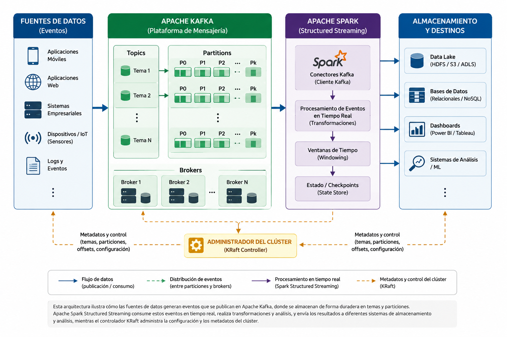
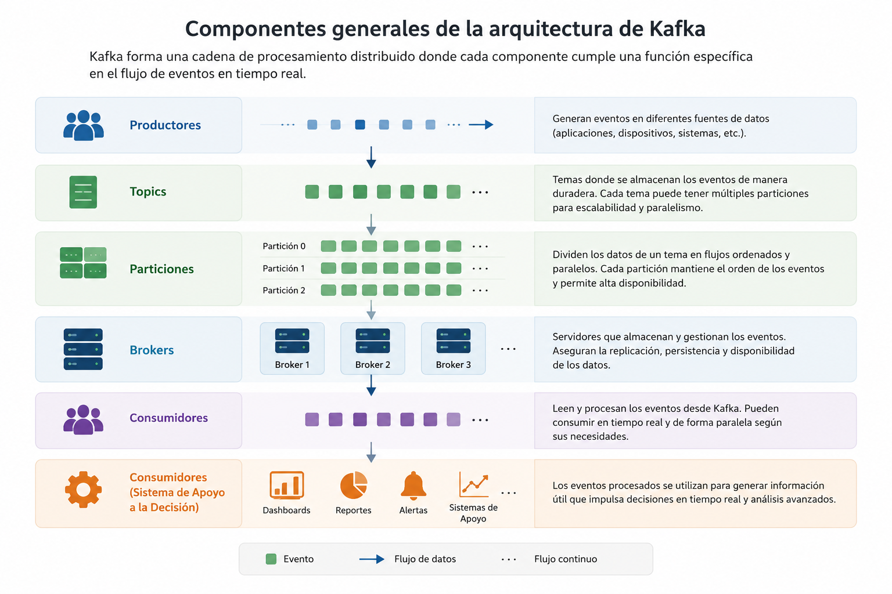
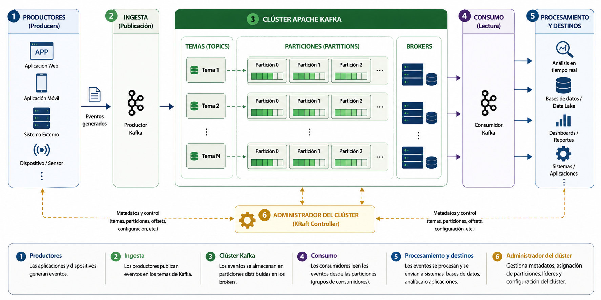
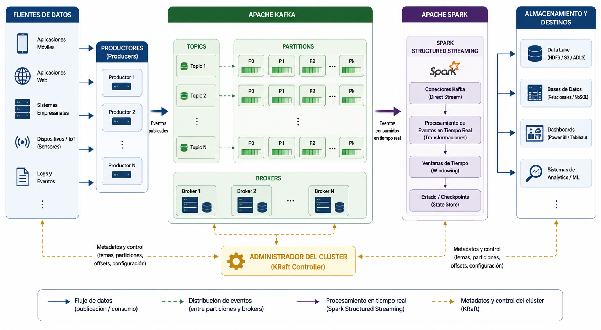

# PARTE IV

# Procesamiento Distribuido

### Del almacenamiento al procesamiento masivo

---

# Capítulo 7. Apache Kafka

---

## Pregunta guía

> **¿Cómo permite Apache Kafka capturar, organizar y distribuir millones de eventos en tiempo real para integrarse con plataformas de procesamiento distribuido como Apache Spark dentro de una arquitectura Big Data?**

---

## Objetivos de aprendizaje

Al finalizar este capítulo el estudiante será capaz de:

- Comprender el propósito de Apache Kafka dentro de una arquitectura Big Data orientada al procesamiento de eventos.
- Explicar la arquitectura y el funcionamiento general de un clúster Apache Kafka.
- Identificar los principales componentes de Kafka: Producer, Broker, Topic, Partition, Consumer, Consumer Group y Offset.
- Comprender el flujo completo de publicación y consumo de eventos.
- Diferenciar las garantías de entrega **At Most Once**, **At Least Once** y **Exactly Once**.
- Analizar los mecanismos de escalabilidad, replicación y tolerancia a fallos implementados por Apache Kafka.
- Explicar la integración de Apache Kafka con Apache Spark Structured Streaming dentro de arquitecturas de procesamiento de eventos.
- Desarrollar aplicaciones básicas de publicación y consumo de mensajes utilizando Python.

---

## Introducción

El crecimiento exponencial del volumen de datos generado por aplicaciones web, dispositivos móviles, sensores IoT, redes sociales y sistemas empresariales ha impulsado la necesidad de adoptar arquitecturas capaces de procesar información de manera continua. A diferencia de los enfoques tradicionales, donde los datos son almacenados para ser analizados posteriormente mediante procesos por lotes (*batch processing*), muchas aplicaciones modernas requieren analizar los eventos prácticamente en el mismo instante en que ocurren.

Este paradigma, conocido como **procesamiento de eventos** (*Event Streaming*), constituye uno de los pilares fundamentales de las plataformas Big Data actuales. Su objetivo consiste en capturar, transportar y procesar flujos continuos de información provenientes de múltiples fuentes, permitiendo reaccionar oportunamente frente a situaciones que requieren una respuesta inmediata.

Apache Kafka surge precisamente para resolver este desafío. Diseñado originalmente por LinkedIn y posteriormente incorporado a la Apache Software Foundation, Kafka proporciona una plataforma distribuida de mensajería orientada a eventos que permite transportar millones de mensajes por segundo con altos niveles de disponibilidad, escalabilidad y tolerancia a fallos.

En la actualidad, Apache Kafka se ha convertido en uno de los componentes más importantes del ecosistema Big Data, siendo utilizado por organizaciones como Netflix, Uber, LinkedIn, Spotify, Airbnb, Amazon, Microsoft, Cisco y numerosas instituciones financieras para construir arquitecturas de procesamiento de datos en tiempo real.

A diferencia de los sistemas tradicionales de mensajería, Kafka no fue concebido únicamente como un mecanismo para intercambiar mensajes entre aplicaciones, sino como una plataforma distribuida capaz de almacenar eventos, replicarlos entre múltiples servidores y ponerlos a disposición de diferentes consumidores de forma simultánea, preservando el orden de llegada y garantizando elevados niveles de rendimiento.

En una arquitectura Big Data moderna, Kafka suele ubicarse entre las fuentes de generación de datos y los motores analíticos, actuando como un sistema intermedio encargado de recibir los eventos, organizarlos y distribuirlos hacia los distintos componentes encargados de su procesamiento. Entre estos componentes destacan Apache Spark Structured Streaming, Apache Flink, bases de datos analíticas, plataformas de Machine Learning y herramientas de visualización como Power BI o Grafana.

La Figura 7.1 presenta una visión conceptual del procesamiento tradicional por lotes en comparación con el procesamiento continuo basado en eventos. Mientras el enfoque *batch* espera la acumulación de grandes volúmenes de información antes de iniciar su procesamiento, el modelo *streaming* procesa cada evento prácticamente en el instante en que es generado, reduciendo significativamente la latencia y permitiendo tomar decisiones casi en tiempo real.

> **Ejemplo práctico**
>
> Imagine un sistema de monitoreo de tránsito urbano compuesto por miles de sensores distribuidos en una ciudad inteligente. Cada sensor envía información sobre velocidad promedio, flujo vehicular y congestión cada pocos segundos.
>
> En un modelo tradicional (*batch*), estos datos podrían almacenarse durante una hora antes de ser analizados, provocando que las decisiones se tomen cuando la congestión ya ocurrió.
>
> En cambio, utilizando Apache Kafka, cada evento es enviado inmediatamente al sistema, donde puede ser procesado por Apache Spark para detectar congestiones, calcular rutas alternativas y actualizar paneles de monitoreo prácticamente en tiempo real.

El procesamiento de eventos constituye actualmente uno de los principales habilitadores de la transformación digital. Sectores como la banca, las telecomunicaciones, la industria manufacturera, el comercio electrónico, la logística, la salud y las ciudades inteligentes dependen cada vez más de plataformas capaces de analizar grandes volúmenes de información continua con tiempos de respuesta del orden de milisegundos.

En los apartados siguientes se estudiará la arquitectura de Apache Kafka, sus principales componentes, el funcionamiento interno del procesamiento distribuido de eventos y su integración con Apache Spark dentro de arquitecturas Big Data modernas.

---

## 7.2 ¿Qué es Apache Kafka?

Apache Kafka es una plataforma distribuida de procesamiento de eventos (*Event Streaming Platform*) diseñada para capturar, almacenar, distribuir y procesar grandes volúmenes de información en tiempo real. Su principal objetivo consiste en permitir que múltiples aplicaciones intercambien datos de forma eficiente, confiable y escalable, incluso cuando el número de eventos alcanza millones de mensajes por segundo.

Desde un punto de vista conceptual, Kafka puede entenderse como un sistema de mensajería distribuido, aunque sus capacidades van considerablemente más allá de un *message broker* tradicional. Mientras que los sistemas clásicos de mensajería suelen eliminar los mensajes una vez consumidos, Kafka los almacena durante un período configurable, permitiendo que distintos consumidores accedan a la misma información de forma independiente y en momentos diferentes.

Esta característica convierte a Kafka en una plataforma idónea para arquitecturas orientadas a eventos (*Event-Driven Architecture, EDA*), donde múltiples sistemas deben reaccionar de manera coordinada frente a la ocurrencia de un mismo evento.

### Evolución de Apache Kafka

Apache Kafka fue desarrollado en LinkedIn durante el año 2011 como respuesta a la necesidad de gestionar enormes volúmenes de eventos generados por millones de usuarios. Posteriormente, el proyecto fue liberado como software de código abierto bajo la Apache Software Foundation, convirtiéndose rápidamente en uno de los componentes más importantes del ecosistema Big Data.

Con el paso de los años, Kafka ha evolucionado significativamente, incorporando mejoras relacionadas con la escalabilidad, la tolerancia a fallos, la replicación automática y la simplificación de su arquitectura.

Uno de los cambios más importantes ocurrió con la incorporación de **KRaft (Kafka Raft Metadata Mode)**, mecanismo que reemplaza la dependencia histórica de Apache ZooKeeper para la administración del clúster. Gracias a esta evolución, las versiones recientes presentan una arquitectura más simple, con menor complejidad administrativa y un mejor rendimiento operativo.

### Principales características

Apache Kafka posee un conjunto de características que explican su amplia adopción en aplicaciones empresariales de gran escala.

#### Procesamiento distribuido

Kafka distribuye automáticamente la información entre múltiples servidores (*brokers*), permitiendo que la carga de trabajo sea compartida entre diferentes equipos físicos o virtuales. Esta arquitectura facilita el procesamiento paralelo y evita que un único servidor se convierta en un cuello de botella.

#### Alto rendimiento

La plataforma ha sido diseñada para trabajar con flujos masivos de datos, siendo capaz de procesar millones de eventos por segundo con tiempos de respuesta muy reducidos. Este rendimiento se logra gracias al uso de operaciones secuenciales sobre disco, almacenamiento eficiente y mecanismos de procesamiento optimizados.

#### Escalabilidad horizontal

Cuando aumenta el volumen de información, no es necesario reemplazar los servidores existentes por equipos más potentes. En cambio, basta con incorporar nuevos nodos al clúster para incrementar la capacidad total de procesamiento y almacenamiento.

Esta característica resulta especialmente importante en aplicaciones cuyo crecimiento es difícil de predecir.

#### Tolerancia a fallos

Kafka replica automáticamente la información entre distintos servidores del clúster. Si uno de ellos deja de funcionar, otro nodo puede asumir inmediatamente sus responsabilidades sin pérdida de información ni interrupción significativa del servicio.

#### Persistencia de eventos

A diferencia de muchos sistemas de mensajería tradicionales, los eventos permanecen almacenados durante un tiempo configurable, incluso después de haber sido consumidos.

Esto permite:

- volver a procesar información histórica;
- reconstruir modelos analíticos;
- recuperar sistemas tras una falla;
- entrenar algoritmos de aprendizaje automático utilizando eventos previamente almacenados.

#### Baja latencia

Kafka está diseñado para minimizar el tiempo transcurrido entre la generación de un evento y su disponibilidad para ser procesado por las aplicaciones consumidoras. En muchos escenarios, esta latencia puede medirse en milisegundos.

### Ventajas de Apache Kafka

Entre los principales beneficios de utilizar Kafka dentro de una arquitectura Big Data destacan:

- procesamiento continuo de información;
- integración con múltiples plataformas y lenguajes de programación;
- alta disponibilidad;
- escalabilidad prácticamente ilimitada;
- excelente rendimiento para aplicaciones de tiempo real;
- desacoplamiento entre aplicaciones productoras y consumidoras;
- almacenamiento temporal de eventos;
- facilidad para construir arquitecturas orientadas a microservicios.

Estas características han convertido a Kafka en una tecnología ampliamente utilizada en soluciones modernas de analítica, Internet de las Cosas (IoT), comercio electrónico, banca digital, monitoreo industrial y plataformas de inteligencia artificial.

### Limitaciones

A pesar de sus numerosas ventajas, Kafka no constituye una solución universal para cualquier problema relacionado con datos.

Entre sus principales limitaciones se encuentran:

- requiere una adecuada planificación del clúster para obtener un rendimiento óptimo;
- la administración de particiones y replicación puede incrementar la complejidad operativa;
- no reemplaza una base de datos transaccional;
- la implementación de arquitecturas distribuidas exige conocimientos adicionales sobre tolerancia a fallos, escalabilidad y monitoreo.

Por estas razones, Kafka suele integrarse con otras tecnologías del ecosistema Big Data, aprovechando las fortalezas particulares de cada componente.

### Kafka dentro del ecosistema Big Data

Actualmente, Apache Kafka actúa como el sistema encargado de transportar eventos entre las diferentes capas de una arquitectura analítica.

De manera simplificada, su ubicación dentro del ecosistema puede representarse en la Figura 7.1

<p align="center">
  
</p>

<p align="center">
  <strong>Figura 7.1.</strong> Ubicación de Apache Kafka dentro del ecosistema Big Data, mostrando el flujo de eventos desde las fuentes de datos hacia Kafka, su procesamiento mediante Apache Spark, la aplicación de modelos de aprendizaje automático y la posterior generación de información para dashboards y sistemas de apoyo a la decisión.
</p>

En esta arquitectura, Kafka desacopla completamente la generación de datos del procesamiento analítico. Mientras las aplicaciones continúan produciendo eventos de manera constante, distintos motores de procesamiento pueden consumir esa información de forma simultánea sin interferir entre sí.

Esta capacidad constituye uno de los principales fundamentos de las arquitecturas modernas basadas en procesamiento de eventos, las cuales serán analizadas con mayor profundidad en las siguientes secciones del capítulo.

---

## 7.3 Arquitectura General de Apache Kafka

La arquitectura de Apache Kafka ha sido diseñada para soportar el procesamiento distribuido de grandes volúmenes de eventos de manera confiable, escalable y con baja latencia. A diferencia de los sistemas tradicionales de mensajería, donde un único servidor central administra el intercambio de información, Kafka distribuye tanto los datos como las responsabilidades de procesamiento entre múltiples nodos del clúster.

Esta arquitectura permite que la plataforma continúe operando incluso cuando alguno de sus servidores deja de funcionar, garantizando la disponibilidad de la información mediante mecanismos de replicación y balanceo automático de carga.

Desde una perspectiva funcional, una aplicación basada en Kafka está compuesta por un conjunto de elementos especializados que colaboran para transportar los eventos desde los sistemas que los generan hasta las aplicaciones encargadas de procesarlos.

La Figura 7.2 presenta la arquitectura general de Apache Kafka, ilustrando la interacción entre productores (*Producers*), temas (*Topics*), particiones (*Partitions*), servidores (*Brokers*), consumidores (*Consumers*) y el administrador del clúster durante la transmisión de eventos.

<p align="center">
  
</p>

<p align="center">
  <strong>Figura 7.2.</strong> Arquitectura general de Apache Kafka, ilustrando la interacción entre productores (<em>Producers</em>), temas (<em>Topics</em>), particiones (<em>Partitions</em>), servidores (<em>Brokers</em>), consumidores (<em>Consumers</em>) y el administrador del clúster durante la transmisión de eventos.
</p>


### Componentes generales de la arquitectura

La arquitectura de Kafka puede entenderse como una cadena de procesamiento distribuido donde cada componente cumple una función específica.

<p align="center">
  
</p>

<p align="center">
  <strong>Figura 7.3.1.</strong> Componentes generales de la arquitectura de Apache Kafka, mostrando el flujo entre productores (<em>Producers</em>), temas (<em>Topics</em>), particiones (<em>Partitions</em>), servidores (<em>Brokers</em>), grupos de consumidores (<em>Consumer Groups</em>) y consumidores (<em>Consumers</em>) dentro de una plataforma distribuida de procesamiento de eventos.
</p>

Aunque este flujo parece lineal, internamente Kafka distribuye automáticamente la información entre múltiples servidores físicos o virtuales, permitiendo que miles de aplicaciones publiquen y consuman información simultáneamente.

### Productores (Producers)

Los **Productores** son las aplicaciones encargadas de generar eventos y enviarlos hacia Kafka.

Cada vez que ocurre un evento dentro de un sistema, el productor construye un mensaje y lo publica sobre un *Topic* determinado.

Algunos ejemplos de productores son:

- sensores IoT;
- aplicaciones web;
- sistemas bancarios;
- plataformas de comercio electrónico;
- aplicaciones móviles;
- registros (*logs*) de servidores;
- sistemas ERP y CRM.

Un productor no necesita conocer qué consumidor utilizará posteriormente la información. Su única responsabilidad consiste en publicar el evento dentro del *Topic* correspondiente.

Este desacoplamiento constituye una de las principales ventajas de Kafka.

### Topics

Un **Topic** representa un canal lógico donde se almacenan eventos pertenecientes a una misma categoría.

Puede imaginarse como una carpeta donde diferentes aplicaciones depositan información relacionada con un mismo dominio de negocio.

Por ejemplo:

| Topic | Tipo de información |
|---------|----------------------|
| ventas | Transacciones comerciales |
| sensores | Mediciones IoT |
| pagos | Operaciones financieras |
| inventario | Movimientos de stock |
| clientes | Actividad de usuarios |

Un mismo clúster Kafka puede administrar miles de *Topics* simultáneamente.

### Particiones

Cada *Topic* puede dividirse en múltiples **Partitions**, permitiendo distribuir físicamente los mensajes entre distintos servidores.

Las particiones representan uno de los mecanismos fundamentales que permiten a Kafka alcanzar altos niveles de escalabilidad.

Por ejemplo:

```text
Topic: ventas

├── Partition 0
├── Partition 1
├── Partition 2
└── Partition 3
```

Cada partición almacena una secuencia ordenada de eventos.

Gracias a esta división, varios consumidores pueden procesar información en paralelo sin interferir entre sí.

### Brokers

Los **Brokers** corresponden a los servidores que conforman el clúster Kafka.

Cada Broker es responsable de almacenar una parte de las particiones y atender las solicitudes provenientes tanto de productores como de consumidores.

Un clúster típico puede estar formado por tres, cinco, diez o incluso cientos de Brokers, dependiendo del volumen de información que deba procesarse.

Por ejemplo:

```text
Broker 1

• Partition 0
• Partition 3

Broker 2

• Partition 1
• Partition 4

Broker 3

• Partition 2
• Partition 5
```

Esta distribución permite repartir automáticamente la carga de trabajo entre todos los servidores disponibles.

### Consumer Groups

Los **Consumer Groups** constituyen uno de los mecanismos más importantes de Kafka.

Un grupo de consumidores está formado por una o varias aplicaciones que cooperan para procesar la información perteneciente a un mismo *Topic*.

Cada partición solamente es procesada por un consumidor dentro del grupo, evitando duplicar el trabajo.

Sin embargo, distintos grupos pueden consumir simultáneamente el mismo *Topic* con objetivos completamente diferentes.

Por ejemplo:

- un grupo puede alimentar un sistema de monitoreo;
- otro grupo puede actualizar un Data Warehouse;
- un tercer grupo puede entrenar modelos de Machine Learning.

Todos ellos consumen exactamente los mismos eventos sin interferir entre sí.

### Consumidores (Consumers)

Los **Consumidores** son las aplicaciones encargadas de leer los eventos almacenados en Kafka.

Entre los consumidores más habituales se encuentran:

- Apache Spark Structured Streaming;
- Apache Flink;
- aplicaciones Java;
- aplicaciones Python;
- microservicios;
- sistemas de monitoreo;
- plataformas de inteligencia artificial;
- motores de recomendación.

Un consumidor decide cuándo leer los eventos y mantiene internamente el registro del último mensaje procesado mediante un mecanismo denominado **Offset**, el cual será estudiado en las siguientes secciones.

### Administración del clúster

En las primeras versiones de Kafka, la coordinación entre los distintos Brokers era realizada mediante Apache ZooKeeper.

Actualmente, las versiones recientes utilizan **KRaft (Kafka Raft Metadata Mode)**, un mecanismo incorporado directamente en Kafka que elimina la necesidad de componentes externos para administrar el clúster.

Gracias a esta evolución, la instalación y operación de Kafka resulta considerablemente más simple, además de ofrecer mejoras en rendimiento, disponibilidad y mantenimiento.

### Funcionamiento general

El flujo básico de una aplicación Kafka puede resumirse en los siguientes pasos:

1. Un productor genera un evento.
2. El evento es enviado a un *Topic*.
3. Kafka almacena el mensaje dentro de una partición.
4. La partición reside en uno de los Brokers del clúster.
5. Los consumidores pertenecientes a un *Consumer Group* leen los eventos.
6. Cada consumidor procesa la información según las necesidades de la aplicación.

Este modelo desacopla completamente los sistemas productores de los consumidores, permitiendo que cada uno evolucione de manera independiente sin afectar el funcionamiento global de la plataforma.

En la siguiente sección se analizarán con mayor profundidad cada uno de estos componentes, estudiando su funcionamiento interno y el papel que desempeñan dentro del procesamiento distribuido de eventos.

---

## 7.4 Componentes de Apache Kafka

La arquitectura de Apache Kafka está compuesta por un conjunto de elementos que trabajan de forma coordinada para garantizar el almacenamiento, transporte y procesamiento eficiente de eventos. Cada componente posee responsabilidades claramente definidas, lo que permite construir sistemas altamente desacoplados, escalables y tolerantes a fallos.

Comprender el funcionamiento de estos componentes resulta fundamental para diseñar arquitecturas basadas en procesamiento de eventos, ya que el rendimiento y la disponibilidad del sistema dependen directamente de la forma en que estos interactúan entre sí.

### 7.4.1 Producer

El **Producer** es la aplicación encargada de generar eventos y enviarlos hacia Apache Kafka.

Cada vez que ocurre una acción dentro de un sistema de información —por ejemplo, una compra realizada por un cliente, una lectura proveniente de un sensor o una transferencia bancaria— el productor crea un mensaje y lo publica en un *Topic* determinado.

Una característica importante es que el productor no necesita conocer quién utilizará posteriormente esa información. Su única responsabilidad consiste en publicar correctamente los eventos.

Entre las funciones principales de un Producer se encuentran:

- generar nuevos eventos;
- seleccionar el *Topic* de destino;
- determinar la partición donde será almacenado el mensaje;
- enviar los datos al Broker correspondiente;
- confirmar la correcta recepción del evento cuando sea necesario.

Esta independencia entre productores y consumidores constituye uno de los principios fundamentales de las arquitecturas orientadas a eventos.

---

### 7.4.2 Broker

Un **Broker** corresponde a un servidor perteneciente al clúster Kafka.

Su función principal consiste en recibir, almacenar y distribuir los eventos publicados por los productores.

Cada Broker administra una parte de las particiones existentes dentro del clúster y mantiene comunicación permanente con los demás servidores para garantizar la disponibilidad de la información.

Entre sus principales responsabilidades destacan:

- almacenar mensajes;
- administrar las particiones asignadas;
- coordinar la replicación de datos;
- responder solicitudes de productores;
- atender las peticiones realizadas por los consumidores.

En ambientes empresariales es habitual encontrar clústeres compuestos por varios Brokers distribuidos físicamente en distintos servidores o centros de datos, permitiendo aumentar la capacidad del sistema y mejorar la tolerancia frente a fallos.

---

### 7.4.3 Topic

El **Topic** representa el canal lógico donde se organizan los eventos.

Puede entenderse como una categoría o flujo de información que agrupa mensajes relacionados con un mismo proceso de negocio.

Por ejemplo, una empresa de comercio electrónico podría definir los siguientes Topics:

| Topic | Información almacenada |
|--------|------------------------|
| pedidos | Nuevas compras realizadas |
| pagos | Confirmaciones de pago |
| inventario | Actualización de stock |
| clientes | Registro de actividad de usuarios |
| envíos | Estado de los despachos |

Cada aplicación productora publica eventos en uno o varios *Topics*, mientras que los consumidores se suscriben únicamente a aquellos que necesitan procesar.

Esta organización facilita enormemente la administración del flujo de información dentro de una arquitectura distribuida.

---

### 7.4.4 Partition

Las **Partitions** constituyen el mecanismo mediante el cual Kafka distribuye físicamente la información.

Cada *Topic* puede dividirse en una o varias particiones independientes.

Por ejemplo:

```text
Topic: pedidos

Partition 0

Evento 1
Evento 2
Evento 3

Partition 1

Evento 4
Evento 5
Evento 6

Partition 2

Evento 7
Evento 8
Evento 9
```

Cada partición mantiene el orden de llegada de los mensajes que almacena.

Sin embargo, distintas particiones pueden procesarse simultáneamente, permitiendo que múltiples consumidores trabajen en paralelo.

Gracias a este mecanismo, Kafka puede escalar prácticamente de forma lineal a medida que aumenta el número de servidores disponibles.

---

### 7.4.5 Offset

Cada mensaje almacenado dentro de una partición recibe un identificador numérico denominado **Offset**.

El Offset representa la posición exacta que ocupa un evento dentro de la secuencia de mensajes de una partición.

Por ejemplo:

```text
Partition 0

Offset 0 → Evento A

Offset 1 → Evento B

Offset 2 → Evento C

Offset 3 → Evento D
```

A diferencia de una base de datos tradicional, donde un registro puede localizarse mediante una clave primaria, en Kafka los consumidores utilizan los Offsets para saber exactamente cuál fue el último evento procesado.

Este mecanismo ofrece importantes ventajas:

- permite reanudar el procesamiento después de una falla;
- posibilita volver a procesar información histórica;
- evita la pérdida de mensajes;
- facilita la auditoría del flujo de eventos.

El manejo de Offsets constituye uno de los elementos diferenciadores de Kafka respecto de otros sistemas de mensajería.

---

### 7.4.6 Consumer

El **Consumer** corresponde a la aplicación encargada de leer y procesar los eventos almacenados en Kafka.

Los consumidores pueden desarrollar funciones muy diversas, entre ellas:

- actualizar una base de datos;
- ejecutar modelos predictivos;
- alimentar un Data Warehouse;
- generar indicadores analíticos;
- enviar notificaciones;
- detectar anomalías;
- construir paneles de monitoreo en tiempo real.

Un consumidor únicamente procesa los *Topics* a los cuales se encuentra suscrito.

Cuando nuevos eventos son publicados, estos quedan disponibles para ser leídos siguiendo el orden definido por los Offsets.

---

### 7.4.7 Consumer Group

Los **Consumer Groups** permiten distribuir el procesamiento entre múltiples consumidores.

Un grupo puede estar formado por una o varias aplicaciones que trabajan colaborativamente.

Cada partición es asignada únicamente a un consumidor dentro del grupo, evitando que el mismo mensaje sea procesado varias veces.

Por ejemplo:

```text
Topic ventas

Partition 0 → Consumer A

Partition 1 → Consumer B

Partition 2 → Consumer C

Partition 3 → Consumer A
```

Este mecanismo proporciona balanceo automático de carga y facilita el procesamiento paralelo de grandes volúmenes de información.

Además, distintos grupos de consumidores pueden leer simultáneamente el mismo *Topic* con propósitos completamente diferentes.

Por ejemplo:

- un grupo puede alimentar un sistema de monitoreo;
- otro grupo puede generar indicadores financieros;
- un tercer grupo puede entrenar modelos de aprendizaje automático.

Todos ellos trabajan sobre exactamente los mismos eventos sin interferir entre sí.

---

### 7.4.8 ZooKeeper y KRaft

Durante muchos años, Apache Kafka dependió de **Apache ZooKeeper** para coordinar el funcionamiento del clúster.

ZooKeeper era responsable de tareas como:

- registrar los Brokers activos;
- administrar la elección del líder de cada partición;
- mantener información sobre el estado del clúster;
- coordinar procesos de recuperación ante fallos.

Aunque este enfoque funcionó adecuadamente durante años, también aumentaba la complejidad de instalación y administración de la plataforma.

Con el objetivo de simplificar la arquitectura, las versiones recientes incorporaron **KRaft (Kafka Raft Metadata Mode)**.

KRaft integra directamente dentro de Kafka todas las funciones de coordinación que anteriormente realizaba ZooKeeper.

Entre las principales ventajas de esta nueva arquitectura destacan:

- menor complejidad administrativa;
- instalación más sencilla;
- reducción del número de componentes;
- mayor rendimiento;
- mejor escalabilidad;
- menor consumo de recursos.

Actualmente, KRaft constituye el mecanismo recomendado para nuevas instalaciones de Apache Kafka.

---

### Relación entre los componentes

La interacción entre todos estos elementos puede resumirse mediante la siguiente secuencia:

1. Un **Producer** genera un evento.
2. El evento es publicado en un **Topic**.
3. Kafka almacena el mensaje dentro de una **Partition**.
4. La partición reside en uno de los **Brokers** del clúster.
5. Cada mensaje recibe un **Offset** que identifica su posición.
6. Uno o varios **Consumer Groups** leen los eventos.
7. Cada **Consumer** procesa la información según los requerimientos de la aplicación.

Esta organización modular constituye la base del elevado rendimiento y la escalabilidad de Apache Kafka, permitiendo construir plataformas capaces de gestionar millones de eventos por segundo sin perder el orden ni la consistencia de la información. En la siguiente sección se estudiará con mayor detalle el flujo completo del procesamiento de eventos dentro de una arquitectura Kafka.

---

## 7.5 Flujo de Procesamiento de Eventos

Una de las principales fortalezas de Apache Kafka radica en la forma en que administra el flujo de eventos desde su generación hasta su procesamiento por parte de una o varias aplicaciones consumidoras. Este flujo ha sido diseñado para maximizar el rendimiento, garantizar la disponibilidad de la información y permitir que múltiples sistemas trabajen simultáneamente sobre los mismos datos sin interferencias.

A diferencia de una arquitectura tradicional, donde las aplicaciones suelen comunicarse directamente entre sí, Kafka introduce una capa intermedia que desacopla completamente a los productores de los consumidores. Esto significa que quien genera un evento no necesita conocer quién lo utilizará posteriormente ni cuándo será procesado.

La Figura 7.3 ilustra el flujo general del procesamiento de eventos dentro de una arquitectura basada en Apache Kafka.

<p align="center">
  
</p>

<p align="center">
  <strong>Figura 7.3.</strong> Flujo general del procesamiento de eventos dentro de una arquitectura basada en Apache Kafka, mostrando el recorrido de los eventos desde su generación por los productores, su publicación en el clúster Kafka, el almacenamiento en <em>Topics</em> y <em>Partitions</em>, el consumo por las aplicaciones cliente y su posterior procesamiento y almacenamiento en diferentes sistemas de destino.
</p>

### Publicación del evento

El proceso comienza cuando una aplicación genera un evento.

Un evento representa cualquier hecho relevante ocurrido dentro de un sistema de información, por ejemplo:

- una compra realizada por un cliente;
- una transferencia bancaria;
- una lectura de temperatura obtenida por un sensor IoT;
- el registro de inicio de sesión de un usuario;
- una actualización del inventario;
- la ubicación GPS de un vehículo.

Cada uno de estos eventos es encapsulado en un mensaje que el **Producer** envía a Kafka.

Por ejemplo, una tienda en línea podría generar el siguiente evento cuando un cliente realiza una compra:

```json
{
  "pedido": 84527,
  "cliente": "CL1025",
  "producto": "Notebook",
  "cantidad": 1,
  "fecha": "2026-08-15T10:45:32"
}
```

Una vez construido el mensaje, el productor lo publica en el *Topic* correspondiente.

---

### Recepción del mensaje por el Broker

Cuando el Broker recibe el mensaje, identifica el *Topic* al cual pertenece y determina la partición donde será almacenado.

Esta asignación puede realizarse de distintas maneras:

- mediante una clave (*Key*);
- utilizando algoritmos de balanceo automático;
- aplicando reglas definidas por la aplicación productora.

El objetivo consiste en distribuir uniformemente la carga entre las distintas particiones disponibles.

---

### Almacenamiento en la partición

Cada mensaje es incorporado al final de la partición correspondiente.

Kafka nunca inserta mensajes entre eventos ya existentes ni modifica el orden en que fueron almacenados.

Por ejemplo:

```text
Partition 2

Offset 120 → Evento A

Offset 121 → Evento B

Offset 122 → Evento C

Offset 123 → Nuevo evento
```

Este mecanismo garantiza que todos los consumidores procesen los eventos exactamente en el mismo orden en que fueron registrados dentro de cada partición.

Esta propiedad resulta especialmente importante en aplicaciones financieras, industriales o logísticas, donde el orden cronológico de los eventos posee un significado operacional.

---

### Asignación del Offset

Una vez almacenado el mensaje, Kafka le asigna automáticamente un **Offset**.

El Offset identifica la posición exacta que ocupa el evento dentro de la partición.

Cada partición mantiene su propia secuencia independiente de Offsets.

Por ejemplo:

```text
Partition 0

Offset 0

Offset 1

Offset 2

Offset 3

...

Partition 1

Offset 0

Offset 1

Offset 2
```

Los Offsets permiten que cada consumidor conozca con precisión cuál fue el último evento procesado y desde qué punto debe continuar la lectura.

---

### Disponibilidad para los consumidores

Una vez almacenado el evento, éste queda disponible para todos los consumidores autorizados.

Es importante destacar que Kafka no elimina automáticamente los mensajes después de ser leídos.

Los eventos permanecen almacenados durante el período de retención configurado por el administrador del clúster.

Gracias a esta característica, diferentes aplicaciones pueden acceder a la misma información en momentos distintos.

Por ejemplo:

- un sistema de monitoreo puede procesar el evento inmediatamente;
- un modelo de Machine Learning puede utilizarlo horas después;
- un proceso de auditoría puede revisarlo semanas más tarde.

Todos trabajan sobre exactamente el mismo conjunto de eventos.

---

### Procesamiento mediante Consumer Groups

Cuando existen múltiples consumidores pertenecientes a un mismo **Consumer Group**, Kafka distribuye automáticamente las particiones entre ellos.

Supóngase el siguiente escenario:

```text
Topic: ventas

Partition 0

Partition 1

Partition 2

Partition 3
```

Si existen dos consumidores dentro del grupo:

```text
Consumer A

Partition 0

Partition 2

Consumer B

Partition 1

Partition 3
```

Cada consumidor procesa únicamente las particiones que le fueron asignadas.

Si posteriormente se incorpora un nuevo consumidor, Kafka redistribuye automáticamente las particiones para equilibrar la carga de trabajo.

Este proceso recibe el nombre de **rebalanceo** (*Rebalancing*).

---

### Procesamiento del evento

Una vez recibido el mensaje, cada consumidor ejecuta las operaciones necesarias según el objetivo de la aplicación.

Entre las acciones más frecuentes se encuentran:

- almacenar información en una base de datos;
- actualizar un Data Warehouse;
- ejecutar modelos predictivos;
- detectar fraudes;
- generar indicadores de gestión;
- actualizar paneles de control;
- enviar alertas automáticas;
- activar procesos de negocio.

Es importante destacar que un mismo evento puede ser utilizado simultáneamente por distintos grupos de consumidores sin duplicar la información almacenada.

---

### Confirmación del procesamiento

Después de procesar correctamente un mensaje, el consumidor registra el Offset correspondiente.

Esta confirmación permite que, ante una eventual interrupción del servicio, el procesamiento continúe exactamente desde el último evento procesado.

Si el consumidor falla antes de registrar el Offset, Kafka permite volver a leer el mensaje, evitando pérdidas de información.

Este mecanismo constituye uno de los principales fundamentos de la confiabilidad del sistema.

---

### Flujo completo del procesamiento de eventos

El ciclo completo puede resumirse en la siguiente secuencia:

```text
Aplicación

↓

Producer

↓

Topic

↓

Partition

↓

Broker

↓

Offset

↓

Consumer Group

↓

Consumer

↓

Procesamiento

↓

Actualización del Offset
```

Cada una de estas etapas ocurre de manera continua y prácticamente en tiempo real, permitiendo que miles o incluso millones de eventos sean procesados simultáneamente por múltiples aplicaciones distribuidas.

### Importancia del flujo de eventos en Big Data

El modelo de procesamiento implementado por Apache Kafka constituye uno de los pilares de las arquitecturas modernas basadas en eventos. Gracias a este enfoque, las organizaciones pueden construir soluciones altamente escalables donde los sistemas productores y consumidores evolucionan de forma independiente, incorporando nuevos servicios sin afectar el funcionamiento de los componentes existentes.

Esta capacidad resulta especialmente relevante en escenarios como Internet de las Cosas (IoT), ciudades inteligentes, monitoreo industrial, plataformas financieras, comercio electrónico y analítica en tiempo real, donde el valor de la información depende, en gran medida, de la rapidez con que los eventos pueden ser capturados, distribuidos y procesados.

---

## 7.6 Organización de los Datos en Apache Kafka

Uno de los aspectos que diferencia a Apache Kafka de otros sistemas de mensajería es la forma en que organiza y administra la información. En lugar de considerar los mensajes como elementos transitorios que desaparecen una vez consumidos, Kafka los trata como **eventos persistentes** almacenados de forma secuencial dentro de un registro distribuido (*Distributed Commit Log*).

Esta estrategia permite mantener un historial ordenado de los eventos ocurridos en el sistema, facilitando tanto el procesamiento en tiempo real como la recuperación de información histórica cuando sea necesario.

Para comprender esta organización es necesario analizar algunos conceptos fundamentales que constituyen la base del funcionamiento interno de Kafka.

### 7.6.1 Evento

Un **evento** representa cualquier hecho relevante ocurrido dentro de un sistema y que merece ser registrado.

En términos generales, un evento responde a la pregunta:

> **¿Qué ocurrió?**

Por ejemplo:

- un cliente realizó una compra;
- un sensor registró una temperatura de 32 °C;
- un usuario inició sesión;
- un vehículo cambió de ubicación;
- una máquina finalizó un proceso de fabricación.

Cada evento constituye una unidad independiente de información que puede ser procesada por diferentes aplicaciones.

A diferencia de un registro tradicional almacenado en una base de datos, un evento representa un hecho que ocurrió en un instante específico y que, una vez generado, normalmente no se modifica.

---

### 7.6.2 Mensaje

Dentro de Kafka, cada evento es almacenado como un **mensaje**.

El mensaje corresponde a la representación física del evento que será transportado y almacenado dentro del clúster.

Generalmente un mensaje está compuesto por:

- una clave (*Key*);
- un valor (*Value*);
- un encabezado (*Headers*, opcional);
- una marca temporal (*Timestamp*).

Un ejemplo simplificado sería:

```json
{
    "cliente": "CL2031",
    "producto": "Monitor",
    "cantidad": 2,
    "fecha": "2026-08-15T14:25:12"
}
```

El contenido del mensaje puede almacenarse en diversos formatos, entre ellos:

- JSON;
- Avro;
- Protocol Buffers;
- XML;
- texto plano;
- datos binarios.

La elección del formato depende de las necesidades particulares de cada aplicación.

---

### 7.6.3 Clave (Key)

La **Key** es un dato opcional que acompaña al mensaje y cumple una función muy importante dentro de Kafka.

Su principal objetivo consiste en determinar la partición donde será almacenado el evento.

Cuando varios mensajes poseen la misma clave, Kafka procura enviarlos a la misma partición, preservando así el orden de llegada.

Por ejemplo:

| Key | Evento |
|------|--------|
| Cliente001 | Compra N.º 1 |
| Cliente001 | Compra N.º 2 |
| Cliente001 | Compra N.º 3 |

Al pertenecer todos al mismo cliente, Kafka intentará almacenarlos en la misma partición, garantizando que sean procesados cronológicamente.

Esta característica resulta especialmente útil cuando el orden de los eventos posee importancia para la lógica del negocio.

---

### 7.6.4 Valor (Value)

El **Value** corresponde a la información principal contenida en el mensaje.

Es decir, representa los datos que serán utilizados posteriormente por las aplicaciones consumidoras.

Por ejemplo:

```json
{
    "temperatura": 24.8,
    "humedad": 68,
    "sensor": "S-125"
}
```

Kafka no interpreta el contenido del valor.

Simplemente lo almacena y lo distribuye a los consumidores.

La interpretación de la información queda completamente a cargo de las aplicaciones que leen los eventos.

---

### 7.6.5 Offset

Como se explicó en la sección anterior, cada mensaje recibe un número secuencial denominado **Offset**.

Este identificador representa la posición exacta del evento dentro de una partición.

Por ejemplo:

```text
Offset 0

Offset 1

Offset 2

Offset 3

Offset 4
```

Es importante destacar que los Offsets son independientes para cada partición.

Por esta razón, diferentes particiones pueden contener simultáneamente un mensaje con Offset 25, sin que ello represente un conflicto.

Los consumidores utilizan estos identificadores para recordar el punto exacto desde donde deben continuar leyendo los eventos.

---

### 7.6.6 Retención de mensajes

Una característica distintiva de Kafka es su política de **retención**.

En muchos sistemas de mensajería, un mensaje desaparece inmediatamente después de ser consumido.

En Kafka ocurre algo diferente.

Los mensajes permanecen almacenados durante un período de tiempo previamente definido por el administrador del clúster.

La retención puede configurarse de diversas maneras:

- durante un número determinado de horas;
- durante varios días;
- durante meses;
- hasta alcanzar un determinado tamaño de almacenamiento.

Esta política ofrece importantes ventajas:

- permite volver a procesar información histórica;
- facilita auditorías;
- simplifica la recuperación ante fallos;
- posibilita entrenar modelos de aprendizaje automático utilizando eventos previamente almacenados.

La duración de la retención depende de las necesidades de cada organización y de la capacidad disponible en el clúster.

---

### 7.6.7 Replicación

Para garantizar la disponibilidad de la información, Kafka implementa un mecanismo de **replicación**.

Cada partición puede mantenerse almacenada simultáneamente en varios Brokers del clúster.

Por ejemplo:

```text
Partition 2

↓

Broker A (Leader)

↓

Broker B (Follower)

↓

Broker C (Follower)
```

Si el Broker principal deja de funcionar, uno de los Brokers secundarios puede asumir automáticamente el control de la partición.

Este mecanismo evita la pérdida de información y reduce considerablemente los tiempos de recuperación frente a fallos.

---

### 7.6.8 Leader y Follower

Dentro de cada conjunto de réplicas existe un Broker denominado **Leader**.

El Leader es responsable de:

- recibir los nuevos mensajes;
- atender las solicitudes de lectura;
- coordinar la replicación de datos.

Los demás Brokers que contienen copias de la partición reciben el nombre de **Followers**.

Su función consiste en mantener una copia sincronizada del Leader.

Cuando ocurre una falla, uno de los Followers puede ser promovido automáticamente como nuevo Leader, permitiendo que el sistema continúe funcionando sin interrupciones significativas.

---

### 7.6.9 ISR (In-Sync Replicas)

No todas las réplicas mantienen necesariamente el mismo nivel de actualización.

Kafka define un conjunto denominado **ISR (In-Sync Replicas)**, formado por aquellas réplicas que se encuentran completamente sincronizadas con el Leader.

Cuando una réplica presenta un retraso considerable, deja temporalmente de pertenecer al grupo ISR hasta recuperar la sincronización.

Este mecanismo permite que Kafka seleccione únicamente réplicas consistentes al momento de reemplazar un Leader ante una eventual falla, reduciendo el riesgo de pérdida de información.

---

### Organización general de los datos

La organización interna de Kafka puede resumirse mediante la siguiente secuencia jerárquica:

```text
Topic

│

├── Partition 0

│      ├── Offset 0

│      ├── Offset 1

│      ├── Offset 2

│      └── ...

│

├── Partition 1

│      ├── Offset 0

│      ├── Offset 1

│      ├── Offset 2

│      └── ...

│

└── Partition 2

       ├── Offset 0

       ├── Offset 1

       ├── Offset 2

       └── ...
```

Cada mensaje conserva su posición dentro de la partición y puede permanecer disponible durante el tiempo definido por la política de retención, permitiendo que múltiples consumidores procesen la información de forma independiente y en distintos momentos.

Esta organización constituye uno de los principales factores que explican el elevado rendimiento, la confiabilidad y la escalabilidad de Apache Kafka en aplicaciones de procesamiento masivo de eventos.

---

## 7.7 Garantías de Entrega de Mensajes

Uno de los aspectos más importantes en cualquier sistema de procesamiento de eventos consiste en garantizar que los mensajes lleguen correctamente a las aplicaciones consumidoras. Dependiendo del contexto de negocio, la pérdida, duplicación o procesamiento incorrecto de un evento puede tener consecuencias de distinta magnitud.

Por ejemplo, perder una lectura de temperatura proveniente de un sensor ambiental puede tener un impacto menor. Sin embargo, perder una transacción bancaria, una orden de compra o una actualización del inventario podría generar errores operacionales, inconsistencias en la información o pérdidas económicas.

Para responder a estas necesidades, Apache Kafka ofrece diferentes **garantías de entrega** (*Delivery Guarantees*), permitiendo que cada aplicación seleccione el nivel de confiabilidad más adecuado según sus requerimientos.

Las tres modalidades principales son:

- **At Most Once**
- **At Least Once**
- **Exactly Once**

Cada una representa un equilibrio diferente entre rendimiento, complejidad y confiabilidad.

---

### 7.7.1 At Most Once

El modelo **At Most Once** garantiza que un mensaje será entregado **como máximo una vez**.

En este enfoque, el consumidor registra el Offset antes de procesar el evento. Si ocurre una falla durante el procesamiento, Kafka considera que el mensaje ya fue consumido y no volverá a enviarlo.

El resultado es que algunos eventos podrían perderse.

El flujo puede representarse de la siguiente manera:

```text
Mensaje recibido

↓

Offset confirmado

↓

Procesamiento

↓

Falla

↓

Mensaje perdido
```

La principal ventaja de este modelo es su rapidez, ya que evita reprocesamientos y reduce la sobrecarga del sistema.

No obstante, no resulta apropiado para aplicaciones donde la pérdida de información sea inaceptable.

#### Casos de uso

Este modelo suele utilizarse en aplicaciones donde una eventual pérdida de algunos eventos no afecta significativamente el resultado final, por ejemplo:

- monitoreo de sensores ambientales;
- recopilación de métricas de rendimiento;
- análisis estadísticos agregados;
- registros de navegación web;
- generación de indicadores no críticos.

---

### 7.7.2 At Least Once

El modelo **At Least Once** garantiza que cada mensaje será procesado **al menos una vez**.

En este caso, el consumidor confirma el Offset únicamente después de finalizar correctamente el procesamiento del evento.

Si ocurre una falla antes de registrar el Offset, Kafka volverá a entregar el mensaje cuando el consumidor reinicie su ejecución.

El flujo general es el siguiente:

```text
Mensaje recibido

↓

Procesamiento

↓

¿Procesamiento exitoso?

↓

Sí

↓

Offset confirmado

↓

Fin
```

Si el procesamiento falla:

```text
Mensaje recibido

↓

Procesamiento

↓

Falla

↓

Offset NO confirmado

↓

Kafka reenvía el mensaje
```

Este enfoque elimina prácticamente el riesgo de pérdida de información.

Sin embargo, existe la posibilidad de que un mismo mensaje sea procesado más de una vez.

Por esta razón, las aplicaciones consumidoras deben estar preparadas para detectar y manejar posibles duplicados.

#### Casos de uso

El modelo *At Least Once* es ampliamente utilizado en:

- sistemas de integración empresarial;
- procesos ETL;
- sincronización entre bases de datos;
- aplicaciones IoT;
- plataformas analíticas;
- procesamiento de registros (*logs*).

En muchas organizaciones constituye la configuración predeterminada debido a su equilibrio entre confiabilidad y simplicidad.

---

### 7.7.3 Exactly Once

El modelo **Exactly Once** representa el mayor nivel de confiabilidad ofrecido por Apache Kafka.

Su objetivo consiste en garantizar que cada mensaje sea procesado **exactamente una vez**, evitando tanto la pérdida de información como el procesamiento duplicado.

Para lograr este comportamiento, Kafka incorpora mecanismos de:

- procesamiento transaccional;
- productores idempotentes;
- confirmaciones coordinadas;
- control de duplicados;
- administración consistente de Offsets.

Gracias a estos mecanismos, incluso si ocurre una interrupción durante el procesamiento, el sistema puede recuperar el estado correcto sin repetir operaciones ya ejecutadas.

El flujo puede resumirse de la siguiente manera:

```text
Mensaje recibido

↓

Procesamiento

↓

Transacción

↓

Offset confirmado

↓

Mensaje procesado exactamente una vez
```

Aunque este modelo ofrece la mayor seguridad, también introduce una mayor complejidad operativa y un ligero incremento en el consumo de recursos.

Por esta razón, suele reservarse para aplicaciones donde la consistencia de la información resulta crítica.

#### Casos de uso

Entre las aplicaciones que habitualmente requieren *Exactly Once* se encuentran:

- sistemas financieros;
- pagos electrónicos;
- procesamiento de transacciones bancarias;
- facturación electrónica;
- plataformas bursátiles;
- sistemas de reservas;
- gestión de inventario en tiempo real.

En estos escenarios, procesar una operación dos veces puede ser tan perjudicial como no procesarla.

---

### Comparación de los modelos de entrega

La Tabla 7.1 resume las principales características de cada modalidad.

| Característica | At Most Once | At Least Once | Exactly Once |
|----------------|--------------|---------------|---------------|
| Pérdida de mensajes | Sí | No | No |
| Duplicación de mensajes | No | Sí (posible) | No |
| Complejidad | Baja | Media | Alta |
| Rendimiento | Muy alto | Alto | Medio |
| Consistencia | Baja | Alta | Muy alta |
| Aplicaciones críticas | No recomendable | Recomendable | Ideal |

---

### Selección del modelo adecuado

La elección de una garantía de entrega depende directamente de las necesidades de cada sistema.

En aplicaciones donde la velocidad es prioritaria y una pequeña pérdida de información resulta aceptable, puede utilizarse **At Most Once**.

Cuando el objetivo principal consiste en evitar la pérdida de eventos, incluso aceptando la posibilidad de reprocesarlos, **At Least Once** representa una alternativa adecuada y ampliamente utilizada.

Finalmente, cuando la consistencia de los datos constituye un requisito fundamental y no puede aceptarse ni la pérdida ni la duplicación de mensajes, la opción recomendada es **Exactly Once**, aun cuando implique una mayor complejidad de implementación.

### Importancia de las garantías de entrega

Las garantías de entrega son uno de los elementos que distinguen a Apache Kafka como una plataforma robusta para el procesamiento distribuido de eventos. Gracias a estos mecanismos, las organizaciones pueden adaptar el comportamiento del sistema a los requerimientos específicos de cada proceso de negocio, equilibrando rendimiento, disponibilidad y confiabilidad.

En la siguiente sección se analizará cómo Kafka logra escalar horizontalmente mediante el uso de particiones, replicación y balanceo de carga, permitiendo procesar millones de eventos por segundo en entornos distribuidos.

---

## 7.8 Escalabilidad en Apache Kafka

Uno de los principales desafíos de las plataformas Big Data consiste en mantener un rendimiento adecuado a medida que aumenta el volumen de información. En muchos sistemas tradicionales, el crecimiento del número de usuarios o de eventos provoca una disminución progresiva del desempeño, debido a que el procesamiento depende de un único servidor o de una arquitectura centralizada.

Apache Kafka fue diseñado precisamente para resolver este problema. Su arquitectura distribuida permite incrementar la capacidad de procesamiento simplemente incorporando nuevos servidores al clúster, sin necesidad de reemplazar la infraestructura existente.

Este enfoque, conocido como **escalabilidad horizontal**, constituye una de las principales razones por las cuales Kafka es utilizado en organizaciones que generan millones de eventos por segundo.

### Escalabilidad horizontal

Existen dos estrategias generales para aumentar la capacidad de un sistema informático.

La primera corresponde a la **escalabilidad vertical** (*Scale Up*), que consiste en mejorar las características de un único servidor, incorporando más memoria, procesadores o capacidad de almacenamiento.

Aunque esta estrategia resulta sencilla de implementar, presenta importantes limitaciones:

- existe un límite físico para el crecimiento del servidor;
- el costo del hardware aumenta considerablemente;
- una falla del servidor puede afectar a todo el sistema.

La segunda estrategia corresponde a la **escalabilidad horizontal** (*Scale Out*).

En este caso, el crecimiento del sistema se logra incorporando nuevos servidores que trabajan de manera colaborativa.

Kafka adopta este segundo enfoque.

Por ejemplo:

```text
Clúster inicial

Broker 1

Broker 2

Broker 3
```

Si aumenta el volumen de información:

```text
Clúster ampliado

Broker 1

Broker 2

Broker 3

Broker 4

Broker 5

Broker 6
```

La incorporación de nuevos Brokers incrementa automáticamente la capacidad de almacenamiento y procesamiento del clúster.

---

### Escalabilidad mediante particiones

El principal mecanismo que permite distribuir la carga de trabajo en Kafka son las **Partitions**.

Cada *Topic* puede dividirse en múltiples particiones independientes.

Por ejemplo:

```text
Topic: sensores

Partition 0

Partition 1

Partition 2

Partition 3

Partition 4

Partition 5
```

Estas particiones pueden almacenarse en distintos Brokers.

Por ejemplo:

```text
Broker 1

Partition 0

Partition 3

Broker 2

Partition 1

Partition 4

Broker 3

Partition 2

Partition 5
```

Gracias a esta distribución, cada servidor procesa únicamente una parte de la carga total del sistema.

A medida que aumenta el número de Brokers, también aumenta la capacidad global de procesamiento.

---

### Procesamiento paralelo

Una de las principales ventajas de utilizar particiones consiste en la posibilidad de ejecutar procesamiento paralelo.

Supóngase un *Topic* compuesto por seis particiones.

Si existe un único consumidor, éste deberá procesar todas las particiones de forma secuencial.

Sin embargo, si el sistema dispone de seis consumidores pertenecientes al mismo *Consumer Group*, Kafka distribuirá automáticamente una partición a cada uno de ellos.

Por ejemplo:

```text
Consumer A → Partition 0

Consumer B → Partition 1

Consumer C → Partition 2

Consumer D → Partition 3

Consumer E → Partition 4

Consumer F → Partition 5
```

De esta manera, los seis consumidores trabajan simultáneamente.

El tiempo total de procesamiento disminuye considerablemente gracias al paralelismo.

---

### Balanceo automático de carga

Kafka administra automáticamente la distribución de particiones entre los consumidores.

Cuando un consumidor deja de funcionar o se incorpora uno nuevo al grupo, la plataforma ejecuta un proceso denominado **Rebalanceo** (*Rebalancing*).

Durante este proceso:

- se identifican los consumidores disponibles;
- se redistribuyen las particiones;
- cada consumidor recibe una nueva asignación de trabajo.

Este mecanismo permite mantener un uso equilibrado de los recursos disponibles sin necesidad de intervención manual.

---

### Replicación y alta disponibilidad

La escalabilidad de Kafka no solamente depende del procesamiento paralelo.

También requiere mecanismos que garanticen la disponibilidad permanente de la información.

Para ello, Kafka replica automáticamente las particiones en distintos Brokers.

Por ejemplo:

```text
Partition 0

Leader

Broker 1

Followers

Broker 2

Broker 3
```

Si el Broker líder deja de funcionar, uno de los Followers sincronizados asume automáticamente el control.

Este proceso ocurre de manera transparente para las aplicaciones productoras y consumidoras.

Como consecuencia, el sistema continúa funcionando sin pérdida significativa de disponibilidad.

---

### Tolerancia a fallos

La combinación entre particiones y replicación proporciona un elevado nivel de tolerancia frente a fallos.

Cuando un servidor presenta problemas, Kafka puede:

- reasignar automáticamente las particiones;
- promover un nuevo Leader;
- mantener disponible la información;
- continuar procesando eventos.

Este comportamiento resulta especialmente importante en sistemas críticos donde el procesamiento continuo constituye un requisito esencial.

---

### Escalabilidad de productores y consumidores

La arquitectura distribuida permite incrementar independientemente el número de productores y consumidores.

Por ejemplo, una organización puede comenzar con:

- dos aplicaciones productoras;
- tres consumidores;
- un clúster formado por tres Brokers.

Con el crecimiento del negocio puede evolucionar hacia:

- cientos de productores;
- decenas de grupos de consumidores;
- múltiples Brokers distribuidos en distintos servidores.

Todo ello sin modificar la lógica básica de funcionamiento de la plataforma.

Esta independencia constituye una de las principales ventajas de las arquitecturas orientadas a eventos.

---

### Escenarios de alta demanda

La capacidad de escalar horizontalmente permite que Kafka sea utilizado en aplicaciones donde el volumen de eventos crece constantemente.

Algunos ejemplos son:

- plataformas de comercio electrónico durante campañas masivas de ventas;
- redes sociales con millones de usuarios conectados;
- sistemas de monitoreo industrial;
- ciudades inteligentes con miles de sensores IoT;
- plataformas de video bajo demanda;
- sistemas financieros que procesan transacciones en tiempo real;
- infraestructuras de ciberseguridad que analizan registros provenientes de miles de dispositivos.

En todos estos escenarios, la incorporación de nuevos Brokers y consumidores permite aumentar la capacidad del sistema sin afectar su funcionamiento.

---

### Beneficios de la escalabilidad en Kafka

La arquitectura escalable de Apache Kafka proporciona múltiples beneficios para las organizaciones:

- incremento progresivo de la capacidad de procesamiento;
- distribución equilibrada de la carga de trabajo;
- mejor aprovechamiento de los recursos computacionales;
- reducción de los tiempos de procesamiento;
- alta disponibilidad de los datos;
- recuperación automática frente a fallos;
- adaptación al crecimiento del negocio sin rediseñar la arquitectura.

Estas características convierten a Kafka en una plataforma capaz de soportar aplicaciones de misión crítica donde el volumen de eventos puede variar significativamente a lo largo del tiempo.

En la siguiente sección se estudiará cómo Apache Kafka se integra con Apache Spark Structured Streaming para construir soluciones analíticas capaces de procesar eventos en tiempo real dentro de arquitecturas Big Data modernas.

---

## 7.9 Integración de Apache Kafka con Apache Spark

Hasta este punto se ha estudiado cómo Apache Kafka captura, almacena y distribuye eventos dentro de una arquitectura Big Data. Sin embargo, el verdadero potencial de esta plataforma se alcanza cuando se integra con motores capaces de procesar dichos eventos en tiempo real.

Uno de los principales consumidores de información proveniente de Kafka es **Apache Spark Structured Streaming**, tecnología que permite analizar flujos continuos de datos utilizando la misma API de DataFrames estudiada en el capítulo anterior.

La combinación de ambas herramientas constituye actualmente una de las arquitecturas más utilizadas para desarrollar sistemas analíticos de tiempo real, permitiendo transformar eventos generados continuamente en información útil para la toma de decisiones.

La Figura 7.4 muestra la integración general entre Apache Kafka y Apache Spark dentro de una arquitectura Big Data.

<p align="center">
  
</p>

<p align="center">
  <strong>Figura 7.4.</strong> Integración general entre Apache Kafka y Apache Spark dentro de una arquitectura Big Data, mostrando el flujo de eventos desde las fuentes de datos hacia Kafka, su procesamiento mediante Apache Spark Structured Streaming y su posterior envío a sistemas de almacenamiento, análisis y visualización.
</p>


### ¿Por qué integrar Kafka con Spark?

Kafka y Spark cumplen funciones diferentes pero complementarias.

Apache Kafka se especializa en el transporte y almacenamiento distribuido de eventos.

Apache Spark, por su parte, está orientado al procesamiento, transformación y análisis de esos datos.

La siguiente tabla resume el rol de cada tecnología.

| Tecnología | Función principal |
|------------|-------------------|
| Apache Kafka | Captura y distribución de eventos |
| Apache Spark | Procesamiento y análisis de datos |
| Power BI | Visualización de indicadores |
| Base de datos | Almacenamiento persistente |

En conjunto, estas herramientas permiten construir plataformas analíticas completamente automatizadas.

---

### Flujo general de integración

Una arquitectura típica basada en Kafka y Spark sigue una secuencia como la siguiente:

```text
Fuentes de datos

↓

Apache Kafka

↓

Spark Structured Streaming

↓

Transformación de datos

↓

Análisis

↓

Machine Learning

↓

Dashboard / Base de datos
```

En este modelo, Kafka actúa como el sistema encargado de transportar continuamente los eventos, mientras Spark consume dichos eventos para transformarlos en información útil.

---

### Lectura de eventos desde Kafka

Spark Structured Streaming incorpora conectores nativos que permiten consumir información directamente desde un Topic de Kafka.

Durante la ejecución del proceso, Spark realiza las siguientes tareas:

1. Se conecta al clúster Kafka.
2. Se suscribe a uno o más Topics.
3. Lee continuamente los nuevos eventos.
4. Convierte los mensajes en DataFrames.
5. Ejecuta las transformaciones definidas por la aplicación.
6. Envía los resultados al destino correspondiente.

Desde la perspectiva del desarrollador, los eventos provenientes de Kafka son tratados como cualquier otro DataFrame, lo que simplifica considerablemente el desarrollo de aplicaciones analíticas.

---

### Transformación de eventos

Una vez que los mensajes han sido convertidos en DataFrames, Spark puede aplicar todas las operaciones estudiadas en el capítulo anterior.

Entre ellas destacan:

- selección de columnas;
- filtrado de registros;
- creación de columnas derivadas;
- agregaciones;
- uniones (*joins*);
- funciones matemáticas;
- funciones de fecha y hora;
- ventanas de procesamiento (*Window Functions*).

Gracias a ello, el procesamiento de eventos mantiene la misma lógica utilizada en el análisis de datos almacenados.

---

### Generación de información en tiempo real

Después de transformar los eventos, Spark puede enviar los resultados a distintos destinos.

Por ejemplo:

- bases de datos relacionales;
- Data Lake;
- archivos Parquet;
- paneles de monitoreo;
- sistemas de alerta;
- modelos de aprendizaje automático;
- APIs empresariales.

Esta capacidad permite automatizar completamente los procesos analíticos.

Cada nuevo evento que llega a Kafka puede producir una actualización inmediata de los indicadores utilizados por la organización.

---

### Caso de aplicación: monitoreo de una ciudad inteligente

Considérese una ciudad equipada con miles de sensores distribuidos en distintos puntos.

Cada sensor registra información sobre:

- velocidad promedio del tránsito;
- flujo vehicular;
- calidad del aire;
- temperatura ambiental;
- nivel de ruido;
- consumo energético.

Cada lectura constituye un evento independiente.

Los sensores actúan como **Productores**, enviando continuamente esta información hacia distintos Topics de Kafka.

Posteriormente, Spark Structured Streaming consume dichos eventos y realiza operaciones como:

- cálculo del promedio de velocidad por avenida;
- detección de congestión vehicular;
- identificación de zonas con contaminación elevada;
- generación de alertas automáticas;
- actualización de paneles de control utilizados por las autoridades municipales.

Todo este proceso ocurre de manera continua y prácticamente en tiempo real.

---

### Beneficios de la integración

La combinación de Kafka y Spark ofrece numerosas ventajas para el desarrollo de soluciones Big Data.

Entre las más importantes destacan:

- procesamiento continuo de grandes volúmenes de eventos;
- separación entre captura y análisis de datos;
- alta escalabilidad;
- procesamiento distribuido;
- baja latencia;
- reutilización de la API de DataFrames;
- facilidad para integrar modelos de Machine Learning;
- actualización automática de indicadores de negocio.

Estas características permiten construir arquitecturas capaces de responder rápidamente frente a cambios detectados en los datos.

---

### Aplicaciones empresariales

La integración entre Apache Kafka y Apache Spark puede encontrarse en múltiples sectores productivos.

Algunos ejemplos son:

| Sector | Aplicación |
|---------|------------|
| Banca | Detección de fraude en tiempo real |
| Salud | Monitoreo continuo de pacientes |
| Transporte | Gestión inteligente del tránsito |
| Industria | Mantenimiento predictivo |
| Retail | Seguimiento de ventas y stock |
| Telecomunicaciones | Monitoreo de redes |
| Energía | Supervisión del consumo eléctrico |
| Ciberseguridad | Detección de incidentes |

En todos estos casos, Kafka proporciona el flujo continuo de eventos y Spark realiza el procesamiento analítico necesario para apoyar la toma de decisiones.

---

### Relación con el siguiente capítulo

La integración presentada en esta sección introduce uno de los conceptos más importantes del procesamiento moderno de datos: el **procesamiento de flujos de información** (*Stream Processing*).

Aunque en este capítulo se ha estudiado la arquitectura general y la interacción entre Kafka y Spark, el procesamiento de eventos mediante **Apache Spark Structured Streaming** será desarrollado con mayor profundidad en el capítulo siguiente.

Allí se abordarán aspectos como la creación de flujos de datos (*Streams*), las ventanas temporales, el procesamiento incremental y el desarrollo de aplicaciones analíticas capaces de operar continuamente sobre eventos generados en tiempo real.

---

## 7.10 Programación Básica con Apache Kafka

Hasta este punto se ha estudiado la arquitectura y el funcionamiento interno de Apache Kafka. Sin embargo, para comprender plenamente su utilidad resulta necesario conocer cómo interactúan las aplicaciones con la plataforma mediante código.

Desde la perspectiva del desarrollador, trabajar con Kafka implica realizar principalmente dos tipos de operaciones:

- publicar eventos (*Producer*);
- consumir eventos (*Consumer*).

Aunque Apache Kafka ofrece bibliotecas para diversos lenguajes de programación, como Java, Scala, Python, C#, Go y JavaScript, en este capítulo se utilizará **Python**, debido a su amplia adopción en proyectos de Big Data y Ciencia de Datos.

El objetivo de esta sección es presentar la estructura básica de una aplicación Kafka, sin profundizar aún en aspectos avanzados como procesamiento continuo, ventanas temporales o integración con Spark Structured Streaming, los cuales serán abordados en el capítulo siguiente.

---

### 7.10.1 Arquitectura básica de una aplicación Kafka

Una aplicación sencilla basada en Kafka está compuesta por dos programas independientes.

El primero genera eventos.

El segundo los consume.

Su interacción puede representarse mediante el siguiente esquema.

```text
Producer

↓

Apache Kafka

↓

Consumer
```

En aplicaciones reales pueden existir múltiples productores y múltiples consumidores trabajando simultáneamente sobre distintos Topics.

---

### 7.10.2 Creación de un Producer

El Producer es responsable de conectarse al clúster Kafka y publicar mensajes en un Topic determinado.

Un ejemplo simplificado utilizando la biblioteca **kafka-python** es el siguiente:

```python
from kafka import KafkaProducer

producer = KafkaProducer(
    bootstrap_servers='localhost:9092'
)
```

En este ejemplo:

- `KafkaProducer` crea la conexión con Kafka;
- `bootstrap_servers` indica la dirección del Broker inicial;
- el puerto **9092** corresponde al puerto predeterminado utilizado por Kafka.

Una vez establecida la conexión, el productor puede comenzar a enviar eventos.

---

### 7.10.3 Publicación de mensajes

Los mensajes se envían mediante el método `send()`.

```python
producer.send(
    'ventas',
    b'Nueva compra registrada'
)
```

En este ejemplo:

- **ventas** corresponde al Topic;
- el segundo parámetro representa el contenido del mensaje.

Después del envío, es recomendable confirmar que el mensaje fue almacenado correctamente.

```python
producer.flush()
```

La operación `flush()` obliga al productor a enviar todos los mensajes pendientes antes de finalizar la ejecución del programa.

---

### 7.10.4 Creación de un Consumer

Para leer información desde Kafka se utiliza un **KafkaConsumer**.

```python
from kafka import KafkaConsumer

consumer = KafkaConsumer(
    'ventas',
    bootstrap_servers='localhost:9092'
)
```

En este caso:

- el consumidor se suscribe al Topic **ventas**;
- Kafka entregará automáticamente todos los nuevos eventos publicados.

---

### 7.10.5 Lectura de mensajes

La lectura de eventos suele realizarse mediante un ciclo continuo.

```python
for mensaje in consumer:
    print(mensaje.value)
```

Cada vez que un nuevo evento es publicado en el Topic, Kafka lo entrega automáticamente al consumidor.

El programa continúa ejecutándose mientras permanezca conectado.

---

### 7.10.6 Envío de mensajes en formato JSON

En aplicaciones empresariales es habitual intercambiar información estructurada utilizando el formato JSON.

Por ejemplo:

```python
import json

venta = {
    "cliente": "CL2031",
    "producto": "Notebook",
    "cantidad": 1
}

producer.send(
    "ventas",
    json.dumps(venta).encode("utf-8")
)
```

Este enfoque facilita la integración con otras aplicaciones y permite representar estructuras de datos complejas de forma estandarizada.

---

### 7.10.7 Lectura de mensajes JSON

El consumidor puede reconstruir el objeto recibido utilizando nuevamente la biblioteca `json`.

```python
import json

for mensaje in consumer:
    datos = json.loads(
        mensaje.value.decode("utf-8")
    )

    print(datos)
```

El resultado obtenido corresponde al mismo objeto enviado originalmente por el productor.

---

### 7.10.8 Flujo completo de ejecución

El funcionamiento conjunto del Producer y el Consumer puede resumirse mediante la siguiente secuencia:

```text
Aplicación Productora

↓

KafkaProducer

↓

Topic

↓

Broker

↓

KafkaConsumer

↓

Aplicación Consumidora
```

Durante este proceso, Kafka actúa como intermediario entre ambas aplicaciones.

Ninguna de ellas necesita conocer detalles sobre el funcionamiento interno de la otra.

Este desacoplamiento facilita enormemente el desarrollo y mantenimiento de sistemas distribuidos.

---

### Buenas prácticas de programación

Aunque los ejemplos anteriores presentan una implementación mínima, las aplicaciones empresariales suelen incorporar diversas prácticas para aumentar la confiabilidad y el rendimiento del sistema.

Entre ellas destacan:

- reutilizar las conexiones con Kafka siempre que sea posible;
- controlar excepciones durante el envío y recepción de mensajes;
- utilizar serializadores y deserializadores adecuados para cada tipo de dato;
- confirmar correctamente el procesamiento de los mensajes;
- registrar eventos mediante sistemas de monitoreo y auditoría;
- definir políticas apropiadas para el manejo de errores.

La adopción de estas prácticas contribuye a construir aplicaciones más robustas y preparadas para operar en ambientes de producción.

---

### Relación con Apache Spark

Los ejemplos desarrollados en esta sección muestran cómo las aplicaciones pueden intercambiar eventos utilizando Kafka.

Sin embargo, en escenarios Big Data los consumidores rara vez son aplicaciones simples.

Con frecuencia, los eventos publicados son procesados por plataformas analíticas como **Apache Spark Structured Streaming**, que leen continuamente los Topics de Kafka y transforman los mensajes en DataFrames para ejecutar procesos de análisis, agregación y aprendizaje automático.

Esta integración constituye uno de los principales casos de uso de Kafka y será desarrollada con mayor profundidad en el capítulo siguiente.

---

## 7.11 Resumen

Apache Kafka constituye una de las tecnologías más relevantes dentro del ecosistema Big Data para el procesamiento de eventos en tiempo real. A lo largo de este capítulo se estudiaron los principios fundamentales que sustentan su funcionamiento, destacando su capacidad para capturar, almacenar y distribuir grandes volúmenes de información de forma eficiente, escalable y con alta disponibilidad.

A diferencia de los sistemas tradicionales de mensajería, Kafka no solamente permite intercambiar mensajes entre aplicaciones, sino que actúa como una plataforma distribuida de *Event Streaming*, donde los eventos permanecen disponibles durante un período configurable, pudiendo ser consumidos por múltiples aplicaciones de manera independiente.

Se analizaron los principales componentes que conforman su arquitectura, entre ellos los **Producers**, **Topics**, **Partitions**, **Brokers**, **Consumers** y **Consumer Groups**, comprendiendo el papel que desempeña cada uno dentro del flujo de procesamiento de eventos. Asimismo, se explicó la importancia de los **Offsets**, la replicación de datos y los mecanismos de coordinación del clúster mediante **KRaft**, elementos que permiten garantizar la confiabilidad y continuidad operacional de la plataforma.

Otro aspecto relevante abordado en este capítulo corresponde a las distintas **garantías de entrega** (*Delivery Guarantees*) implementadas por Kafka. Se estudiaron los modelos **At Most Once**, **At Least Once** y **Exactly Once**, identificando sus ventajas, limitaciones y ámbitos de aplicación según los requerimientos de consistencia y rendimiento de cada sistema.

Posteriormente, se examinó cómo Kafka alcanza elevados niveles de escalabilidad mediante el uso de particiones, balanceo automático de carga, procesamiento paralelo y replicación entre Brokers. Estas características permiten que la plataforma procese millones de eventos por segundo manteniendo un comportamiento estable incluso ante fallos de infraestructura o incrementos significativos en el volumen de información.

El capítulo también presentó la integración de Apache Kafka con **Apache Spark Structured Streaming**, mostrando cómo ambas tecnologías trabajan de forma complementaria dentro de una arquitectura Big Data. Mientras Kafka se encarga del transporte y almacenamiento temporal de los eventos, Spark realiza su procesamiento analítico utilizando la API de DataFrames, permitiendo construir soluciones capaces de operar sobre flujos continuos de información.

Finalmente, el caso práctico desarrollado evidenció cómo Kafka puede utilizarse en escenarios reales, como el monitoreo de una ciudad inteligente, donde miles de sensores generan eventos que son procesados prácticamente en tiempo real para apoyar la toma de decisiones.

En conjunto, los contenidos abordados permiten comprender que Apache Kafka constituye el núcleo de numerosas arquitecturas modernas basadas en eventos. Su capacidad para desacoplar aplicaciones, distribuir información, garantizar la disponibilidad de los datos y facilitar el procesamiento continuo lo convierten en una herramienta fundamental para el desarrollo de soluciones Big Data de alto rendimiento.

En el siguiente capítulo se profundizará en el procesamiento de flujos de datos mediante **Apache Spark Structured Streaming**, estudiando cómo consumir eventos provenientes de Kafka y transformarlos en información analítica utilizando técnicas de procesamiento distribuido en tiempo real.

---

## 7.12 Actividades

Las siguientes actividades tienen como propósito consolidar los conceptos estudiados en este capítulo, promoviendo el análisis crítico, la aplicación de conocimientos y la comprensión del papel que desempeña Apache Kafka dentro de las arquitecturas Big Data modernas.

### Actividad 1. Conceptos fundamentales

Responda las siguientes preguntas.

1. ¿Qué es Apache Kafka y cuál es su principal propósito dentro de una arquitectura Big Data?
2. ¿Qué diferencias existen entre un sistema tradicional de mensajería y Apache Kafka?
3. ¿Qué se entiende por procesamiento de eventos (*Event Streaming*)?
4. ¿Por qué Apache Kafka es considerado una plataforma distribuida?

---

### Actividad 2. Arquitectura de Kafka

Observe la arquitectura presentada en este capítulo y responda:

1. ¿Cuál es la función de un **Producer**?
2. ¿Qué papel cumple un **Broker** dentro del clúster?
3. ¿Qué representa un **Topic**?
4. ¿Por qué un Topic puede dividirse en varias particiones?
5. ¿Cuál es la función de un **Consumer Group**?

---

### Actividad 3. Organización de los datos

Explique, con sus propias palabras, los siguientes conceptos:

- Evento.
- Mensaje.
- Key.
- Value.
- Offset.
- Partición.
- Replicación.
- Leader.
- Follower.
- ISR.

Indique además por qué cada uno resulta importante para el funcionamiento de Apache Kafka.

---

### Actividad 4. Análisis de un escenario

Una empresa de transporte posee miles de buses equipados con dispositivos GPS que envían su ubicación cada cinco segundos.

Responda las siguientes preguntas:

1. ¿Qué componente actuaría como **Producer**?
2. ¿Qué información contendría cada evento?
3. ¿Qué nombre asignaría al Topic encargado de almacenar estos datos?
4. ¿Qué aplicaciones podrían actuar como **Consumers**?
5. ¿Qué beneficios aportaría Apache Kafka respecto de un sistema basado únicamente en bases de datos?

Justifique cada respuesta.

---

### Actividad 5. Garantías de entrega

Complete la siguiente tabla indicando las características principales de cada garantía de entrega implementada por Kafka.

| Garantía | ¿Puede perder mensajes? | ¿Puede duplicar mensajes? | Ejemplo de aplicación |
|----------|-------------------------|---------------------------|-----------------------|
| At Most Once | | | |
| At Least Once | | | |
| Exactly Once | | | |

Finalmente, explique cuál de las tres modalidades utilizaría en los siguientes escenarios:

- Sistema bancario.
- Monitoreo ambiental.
- Comercio electrónico.
- Plataforma de análisis estadístico.

---

### Actividad 6. Escalabilidad

Explique por qué las siguientes afirmaciones son verdaderas o falsas.

1. Incrementar el número de particiones permite aumentar el paralelismo del sistema.
2. Un Topic solamente puede existir en un único Broker.
3. Kafka implementa escalabilidad horizontal.
4. Los Consumer Groups permiten distribuir automáticamente la carga de trabajo.
5. La replicación mejora la disponibilidad del sistema.

Justifique cada respuesta.

---

### Actividad 7. Integración con Apache Spark

Explique el papel que desempeña cada uno de los siguientes componentes dentro de una arquitectura Big Data.

| Componente | Función |
|------------|---------|
| Apache Kafka | |
| Apache Spark Structured Streaming | |
| Power BI | |
| Base de datos analítica | |

Finalmente, describa el flujo completo de procesamiento desde que ocurre un evento hasta que éste aparece representado en un tablero de control.

---

### Actividad 8. Diseño de una arquitectura basada en eventos

Seleccione uno de los siguientes escenarios:

- Hospital inteligente.
- Comercio electrónico.
- Universidad.
- Planta industrial.
- Agricultura inteligente.
- Ciudad inteligente.

Para el escenario seleccionado, diseñe una arquitectura basada en Apache Kafka identificando:

- Productores.
- Topics.
- Particiones.
- Consumidores.
- Tipo de información intercambiada.
- Aplicaciones analíticas que utilizarían los eventos.

Represente su propuesta mediante un diagrama de bloques.

---

### Actividad 9. Investigación

Investigue una organización que utilice Apache Kafka como parte de su infraestructura tecnológica.

Elabore un informe breve (2 a 3 páginas) donde responda, al menos, las siguientes preguntas:

- ¿Qué organización fue seleccionada?
- ¿Cuál es el problema que resuelve mediante Apache Kafka?
- ¿Qué beneficios obtuvo con su implementación?
- ¿Qué otros componentes del ecosistema Big Data utiliza?
- ¿Qué desafíos enfrenta al trabajar con procesamiento de eventos?

Incluya las referencias bibliográficas utilizadas.

---

### Actividad 10. Integración de conocimientos

Elabore un mapa conceptual que sintetice los principales contenidos estudiados en este capítulo.

El mapa debe incluir, al menos, los siguientes conceptos:

- Apache Kafka.
- Event Streaming.
- Producer.
- Broker.
- Topic.
- Partition.
- Offset.
- Consumer.
- Consumer Group.
- Replicación.
- Escalabilidad.
- Apache Spark Structured Streaming.

Establezca relaciones claras entre los conceptos, utilizando conectores que expliquen la función de cada componente dentro de una arquitectura de procesamiento de eventos.

---

## 7.13 Laboratorio

# Laboratorio 7
## Publicación y consumo de eventos utilizando Apache Kafka

### Objetivo

Implementar una arquitectura básica de procesamiento de eventos utilizando Apache Kafka, desarrollando un productor (*Producer*) y un consumidor (*Consumer*) en Python que intercambien mensajes a través de un *Topic*. Al finalizar el laboratorio, el estudiante comprenderá el flujo completo de publicación, almacenamiento y consumo de eventos dentro de una plataforma de *Event Streaming*.

---

## Competencias a desarrollar

Al finalizar este laboratorio el estudiante será capaz de:

- Crear un Topic en Apache Kafka.
- Implementar un Producer utilizando Python.
- Implementar un Consumer utilizando Python.
- Publicar mensajes en formato JSON.
- Consumir eventos desde un Topic.
- Analizar el funcionamiento de Topics, Partitions y Offsets.
- Comprender la integración entre aplicaciones mediante Apache Kafka.

---

## Recursos necesarios

- Computador con Windows, Linux o macOS.
- Python 3.10 o superior.
- Apache Kafka (modo KRaft o Docker).
- Biblioteca `kafka-python`.
- Editor Visual Studio Code.
- Terminal o consola del sistema operativo.

---

## Contexto del problema

Una empresa de transporte urbano desea comenzar a monitorear la ubicación de sus buses en tiempo real.

Cada bus enviará periódicamente un evento con la siguiente información:

- Identificador del vehículo.
- Línea de recorrido.
- Velocidad.
- Latitud.
- Longitud.
- Fecha y hora del registro.

Los eventos deberán enviarse a Apache Kafka para posteriormente ser procesados por otras aplicaciones analíticas.

En este laboratorio se desarrollará la primera etapa del sistema: la publicación y consumo de eventos.

---

# Parte 1. Creación del Topic

Crear un Topic denominado:

```text
transporte
```

Verificar posteriormente que el Topic fue creado correctamente.

---

# Parte 2. Instalación de la biblioteca

Instalar la biblioteca de Python mediante el siguiente comando:

```bash
pip install kafka-python
```

Comprobar que la instalación finalizó correctamente.

---

# Parte 3. Desarrollo del Producer

Crear un archivo denominado:

```text
producer.py
```

Implementar el siguiente código:

```python
from kafka import KafkaProducer
import json

producer = KafkaProducer(
    bootstrap_servers='localhost:9092',
    value_serializer=lambda v: json.dumps(v).encode('utf-8')
)

evento = {
    "bus": "B-125",
    "linea": "Línea 3",
    "velocidad": 48,
    "latitud": -33.451,
    "longitud": -70.665
}

producer.send("transporte", evento)
producer.flush()

print("Evento enviado correctamente.")
```

Ejecutar el programa y verificar que el mensaje fue publicado correctamente.

---

# Parte 4. Desarrollo del Consumer

Crear un archivo denominado:

```text
consumer.py
```

Implementar el siguiente código:

```python
from kafka import KafkaConsumer
import json

consumer = KafkaConsumer(
    "transporte",
    bootstrap_servers="localhost:9092",
    value_deserializer=lambda m: json.loads(m.decode("utf-8"))
)

print("Esperando eventos...")

for mensaje in consumer:
    print(mensaje.value)
```

Ejecutar el consumidor.

Posteriormente volver a ejecutar el Producer y verificar que el evento aparece automáticamente en pantalla.

---

# Parte 5. Publicación de múltiples eventos

Modificar el Producer para enviar cinco eventos diferentes.

Por ejemplo:

```text
Bus B-101

Bus B-102

Bus B-103

Bus B-104

Bus B-105
```

Verificar que todos los eventos sean recibidos por el Consumer.

---

# Parte 6. Análisis del flujo

Responder las siguientes preguntas.

1. ¿Qué aplicación actuó como Producer?

2. ¿Qué aplicación actuó como Consumer?

3. ¿Qué función cumplió el Topic?

4. ¿Qué ocurriría si existieran dos Consumers pertenecientes al mismo Consumer Group?

5. ¿Qué ventajas ofrece Kafka respecto de una comunicación directa entre aplicaciones?

---

# Parte 7. Desafío

Modificar el programa para representar un escenario de ciudad inteligente.

Cada evento deberá incluir:

- Sensor.
- Avenida.
- Velocidad promedio.
- Flujo vehicular.
- Nivel de congestión.
- Fecha y hora.

Ejecutar nuevamente el Producer y verificar que el Consumer reciba correctamente toda la información.

---

# Evidencias solicitadas

Al finalizar el laboratorio el estudiante deberá entregar:

- Código fuente del Producer.
- Código fuente del Consumer.
- Captura de pantalla mostrando la ejecución del Producer.
- Captura de pantalla mostrando el Consumer recibiendo los eventos.
- Respuestas a las preguntas de análisis.
- Breve reflexión (máximo una página) indicando las ventajas observadas al utilizar Apache Kafka para el intercambio de eventos entre aplicaciones.

---

# Resultados esperados

Al finalizar esta actividad el estudiante habrá implementado exitosamente un sistema básico de procesamiento de eventos utilizando Apache Kafka, comprendiendo el funcionamiento de Producers, Consumers y Topics, así como el flujo general de publicación y consumo de mensajes. Este laboratorio servirá como base para el siguiente capítulo, donde los eventos publicados en Kafka serán consumidos por Apache Spark Structured Streaming para realizar procesamiento distribuido en tiempo real.

---

### Consulta rápida
Durante el desarrollo de las actividades y del laboratorio de este capítulo puede ser necesario consultar la sintaxis de los principales comandos de administración de Apache Kafka. Para facilitar su ejecución, al final **[Anexo E. Guía rápida de comandos de Apache Kafka](#anexo-e-kafka.md)**, donde se presenta una recopilación organizada de los comandos más utilizados para la creación y administración de *Topics*, gestión de *Consumer Groups*, publicación y consumo de eventos, así como operaciones básicas de administración del clúster.

---

## 7.14 Lecturas recomendadas

El estudio de Apache Kafka puede complementarse mediante la consulta de libros especializados, documentación oficial y recursos técnicos que profundizan en aspectos relacionados con arquitecturas orientadas a eventos, procesamiento distribuido y aplicaciones Big Data. A continuación, se presentan algunas referencias recomendadas para ampliar los contenidos desarrollados en este capítulo.

### Documentación oficial

**Apache Kafka Project.**
La documentación oficial constituye la principal fuente de información sobre instalación, configuración, administración del clúster, desarrollo de aplicaciones y novedades incorporadas en las versiones más recientes de la plataforma.

Disponible en:

https://kafka.apache.org/documentation/

---

### Documentación de Confluent

**Confluent Documentation.**

Confluent desarrolla una de las distribuciones empresariales más utilizadas de Apache Kafka. Su documentación incluye guías prácticas sobre arquitectura, seguridad, procesamiento de eventos, conectores, administración de clústeres y casos de uso en entornos productivos.

Disponible en:

https://docs.confluent.io/

---

### Libro recomendado

**Kleppmann, M. (2017).** *Designing Data-Intensive Applications*. O'Reilly Media.

Considerado uno de los textos más importantes sobre sistemas distribuidos modernos, aborda en profundidad conceptos como procesamiento de eventos, sistemas de mensajería, consistencia de datos, almacenamiento distribuido y arquitecturas escalables. Aunque no está dedicado exclusivamente a Apache Kafka, proporciona los fundamentos teóricos necesarios para comprender su funcionamiento dentro de soluciones Big Data.

---

### Libro recomendado

**Shapira, G., Palino, T., & Sivaram, R. (2021).** *Kafka: The Definitive Guide* (2nd ed.). O'Reilly Media.

Obra especializada dedicada íntegramente a Apache Kafka. Describe la arquitectura interna de la plataforma, sus mecanismos de replicación, procesamiento distribuido, administración de clústeres, desarrollo de aplicaciones y mejores prácticas para ambientes empresariales.

---

### Libro recomendado

**Narkhede, N., Shapira, G., & Palino, T. (2021).** *Kafka in Action*. Manning Publications.

Presenta un enfoque eminentemente práctico para el desarrollo de aplicaciones basadas en Apache Kafka, incluyendo ejemplos de implementación, integración con microservicios y arquitecturas orientadas a eventos.

---

### Lecturas complementarias

Para comprender el papel de Apache Kafka dentro del ecosistema Big Data, se recomienda revisar además literatura relacionada con:

- Arquitecturas orientadas a eventos (*Event-Driven Architecture*).
- Apache Spark Structured Streaming.
- Procesamiento distribuido de datos.
- Sistemas de mensajería distribuidos.
- Arquitecturas de microservicios.
- Internet de las Cosas (IoT).
- Plataformas analíticas en tiempo real.

Estas temáticas permitirán comprender con mayor profundidad la integración de Kafka con otras tecnologías utilizadas en proyectos modernos de Ingeniería de Datos y Ciencia de Datos.

---

### Recursos de aprendizaje

Se recomienda complementar el estudio del capítulo desarrollando pequeñas aplicaciones que integren Apache Kafka con otras herramientas del ecosistema Big Data, tales como:

- Apache Spark Structured Streaming.
- Apache Flink.
- Apache NiFi.
- Docker.
- Power BI.
- Bases de datos NoSQL.

La experimentación práctica constituye una de las mejores estrategias para comprender el funcionamiento de las arquitecturas basadas en procesamiento de eventos y consolidar los conocimientos adquiridos durante este capítulo.

---

## 7.15 Referencias

Apache Software Foundation. (2025). *Apache Kafka Documentation*. https://kafka.apache.org/documentation/

Apache Software Foundation. (2025). *Apache Kafka Quick Start*. https://kafka.apache.org/quickstart

Confluent. (2025). *Confluent Platform Documentation*. https://docs.confluent.io/

Kleppmann, M. (2017). *Designing Data-Intensive Applications: The Big Ideas Behind Reliable, Scalable, and Maintainable Systems*. O'Reilly Media.

Kreps, J. (2013). *The Log: What Every Software Engineer Should Know About Real-Time Data's Unifying Abstraction*. LinkedIn Engineering. https://engineering.linkedin.com/distributed-systems/log-what-every-software-engineer-should-know-about-real-time-datas-unifying

Narkhede, N., Shapira, G., & Palino, T. (2021). *Kafka: The Definitive Guide* (2nd ed.). O'Reilly Media.

Shapira, G., Palino, T., & Sivaram, R. (2021). *Kafka in Action*. Manning Publications.

Spark, A., Damji, J., Wenig, B., Das, T., Lee, D., Xin, R., & Zaharia, M. (2024). *Learning Spark: Lightning-Fast Data Analytics* (2nd ed.). O'Reilly Media.

White, T. (2015). *Hadoop: The Definitive Guide* (4th ed.). O'Reilly Media.

Zaharia, M., Chambers, B., Xin, R., & González, J. (2018). *Spark: The Definitive Guide*. O'Reilly Media.
