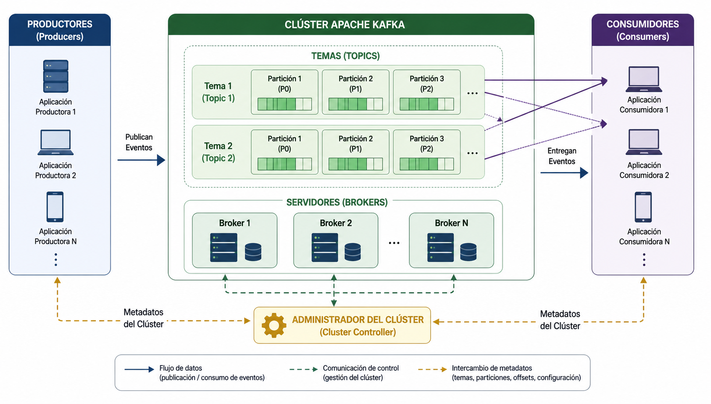

# Imágenes

Este directorio contiene todas las figuras, diagramas e ilustraciones utilizadas en el libro **Big Data: Fundamentos, Arquitecturas y Procesamiento Distribuido**.

Las imágenes constituyen un complemento al contenido desarrollado en cada capítulo y tienen como objetivo facilitar la comprensión de conceptos, arquitecturas y procesos propios del ecosistema Big Data.

---

# Organización

Las imágenes se encuentran organizadas por capítulo.

```text
imagenes/
│
├── cap01/
├── cap02/
├── cap03/
├── cap04/
├── cap05/
├── cap06/
├── cap07/
└── cap08/
```

Cada carpeta almacena exclusivamente las imágenes correspondientes al capítulo indicado.

---

# Convención de nombres

Los archivos siguen una nomenclatura uniforme que facilita su identificación y mantenimiento.

```text
figura-X-Y-descripcion.png
```

donde:

- **X** corresponde al número del capítulo.
- **Y** corresponde al número correlativo de la figura dentro del capítulo.

Ejemplos:

```text
figura-5-1-comparacion-mapreduce-apache-spark.png

figura-6-4-arquitectura-dataframe-pyspark.png

figura-7-3-flujo-procesamiento-eventos-kafka.png

figura-8-2-arquitectura-structured-streaming.png
```

---

# Estándar gráfico

Todas las ilustraciones del libro fueron diseñadas siguiendo un estilo visual homogéneo.

Las figuras consideran:

- diagramas simples y de fácil interpretación;
- iconografía consistente entre capítulos;
- colores diferenciados para representar componentes tecnológicos;
- orientación preferentemente horizontal;
- fondo blanco;
- resolución adecuada para impresión y visualización digital.

Las imágenes **no incluyen**:

- numeración de figuras;
- títulos;
- pies de figura;
- referencias al capítulo.

Toda la información editorial es incorporada posteriormente mediante bloques HTML en los archivos Markdown.

---

# Inserción en los capítulos

Las imágenes se incorporan al libro utilizando bloques HTML para asegurar una presentación uniforme durante la publicación.

Ejemplo:

```html
<p align="center">
  
</p>

<p align="center">
  <strong>Figura 7.2.</strong> Arquitectura general de Apache Kafka.
</p>
```

---

# Tipos de ilustraciones

A lo largo del libro se emplean distintos tipos de recursos gráficos, entre ellos:

- arquitecturas;
- diagramas de flujo;
- comparaciones conceptuales;
- modelos de procesamiento;
- componentes tecnológicos;
- casos de estudio;
- esquemas de integración;
- procesos de ejecución.

---

# Objetivo

El propósito de este directorio es mantener un repositorio centralizado de todos los recursos gráficos utilizados en el libro, garantizando una identidad visual uniforme, facilitando su reutilización y simplificando el mantenimiento del material académico.
