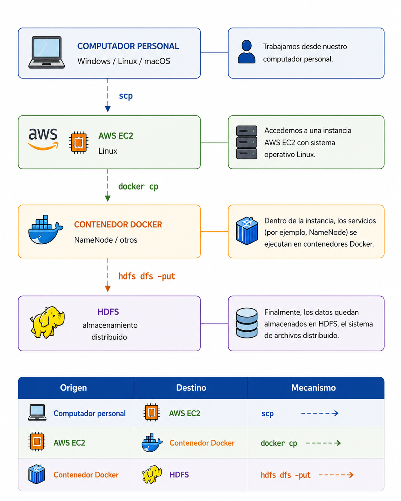
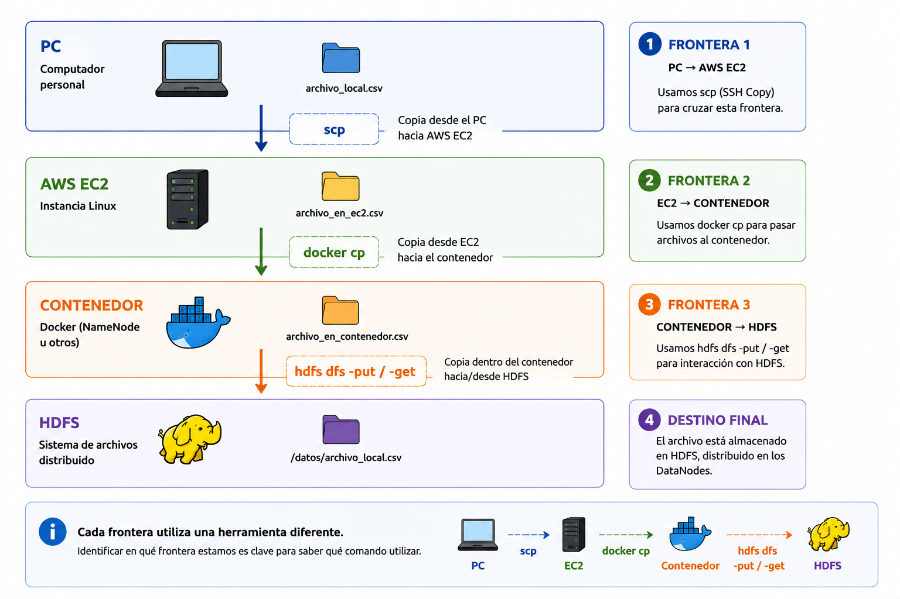

# Guía transversal — Transferencia de archivos

## Computador local ↔ AWS EC2 ↔ Docker ↔ HDFS

### 1. ¿Por qué necesitamos esta guía?

Durante el curso trabajaremos con diferentes tecnologías ejecutadas sobre una instancia Linux en AWS EC2 y, dentro de ella, con servicios desplegados mediante Docker.

Esto significa que nuestros archivos pueden encontrarse en **distintos sistemas de archivos**.

El recorrido general será:

<p align="center">
  
</p>

Por tanto, debemos aprender **tres mecanismos diferentes de transferencia**:

| Origen              | Destino           | Mecanismo       |
| ------------------- | ----------------- | --------------- |
| Computador personal | AWS EC2           | `scp`           |
| AWS EC2             | Contenedor Docker | `docker cp`     |
| Contenedor          | HDFS              | `hdfs dfs -put` |

Y también debemos dominar el recorrido inverso:

| Origen            | Destino             | Mecanismo       |
| ----------------- | ------------------- | --------------- |
| HDFS              | Contenedor          | `hdfs dfs -get` |
| Contenedor Docker | AWS EC2             | `docker cp`     |
| AWS EC2           | Computador personal | `scp`           |

---

# 2. La regla fundamental: identificar origen y destino

Antes de copiar cualquier archivo debemos responder:

**¿Dónde está actualmente el archivo?**

y:

**¿Dónde quiero que termine?**

Por ejemplo, si `ventas.csv` está en nuestro computador personal y queremos analizarlo dentro del contenedor `namenode`, no podemos ejecutar directamente:

```bash
hdfs dfs -put ventas.csv /datos/
```

porque el archivo todavía está en nuestro computador.

El recorrido será:

```text
ventas.csv
    │
    │ scp
    ▼
AWS EC2
    │
    │ docker cp
    ▼
NameNode
    │
    │ hdfs dfs -put
    ▼
HDFS
```

---

# PARTE I — Computador personal → AWS EC2

## 3. ¿Qué es `scp`?

`scp` permite copiar archivos entre computadores utilizando una conexión SSH.

La estructura general es:

```bash
scp [opciones] ORIGEN DESTINO
```

Para transferir archivos hacia una instancia EC2 mediante scp necesitamos:

* archivo de clave privada;
* usuario de la instancia;
* dirección IP pública o nombre DNS de la instancia;
* ruta del archivo que queremos transferir.

Nuestra instancia EC2 tiene como DNS público:

```
ec2-18-222-10-55.us-east-2.compute.amazonaws.com
```

Queremos copiar `datos.csv` desde nuestro computador hacia el directorio `/home/ubuntu/` de la instancia EC2.

El comando sería:

```
scp -i laboratorio.pem datos.csv ubuntu@ec2-18-222-10-55.us-east-2.compute.amazonaws.com:/home/ubuntu/
```

### ¿Qué significa cada parte?

```
scp
 │
 ├── -i laboratorio.pem
 │      └── clave privada para autenticarnos en EC2
 │
 ├── datos.csv
 │      └── archivo que queremos copiar
 │
 ├── ubuntu@
 │      └── usuario de la instancia
 │
 ├── ec2-18-222-10-55.us-east-2.compute.amazonaws.com
 │      └── DNS público de la instancia EC2
 │
 └── :/home/ubuntu/
        └── directorio de destino
```

Fórmula que podrán reutilizar durante todo el semestre:

```
scp -i <CLAVE.pem> <ARCHIVO> <USUARIO>@<DNS_PUBLICO>:<DESTINO>
```

---

# 4. Identificar los elementos necesarios

Supongamos:

```text
Clave privada:
labsuser.pem

Archivo:
ventas.csv

Usuario EC2:
ubuntu

IP pública:
54.123.45.67
```

Estos valores son solamente ilustrativos. Cada estudiante debe utilizar los correspondientes a su instancia.

---

# 5. Copiar un archivo desde nuestro computador hacia EC2

Desde **nuestro computador**, ejecutamos:

```bash
scp -i labsuser.pem ventas.csv ubuntu@54.123.45.67:/home/ubuntu/
```

Podemos interpretar el comando:

```text
scp
 │
 ├── -i labsuser.pem
 │      └── clave utilizada para autenticarnos
 │
 ├── ventas.csv
 │      └── archivo de origen
 │
 └── ubuntu@54.123.45.67:/home/ubuntu/
        └── destino
```

Después ingresamos a EC2 y comprobamos:

```bash
ls
```

o:

```bash
ls -lh /home/ubuntu/
```

Deberíamos encontrar:

```text
ventas.csv
```

---

# 6. Especificar otra ubicación de destino

Podemos copiar directamente hacia un directorio:

```bash
scp -i labsuser.pem ventas.csv ubuntu@54.123.45.67:/home/ubuntu/datos/
```

Pero `/home/ubuntu/datos/` debe existir y debemos tener permisos para escribir en él.

---

# 7. Copiar varios archivos

Podemos especificar varios archivos:

```bash
scp -i labsuser.pem ventas.csv clientes.csv sensores.csv ubuntu@54.123.45.67:/home/ubuntu/datos/
```

---

# 8. Copiar un directorio completo

Para transferir recursivamente un directorio utilizamos `-r`:

```bash
scp -i labsuser.pem -r dataset ubuntu@54.123.45.67:/home/ubuntu/
```

Si localmente tenemos:

```text
dataset/
├── ventas.csv
├── clientes.csv
└── sensores.csv
```

la estructura completa será transferida.

---

# PARTE II — AWS EC2 → computador personal

## 9. El recorrido inverso

Supongamos que hemos generado:

```text
resultado.csv
```

en EC2 y queremos descargarlo a nuestro computador.

El comando `scp` debe ejecutarse desde **nuestro computador personal**:

```bash
scp -i labsuser.pem ubuntu@54.123.45.67:/home/ubuntu/resultado.csv .
```

El punto:

```text
.
```

significa:

> directorio actual de mi computador.

Por tanto:

```text
AWS EC2
   │
   │ scp
   ▼
Computador personal
```

---

# 10. Descargar con otro nombre

También podemos especificar:

```bash
scp -i labsuser.pem ubuntu@54.123.45.67:/home/ubuntu/resultado.csv resultado_final.csv
```

---

# 11. Descargar un directorio completo

Utilizamos nuevamente `-r`:

```bash
scp -i labsuser.pem -r ubuntu@54.123.45.67:/home/ubuntu/resultados .
```

---

# PARTE III — AWS EC2 → Docker

## 12. Segundo límite: EC2 y Docker

Ahora supongamos que tenemos:

```text
/home/ubuntu/ventas.csv
```

en nuestra instancia EC2.

El archivo **no está automáticamente dentro del contenedor `namenode`**.

Tenemos:

```text
AWS EC2
│
└── /home/ubuntu/ventas.csv


Docker
│
└── namenode
     └── ventas.csv   ← todavía no existe
```

Para atravesar esta frontera utilizamos:

```text
docker cp
```

---

# 13. Verificar que el contenedor existe

Antes:

```bash
docker ps
```

Buscamos:

```text
namenode
```

Esto es consistente con la arquitectura utilizada en la guía anterior del curso. 

---

# 14. Copiar desde EC2 hacia el NameNode

Desde **Linux EC2**, ejecutamos:

```bash
docker cp ventas.csv namenode:/tmp/ventas.csv
```

Sintaxis:

```text
docker cp ORIGEN CONTENEDOR:DESTINO
```

En nuestro ejemplo:

```text
ventas.csv
    │
    │ docker cp
    ▼
namenode:/tmp/ventas.csv
```

---

# 15. Comprobar la transferencia

Ingresamos al contenedor:

```bash
docker exec -it namenode bash
```

Una vez dentro:

```bash
ls -lh /tmp/
```

Podemos verificar:

```bash
cat /tmp/ventas.csv
```

Ahora el archivo está disponible dentro del contenedor.

---

# 16. Podemos cambiar el nombre durante la copia

Por ejemplo:

```bash
docker cp ventas.csv namenode:/tmp/datos_ventas.csv
```

---

# 17. Copiar un directorio hacia Docker

También podemos transferir directorios:

```bash
docker cp datos namenode:/tmp/
```

Posteriormente:

```bash
docker exec -it namenode bash
```

y:

```bash
ls -R /tmp/datos
```

---

# PARTE IV — Docker → AWS EC2

## 18. El recorrido inverso

Supongamos que dentro del NameNode tenemos:

```text
/tmp/resultado.csv
```

Queremos llevarlo hacia EC2.

Primero salimos del contenedor:

```bash
exit
```

Ahora, desde EC2:

```bash
docker cp namenode:/tmp/resultado.csv /home/ubuntu/resultado.csv
```

La sintaxis se invirtió:

```text
docker cp CONTENEDOR:ORIGEN DESTINO
```

Conceptualmente:

```text
NameNode
   │
   │ docker cp
   ▼
AWS EC2
```

Comprobamos:

```bash
ls -lh /home/ubuntu/resultado.csv
```

---

# PARTE V — Docker → HDFS

## 19. Tercer límite: el contenedor tampoco es HDFS

Supongamos que dentro de `namenode` tenemos:

```text
/tmp/ventas.csv
```

Eso **no significa todavía que el archivo esté almacenado en HDFS**.

Tenemos:

```text
CONTENEDOR NAMENODE

/tmp/ventas.csv
       │
       │ hdfs dfs -put
       ▼
      HDFS
```

Dentro del NameNode:

```bash
hdfs dfs -mkdir -p /datos
```

Después:

```bash
hdfs dfs -put /tmp/ventas.csv /datos/
```

Comprobamos:

```bash
hdfs dfs -ls /datos
```

y:

```bash
hdfs dfs -cat /datos/ventas.csv
```

La guía anterior ya utiliza precisamente `-put` para transferir desde el sistema local visible para el comando hacia HDFS. 

---

# PARTE VI — HDFS → Docker

## 20. Recuperar un archivo desde HDFS

Dentro del NameNode:

```bash
hdfs dfs -get /datos/ventas.csv /tmp/ventas_recuperadas.csv
```

Comprobamos:

```bash
ls -lh /tmp/ventas_recuperadas.csv
```

Ahora:

```text
HDFS
 │
 │ hdfs dfs -get
 ▼
CONTENEDOR
```

La operación `-get` también está contemplada en la guía histórica del curso. 

---

# PARTE VII — El recorrido completo

## 21. Computador → HDFS

Supongamos que `sensores.csv` comienza en nuestro computador personal.

### Paso 1 — Computador → EC2

Desde nuestro computador:

```bash
scp -i labsuser.pem sensores.csv ubuntu@IP_PUBLICA:/home/ubuntu/
```

### Paso 2 — Verificar en EC2

```bash
ls -lh /home/ubuntu/sensores.csv
```

### Paso 3 — EC2 → NameNode

```bash
docker cp /home/ubuntu/sensores.csv namenode:/tmp/sensores.csv
```

### Paso 4 — Entrar al NameNode

```bash
docker exec -it namenode bash
```

### Paso 5 — Verificar

```bash
ls -lh /tmp/sensores.csv
```

### Paso 6 — NameNode → HDFS

```bash
hdfs dfs -mkdir -p /datos/sensores
```

```bash
hdfs dfs -put /tmp/sensores.csv /datos/sensores/
```

### Paso 7 — Verificar en HDFS

```bash
hdfs dfs -ls /datos/sensores
```

Resultado:

```text
COMPUTADOR
     │
     │ scp
     ▼
AWS EC2
     │
     │ docker cp
     ▼
NAMENODE
     │
     │ hdfs dfs -put
     ▼
HDFS
```

---

# 22. El recorrido completo inverso

Ahora queremos recuperar:

```text
/datos/sensores/sensores.csv
```

desde HDFS y dejarlo en nuestro computador.

### Paso 1 — HDFS → NameNode

Dentro del NameNode:

```bash
hdfs dfs -get /datos/sensores/sensores.csv /tmp/sensores_resultado.csv
```

### Paso 2 — Salir

```bash
exit
```

### Paso 3 — NameNode → EC2

Desde EC2:

```bash
docker cp namenode:/tmp/sensores_resultado.csv /home/ubuntu/sensores_resultado.csv
```

### Paso 4 — Verificar

```bash
ls -lh /home/ubuntu/sensores_resultado.csv
```

### Paso 5 — EC2 → computador

Este comando se ejecuta **desde nuestro computador personal**:

```bash
scp -i labsuser.pem ubuntu@IP_PUBLICA:/home/ubuntu/sensores_resultado.csv .
```

Tenemos:

```text
HDFS
 │
 │ hdfs dfs -get
 ▼
NAMENODE
 │
 │ docker cp
 ▼
AWS EC2
 │
 │ scp
 ▼
COMPUTADOR
```

---

# 23. ¿Dónde debo ejecutar cada comando?

Esta tabla debería acompañarlos durante todo el semestre:

| Comando                              | Dónde se ejecuta                                           | Función                                             |
| ------------------------------------ | ---------------------------------------------------------- | --------------------------------------------------- |
| `ssh ...`                            | Computador personal                                        | Conectarse a EC2                                    |
| `scp ...`                            | Normalmente computador personal                            | Transferir computador ↔ EC2                         |
| `ls`                                 | EC2 o contenedor                                           | Consultar el sistema de archivos del entorno actual |
| `docker ps`                          | EC2                                                        | Ver contenedores                                    |
| `docker exec -it ... bash`           | EC2                                                        | Entrar a un contenedor                              |
| `docker cp archivo contenedor:/ruta` | EC2                                                        | Copiar EC2 → contenedor                             |
| `docker cp contenedor:/ruta archivo` | EC2                                                        | Copiar contenedor → EC2                             |
| `hdfs dfs -put ...`                  | Entorno con cliente HDFS; en nuestro laboratorio, NameNode | Copiar hacia HDFS                                   |
| `hdfs dfs -get ...`                  | NameNode                                                   | Recuperar desde HDFS                                |
| `hdfs dfs -ls ...`                   | NameNode                                                   | Consultar HDFS                                      |

---

# 24. Una regla visual muy útil

Cuando tenga dudas, piense en las **fronteras**:

<p align="center">
  
</p>

Cada frontera utiliza una herramienta diferente.

---

# 25. ¿Y SSH?

SSH y SCP cumplen funciones relacionadas pero diferentes.

### SSH

Permite **conectarnos remotamente**:

```bash
ssh -i labsuser.pem ubuntu@IP_PUBLICA
```

Conceptualmente:

```text
PC ───── SSH ─────► terminal EC2
```

### SCP

Permite **transferir archivos**:

```bash
scp -i labsuser.pem archivo.csv ubuntu@IP_PUBLICA:/home/ubuntu/
```

Conceptualmente:

```text
PC ───── SCP ─────► archivo en EC2
```

Por tanto:

> **SSH nos permite entrar; SCP nos permite copiar.**

---

# 26. Claves `.pem` y permisos

En Linux/macOS puede ser necesario proteger los permisos de la clave:

```bash
chmod 400 labsuser.pem
```

Después:

```bash
ssh -i labsuser.pem ubuntu@IP_PUBLICA
```

o:

```bash
scp -i labsuser.pem archivo.csv ubuntu@IP_PUBLICA:/home/ubuntu/
```

No deben compartir públicamente la clave privada utilizada para acceder a una instancia.

### Proteger la clave `.pem` en Windows

En Windows, los permisos de una clave privada pueden ajustarse desde **PowerShell** mediante `icacls`. El objetivo es que el archivo `.pem` pueda ser leído únicamente por el usuario actual.

Primero, ubicarse en la carpeta donde se encuentra la clave:

```powershell
cd "C:\Users\Usuario\Downloads"
```

Luego ejecutar:

```powershell
icacls labsuser.pem /inheritance:r
icacls labsuser.pem /grant:r "$($env:USERNAME):(R)"
```

**¿Qué hace cada comando?**

```text
/inheritance:r
      └── elimina los permisos heredados del archivo

/grant:r
      └── reemplaza los permisos explícitos para el usuario indicado

$env:USERNAME
      └── identifica al usuario actual de Windows

(R)
      └── concede permiso de solo lectura
```

Podemos comprobar los permisos con:

```powershell
icacls labsuser.pem
```

Una vez protegida la clave, podemos utilizarla normalmente con SSH:

```powershell
ssh -i labsuser.pem ubuntu@IP_PUBLICA
```

o con SCP:

```powershell
scp -i labsuser.pem ventas.csv ubuntu@IP_PUBLICA:/home/ubuntu/
```


> **Importante:** si SSH informa que la clave privada tiene permisos demasiado abiertos, revise los permisos del archivo `.pem` antes de intentar conectarse nuevamente. La clave privada no debe quedar accesible para otros usuarios del equipo.

|Linux/macOS|Windows|
|---|---|
|`chmod 400 labsuser.pem`|`icacls labsuser.pem /inheritance:r` + `icacls labsuser.pem /grant:r "$($env:USERNAME):(R)"`|
|Restringe el acceso a la clave|Restringe el acceso mediante ACL de Windows|

---

# 27. Windows

En Windows moderno, `ssh` y `scp` pueden utilizarse desde PowerShell cuando el cliente OpenSSH está disponible.

Por ejemplo:

```powershell
scp -i labsuser.pem ventas.csv ubuntu@IP_PUBLICA:/home/ubuntu/
```

Si la ruta contiene espacios, utilice comillas:

```powershell
scp -i "C:\Users\Usuario\Downloads\labsuser.pem" "C:\Users\Usuario\Desktop\ventas.csv" ubuntu@IP_PUBLICA:/home/ubuntu/
```

La lógica es exactamente la misma:

```text
ORIGEN → DESTINO
```

---

# 28. Error: `No such file or directory`

Si aparece:

```text
No such file or directory
```

antes de asumir que el archivo se perdió, pregúntese:

> **¿Estoy buscando en el sistema de archivos correcto?**

Por ejemplo:

```bash
ls /datos
```

consulta el sistema de archivos del entorno actual.

Mientras:

```bash
hdfs dfs -ls /datos
```

consulta HDFS.

No son equivalentes.

---

# 29. Error: `Permission denied (publickey)`

Si SCP/SSH responde con un error relacionado con `publickey`, revise:

* clave correcta;
* usuario correcto;
* IP/DNS correcto;
* permisos de la clave;
* configuración de acceso de la instancia.

No cambie aleatoriamente comandos HDFS o Docker: el problema ocurre **antes de llegar a esas capas**.

---

# 30. Error: `Could not resolve hostname`

Compruebe la dirección utilizada.

Por ejemplo:

```bash
ubuntu@IP_PUBLICA
```

debe reemplazarse por la dirección real correspondiente a la instancia.

---

# 31. Error: Docker no encuentra el contenedor

Si:

```bash
docker cp ventas.csv namenode:/tmp/
```

informa que no encuentra `namenode`, compruebe:

```bash
docker ps
```

y, si necesita observar también contenedores detenidos:

```bash
docker ps -a
```

Verifique el **nombre real del contenedor** y que la arquitectura se encuentre ejecutándose.

---

# 32. Error: Docker no encuentra el archivo

Antes:

```bash
docker cp ventas.csv namenode:/tmp/
```

compruebe en EC2:

```bash
pwd
```

y:

```bash
ls -lh ventas.csv
```

Si no existe allí, indique la ruta completa:

```bash
docker cp /home/ubuntu/ventas.csv namenode:/tmp/
```

---

# 33. Error: HDFS no encuentra el archivo local

Supongamos que dentro del NameNode ejecutamos:

```bash
hdfs dfs -put ventas.csv /datos/
```

y aparece que `ventas.csv` no existe.

Compruebe:

```bash
pwd
```

```bash
ls -lh
```

Quizás el archivo se encuentra en:

```text
/tmp/ventas.csv
```

Entonces:

```bash
hdfs dfs -put /tmp/ventas.csv /datos/
```

---

# 34. Error conceptual: “Lo veo en EC2, por tanto Docker también lo ve”

Incorrecto.

```text
EC2 ≠ contenedor Docker
```

De la misma manera:

```text
contenedor Docker ≠ HDFS
```

Y:

```text
computador personal ≠ EC2
```

Los archivos deben atravesar explícitamente estas fronteras cuando la arquitectura así lo requiera.

---

# 35. Error conceptual: confundir `docker exec` con `docker cp`

Compare:

```bash
docker exec -it namenode bash
```

**Accede al contenedor.**

Mientras:

```bash
docker cp ventas.csv namenode:/tmp/
```

**Copia un archivo al contenedor.**

Uno cambia nuestro contexto de ejecución; el otro transfiere información.

---

# 36. Error conceptual: confundir `docker cp` con `hdfs dfs -put`

```bash
docker cp ventas.csv namenode:/tmp/
```

deja el archivo **dentro del sistema de archivos del contenedor**.

No lo deja automáticamente en HDFS.

Posteriormente:

```bash
hdfs dfs -put /tmp/ventas.csv /datos/
```

lo incorpora a **HDFS**.

Esta diferencia es fundamental.

---

# 37. Tabla de diagnóstico rápido

| Quiero...                       | Herramienta     |
| ------------------------------- | --------------- |
| Entrar desde mi PC a EC2        | `ssh`           |
| Enviar archivo PC → EC2         | `scp`           |
| Descargar archivo EC2 → PC      | `scp`           |
| Ver los contenedores            | `docker ps`     |
| Entrar a un contenedor          | `docker exec`   |
| Copiar EC2 → contenedor         | `docker cp`     |
| Copiar contenedor → EC2         | `docker cp`     |
| Incorporar archivo a HDFS       | `hdfs dfs -put` |
| Recuperar archivo de HDFS       | `hdfs dfs -get` |
| Ver archivos del entorno actual | `ls`            |
| Ver archivos de HDFS            | `hdfs dfs -ls`  |

---

# 38. La pregunta que debe hacerse siempre

Antes de ejecutar cualquier transferencia:

> **¿Dónde está ahora mi archivo y dónde necesito que esté?**

Si responde correctamente esas dos preguntas, normalmente podrá determinar qué herramienta necesita:

```text
PC ↔ EC2
     SCP

EC2 ↔ Docker
     DOCKER CP

Docker ↔ HDFS
     HDFS DFS
```

---

# 39. Ejemplo integrador

Tenemos:

```text
C:\Users\Estudiante\Downloads\clientes.csv
```

y queremos terminar con:

```text
/datos/clientes/clientes.csv
```

en HDFS.

El razonamiento debe ser:

```text
1. ¿Dónde está?
   PC.

2. ¿Cuál es la siguiente frontera?
   EC2.
   → scp

3. ¿Dónde está ahora?
   EC2.

4. ¿Cuál es la siguiente frontera?
   Docker.
   → docker cp

5. ¿Dónde está ahora?
   NameNode.

6. ¿Cuál es la siguiente frontera?
   HDFS.
   → hdfs dfs -put
```


---

# 40. Resumen de lo aprendido en esta guía

```bash
# =============================================
# PC → EC2
# Ejecutar desde el computador personal
# =============================================

scp -i CLAVE.pem archivo.csv USUARIO@IP:/ruta/


# =============================================
# EC2 → PC
# Ejecutar desde el computador personal
# =============================================

scp -i CLAVE.pem USUARIO@IP:/ruta/archivo.csv .


# =============================================
# Ver contenedores
# Ejecutar desde EC2
# =============================================

docker ps


# =============================================
# EC2 → CONTENEDOR
# Ejecutar desde EC2
# =============================================

docker cp archivo.csv CONTENEDOR:/tmp/archivo.csv


# =============================================
# Entrar al contenedor
# Ejecutar desde EC2
# =============================================

docker exec -it CONTENEDOR bash


# =============================================
# CONTENEDOR → HDFS
# En nuestro laboratorio, desde NameNode
# =============================================

hdfs dfs -put /tmp/archivo.csv /ruta/hdfs/


# =============================================
# HDFS → CONTENEDOR
# =============================================

hdfs dfs -get /ruta/hdfs/archivo.csv /tmp/archivo.csv


# =============================================
# Salir del contenedor
# =============================================

exit


# =============================================
# CONTENEDOR → EC2
# Ejecutar desde EC2
# =============================================

docker cp CONTENEDOR:/tmp/archivo.csv /home/usuario/
```


