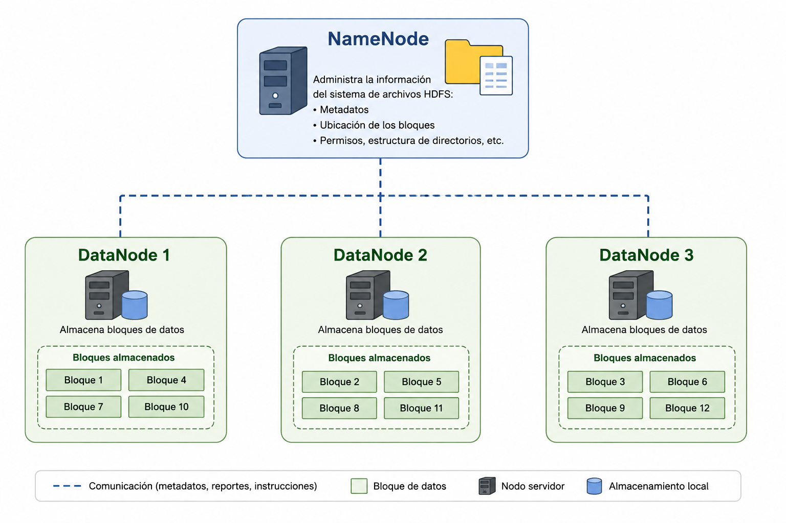
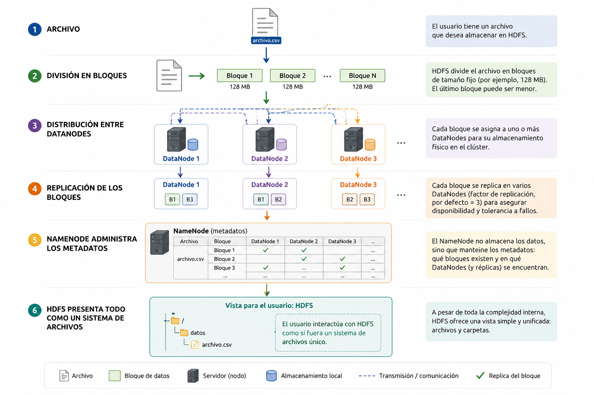

# Semana 4 — HDFS: almacenar datos en un mundo distribuido

## 1. El problema antes de HDFS

En las primeras semanas vimos que Big Data no surge simplemente porque existan grandes cantidades de información. El problema aparece cuando el volumen, la velocidad o las características de los datos comienzan a superar las capacidades prácticas y económicas de las arquitecturas tradicionales.

Una primera respuesta podría parecer evidente: si necesitamos almacenar más información, utilizamos un computador con mayor capacidad. Esta estrategia corresponde al **escalamiento vertical o scale-up**: aumentar memoria, almacenamiento o capacidad de procesamiento de una misma máquina.

Sin embargo, este enfoque presenta límites. Los equipos de mayor capacidad son progresivamente más costosos, existe un límite físico para seguir ampliándolos y, además, concentrar los datos y servicios en una sola máquina introduce un problema importante: **si esa máquina falla, el sistema completo puede verse afectado**.

La alternativa que comenzó a adquirir importancia con el crecimiento de Internet fue utilizar muchos computadores trabajando conjuntamente: **escalamiento horizontal o scale-out**.

Pero esto genera una nueva pregunta:

> **¿Cómo almacenamos un archivo utilizando múltiples computadores y conseguimos que para el usuario siga comportándose como un único sistema?**

HDFS surge precisamente para responder a este tipo de problema.

---

# 2. El antecedente: Google tenía un problema

A comienzos de los años 2000, Google enfrentaba un desafío de escala extraordinario. Su motor de búsqueda necesitaba capturar, almacenar y procesar enormes cantidades de información proveniente de Internet.

Utilizar servidores cada vez más grandes no era una solución suficientemente escalable. Google comenzó a construir su infraestructura utilizando grandes cantidades de servidores relativamente económicos.

Esto generó un principio importante:

> **En una infraestructura compuesta por miles de computadores, los fallos dejan de ser excepcionales y pasan a formar parte del funcionamiento normal del sistema.**

Si tenemos un computador, esperamos que funcione.

Si tenemos diez, eventualmente alguno fallará.

Si tenemos miles, debemos diseñar suponiendo que **siempre habrá algún equipo, disco o componente que esté fallando**.

La arquitectura, por tanto, no puede intentar evitar completamente los fallos. Debe ser capaz de **seguir funcionando a pesar de ellos**.

---

# 3. Google File System: el antecedente directo

En 2003, Google publicó el artículo **The Google File System (GFS)**.

La propuesta introducía una manera diferente de pensar el almacenamiento: en lugar de guardar un archivo completo en un único servidor, podía **dividirse y distribuirse entre diferentes máquinas**.

La infraestructura podía construirse utilizando numerosos computadores y el propio sistema debía encargarse de administrar dónde estaban almacenadas las distintas partes de los archivos.

Este trabajo se convirtió posteriormente en una de las principales inspiraciones para Hadoop.

Como vimos al estudiar la historia de Hadoop, Doug Cutting y Mike Cafarella trabajaban en el proyecto Nutch y utilizaron las ideas publicadas por Google para desarrollar alternativas abiertas.

De esa evolución surgiría **Hadoop Distributed File System (HDFS)**.

Por eso podemos establecer la relación:

**Google File System (GFS) → inspiración → Hadoop Distributed File System (HDFS).**

---

# 4. ¿Qué es HDFS?

**HDFS significa Hadoop Distributed File System.**

Es el sistema de archivos distribuido utilizado por Hadoop para almacenar grandes cantidades de información utilizando múltiples computadores.

La palabra fundamental aquí es **distribuido**.

Cuando guardamos normalmente un archivo:

`ventas.csv`

pensamos que ese archivo se encuentra almacenado en un disco.

Con HDFS debemos cambiar ese modelo mental.

Un archivo puede ser:

**dividido → distribuido → replicado**

entre diferentes computadores pertenecientes al clúster.

Para el usuario sigue existiendo conceptualmente un archivo, pero físicamente sus datos pueden encontrarse distribuidos entre diferentes máquinas.

---

# 5. Una analogía sencilla: un libro demasiado grande

Supongamos que tenemos un libro de **1.000 páginas** y ninguna biblioteca dispone de espacio suficiente para conservarlo completo.

Podríamos dividirlo:

* páginas 1–250;
* páginas 251–500;
* páginas 501–750;
* páginas 751–1.000.

Y guardar cada parte en una biblioteca diferente.

Acabamos de resolver el problema de capacidad, pero aparece otro:

**¿qué ocurre si una de las bibliotecas pierde su parte del libro?**

Perderíamos una sección completa.

Podemos solucionar el problema haciendo varias copias de cada parte y distribuyéndolas entre diferentes bibliotecas.

Ahora tenemos dos principios esenciales de HDFS:

**distribución + replicación.**

La distribución permite escalar.

La replicación contribuye a tolerar fallos.

---

# 6. Los bloques: la unidad fundamental de HDFS

HDFS no trata necesariamente un archivo grande como una única unidad física.

Lo divide en unidades denominadas **bloques**.

Podemos imaginar un archivo:

`datos.csv`

que se divide conceptualmente en:

`Bloque A | Bloque B | Bloque C | Bloque D`

Los bloques pueden almacenarse en diferentes computadores.

Por ejemplo:

| Computador | Contenido |
| ---------- | --------- |
| Nodo 1     | Bloque A  |
| Nodo 2     | Bloque B  |
| Nodo 3     | Bloque C  |
| Nodo 4     | Bloque D  |

Esto permite que un archivo pueda superar incluso la capacidad individual de almacenamiento de una máquina.

### Ejemplo

Supongamos, de manera simplificada, que tenemos un archivo de **500 MB** y trabajamos con bloques de **128 MB**.

El archivo necesitaría cuatro bloques:

* bloque 1 → 128 MB
* bloque 2 → 128 MB
* bloque 3 → 128 MB
* bloque 4 → 116 MB

El último bloque no necesita ocupar artificialmente 128 MB: contiene solamente los datos restantes.

El concepto importante no es memorizar esta operación, sino comprender que **HDFS fragmenta archivos grandes para poder distribuirlos**.

---

# 7. NameNode y DataNodes

Ahora aparece un problema.

Si distribuimos miles o millones de bloques entre numerosos computadores:

**¿quién sabe dónde está cada cosa?**

HDFS utiliza una arquitectura en la que podemos distinguir dos roles fundamentales.

### NameNode

El **NameNode** administra los metadatos del sistema de archivos.

Mantiene información como:

* qué archivos existen;
* cómo está organizado el sistema de directorios;
* en qué bloques está dividido un archivo;
* dónde se encuentran esos bloques.

Una buena analogía es pensar en el **catálogo de una biblioteca**.

El catálogo no contiene necesariamente los libros, pero sabe **qué libros existen y dónde encontrarlos**.

### DataNodes

Los **DataNodes** son los nodos que almacenan físicamente los bloques de datos.

Podemos representarlo así:

<p align="center">
  
</p>

El NameNode administra información sobre la ubicación.

Los DataNodes almacenan los datos.

---

# 8. Una distinción fundamental: datos y metadatos

Esta arquitectura permite introducir una diferencia importante.

**Datos:** el contenido real de nuestros archivos.

**Metadatos:** información que describe cómo y dónde están organizados esos datos.

Por ejemplo:

```text
ventas.csv
```

contiene datos.

Pero información como:

```text
ventas.csv → bloques 14, 27 y 38
bloque 14 → DataNode 1
bloque 27 → DataNode 3
bloque 38 → DataNode 2
```

corresponde a **metadatos**.

Esta separación ayuda a comprender por qué el NameNode cumple una función diferente de los DataNodes.

---

# 9. El segundo gran problema: ¿qué ocurre cuando falla un nodo?

Supongamos que tenemos:

```text
Archivo → A + B + C
```

y los bloques están almacenados así:

```text
Nodo 1 → A
Nodo 2 → B
Nodo 3 → C
```

Si el Nodo 2 falla, perdemos B.

Por eso HDFS incorpora **replicación**.

En lugar de almacenar una única copia de cada bloque, podemos mantener múltiples copias distribuidas entre diferentes DataNodes.

Por ejemplo:

```text
Nodo 1 → A, C
Nodo 2 → B, A
Nodo 3 → C, B
```

Ahora, si desaparece un nodo, existen otras copias disponibles.

La idea central es:

> **HDFS no supone que el hardware nunca fallará; diseña el almacenamiento considerando que los fallos ocurrirán.**

Esto constituye la **tolerancia a fallos**.

---

# 10. Replicación no significa simplemente respaldo

Aquí conviene evitar una confusión.

La replicación de HDFS no debe entenderse simplemente como realizar periódicamente un *backup* tradicional.

Las réplicas forman parte del funcionamiento de la arquitectura distribuida y permiten mantener los bloques disponibles cuando determinados nodos dejan de funcionar.

Por tanto:

**backup** y **replicación** están relacionados con protección de información, pero **no son conceptos equivalentes**.

---

# 11. ¿Cómo sabe HDFS si los DataNodes siguen funcionando?

Los DataNodes se comunican periódicamente con el NameNode.

Una forma sencilla de comprenderlo es imaginar que cada DataNode informa:

> "Sigo aquí."

Estas señales se conocen como **heartbeats**.

La metáfora es bastante literal: del mismo modo que un latido permite saber que un organismo continúa funcionando, estos mensajes permiten al sistema conocer el estado de los nodos.

Si un DataNode deja de comunicarse durante determinado tiempo, el sistema puede considerarlo no disponible y utilizar las réplicas existentes.

Además, los DataNodes proporcionan información acerca de los bloques que mantienen almacenados.

---

# 12. Llevar el procesamiento hacia los datos

Las arquitecturas Big Data introducen otra idea interesante.

Imaginemos que tenemos terabytes de información almacenados en un clúster.

Una alternativa sería mover continuamente esos enormes volúmenes hacia una máquina que realizará el procesamiento.

Pero mover grandes cantidades de información a través de una red puede ser costoso.

Por eso aparece un principio importante en Hadoop:

> **Cuando es posible, resulta preferible llevar el procesamiento hacia donde están los datos en lugar de mover grandes cantidades de datos hacia el procesamiento.**

Esto ayuda a comprender posteriormente por qué almacenamiento distribuido y procesamiento distribuido están tan estrechamente relacionados dentro de Hadoop.

HDFS proporciona el almacenamiento distribuido; tecnologías de procesamiento pueden aprovechar esa distribución.

---

# 13. HDFS no reemplaza necesariamente a una base de datos

Otro error frecuente sería concluir:

> "Entonces HDFS es una base de datos mejor."

No.

HDFS es fundamentalmente un **sistema de archivos distribuido**.

Una base de datos relacional y HDFS responden a necesidades diferentes.

Una base de datos tradicional resulta especialmente apropiada para muchas operaciones transaccionales, registros estructurados y consultas que requieren actualizaciones frecuentes.

HDFS fue diseñado pensando principalmente en **grandes conjuntos de datos, almacenamiento distribuido y procesamiento de grandes volúmenes de información**.

Por eso la pregunta correcta no es:

> "¿Cuál es mejor?"

sino:

> **"¿Qué tecnología responde mejor al problema que necesitamos resolver?"**

Esta idea conecta directamente con la Semana 1: **no todos los problemas necesitan Big Data**.

---

# 14. ¿Qué ganamos con HDFS?

Podemos resumir sus principales ventajas conceptuales en cuatro ideas.

### Escalabilidad

Si necesitamos mayor capacidad, podemos incorporar nuevos nodos al clúster.

Esto materializa el concepto de **scale-out** estudiado durante la primera semana.

### Distribución

Los archivos pueden dividirse en bloques almacenados en diferentes nodos.

### Tolerancia a fallos

La replicación permite mantener disponibles los datos incluso cuando determinados nodos presentan problemas.

### Trabajo con grandes volúmenes

La arquitectura está pensada para almacenar y facilitar el procesamiento de grandes conjuntos de información.

---

# 15. Una situación para discutir antes de comenzar la práctica

Supongamos que una organización posee un archivo de varios terabytes con registros históricos.

Tiene dos alternativas:

**Alternativa A:** comprar un servidor cada vez más potente y almacenar todo allí.

**Alternativa B:** distribuir la información entre múltiples máquinas utilizando HDFS.

No deberíamos concluir automáticamente que B siempre es mejor.

La decisión depende del problema.

Pero si el volumen continúa creciendo, necesitamos escalabilidad horizontal y queremos diseñar considerando fallos de hardware, HDFS comienza a adquirir sentido.

Aquí se conectan las cuatro primeras semanas:

**crecimiento de datos → límites del scale-up → scale-out → Hadoop → HDFS.**

---

# 16. El modelo mental que debemos conservar

Antes de ejecutar cualquier comando, el estudiante debería ser capaz de explicar esta secuencia:

<p align="center">
  
</p>

Si comprendemos esto, los comandos que utilizaremos posteriormente dejan de ser instrucciones aisladas.

Cuando ejecutemos una operación para copiar un archivo hacia HDFS, conceptualmente estaremos solicitando al sistema que **incorpore ese archivo al sistema distribuido**, donde podrá dividirse en bloques, almacenarse en DataNodes y gestionarse mediante los metadatos correspondientes.

---

# Si guardamos un archivo en HDFS y posteriormente desconectamos uno de los nodos que contiene parte de ese archivo, ¿deberíamos perder el archivo? ¿Por qué?

---

