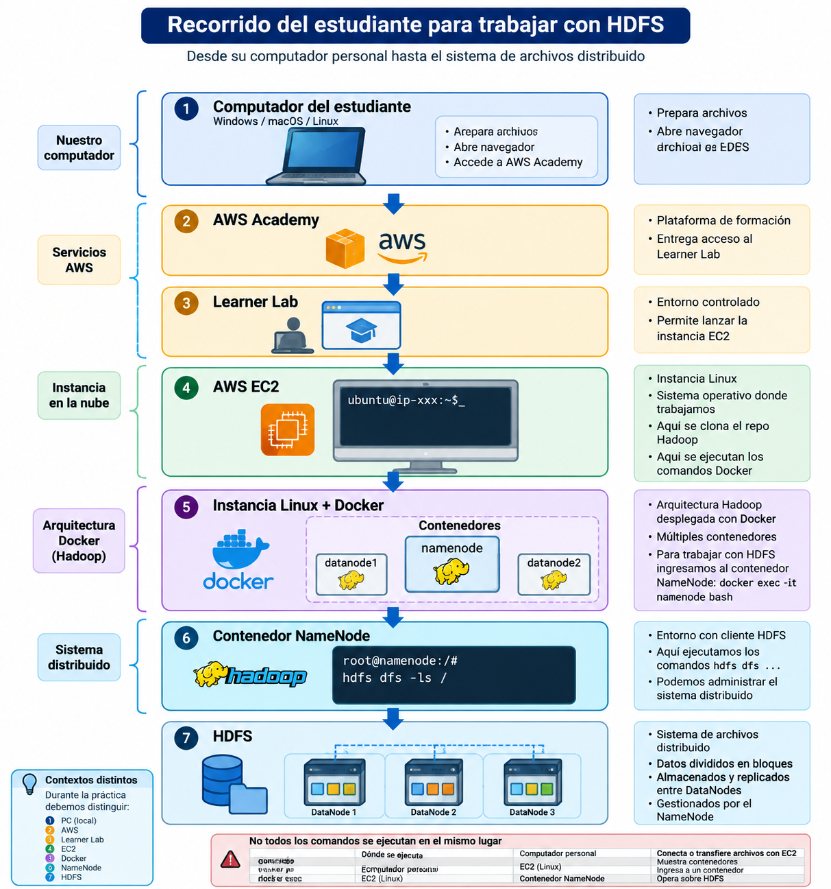

# Semana 4 — HDFS

## Guía de ejercicios prácticos

### Propósito

En esta actividad trabajaremos con **HDFS (Hadoop Distributed File System)** utilizando la arquitectura Hadoop desplegada mediante Docker en una instancia Linux de AWS EC2.

El propósito no es memorizar comandos. Al finalizar la actividad, el estudiante deberá ser capaz de:

* reconocer los distintos entornos involucrados en el laboratorio;
* acceder desde la instancia Linux al contenedor del NameNode;
* distinguir entre el sistema de archivos del entorno Linux/contenedor y HDFS;
* crear y administrar directorios y archivos en HDFS;
* transferir información hacia y desde HDFS;
* consultar información sobre almacenamiento, bloques y replicación;
* seleccionar autónomamente los comandos necesarios para resolver un requerimiento.

La actividad se desarrollará progresivamente:

**Nivel 0 — Reconocer el entorno**
↓
**Nivel 1 — Muestra**
↓
**Nivel 2 — Ejercicios guiados**
↓
**Nivel 3 — Ejercicios autónomos**

Durante toda la sesión utilizaremos una regla:

> **Ejecutar → Verificar → Interpretar.**

---

# Nivel 0 — Reconocimiento del entorno

## 1. ¿Dónde estamos trabajando?

Antes de utilizar HDFS debemos comprender la arquitectura del laboratorio.

El recorrido que realizaremos es:

<p align="center">
  
</p>

Esta distinción será fundamental durante toda la actividad.

No todos los comandos se ejecutan en el mismo lugar.

---

## 2. Acceder a la instancia EC2

Ingrese a AWS Academy y posteriormente al **Learner Lab**.

Desde allí acceda a la instancia EC2 preparada para trabajar con Hadoop.

Una vez conectado a la instancia, nos encontramos trabajando sobre el sistema operativo **Linux de la máquina EC2**.

Podemos comprobar nuestro entorno mediante comandos como:

```bash
pwd
```

```bash
ls
```

En este momento **todavía no estamos trabajando directamente con HDFS**.

---

## 3. Acceder al repositorio Hadoop

La arquitectura utilizada durante el curso se encuentra disponible en el repositorio Hadoop del docente.

Si el repositorio todavía no está disponible en la instancia, deberá clonarse siguiendo las instrucciones entregadas para el curso.

Una vez descargado, ingrese al directorio correspondiente al repositorio.

Por ejemplo:

```bash
cd Hadoop
```

Compruebe:

```bash
ls
```

El objetivo en este punto es reconocer que estamos trabajando en:

```text
EC2
└── Linux
    └── repositorio Hadoop
```

El repositorio utiliza **Docker** para desplegar los componentes necesarios de Hadoop.

---

## 4. Comprobar los contenedores

Desde la instancia Linux ejecute:

```bash
docker ps
```

Observe los contenedores que se encuentran ejecutándose.

Busque particularmente el contenedor:

```text
namenode
```

### Pregunta

¿Estamos dentro del NameNode después de ejecutar `docker ps`?

**No.**

Solamente estamos observando desde Linux los contenedores que Docker está ejecutando.

---

# 5. Ingresar al contenedor NameNode

La guía utilizada anteriormente en el curso establece el acceso mediante: 

```bash
docker exec -it namenode bash
```

Después de ejecutarlo, el prompt debería cambiar a algo semejante a:

```text
root@25e58cd35002:/#
```

El identificador exacto puede ser diferente.

Ahora nos encontramos **dentro del contenedor NameNode**.

Compruebe:

```bash
pwd
```

y:

```bash
ls
```

---

# 6. Llegar finalmente a HDFS

Desde el contenedor NameNode ejecute:

```bash
hdfs dfs -ls /
```

Ahora sí estamos solicitando información al **sistema de archivos HDFS**.

Observe cuidadosamente la diferencia:

```text
INSTANCIA LINUX
    │
    │ docker exec -it namenode bash
    ▼
CONTENEDOR NAMENODE
    │
    │ hdfs dfs -ls /
    ▼
HDFS
```

Esta secuencia debe quedar clara antes de continuar.

---

# 7. Tres contextos diferentes

Durante la práctica debemos distinguir:

| Operación                       | Entorno                                         |
| ------------------------------- | ----------------------------------------------- |
| `docker ps`                     | Linux de EC2                                    |
| `docker exec -it namenode bash` | Linux EC2 → acceso al contenedor                |
| `ls` dentro de `namenode`       | Sistema de archivos visible desde el contenedor |
| `hdfs dfs -ls /`                | HDFS                                            |
| `hdfs dfs -mkdir /datos`        | HDFS                                            |
| `hdfs dfs -put archivo /datos/` | Contenedor → HDFS                               |

Este último punto es especialmente importante.

Si ejecutamos:

```bash
hdfs dfs -put ventas.csv /datos/
```

el archivo `ventas.csv` debe estar disponible en el **sistema de archivos desde el cual estamos ejecutando el comando**, en este caso el entorno del contenedor.

No debemos asumir que un archivo ubicado en nuestro computador físico, o incluso en otro entorno, está automáticamente disponible dentro del contenedor.

---

# Nivel 1 — Muestra

## Ejercicio 1. Nuestro primer recorrido por HDFS

Esta actividad será realizada inicialmente junto con el profesor.

El objetivo es observar un ciclo completo:

**crear → almacenar → verificar → consultar → recuperar.**

---

## Paso 1. Consultar HDFS

Dentro del NameNode:

```bash
hdfs dfs -ls /
```

Estamos consultando el directorio raíz de HDFS.

Ahora ejecute:

```bash
ls /
```

### Pregunta

¿Los dos comandos anteriores están mostrando el mismo sistema de archivos?

Explique la diferencia.

---

# Paso 2. Crear un pequeño archivo

Dentro del entorno desde el cual posteriormente ejecutaremos `-put`:

```bash
echo "id,nombre,ciudad,ventas" > ventas.csv
echo "1,Ana,Santiago,150000" >> ventas.csv
echo "2,Pedro,Valparaiso,230000" >> ventas.csv
echo "3,Carolina,Concepcion,180000" >> ventas.csv
echo "4,Diego,Santiago,310000" >> ventas.csv
echo "5,Francisca,Temuco,195000" >> ventas.csv
```

Compruebe:

```bash
cat ventas.csv
```

### Pregunta

¿`ventas.csv` está almacenado en HDFS?

**Todavía no.**

Tenemos un archivo disponible en el sistema de archivos desde el cual trabajaremos, pero aún debemos incorporarlo a HDFS.

---

# Paso 3. Crear nuestra estructura HDFS

Ejecute:

```bash
hdfs dfs -mkdir -p /curso/hdfs/datos
```

Compruebe:

```bash
hdfs dfs -ls -R /curso
```

Deberíamos obtener conceptualmente:

```text
/curso
└── hdfs
    └── datos
```

---

# Paso 4. Incorporar el archivo

Ejecute:

```bash
hdfs dfs -put ventas.csv /curso/hdfs/datos/
```

Compruebe:

```bash
hdfs dfs -ls /curso/hdfs/datos
```

Ahora `ventas.csv` está almacenado en HDFS.

### ¿Qué ocurrió?

```text
Archivo disponible en el entorno local del comando
                    │
                    │ -put
                    ▼
                   HDFS
        /curso/hdfs/datos/ventas.csv
```

---

# Paso 5. Consultar directamente desde HDFS

Ejecute:

```bash
hdfs dfs -cat /curso/hdfs/datos/ventas.csv
```

Después:

```bash
hdfs dfs -head /curso/hdfs/datos/ventas.csv
```

Observe nuevamente:

```bash
cat ventas.csv
```

y:

```bash
hdfs dfs -cat /curso/hdfs/datos/ventas.csv
```

Aunque ambos pueden mostrar el mismo contenido, **no están leyendo necesariamente el mismo archivo físico ni el mismo sistema de archivos**.

---

# Paso 6. Observar el almacenamiento

Ejecute:

```bash
hdfs dfs -du -h /curso/hdfs/datos
```

Luego consulte la capacidad y estado general:

```bash
hdfs dfsadmin -report
```

Este último comando ya aparecía en la guía anterior como mecanismo para obtener información sobre el estado de HDFS. 

Observe la información disponible.

### Identifique

* capacidad;
* espacio utilizado;
* espacio disponible;
* información sobre los DataNodes.

No es necesario memorizar toda la salida.

---

# Paso 7. Observar la replicación

Ejecute:

```bash
hdfs dfs -stat %r /curso/hdfs/datos/ventas.csv
```

Registre:

**Factor de replicación: __________**

Ahora podemos conectar teoría y práctica:

```text
TEORÍA                     OBSERVACIÓN

Replicación        →       factor de replicación
DataNodes          →       dfsadmin -report
Archivo            →       ventas.csv
Bloques            →       estructura interna HDFS
```

---

# Paso 8. Observar los bloques

Ejecute:

```bash
hdfs fsck /curso/hdfs/datos/ventas.csv -files -blocks -locations
```

No intente interpretar toda la salida.

Busque información relacionada con:

* archivo;
* bloques;
* replicación;
* ubicación.

### Pregunta

Para nosotros `ventas.csv` aparece como un archivo.

¿Qué información adicional muestra HDFS acerca de cómo se administra internamente?

---

# Paso 9. Recuperar información desde HDFS

Ejecute:

```bash
hdfs dfs -get /curso/hdfs/datos/ventas.csv ventas_recuperadas.csv
```

Compruebe:

```bash
ls
```

Luego:

```bash
cat ventas_recuperadas.csv
```

Hemos completado:

```text
ENTORNO LOCAL
     │
     │ -put
     ▼
    HDFS
     │
     │ -get
     ▼
ENTORNO LOCAL
```

---

# Cierre del Nivel 1

Antes de continuar, cada pareja debe poder explicar:

1. ¿Dónde se ejecuta `docker ps`?
2. ¿Qué hace `docker exec -it namenode bash`?
3. ¿Qué diferencia existe entre `ls` y `hdfs dfs -ls`?
4. ¿Qué hace `-put`?
5. ¿Qué hace `-get`?
6. ¿Qué relación existe entre un archivo HDFS, sus bloques y su replicación?

Si alguna de estas respuestas no está clara, vuelva a revisar la actividad antes de continuar.

---

# Nivel 2 — Ejercicios guiados

A partir de este momento trabajarán en parejas.

Pueden utilizar la **Guía de comandos HDFS**.

No es necesario memorizar la sintaxis.

---

# Ejercicio 2. Construir un espacio organizacional

Una empresa utilizará HDFS para almacenar información proveniente de tres áreas.

Construya:

```text
/empresa
├── ventas
├── clientes
└── logistica
```

### Debe

1. crear la estructura;
2. comprobar que los tres directorios existen;
3. utilizar una consulta recursiva para mostrar la estructura completa.

### Orientación

Necesitará trabajar con:

```text
-mkdir
-ls
```

Usted debe determinar la sintaxis.

---

# Ejercicio 3. Incorporar datos

Cree un archivo denominado:

```text
clientes.csv
```

con:

```text
id,nombre,region
101,Empresa_A,Metropolitana
102,Empresa_B,Valparaiso
103,Empresa_C,Biobio
```

Y otro denominado:

```text
logistica.csv
```

con:

```text
id_envio,destino,estado
5001,Santiago,Entregado
5002,Valparaiso,En_transito
5003,Concepcion,Pendiente
```

Posteriormente:

* incorpore `clientes.csv` a `/empresa/clientes`;
* incorpore `logistica.csv` a `/empresa/logistica`;
* compruebe que ambos existen en HDFS;
* visualice sus contenidos desde HDFS.

### Antes de ejecutar `-put`

Pregúntese:

> **¿Desde qué sistema de archivos está intentando leer HDFS el archivo que quiero incorporar?**

---

# Ejercicio 4. Copiar y reorganizar

Cree:

```text
/empresa/respaldo
```

Posteriormente:

1. copie `clientes.csv` hacia `/empresa/respaldo`;
2. compruebe que el original continúa en `/empresa/clientes`;
3. cambie el nombre de la copia a:

```text
clientes_backup.csv
```

4. compruebe el resultado.

### Explique

¿Cuál fue la diferencia práctica entre utilizar una operación de **copia** y una operación de **movimiento/renombrado**?

---

# Ejercicio 5. Investigar el almacenamiento

Seleccione uno de sus archivos y complete:

| Elemento                       | Resultado |
| ------------------------------ | --------- |
| Archivo                        |           |
| Ruta HDFS                      |           |
| Tamaño                         |           |
| Factor de replicación          |           |
| Cantidad de bloques observados |           |

Para obtener la información deberá identificar los comandos correspondientes en la guía.

Después ejecute:

```bash
hdfs dfsadmin -report
```

### Responda

**¿Qué relación existe entre los DataNodes mostrados por el informe y los bloques utilizados para almacenar los archivos?**

---

# Ejercicio 6. Modificar la replicación

Seleccione uno de los archivos.

Consulte primero su factor de replicación.

Posteriormente solicite un factor de replicación diferente utilizando el comando correspondiente.

La guía anterior ya planteaba la modificación de replicación como una actividad de mayor nivel. 

Después:

1. vuelva a consultar el factor;
2. observe el resultado;
3. relacione lo ocurrido con la cantidad de DataNodes disponibles.

### Pregunta

¿Por qué solicitar un factor de replicación determinado no significa necesariamente que puedan existir físicamente esa cantidad de copias si el clúster no dispone de suficientes DataNodes?

---

# Ejercicio 7. Recuperar un archivo

Recupere:

```text
/empresa/logistica/logistica.csv
```

utilizando como nombre:

```text
logistica_recuperada.csv
```

Compruebe que:

* el original continúa en HDFS;
* el archivo recuperado existe en el entorno desde el cual ejecutó la descarga;
* ambos contienen la misma información.

### Identifique el recorrido

```text
¿ HDFS → entorno local ?

o

¿ entorno local → HDFS ?
```

---

# Nivel 3 — Ejercicios autónomos

A partir de este punto **no se proporcionan comandos**.

Puede utilizar:

* la Guía de comandos HDFS;
* `hdfs dfs -help`;
* los ejercicios anteriores.

La evaluación no está en recordar sintaxis, sino en **determinar qué operación necesita realizar**.

---

# Desafío 1. Reorganización del almacenamiento

La estructura actual es:

```text
/empresa
├── ventas
├── clientes
├── logistica
└── respaldo
```

La organización solicita transformarla en:

```text
/empresa
├── entrada
│   ├── ventas
│   ├── clientes
│   └── logistica
└── respaldo
```

### Condición

**No puede volver a cargar desde fuera de HDFS los archivos que ya están almacenados.**

Debe resolver completamente el problema utilizando operaciones dentro de HDFS.

Al finalizar:

* muestre la estructura completa;
* compruebe que los archivos siguen disponibles;
* explique qué operaciones utilizó.

---

# Desafío 2. ¿Dónde está realmente mi archivo?

Un integrante del equipo ejecuta:

```bash
ls /empresa/clientes
```

y obtiene un mensaje indicando que la ruta no existe.

Afirma:

> “Se borraron nuestros datos de HDFS”.

### Su tarea

Determine si esa conclusión es correcta.

Debe:

1. identificar en qué sistema de archivos está buscando;
2. formular una hipótesis;
3. seleccionar el comando correcto para comprobarla;
4. explicar el resultado.

---

# Desafío 3. El archivo modificado

Un estudiante:

1. descarga un archivo desde HDFS;
2. modifica la copia descargada;
3. afirma que el archivo original almacenado en HDFS también debería haberse actualizado.

Diseñe una pequeña prueba que permita demostrar si esta afirmación es correcta o incorrecta.

### Debe entregar

* procedimiento realizado;
* evidencia;
* conclusión.

---

# Desafío 4. Nuevo proyecto

La organización solicita crear:

```text
/proyecto_final
├── datos
├── procesados
└── respaldo
```

El archivo:

```text
ventas.csv
```

debe quedar en:

```text
/proyecto_final/datos/
```

Además:

* debe existir una copia denominada `ventas_backup.csv` en `/proyecto_final/respaldo/`;
* `/proyecto_final/procesados/` debe permanecer vacío;
* debe poder visualizarse el contenido de `ventas.csv`;
* debe informarse su tamaño;
* debe informarse su factor de replicación;
* debe consultarse información sobre sus bloques;
* debe recuperarse una copia denominada `ventas_final.csv`.

No se indican los comandos ni el orden.

**Diseñe y ejecute la solución.**

---

# Desafío final — De AWS a HDFS

Una nueva fuente entrega:

```text
sensores.csv
```

La empresa necesita almacenarlo en:

```text
/empresa/entrada/sensores/
```

Su equipo debe resolver el requerimiento completo.

Al finalizar deberá demostrar:

1. que se encuentra trabajando en la instancia correcta;
2. que la arquitectura Docker está disponible;
3. que puede ingresar al contenedor NameNode;
4. que HDFS está operativo;
5. que creó la estructura necesaria;
6. que `sensores.csv` está almacenado en HDFS;
7. que puede visualizar sus primeras líneas;
8. que puede determinar su tamaño;
9. que puede consultar su factor de replicación;
10. que puede consultar información de sus bloques;
11. que puede generar una copia de respaldo dentro de HDFS;
12. que puede recuperar finalmente una copia desde HDFS.

No se entrega ninguna secuencia de comandos.

---

# Cierre de la actividad

Cada pareja debe responder brevemente:

### 1. ¿Cuál fue el recorrido tecnológico que realizaron para llegar hasta HDFS?

Representen la secuencia desde su computador hasta el sistema de archivos distribuido.

### 2. ¿Cuál es la diferencia entre el sistema de archivos del contenedor y HDFS?

Utilicen un ejemplo observado durante la práctica.

### 3. ¿Qué relación existe entre NameNode, DataNodes, bloques y replicación?

### 4. ¿Por qué la replicación está relacionada con la tolerancia a fallos?

### 5. ¿Qué comandos consideran esenciales y cuáles consultarían mediante `-help`?

---


